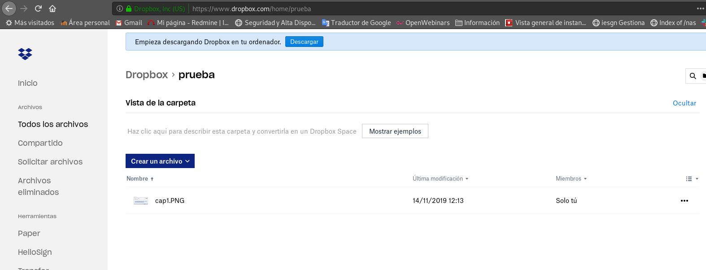

 
## Práctica 2: rclone - Gestionando nuestro almacenamiento en la nube

rclone es una herramienta que nos permite trabajar con los ficheros que tenemos almacenados en distintos servicios de almacenamiento en la nube (dropbox, google drive, mega, box,… y muchos más que puedes ver en su página principal). Por lo tanto con rclone podemos gestionar y sincronizar los ficheros de nuestros servicios preferidos desde la línea de comandos.

## Tarea 1: Instala rclone en tu equipo.
```shell
root@madueo:/home/fran# wget https://downloads.rclone.org/v1.53.1/rclone-v1.53.1-linux-amd64.deb

root@madueo:/home/fran# dpkg -i rclone-v1.53.1-linux-amd64.deb
(Leyendo la base de datos ... 293038 ficheros o directorios instalados actualmente.)
Preparando para desempaquetar rclone-v1.53.1-linux-amd64.deb ...
Desempaquetando rclone (1.53.1) sobre (1.45-3) ...
Configurando rclone (1.53.1) ...
Procesando disparadores para man-db (2.8.5-2) ...
root@madueo:/home/fran# rclone version
rclone v1.53.1
- os/arch: linux/amd64
- go version: go1.15

```

## Tarea 2: Configura dos proveedores cloud en rclone (dropbox, google drive, mega, …)

```shell
root@madueo:/home/fran# rclone config
No remotes found - make a new one
n) New remote
s) Set configuration password
q) Quit config
n/s/q> n
name> dropbox
Type of storage to configure.
Enter a string value. Press Enter for the default ("").
Choose a number from below, or type in your own value
 1 / A stackable unification remote, which can appear to merge the contents of several remotes
   \ "union"
 2 / Alias for a existing remote
   \ "alias"
 3 / Amazon Drive
   \ "amazon cloud drive"
 4 / Amazon S3 Compliant Storage Providers (AWS, Ceph, Dreamhost, IBM COS, Minio)
   \ "s3"
 5 / Backblaze B2
   \ "b2"
 6 / Box
   \ "box"
 7 / Cache a remote
   \ "cache"
 8 / Dropbox
   \ "dropbox"
 9 / Encrypt/Decrypt a remote
   \ "crypt"
10 / FTP Connection
   \ "ftp"
11 / Google Cloud Storage (this is not Google Drive)
   \ "google cloud storage"
12 / Google Drive
   \ "drive"
13 / Hubic
   \ "hubic"
14 / JottaCloud
   \ "jottacloud"
15 / Local Disk
   \ "local"
16 / Microsoft Azure Blob Storage
   \ "azureblob"
17 / Microsoft OneDrive
   \ "onedrive"
18 / OpenDrive
   \ "opendrive"
19 / Openstack Swift (Rackspace Cloud Files, Memset Memstore, OVH)
   \ "swift"
20 / Pcloud
   \ "pcloud"
21 / SSH/SFTP Connection
   \ "sftp"
22 / Webdav
   \ "webdav"
23 / Yandex Disk
   \ "yandex"
24 / http Connection
   \ "http"
Storage> 8
** See help for dropbox backend at: https://rclone.org/dropbox/ **

Dropbox App Client Id
Leave blank normally.
Enter a string value. Press Enter for the default ("").
client_id> asirgames97@gmail.com
Dropbox App Client Secret
Leave blank normally.
Enter a string value. Press Enter for the default ("").
client_secret> (contraseña)
Edit advanced config? (y/n)
y) Yes
n) No
y/n> n
Remote config
Make sure your Redirect URL is set to "http://localhost:53682/" in your custom config.
Use auto config?
 * Say Y if not sure
 * Say N if you are working on a remote or headless machine
y) Yes
n) No
y/n> n
For this to work, you will need rclone available on a machine that has a web browser available.
Execute the following on your machine:
	rclone authorize "dropbox" "asirgames97@gmail.com" "(contraseña)"
Then paste the result below:
result>
--------------------
```

desde otra terminal pondremos :
```shell
root@madueo:/home/fran# rclone authorize "dropbox"
If your browser doesn't open automatically go to the following link: http://127.0.0.1:53682/auth
Log in and authorize rclone for access
Waiting for code...
Got code
Paste the following into your remote machine --->
{"access_token":"4K5WIAn2ODYAAAAAAAAAAbCTIJVfyowBMoHDKK-e2rlHJSZc0bIYME5FQouUgdd9","token_type":"bearer","expiry":"0001-01-01T00:00:00Z"}
```

```shell
result> {"access_token":"4K5WIAn2ODYAAAAAAAAAAbCTIJVfyowBMoHDKK-e2rlHJSZc0bIYME5FQouUgdd9","token_type":"bearer","expiry":"0001-01-01T00:00:00Z"}
2020/09/24 13:36:11 ERROR : Failed to save new token in config file: section 'dropbox' not found
--------------------
[dropbox]
client_id = asirgames97@gmail.com
client_secret = (contraseña)
token = {"access_token":"4K5WIAn2ODYAAAAAAAAAAbCTIJVfyowBMoHDKK-e2rlHJSZc0bIYME5FQouUgdd9","token_type":"bearer","expiry":"0001-01-01T00:00:00Z"}
--------------------
y) Yes this is OK
e) Edit this remote
d) Delete this remote
y/e/d> y
Current remotes:

Name                 Type
====                 ====
dropbox              dropbox

e) Edit existing remote
n) New remote
d) Delete remote
r) Rename remote
c) Copy remote
s) Set configuration password
q) Quit config
e/n/d/r/c/s/q> 
```

Accedemos al link que nos proporciona rclone y nos registramos, también daremos los permisos a dropbox.


Con estos pasos hemos configurado dropbox en rclone  
Acontinuacion añadiremos a la configuracion mega.
```shell

root@madueo:/home/fran# rclone config
Current remotes:

Name                 Type
====                 ====
dropbox              dropbox

e) Edit existing remote
n) New remote
d) Delete remote
r) Rename remote
c) Copy remote
s) Set configuration password
q) Quit config
e/n/d/r/c/s/q> n
name> mega
Type of storage to configure.
Enter a string value. Press Enter for the default ("").
Choose a number from below, or type in your own value
 1 / 1Fichier
   \ "fichier"
 2 / Alias for an existing remote
   \ "alias"
 3 / Amazon Drive
   \ "amazon cloud drive"
 4 / Amazon S3 Compliant Storage Provider (AWS, Alibaba, Ceph, Digital Ocean, Dreamhost, IBM COS, Minio, Tencent COS, etc)
   \ "s3"
 5 / Backblaze B2
   \ "b2"
 6 / Box
   \ "box"
 7 / Cache a remote
   \ "cache"
 8 / Citrix Sharefile
   \ "sharefile"
 9 / Dropbox
   \ "dropbox"
10 / Encrypt/Decrypt a remote
   \ "crypt"
11 / FTP Connection
   \ "ftp"
12 / Google Cloud Storage (this is not Google Drive)
   \ "google cloud storage"
13 / Google Drive
   \ "drive"
14 / Google Photos
   \ "google photos"
15 / Hubic
   \ "hubic"
16 / In memory object storage system.
   \ "memory"
17 / Jottacloud
   \ "jottacloud"
18 / Koofr
   \ "koofr"
19 / Local Disk
   \ "local"
20 / Mail.ru Cloud
   \ "mailru"
21 / Mega
   \ "mega"
22 / Microsoft Azure Blob Storage
   \ "azureblob"
23 / Microsoft OneDrive
   \ "onedrive"
24 / OpenDrive
   \ "opendrive"
25 / OpenStack Swift (Rackspace Cloud Files, Memset Memstore, OVH)
   \ "swift"
26 / Pcloud
   \ "pcloud"
27 / Put.io
   \ "putio"
28 / QingCloud Object Storage
   \ "qingstor"
29 / SSH/SFTP Connection
   \ "sftp"
30 / Sugarsync
   \ "sugarsync"
31 / Tardigrade Decentralized Cloud Storage
   \ "tardigrade"
32 / Transparently chunk/split large files
   \ "chunker"
33 / Union merges the contents of several upstream fs
   \ "union"
34 / Webdav
   \ "webdav"
35 / Yandex Disk
   \ "yandex"
36 / http Connection
   \ "http"
37 / premiumize.me
   \ "premiumizeme"
38 / seafile
   \ "seafile"
Storage> 21
** See help for mega backend at: https://rclone.org/mega/ **

User name
Enter a string value. Press Enter for the default ("").
user> asirgames97@gmail.com
Password.
y) Yes type in my own password
g) Generate random password
y/g> y
Enter the password:
password:
Confirm the password:
password:
Edit advanced config? (y/n)
y) Yes
n) No (default)
y/n> n
Remote config
--------------------
[mega]
type = mega
user = asirgames97@gmail.com
pass = *** ENCRYPTED ***
--------------------
y) Yes this is OK (default)
e) Edit this remote
d) Delete this remote
y/e/d> y
Current remotes:

Name                 Type
====                 ====
dropbox              dropbox
mega                 mega

e) Edit existing remote
n) New remote
d) Delete remote
r) Rename remote
c) Copy remote
s) Set configuration password
q) Quit config
e/n/d/r/c/s/q>
``` 

**Despues de un buen rato peleandome con rclone he conseguido añadir tambien google drive, de pues de varios intentos creo que mi fallo estaba en la configuracion en concreto, a la hora de poner mi cuenta, es preferible dejar los apartados de tu cuenta en blanco.**

```shell
root@madueo:/home/fran# rclone config
Current remotes:

Name                 Type
====                 ====
dropbox              dropbox
mega                 mega

e) Edit existing remote
n) New remote
d) Delete remote
r) Rename remote
c) Copy remote
s) Set configuration password
q) Quit config
e/n/d/r/c/s/q> n
name> googledrive
Type of storage to configure.
Enter a string value. Press Enter for the default ("").
Choose a number from below, or type in your own value
 1 / 1Fichier
   \ "fichier"
 2 / Alias for an existing remote
   \ "alias"
 3 / Amazon Drive
   \ "amazon cloud drive"
 4 / Amazon S3 Compliant Storage Provider (AWS, Alibaba, Ceph, Digital Ocean, Dreamhost, IBM COS, Minio, Tencent COS, etc)
   \ "s3"
 5 / Backblaze B2
   \ "b2"
 6 / Box
   \ "box"
 7 / Cache a remote
   \ "cache"
 8 / Citrix Sharefile
   \ "sharefile"
 9 / Dropbox
   \ "dropbox"
10 / Encrypt/Decrypt a remote
   \ "crypt"
11 / FTP Connection
   \ "ftp"
12 / Google Cloud Storage (this is not Google Drive)
   \ "google cloud storage"
13 / Google Drive
   \ "drive"
14 / Google Photos
   \ "google photos"
15 / Hubic
   \ "hubic"
16 / In memory object storage system.
   \ "memory"
17 / Jottacloud
   \ "jottacloud"
18 / Koofr
   \ "koofr"
19 / Local Disk
   \ "local"
20 / Mail.ru Cloud
   \ "mailru"
21 / Mega
   \ "mega"
22 / Microsoft Azure Blob Storage
   \ "azureblob"
23 / Microsoft OneDrive
   \ "onedrive"
24 / OpenDrive
   \ "opendrive"
25 / OpenStack Swift (Rackspace Cloud Files, Memset Memstore, OVH)
   \ "swift"
26 / Pcloud
   \ "pcloud"
27 / Put.io
   \ "putio"
28 / QingCloud Object Storage
   \ "qingstor"
29 / SSH/SFTP Connection
   \ "sftp"
30 / Sugarsync
   \ "sugarsync"
31 / Tardigrade Decentralized Cloud Storage
   \ "tardigrade"
32 / Transparently chunk/split large files
   \ "chunker"
33 / Union merges the contents of several upstream fs
   \ "union"
34 / Webdav
   \ "webdav"
35 / Yandex Disk
   \ "yandex"
36 / http Connection
   \ "http"
37 / premiumize.me
   \ "premiumizeme"
38 / seafile
   \ "seafile"
Storage> 13
** See help for drive backend at: https://rclone.org/drive/ **

Google Application Client Id
Setting your own is recommended.
See https://rclone.org/drive/#making-your-own-client-id for how to create your own.
If you leave this blank, it will use an internal key which is low performance.
Enter a string value. Press Enter for the default ("").
client_id> 
OAuth Client Secret
Leave blank normally.
Enter a string value. Press Enter for the default ("").
client_secret> 
Scope that rclone should use when requesting access from drive.
Enter a string value. Press Enter for the default ("").
Choose a number from below, or type in your own value
 1 / Full access all files, excluding Application Data Folder.
   \ "drive"
 2 / Read-only access to file metadata and file contents.
   \ "drive.readonly"
   / Access to files created by rclone only.
 3 | These are visible in the drive website.
   | File authorization is revoked when the user deauthorizes the app.
   \ "drive.file"
   / Allows read and write access to the Application Data folder.
 4 | This is not visible in the drive website.
   \ "drive.appfolder"
   / Allows read-only access to file metadata but
 5 | does not allow any access to read or download file content.
   \ "drive.metadata.readonly"
scope> 1
ID of the root folder
Leave blank normally.

Fill in to access "Computers" folders (see docs), or for rclone to use
a non root folder as its starting point.

Enter a string value. Press Enter for the default ("").
root_folder_id> 
Service Account Credentials JSON file path 
Leave blank normally.
Needed only if you want use SA instead of interactive login.

Leading `~` will be expanded in the file name as will environment variables such as `${RCLONE_CONFIG_DIR}`.

Enter a string value. Press Enter for the default ("").
service_account_file> 
Edit advanced config? (y/n)
y) Yes
n) No (default)
y/n> n
Remote config
Use auto config?
 * Say Y if not sure
 * Say N if you are working on a remote or headless machine
y) Yes (default)
n) No
y/n> n
Please go to the following link: https://accounts.google.com/o/oauth2/auth?access_type=offline&client_id=202264815644.apps.googleusercontent.com&redirect_uri=urn%3Aietf%3Awg%3Aoauth%3A2.0%3Aoob&response_type=code&scope=https%3A%2F%2Fwww.googleapis.com%2Fauth%2Fdrive&state=UW0G1I6DsfY2aAe6zS_KQQ
Log in and authorize rclone for access
Enter verification code> 4/4gEraHwhFI9FAQWMl3xcYTfUjV4FrttxH_HCqoRAo4RaVtOFq_BcdWk            
Configure this as a team drive?
y) Yes
n) No (default)
y/n> n
--------------------
[googledrive]
type = drive
scope = drive
token = {"access_token":"ya29.a0AfH6SMCfIp8MYBmjM83uNRtZO5bh8yjbf6rRt4dmktZVgaXPbpGJVhRjQqxrIICsF1iKDgkT7gxI7DGLpv_zHANB1HQoYpbWmUkC28YZP6NyqmNo2WT6xhc5ekDe3qhwu87cgUqdNpR9wU3pLPlGRDzLFV7KKpzupnA","token_type":"Bearer","refresh_token":"1//03MZHVsEYfirECgYIARAAGAMSNwF-L9IrsfWUgmTPK3PHPakqEV5QI3F1h50-eKAx9zU22LeMDI5CaMTzzz2rwVw2u6ZXLHXCut0","expiry":"2020-09-25T10:28:04.359275291+02:00"}
--------------------
y) Yes this is OK (default)
e) Edit this remote
d) Delete this remote
y/e/d> y
Current remotes:

Name                 Type
====                 ====
dropbox              dropbox
googledrive          drive
mega                 mega

e) Edit existing remote
n) New remote
d) Delete remote
r) Rename remote
c) Copy remote
s) Set configuration password
q) Quit config
e/n/d/r/c/s/q> 
```


## Tarea 3: Muestra distintos comandos de rclone para gestionar los ficheros de los proveedores cloud: lista los ficheros, copia un fichero local a la nube, sincroniza un directorio local con un directorio en la nube, copia ficheros entre los dos proveedores cloud, muestra alguna funcionalidad más,…

* Listar todos los ficheros del servicio:
```shell
     rclone ls dropbox:
```
* Listar los directorios que tenemos:
```shell
     rclone lsd dropbox:
```

* Podemos crear un directorio:
```shell
     rclone mkdir dropbox:/prueba
```

* Copiar un fichero desde nuestro ordenador a la carpeta que hemos creado:
```shell
     rclone copy info.txt dropbox:/prueba
     rclone ls dropbox:/prueba
     2072006 info.txt
```

* Operaciones entre varios servicios, por ejemplo copiar el fichero info.txt que acabamos de subir a dropbox, a un directorio de mega:
```shell
     rclone mkdir mega:/prueba
     rclone copy dropbox:/prueba/info.txt mega:/prueba
     rclone ls mega:/prueba
     test.txt
```

* En este caso, la fuente se sincroniza con el destino, Este método salta archivos sin cambios. Como el comando puede causar la pérdida de datos, puede usarlo con “–dry-run” para ver qué se copiará y eliminará exactamente.
```shell
rclone sync source:path dest:path [flags]
```
ejemplo:
```shell
rclone sync dropbox:dropbox\ imagenes captura.png --dry-run
```

* Comprobar si los archivos en origen y destino coinciden:
```shell
rclone check source:path dest:path
```

* Borrar archivos:
```shell
rclone delete remote:path
```

## Tarea 4: Monta en un directorio local de tu ordenador, los ficheros de un proveedor cloud. Comprueba que copiando o borrando ficheros en este directorio se crean o eliminan en el proveedor.

```shell
root@madueo:/home/fran# rclone mkdir dropbox:/prueba
root@madueo:/home/fran/Descargas# rclone copy cap1.PNG dropbox:/prueba
root@madueo:/home/fran/Descargas# rclone ls dropbox:/prueba
    23248 cap1.PNG
```


```shell
root@madueo:/home/fran# rclone delete dropbox:/prueba
```
