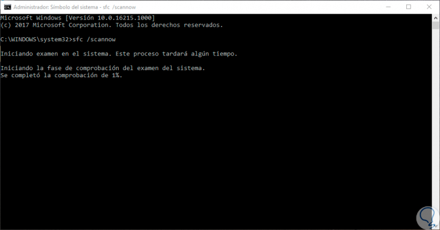
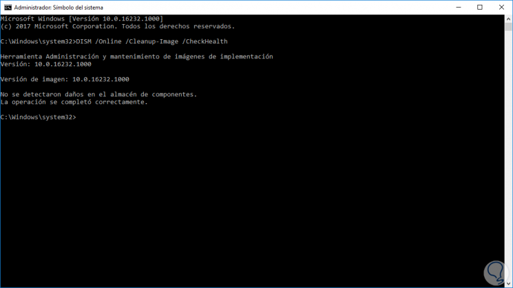

# Práctica 3: Integridad de ficheros

En caso de que algún tipo de malware reemplace o falsifique archivos del sistema operativo, ocultándose para realizar tareas no autorizadas, la búsqueda y detección del mismo se complica ya que los análisis antimalware y de los procesos sospechosos por parte de administradores de sistemas, no dudarán de la veracidad de dichos archivos y procesos. A este tipo de malware se le denomina rootkit, programa que sustituye los ejecutables binarios del sistema para ocultarse mejor, pudiendo servir de puertas trasera o backdoor para la ejecución malware remota.

## Tarea 1: Crea un manual lo más completo posible de las herramientas sfc y dsim para comprobar la integridad de ficheros en Windows. Indica para qué sirven las opciones más usadas del programa y entrega capturas de pantallas para comprobar que has realizado la práctica.

**SFC**:(System File Checker) Comprobador de archivos de sistema para reparar los archivos de sistema que faltan o están dañados.

En el símbolo del sistema, escriba el comando siguiente y presione ENTRAR:
```shell
sfc /scannow
```



El comando sfc /scannow examinará todos los archivos de sistema protegidos y remplaza los archivos dañados con una copia en caché ubicada en una carpeta comprimida en %WinDir%\System32\dllcache.
El marcador de posición %WinDir% representa la carpeta del sistema operativo Windows. Por ejemplo, C:\Windows.

**Nota:** No cierre la ventana del símbolo del sistema hasta que la verificación haya terminado por completo. Una vez finalizado el proceso, aparecerán los resultados del examen.

Cuando el proceso termine, puede recibir alguno de los siguientes mensajes:
* Protección de recursos de Windows no encontró ninguna infracción de integridad.  
   Esto quiere decir que no hay ningún archivo de sistema que esté dañado o que falte.
* Protección de recursos de Windows no pudo realizar la operación solicitada.  
   Para resolver este problema, vuelva a ejecutar el examen de Comprobador de archivos de sistema en modo seguro y compruebe que las carpetas PendingDeletes y PendingRenames existen dentro de %WinDir%\WinSxS\Temp.
* Protección de recursos de Windows encontró archivos dañados y los reparó correctamente. Los detalles están incluidos en CBS.Log %WinDir%\Logs\CBS\CBS.log.  
* Para obtener información detallada sobre el análisis de archivos de sistema y su restauración, diríjase a Cómo ver los detalles del proceso de Comprobador de archivos de sistema.  
* Protección de recursos de Windows encontró archivos dañados pero no pudo corregir algunos de ellos. Los detalles están incluidos en CBS.Log %WinDir%\Logs\CBS\CBS.log.  

**Cómo ver los detalles del proceso del Comprobador de archivos de sistema**  
Para ver los detalles incluidos en el archivo CBS.Log, puede copiar la información al archivo Sfcdetails.txt usando el comando Findstr y luego ver los detalles en el archivo Sfcdetails.txt.
```shell
findstr /c:"[SR]" %windir%\Logs\CBS\CBS.log >"%userprofile%\Desktop\sfcdetails.txt"
```

*DSIM:*(Deployment Image Servicing and Management) Mantenimiento y preparación de las imágenes de Windows.

DISM permite realizar el mantenimiento y preparación de las imágenes de Windows. Es decir, DISM lo podemos usar para realizar el mantenimiento de una imagen de Windows o un disco duro virtual.

Los comandos de DISM permiten capturar y aplicar imágenes de Windows, añadir o elimnar imágenes de un archivo .wim o incluso dividir archvios .win en otros archivos más pequeños. Para realizar un análisis a una imagen de Windows 10 con el objetivo de detectar errores o archivos corruptos podemos ejecutar el comando Dism /Online /Cleanup-Image /ScanHealth, aunque podemos ver el resto de opciones y parámetros si ejecutamos DISM /? desde la línea de comandos:

```shell
DISM /Online /Cleanup-Image /CheckHealth
#comprueba el estado del sistema y mira si se han detectado fallos
DISM /Online /Cleanup-Image /ScanHealth
#escanea el sistema buscando errores. Realiza él la búsqueda asi que tarda algo más que CheckHealth
DISM /Online /Cleanup-Image /RestoreHealth
#comprobará nuestro sistema e intentará repararlo, tardará un poco.
```


**Combinación de ambos:**

Con estos dos comandos (SFC y DISM), si tienes suerte, deberías poder reparar tu sistema. El proceso normal es:
    correr el sfc/scannow.
    Si hay errores correr DISM /Online /Cleanup-Image /RestoreHealth
    Reiniciar, ejecutar de nuevo el sfc /scannow y repetir hasta que no existan errores o buscar otro método si no se arreglan (mirando el registro de ambos para ver por qué).

## Tarea 2: Del mismo modo, crea un manual de la herramienta Rootkit Hunter (rkhunter) en Linux. Indica las opciones mas usadas del programa y entrega capturas de pantallas para comprobar que has realizado la práctica.

Rkhunter es una aplicación para línea de comandos que se encarga automáticamente de analizar nuestro sistema en busca de rootkits, malware, scripts maliciosos, backdoors y otro tipo de software potencialmente peligroso en nuestro sistema Linux fácilmente para saber en todo momento si nuestro sistema se encuentra realmente seguro.

Terminos asociados:

* Rootkits: Un rootkit permite acceso de privilegio continuo a un sistema y su presencia activamente oculta al control de los administradores al corromper su funcionamiento normal y el de otras aplicaciones. Comúnmente son asociados a malware.

* BackDoor (o puerta trasera): Es una secuencia especial dentro del código de programación, mediante la cual se pueden evitar los sistemas de autentificación para acceder al sistema.

* Exploit: Es un fragmento de software, fragmento de datos o secuencia de comandos y/o acciones, utilizada con el fin de aprovechar una vulnerabilidad de seguridad de un sistema de información para conseguir un comportamiento no deseado del mismo. Acceso de forma no autorizada, toma de control de un sistema, consecución privilegios no concedidos lícitamente, consecución de ataques de denegación de servicio.

* MD5: En criptografía, MD5 es un algoritmo de reducción criptográfico de 128 bits usado en este caso para comprobar que algún archivo no haya sido modificado.

Comandos:

**Escaneo**
El escaneo de nuestro sistema invocando a rkhuter, se lleva a cabo bajo la siguiente linea de comando:
```shell
root@debian:/home/fran# rkhunter --check
[ Rootkit Hunter version 1.4.6 ]

Checking system commands...

  Performing 'strings' command checks
    Checking 'strings' command                               [ OK ]

  Performing 'shared libraries' checks
    Checking for preloading variables                        [ None found ]
    Checking for preloaded libraries                         [ None found ]
    Checking LD_LIBRARY_PATH variable                        [ Not found ]

  Performing file properties checks
    Checking for prerequisites                               [ OK ]
    /usr/bin/awk                                             [ Warning ]
    /usr/bin/basename                                        [ OK ]
    /usr/bin/bash                                            [ OK ]
    /usr/bin/cat                                             [ OK ]
    /usr/bin/chattr                                          [ OK ]
    /usr/bin/chmod                                           [ OK ]
    /usr/bin/chown                                           [ OK ]
    /usr/bin/cp                                              [ OK ]
    /usr/bin/curl                                            [ Warning ]
    /usr/bin/cut                                             [ OK ]
    /usr/bin/date                                            [ OK ]
    /usr/bin/df                                              [ OK ]
    /usr/bin/diff                                            [ OK ]
    /usr/bin/dirname                                         [ OK ]
    /usr/bin/dmesg                                           [ OK ]
    /usr/bin/dpkg                                            [ OK ]
    /usr/bin/dpkg-query                                      [ OK ]
    /usr/bin/du                                              [ OK ]
    /usr/bin/echo                                            [ OK ]
    /usr/bin/egrep                                           [ Warning ]
    /usr/bin/env                                             [ OK ]
    /usr/bin/fgrep                                           [ Warning ]
    /usr/bin/file                                            [ OK ]
    /usr/bin/find                                            [ OK ]
    /usr/bin/fuser                                           [ OK ]
    /usr/bin/GET                                             [ OK ]
    /usr/bin/grep                                            [ OK ]
    /usr/bin/groups                                          [ OK ]
    /usr/bin/head                                            [ OK ]
    /usr/bin/id                                              [ OK ]
    /usr/bin/ip                                              [ OK ]
    /usr/bin/ipcs                                            [ OK ]
    /usr/bin/kill                                            [ OK ]
    /usr/bin/killall                                         [ OK ]
    /usr/bin/last                                            [ OK ]
    /usr/bin/lastlog                                         [ OK ]
    /usr/bin/ldd                                             [ OK ]
    /usr/bin/less                                            [ OK ]
    /usr/bin/logger                                          [ OK ]
    /usr/bin/login                                           [ OK ]
    /usr/bin/ls                                              [ OK ]
    /usr/bin/lsattr                                          [ OK ]
    /usr/bin/lsmod                                           [ OK ]
    /usr/bin/lsof                                            [ OK ]
    /usr/bin/mail                                            [ OK ]
    /usr/bin/md5sum                                          [ OK ]
    /usr/bin/mktemp                                          [ OK ]
    /usr/bin/more                                            [ OK ]
    /usr/bin/mount                                           [ OK ]
    /usr/bin/mv                                              [ OK ]
    /usr/bin/netstat                                         [ OK ]
    /usr/bin/newgrp                                          [ OK ]
    /usr/bin/passwd                                          [ OK ]
    /usr/bin/perl                                            [ OK ]
    /usr/bin/pgrep                                           [ OK ]
    /usr/bin/ping                                            [ OK ]
    /usr/bin/pkill                                           [ OK ]
    /usr/bin/ps                                              [ OK ]
    /usr/bin/pstree                                          [ OK ]
    /usr/bin/pwd                                             [ OK ]
    /usr/bin/readlink                                        [ OK ]
    /usr/bin/rkhunter                                        [ OK ]
    /usr/bin/runcon                                          [ OK ]
    /usr/bin/sed                                             [ OK ]
    /usr/bin/sh                                              [ OK ]
    /usr/bin/sha1sum                                         [ OK ]
    /usr/bin/sha224sum                                       [ OK ]
    /usr/bin/sha256sum                                       [ OK ]
    /usr/bin/sha384sum                                       [ OK ]
    /usr/bin/sha512sum                                       [ OK ]
    /usr/bin/size                                            [ OK ]
    /usr/bin/sort                                            [ OK ]
    /usr/bin/ssh                                             [ OK ]
    /usr/bin/stat                                            [ OK ]
    /usr/bin/strings                                         [ OK ]
    /usr/bin/su                                              [ OK ]
    /usr/bin/sudo                                            [ OK ]
    /usr/bin/tail                                            [ OK ]
    /usr/bin/telnet                                          [ OK ]
    /usr/bin/test                                            [ OK ]
    /usr/bin/top                                             [ OK ]
    /usr/bin/touch                                           [ OK ]
    /usr/bin/tr                                              [ OK ]
    /usr/bin/uname                                           [ OK ]
    /usr/bin/uniq                                            [ OK ]
    /usr/bin/users                                           [ OK ]
    /usr/bin/vmstat                                          [ OK ]
    /usr/bin/w                                               [ OK ]
    /usr/bin/watch                                           [ OK ]
    /usr/bin/wc                                              [ OK ]
    /usr/bin/wget                                            [ OK ]
    /usr/bin/whatis                                          [ OK ]
    /usr/bin/whereis                                         [ OK ]
    /usr/bin/which                                           [ Warning ]
    /usr/bin/who                                             [ OK ]
    /usr/bin/whoami                                          [ OK ]
    /usr/bin/numfmt                                          [ OK ]
    /usr/bin/gawk                                            [ Warning ]
    /usr/bin/lwp-request                                     [ Warning ]
    /usr/bin/kmod                                            [ OK ]
    /usr/bin/bsd-mailx                                       [ OK ]
    /usr/bin/dash                                            [ OK ]
    /usr/bin/x86_64-linux-gnu-size                           [ OK ]
    /usr/bin/x86_64-linux-gnu-strings                        [ OK ]
    /usr/bin/telnet.netkit                                   [ OK ]
    /usr/bin/w.procps                                        [ OK ]
    /usr/bin/systemd                                         [ OK ]
    /usr/bin/systemctl                                       [ OK ]
    /usr/sbin/adduser                                        [ OK ]
    /usr/sbin/chroot                                         [ OK ]
    /usr/sbin/cron                                           [ OK ]
    /usr/sbin/depmod                                         [ OK ]
    /usr/sbin/fsck                                           [ OK ]
    /usr/sbin/groupadd                                       [ OK ]
    /usr/sbin/groupdel                                       [ OK ]
    /usr/sbin/groupmod                                       [ OK ]
    /usr/sbin/grpck                                          [ OK ]
    /usr/sbin/ifconfig                                       [ OK ]
    /usr/sbin/ifdown                                         [ OK ]
    /usr/sbin/ifup                                           [ OK ]
    /usr/sbin/init                                           [ OK ]
    /usr/sbin/insmod                                         [ OK ]
    /usr/sbin/ip                                             [ OK ]
    /usr/sbin/lsmod                                          [ OK ]
    /usr/sbin/modinfo                                        [ OK ]
    /usr/sbin/modprobe                                       [ OK ]
    /usr/sbin/nologin                                        [ OK ]
    /usr/sbin/pwck                                           [ OK ]
    /usr/sbin/rmmod                                          [ OK ]
    /usr/sbin/route                                          [ OK ]
    /usr/sbin/rsyslogd                                       [ OK ]
    /usr/sbin/runlevel                                       [ OK ]
    /usr/sbin/sulogin                                        [ OK ]
    /usr/sbin/sysctl                                         [ OK ]
    /usr/sbin/useradd                                        [ OK ]
    /usr/sbin/userdel                                        [ OK ]
    /usr/sbin/usermod                                        [ OK ]
    /usr/sbin/vipw                                           [ OK ]
    /usr/sbin/unhide                                         [ OK ]
    /usr/sbin/unhide-linux                                   [ OK ]
    /usr/sbin/unhide-posix                                   [ OK ]
    /usr/sbin/unhide-tcp                                     [ OK ]
    /usr/lib/systemd/systemd                                 [ OK ]

[Press <ENTER> to continue]


Checking for rootkits...

  Performing check of known rootkit files and directories
    55808 Trojan - Variant A                                 [ Not found ]
    ADM Worm                                                 [ Not found ]
    AjaKit Rootkit                                           [ Not found ]
    Adore Rootkit                                            [ Not found ]
    aPa Kit                                                  [ Not found ]
    Apache Worm                                              [ Not found ]
    Ambient (ark) Rootkit                                    [ Not found ]
    Balaur Rootkit                                           [ Not found ]
    BeastKit Rootkit                                         [ Not found ]
    beX2 Rootkit                                             [ Not found ]
    BOBKit Rootkit                                           [ Not found ]
    cb Rootkit                                               [ Not found ]
    CiNIK Worm (Slapper.B variant)                           [ Not found ]
    Danny-Boy's Abuse Kit                                    [ Not found ]
    Devil RootKit                                            [ Not found ]
    Diamorphine LKM                                          [ Not found ]
    Dica-Kit Rootkit                                         [ Not found ]
    Dreams Rootkit                                           [ Not found ]
    Duarawkz Rootkit                                         [ Not found ]
    Ebury backdoor                                           [ Not found ]
    Enye LKM                                                 [ Not found ]
    Flea Linux Rootkit                                       [ Not found ]
    Fu Rootkit                                               [ Not found ]
    Fuck`it Rootkit                                          [ Not found ]
    GasKit Rootkit                                           [ Not found ]
    Heroin LKM                                               [ Not found ]
    HjC Kit                                                  [ Not found ]
    ignoKit Rootkit                                          [ Not found ]
    IntoXonia-NG Rootkit                                     [ Not found ]
    Irix Rootkit                                             [ Not found ]
    Jynx Rootkit                                             [ Not found ]
    Jynx2 Rootkit                                            [ Not found ]
    KBeast Rootkit                                           [ Not found ]
    Kitko Rootkit                                            [ Not found ]
    Knark Rootkit                                            [ Not found ]
    ld-linuxv.so Rootkit                                     [ Not found ]
    Li0n Worm                                                [ Not found ]
    Lockit / LJK2 Rootkit                                    [ Not found ]
    Mokes backdoor                                           [ Not found ]
    Mood-NT Rootkit                                          [ Not found ]
    MRK Rootkit                                              [ Not found ]
    Ni0 Rootkit                                              [ Not found ]
    Ohhara Rootkit                                           [ Not found ]
    Optic Kit (Tux) Worm                                     [ Not found ]
    Oz Rootkit                                               [ Not found ]
    Phalanx Rootkit                                          [ Not found ]
    Phalanx2 Rootkit                                         [ Not found ]
    Phalanx2 Rootkit (extended tests)                        [ Not found ]
    Portacelo Rootkit                                        [ Not found ]
    R3dstorm Toolkit                                         [ Not found ]
    RH-Sharpe's Rootkit                                      [ Not found ]
    RSHA's Rootkit                                           [ Not found ]
    Scalper Worm                                             [ Not found ]
    Sebek LKM                                                [ Not found ]
    Shutdown Rootkit                                         [ Not found ]
    SHV4 Rootkit                                             [ Not found ]
    SHV5 Rootkit                                             [ Not found ]
    Sin Rootkit                                              [ Not found ]
    Slapper Worm                                             [ Not found ]
    Sneakin Rootkit                                          [ Not found ]
    'Spanish' Rootkit                                        [ Not found ]
    Suckit Rootkit                                           [ Not found ]
    Superkit Rootkit                                         [ Not found ]
    TBD (Telnet BackDoor)                                    [ Not found ]
    TeLeKiT Rootkit                                          [ Not found ]
    T0rn Rootkit                                             [ Not found ]
    trNkit Rootkit                                           [ Not found ]
    Trojanit Kit                                             [ Not found ]
    Tuxtendo Rootkit                                         [ Not found ]
    URK Rootkit                                              [ Not found ]
    Vampire Rootkit                                          [ Not found ]
    VcKit Rootkit                                            [ Not found ]
    Volc Rootkit                                             [ Not found ]
    Xzibit Rootkit                                           [ Not found ]
    zaRwT.KiT Rootkit                                        [ Not found ]
    ZK Rootkit                                               [ Not found ]

[Press <ENTER> to continue]


  Performing additional rootkit checks
    Suckit Rootkit additional checks                         [ OK ]
    Checking for possible rootkit files and directories      [ None found ]
    Checking for possible rootkit strings                    [ None found ]

  Performing malware checks
    Checking running processes for suspicious files          [ None found ]
    Checking for login backdoors                             [ None found ]
    Checking for sniffer log files                           [ None found ]
    Checking for suspicious directories                      [ None found ]
    Checking for suspicious (large) shared memory segments   [ None found ]
    Checking for Apache backdoor                             [ Not found ]

  Performing Linux specific checks
    Checking loaded kernel modules                           [ OK ]
    Checking kernel module names                             [ OK ]

[Press <ENTER> to continue]


Checking the network...

  Performing checks on the network ports
    Checking for backdoor ports                              [ None found ]

  Performing checks on the network interfaces
    Checking for promiscuous interfaces                      [ None found ]

Checking the local host...

  Performing system boot checks
    Checking for local host name                             [ Found ]
    Checking for system startup files                        [ Found ]
    Checking system startup files for malware                [ None found ]

  Performing group and account checks
    Checking for passwd file                                 [ Found ]
    Checking for root equivalent (UID 0) accounts            [ None found ]
    Checking for passwordless accounts                       [ None found ]
    Checking for passwd file changes                         [ Warning ]
    Checking for group file changes                          [ Warning ]
    Checking root account shell history files                [ OK ]

  Performing system configuration file checks
    Checking for an SSH configuration file                   [ Not found ]
    Checking for a running system logging daemon             [ Found ]
    Checking for a system logging configuration file         [ Found ]
    Checking if syslog remote logging is allowed             [ Not allowed ]

  Performing filesystem checks
    Checking /dev for suspicious file types                  [ None found ]
    Checking for hidden files and directories                [ None found ]

[Press <ENTER> to continue]


System checks summary
=====================

File properties checks...
    Files checked: 143
    Suspect files: 7

Rootkit checks...
    Rootkits checked : 481
    Possible rootkits: 0

Applications checks...
    All checks skipped

The system checks took: 6 minutes and 52 seconds

All results have been written to the log file: /var/log/rkhunter.log

One or more warnings have been found while checking the system.
Please check the log file (/var/log/rkhunter.log)
```

Los resultado son muy intuitivos de visualizar, los agrupa en 3 categorías: Archivos sospechosos, posibles rootkits, y aplicaciones sospechosas.  
También, nos crea un archivo con los resultados del análisis al que podemos acceder por cualquier consulta.

Modificando el fichero de rkhunter podemos cambiar las rutas y otros parametros:
```shell
  --examples       : Show layout examples.
  --layout  : Choose installation template.
                     The templates are:
                      - default: (FHS compliant; the default)
                      - /usr
                      - /usr/local
                      - oldschool: old version file locations
                      - custom: supply your own installation directory
                      - RPM: for building RPM's. Requires $RPM_BUILD_ROOT.
                      - DEB: for building DEB's. Requires $DEB_BUILD_ROOT.
                      - TGZ: for building Slackware TGZ's. Requires $TGZ_BUILD_ROOT.
                      - TXZ: for building Slackware TXZ's. Requires $TXZ_BUILD_ROOT.
  --striproot      : Strip path from custom layout (for package maintainers).
  --install        : Install according to chosen layout.
  --overwrite      : Overwrite the existing configuration file.
                     (Default is to create a separate configuration file.)
```

**Instalación en modo standalone**  
Este modo de instalación permite instalar rkhunter en un único directorio, es decir, sin separar binarios, archivos de configuración, logs, etc.

Si quisiéramos instalar todo en la ruta /opt/rkhunter:
```shell
# ./installer.sh --layout custom /opt/rkhunter/ --install
```
Este es el proceso normal de instalación, todo correcto a excepción de un aviso que nos indica que la ruta no se encuentra en el path así que si no lo modificamos manualmente no podremos invocar el comando sin utilizar el path completo:
```shell
Note: Directory /opt/rkhunter//bin is not in your PATH

Checking system for:
 Rootkit Hunter installer files: found
 A web file download command: wget found
Starting installation:
 Checking installation directory "/opt/rkhunter/": it exists and is writable.
 Checking installation directories:
  Directory /opt/rkhunter//share/doc/rkhunter-1.4.2: creating: OK
  Directory /opt/rkhunter//share/man/man8: creating: OK
  Directory /opt/rkhunter//etc: creating: OK
  Directory /opt/rkhunter//bin: creating: OK
  Directory /opt/rkhunter//lib64: creating: OK
  Directory /opt/rkhunter//var/lib: creating: OK
  Directory /opt/rkhunter//lib64/rkhunter/scripts: creating: OK
  Directory /opt/rkhunter//var/lib/rkhunter/db: creating: OK
  Directory /opt/rkhunter//var/lib/rkhunter/tmp: creating: OK
  Directory /opt/rkhunter//var/lib/rkhunter/db/i18n: creating: OK
  Directory /opt/rkhunter//var/lib/rkhunter/db/signatures: creating: OK
 Installing check_modules.pl: OK
 Installing filehashsha.pl: OK
 Installing stat.pl: OK
 Installing readlink.sh: OK
 Installing backdoorports.dat: OK
 Installing mirrors.dat: OK
 Installing programs_bad.dat: OK
 Installing suspscan.dat: OK
 Installing rkhunter.8: OK
 Installing ACKNOWLEDGMENTS: OK
 Installing CHANGELOG: OK
 Installing FAQ: OK
 Installing LICENSE: OK
 Installing README: OK
 Installing language support files: OK
 Installing ClamAV signatures: OK
 Installing rkhunter: OK
 Installing rkhunter.conf: OK
Installation complete
```

Este método de instalación es interesante si vamos a probar la herramienta y no queremos integrarla en el sistema, así la podremos borrar fácilmente (eliminar directorio y listo). En el resto de casos, para eliminar rkhunter usaremos el parámetro –remove del instalador:
```shell
# ./installer.sh --remove
```

**Utilización/Modo de uso**

En el caso de que vayamos a utilizar rkhunter de forma proactiva, es necesario generar una base de datos en la que indiquemos a la herramienta el estado inicial (y correcto) del sistema sobre el cual comparar futuros análisis. El comando para generar la base de datos es el siguiente:
```shell
# rkhunter --propupd

[ Rootkit Hunter version 1.4.6 ]
File created: searched for 171 files, found 118
```
Para hacer un análisis básico del sistema, utilizamos el parámetro -c (check). Podemos personalizar el modo de análisis añadiendo o quitando diferentes tests. Actualmente, los test disponibles son los siguientes:
```shell
Current test names:
    additional_rkts all apps attributes avail_modules deleted_files
    filesystem group_accounts group_changes hashes hidden_ports hidden_procs
    immutable known_rkts loaded_modules local_host malware network
    none os_specific other_malware packet_cap_apps passwd_changes ports
    possible_rkt_files possible_rkt_strings promisc properties rootkits running_procs
    scripts shared_libs shared_libs_path startup_files startup_malware strings
    suspscan system_commands system_configs trojans

Grouped test names:
    additional_rkts => possible_rkt_files possible_rkt_strings 
    group_accounts  => group_changes passwd_changes 
    local_host      => filesystem group_changes passwd_changes startup_malware system_configs 
    malware         => deleted_files hidden_procs other_malware running_procs suspscan 
    network         => hidden_ports packet_cap_apps ports promisc 
    os_specific     => avail_modules loaded_modules 
    properties      => attributes hashes immutable scripts 
    rootkits        => avail_modules deleted_files hidden_procs known_rkts loaded_modules other_malware possible_rkt_files possible_rkt_strings running_procs suspscan trojans 
    shared_libs     => shared_libs_path 
    startup_files   => startup_malware 
    system_commands => attributes hashes immutable scripts shared_libs_path strings 

Current languages:
    cn de en tr tr.utf8 zh zh.utf8

Rootkits checked for:
    55808 Trojan - Variant A, AjaKit, aPa Kit, Adore, Apache Worm, Ambient (ark),
    Balaur, BeastKit, beX2, BOBKit, Boonana (Koobface.A), cb,
    CiNIK Worm (Slapper.B variant), CX, Danny-Boy's Abuse Kit, Devil, Dica, Dreams,
    Duarawkz, Enye LKM, Flea Linux, FreeBSD, Fu, Fuck`it,
    GasKit, Heroin LKM, HjC Kit, ignoKit, iLLogiC, Inqtana-A,
    Inqtana-B, Inqtana-C, IntoXonia-NG, Irix, Jynx, KBeast,
    Kitko, Knark, ld-linuxv.so, Li0n Worm, Lockit/LJK2, Mood-NT,
    MRK, Ni0, Ohhara, Optic Kit (Tux), OSXRK, Oz,
    Phalanx, Phalanx2, Portacelo, R3dstorm Toolkit, RH-Sharpe's, RSHA's,
    Scalper Worm, Shutdown, SHV4, SHV5, Sin, SInAR,
    Slapper, Sneakin, Solaris Wanuk, Spanish, Suckit, SunOS / NSDAP,
    SunOS Rootkit, Superkit, TBD (Telnet BackDoor), TeLeKiT, Togroot, T0rn,
    trNkit, Trojanit Kit, Turtle2, Tuxtendo, URK, Vampire,
    VcKit, Volc, w00tkit, weaponX, Xzibit, X-Org SunOS,
    zaRwT.KiT, ZK
```
De primeras, y ante la duda sobre tanta lista de pruebas, podemos lanzar un escaneo completo con todos los tests, así que lo ejecutamos:
```shell
# rkhunter -c --enable all
```
Se realiza el escaneo, en este punto, lo importante es revisar cualquier problema que haya podido saltar en el análisis. Información extendida aparecerá en el log var/log/rkhunter.log  

**Actualización de las bases de datos**  
Con el parámetro -update revisamos si hay actualizaciones (y actualizamos en caso afirmativo) referente a la información de rootkits, backdoors, malware, etc:
```shell
# rkhunter --update
[ Rootkit Hunter version 1.4.6 ]

Checking rkhunter data files...
  Checking file mirrors.dat                                  [ No update ]
  Checking file programs_bad.dat                             [ No update ]
  Checking file backdoorports.dat                            [ No update ]
  Checking file suspscan.dat                                 [ No update ]
  Checking file i18n/cn                                      [ No update ]
  Checking file i18n/de                                      [ No update ]
  Checking file i18n/en                                      [ No update ]
  Checking file i18n/tr                                      [ No update ]
  Checking file i18n/tr.utf8                                 [ No update ]
  Checking file i18n/zh                                      [ No update ]
  Checking file i18n/zh.utf8                                 [ No update ]
```

**Falsos positivos y personalización**

Como es lógico, pueden aparecer falsos positivos. Para ello tenemos el archivo de configuración «/etc/rkhunter.conf» donde se pueden personalizar todos los parámetros, por ejemplo añadiendo scripts o binarios en lista blanca (SCRIPTWHITELIST), configurar alertas por correo electrónico (MAIL-ON-WARNING), configuraciones de SSH (ALLOW_SSH_ROOT_USER), etc.

Después de cada cambio en la configuración hay que volver a actualizar la base de datos de rkhunter, sino aparecerán alertas y errores:
```shell
# rkhunter --propupd
```

**Automatización de análisis**
Para automatizar los análisis, simplemente añadimos una entrada en el cron de root que ejecute periódicamente el análisis según nuestros requerimientos. Podemos añadir el parámetro «–quiet» y «–cronjob» para evitar ruido al ser una ejecución desatendida. En este caso lo ejecutamos a las 8 de la mañana todos los días junto con un update por si hay actualizaciones:
```shell
crontab -u root -e

0 08 * * * /usr/bin/rkhunter --cronjob --update --quiet; /usr/bin/rkhunter --cronjob -c --enable all --quiet
```

Por supuesto, en lugar de añadirlo así al cron se puede crear un script más optimizado que realice el update y el chequeo según nuestros requerimientos. Después, basta con invocar ese script en el cron.io.