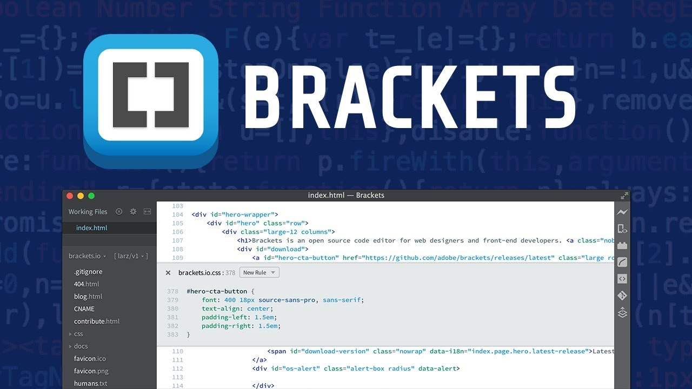

## Brackets2

Un editor de texto de código abierto moderno que comprende el diseño web.

## Extensiones recomendadas

1. CanIUse

Con esta extensión podrás ver de un vistazo el nivel de soporte que tenga cierta tecnología web sin dejar de utilizar Brackets. Y es que su nombre lo deja bien claro. Can I Use significa ¿Puedo utilizar?, frase que resume muy bien el uso de esta extensión. 

2. HTML Skeleton

HTML Skeleton te ayuda a configurar tus páginas HTML de manera rápida insertando automáticamente elementos básicos como la declaración doctype, el tag html, el tag head, el tah body...

3. HTML Wrapper

Con HTML Wrapper solo basta con seleccionar un texto con retornos de carro para convertirlos automáticamente en una lista (li), celdas de una tabla (tr), hipervínculos (a) o cualquier elemento de HTML que se te ocurra.

4. Brackets Icons

Esta super extensión añade los iconos típicos de los ficheros en el sidebar de Brackets. Los iconos son un gran referente visual para identificar de manera sencilla la extensión de los ficheros de un directorio y sobre todo, saber cómo hay que tratarlos.

5. Autoprefixer

Añade prefijos automática e inteligentemente a las propiedades CSS con la extensión Autoprefixer. Utiliza los datos relativos al soporte de navegadores de la extensión CanIUse para decidir si debe poner un prefijo para el navegador o no. Otra funcionalidad destacada de esta extensión es que elimina los prefijos para proveedores innecesarios.

6. JS CSS Minifier

Esta extensión elimina los caracteres innecesarios de tus archivos CSS y Javascript. A este proceso se le llama minificación, y puede mejorar la velocidad de tu proyecto web.

7. CSSLint

Este error pone de manifiesto, remarcándolos, los errores de CSS y las partes del código que deberían mejorarse. Los errores y los warnings que se muestran con esta extensión están basados en las reglas de CSS Lint.
Emmet

Emmet es una colección de herramientas y atajos de teclados que pueden ayudarte a desarrollar más rápido tanto tus códigos CSS como la implementación de maquetas en HTML.

8. Lorem Ipsum Generator

¿Necesitas algo de texto para rellenar el prototipo de un diseño? La extensión Lorem Ipsum Generator te ayuda convenientemente a generar texto de prueba. Este texto de prueba es el típico Lorem Ipsum, un texto en latín que se suele utilizar para rellenar huecos en documentos de diseño gráfico.

9. Beautify

Esta extensión te ayudará a mantener tu código HTML, CSS y Javascript siempre bien formateado, indentado y, lo más importante, legible. Una opción alternativa para esto es la extensión CSSComb, pero solo funciona para código CSS. En mi opinión, Beautify es más útil.

10. Simple To-Do

Asegúrate de no olvidar ninguna tarea relacionada con tus proyectos utilizando la extensión Simple To-Do, que te permite gestionar lista sobre cosas a realizar (to do) para cada proyecto. Todo esto sin salir de Brackets, claro está.

11. eqFTP

Transferir ficheros desde tu ordenador al servidor web del proyecto requiere de un cliente FTP o SFTP, pero esta característica tan fundamental del desarrollo web no está incluida en Brackets. Para remediar esta situación, usa la extensión eqFTP, un cliente FTP/SFTP con el cual puedes operar sin tener que abandonar el editor de código. 

## Enlaces de interes

-[Todo lo que necesitas saber de Brackets](https://beatrizruizcorvillo.es/brackets-editor-html/)  
-[HTML Y CSS](https://www.w3.org/Style/Examples/011/firstcss.es.html)