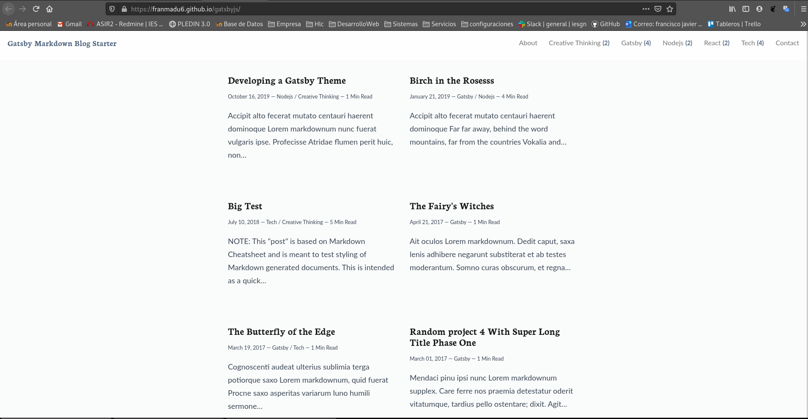
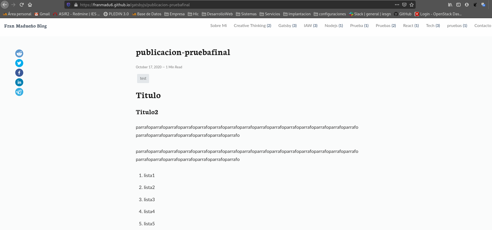

# Instalacion de Gatsby

**¿Que es Gatsby?**  
Gatsby es un framework gratuito y open source basado en React que permite desarrollar de forma rápida sitios web y aplicaciones web rápidos.

**¿Por qué Gatsby?**  
Gatsby quiere ser el framework universal de JavaScript que tiene la visión de que todo el “sitio web es un aplicación web y toda aplicación web es un sitio web”. Además, Gatsby.js es un generador de PWAs estáticas, que gracias a su funcionamiento nativo, permite una carga óptima y una navegación muy rápida.

**Temas**  
Con un tema de Gatsby, toda su configuración predeterminada (funcionalidad compartida, origen de datos, diseño) se extrae de su sitio y se convierte en un paquete instalable. Esto significa que la configuración y la funcionalidad no se escriben directamente en su proyecto, sino que se versionan, administran de forma centralizada y se instalan como una dependencia. Puede actualizar sin problemas un tema, componer temas juntos e incluso cambiar un tema compatible por otro.

**Requisitos previos:**
```shell
sudo apt install build-essential
sudo apt install git
sudo apt install libpng-dev
```

*Instalacion de Node.Js*
(Es aconsejable no instalarlo como root)
```shell
root@debian:/home/fran# apt-get install curl
debian:/home/fran#curl -o- https://raw.githubusercontent.com/nvm-sh/nvm/v0.35.1/install.sh | bash

fran@debian:~$ nvm --version
0.35.1
fran@debian:~$ nvm install 10
Downloading and installing node v10.22.1...
Downloading https://nodejs.org/dist/v10.22.1/node-v10.22.1-linux-x64.tar.xz...
######################################################################### 100,0%
Computing checksum with sha256sum
Checksums matched!
^[[ANow using node v10.22.1 (npm v6.14.6)
Creating default alias: default -> 10 (-> v10.22.1)
fran@debian:~$ nvm use 10
Now using node v10.22.1 (npm v6.14.6)

```

**Instalamos el cliente de Gatsby:**
```shell
fran@debian:~$ npm install -g gatsby-cli
npm WARN deprecated @hapi/joi@15.1.1: joi is leaving the @hapi organization and moving back to 'joi' (https://github.com/sideway/joi/issues/2411)
npm WARN deprecated @hapi/bourne@1.3.2: This version has been deprecated and is no longer supported or maintained
npm WARN deprecated @hapi/hoek@8.5.1: This version has been deprecated and is no longer supported or maintained
npm WARN deprecated @hapi/address@2.1.4: This version has been deprecated and is no longer supported or maintained
npm WARN deprecated @hapi/topo@3.1.6: This version has been deprecated and is no longer supported or maintained
npm WARN deprecated core-js@2.6.11: core-js@<3 is no longer maintained and not recommended for usage due to the number of issues. Please, upgrade your dependencies to the actual version of core-js@3.
/home/fran/.nvm/versions/node/v10.22.1/bin/gatsby -> /home/fran/.nvm/versions/node/v10.22.1/lib/node_modules/gatsby-cli/cli.js

> core-js@2.6.11 postinstall /home/fran/.nvm/versions/node/v10.22.1/lib/node_modules/gatsby-cli/node_modules/core-js
> node -e "try{require('./postinstall')}catch(e){}"

Thank you for using core-js ( https://github.com/zloirock/core-js ) for polyfilling JavaScript standard library!

The project needs your help! Please consider supporting of core-js on Open Collective or Patreon: 
> https://opencollective.com/core-js 
> https://www.patreon.com/zloirock 

Also, the author of core-js ( https://github.com/zloirock ) is looking for a good job -)


> gatsby-telemetry@1.3.37 postinstall /home/fran/.nvm/versions/node/v10.22.1/lib/node_modules/gatsby-cli/node_modules/gatsby-telemetry
> node src/postinstall.js || true


> gatsby-cli@2.12.102 postinstall /home/fran/.nvm/versions/node/v10.22.1/lib/node_modules/gatsby-cli
> node scripts/postinstall.js

╔════════════════════════════════════════════════════════════════════════╗
║                                                                        ║
║   Gatsby collects anonymous usage analytics                            ║
║   to help improve Gatsby for all users.                                ║
║                                                                        ║
║   If you d like to opt-out, you can use `gatsby telemetry --disable`   ║
║   To learn more, checkout https://gatsby.dev/telemetry                 ║
║                                                                        ║
╚════════════════════════════════════════════════════════════════════════╝
Success!

Welcome to the Gatsby CLI! Please visit https://www.gatsbyjs.org/docs/gatsby-cli/ for more information.

npm WARN optional SKIPPING OPTIONAL DEPENDENCY: fsevents@~2.1.2 (node_modules/gatsby-cli/node_modules/chokidar/node_modules/fsevents):
npm WARN notsup SKIPPING OPTIONAL DEPENDENCY: Unsupported platform for fsevents@2.1.3: wanted {"os":"darwin","arch":"any"} (current: {"os":"linux","arch":"x64"})
npm WARN gatsby-interface@0.0.193 requires a peer of gatsby@^2.6.0 but none is installed. You must install peer dependencies yourself.
npm WARN gatsby-interface@0.0.193 requires a peer of react-dom@^16.8.1 but none is installed. You must install peer dependencies yourself.
npm WARN acorn-dynamic-import@4.0.0 requires a peer of acorn@^6.0.0 but none is installed. You must install peer dependencies yourself.
npm WARN theme-ui@0.2.52 requires a peer of @mdx-js/react@^1.0.0 but none is installed. You must install peer dependencies yourself.
npm WARN @reach/tooltip@0.10.3 requires a peer of react-dom@^16.8.0 but none is installed. You must install peer dependencies yourself.
npm WARN @reach/popover@0.10.3 requires a peer of react-dom@^16.8.0 but none is installed. You must install peer dependencies yourself.
npm WARN @reach/combobox@0.10.3 requires a peer of react-dom@^16.8.0 but none is installed. You must install peer dependencies yourself.
npm WARN @reach/dialog@0.10.3 requires a peer of react-dom@^16.8.0 but none is installed. You must install peer dependencies yourself.
npm WARN @reach/tabs@0.10.3 requires a peer of react-dom@^16.8.0 but none is installed. You must install peer dependencies yourself.
npm WARN @reach/alert@0.10.3 requires a peer of react-dom@^16.8.0 but none is installed. You must install peer dependencies yourself.
npm WARN @reach/menu-button@0.10.3 requires a peer of react-dom@^16.8.0 but none is installed. You must install peer dependencies yourself.
npm WARN @reach/utils@0.10.5 requires a peer of react-dom@^16.8.0 but none is installed. You must install peer dependencies yourself.
npm WARN @reach/visually-hidden@0.10.4 requires a peer of react-dom@^16.8.0 but none is installed. You must install peer dependencies yourself.
npm WARN @reach/descendants@0.10.5 requires a peer of react-dom@^16.8.0 but none is installed. You must install peer dependencies yourself.
npm WARN @reach/portal@0.10.5 requires a peer of react-dom@^16.8.0 but none is installed. You must install peer dependencies yourself.
npm WARN @reach/auto-id@0.10.5 requires a peer of react-dom@^16.8.0 but none is installed. You must install peer dependencies yourself.
npm WARN @reach/rect@0.10.5 requires a peer of react-dom@^16.8.0 but none is installed. You must install peer dependencies yourself.

+ gatsby-cli@2.12.102
added 860 packages from 621 contributors in 67.717s
```

**Implantación del entorno:**  
Para crear nuestro sitio web con estilo deberemos elegir un tema, en mi caso he elegido un tema de https://jamstackthemes.dev/ssg/gatsby/
para generarlo ejecutaremos el siguiente comando en el cual crearemos una carpeta y descargaremos el contenido.

```shell
root@debian:/home/fran/GitHub# gatsby new gatsby https://github.com/ammarjabakji/gatsby-markdown-blog-starter/
info Creating new site from git: https://github.com/ammarjabakji/gatsby-markdown-blog-starter.git
Clonando en 'gatsby'...
remote: Enumerating objects: 69, done.
remote: Counting objects: 100% (69/69), done.
remote: Compressing objects: 100% (63/63), done.
remote: Total 69 (delta 5), reused 30 (delta 0), pack-reused 0
Desempaquetando objetos: 100% (69/69), listo.
success Created starter directory layout
info Installing packages...

> sharp@0.23.0 install /home/fran/GitHub/gatsby/node_modules/sharp
> (node install/libvips && node install/dll-copy && prebuild-install) || (node-gyp rebuild && node install/dll-copy)

info sharp Using cached /root/.npm/_libvips/libvips-8.8.1-linux-x64.tar.gz

> node-sass@4.13.1 install /home/fran/GitHub/gatsby/node_modules/node-sass
> node scripts/install.js

Cached binary found at /root/.npm/node-sass/4.13.1/linux-x64-64_binding.node

> core-js@2.6.9 postinstall /home/fran/GitHub/gatsby/node_modules/core-js
> node scripts/postinstall || echo "ignore"

Thank you for using core-js ( https://github.com/zloirock/core-js ) for polyfilling JavaScript standard library!

The project needs your help! Please consider supporting of core-js on Open Collective or Patreon: 
> https://opencollective.com/core-js 
> https://www.patreon.com/zloirock 

Also, the author of core-js ( https://github.com/zloirock ) is looking for a good job -)


> core-js-pure@3.6.4 postinstall /home/fran/GitHub/gatsby/node_modules/core-js-pure
> node -e "try{require('./postinstall')}catch(e){}"

Thank you for using core-js ( https://github.com/zloirock/core-js ) for polyfilling JavaScript standard library!

The project needs your help! Please consider supporting of core-js on Open Collective or Patreon: 
> https://opencollective.com/core-js 
> https://www.patreon.com/zloirock 

Also, the author of core-js ( https://github.com/zloirock ) is looking for a good job -)


> core-js@2.6.11 postinstall /home/fran/GitHub/gatsby/node_modules/gatsby/node_modules/core-js
> node -e "try{require('./postinstall')}catch(e){}"

Thank you for using core-js ( https://github.com/zloirock/core-js ) for polyfilling JavaScript standard library!

The project needs your help! Please consider supporting of core-js on Open Collective or Patreon: 
> https://opencollective.com/core-js 
> https://www.patreon.com/zloirock 

Also, the author of core-js ( https://github.com/zloirock ) is looking for a good job -)


> gatsby-telemetry@1.1.56 postinstall /home/fran/GitHub/gatsby/node_modules/gatsby-telemetry
> node src/postinstall.js || true


> cwebp-bin@5.1.0 postinstall /home/fran/GitHub/gatsby/node_modules/cwebp-bin
> node lib/install.js

  ✔ cwebp pre-build test passed successfully

> mozjpeg@6.0.1 postinstall /home/fran/GitHub/gatsby/node_modules/mozjpeg
> node lib/install.js

  ✔ mozjpeg pre-build test passed successfully

> pngquant-bin@5.0.2 postinstall /home/fran/GitHub/gatsby/node_modules/pngquant-bin
> node lib/install.js

  ✔ pngquant pre-build test passed successfully

> gatsby-cli@2.10.13 postinstall /home/fran/GitHub/gatsby/node_modules/gatsby/node_modules/gatsby-cli
> node scripts/postinstall.js


> gatsby@2.19.49 postinstall /home/fran/GitHub/gatsby/node_modules/gatsby
> node scripts/postinstall.js


> node-sass@4.13.1 postinstall /home/fran/GitHub/gatsby/node_modules/node-sass
> node scripts/build.js

Binary found at /home/fran/GitHub/gatsby/node_modules/node-sass/vendor/linux-x64-64/binding.node
Testing binary
Binary is fine
npm WARN gatsby-Blog-advanced@1.1.0 No repository field.
npm WARN optional SKIPPING OPTIONAL DEPENDENCY: fsevents@1.2.9 (node_modules/fsevents):
npm WARN notsup SKIPPING OPTIONAL DEPENDENCY: Unsupported platform for fsevents@1.2.9: wanted {"os":"darwin","arch":"any"} (current: {"os":"linux","arch":"x64"})
npm WARN optional SKIPPING OPTIONAL DEPENDENCY: fsevents@2.1.2 (node_modules/gatsby/node_modules/fsevents):
npm WARN notsup SKIPPING OPTIONAL DEPENDENCY: Unsupported platform for fsevents@2.1.2: wanted {"os":"darwin","arch":"any"} (current: {"os":"linux","arch":"x64"})
npm WARN optional SKIPPING OPTIONAL DEPENDENCY: fsevents@2.0.7 (node_modules/gatsby-source-filesystem/node_modules/fsevents):
npm WARN notsup SKIPPING OPTIONAL DEPENDENCY: Unsupported platform for fsevents@2.0.7: wanted {"os":"darwin","arch":"any"} (current: {"os":"linux","arch":"x64"})
npm WARN optional SKIPPING OPTIONAL DEPENDENCY: fsevents@2.1.2 (node_modules/gatsby-page-utils/node_modules/fsevents):
npm WARN notsup SKIPPING OPTIONAL DEPENDENCY: Unsupported platform for fsevents@2.1.2: wanted {"os":"darwin","arch":"any"} (current: {"os":"linux","arch":"x64"})

added 3001 packages from 1182 contributors and audited 3075 packages in 30.09s

57 packages are looking for funding
  run `npm fund` for details

found 456 vulnerabilities (409 low, 47 high)
  run `npm audit fix` to fix them, or `npm audit` for details
info Initialising git in gatsby
Inicializado repositorio Git vacío en /home/fran/GitHub/gatsby/.git/
info Create initial git commit in gatsby
info
Your new Gatsby site has been successfully bootstrapped. Start developing it by running:

  cd gatsby
  gatsby develop
```

**Podremos desplegarla usando gastby develop para tener una primera vista de la misma.**
```shell
root@debian:/home/fran/GitHub/gatsby# gatsby develop
success open and validate gatsby-configs - 0.094s
success load plugins - 0.981s
success onPreInit - 0.005s
success initialize cache - 0.006s
success copy gatsby files - 0.015s
success onPreBootstrap - 0.008s
success createSchemaCustomization - 0.020s
success source and transform nodes - 0.107s
warn Plugin `gatsby-source-filesystem` tried to define built-in Gatsby GraphQL type `File`
warn Plugin `gatsby-source-filesystem` tried to define built-in Gatsby GraphQL type `File`
success building schema - 0.272s
success createPages - 0.053s
success createPagesStatefully - 0.071s
success onPreExtractQueries - 0.002s
success update schema - 0.025s
success extract queries from components - 0.237s
success write out requires - 0.044s
success write out redirect data - 0.003s
success Build manifest and related icons - 0.003s
success onPostBootstrap - 0.013s
⠀
info bootstrap finished - 4.613 s
⠀
success Generating image thumbnails - 0.164s - 6/6 36.58/s
warn code block or inline code language not specified in markdown. applying generic code block
success run queries - 0.598s - 33/33 55.21/s
warn Browserslist: caniuse-lite is outdated. Please run the following command: `npx browserslist --update-db`
⠀
You can now view gatsby-Blog-advanced in the browser.
⠀
  http://localhost:8000/
⠀
View GraphiQL, an in-browser IDE, to explore your site s data and schema
⠀
  http://localhost:8000/___graphql
⠀
Note that the development build is not optimized.
To create a production build, use gatsby build
⠀
success Building development bundle - 4.242s
```

**Ejecutaremos gatsby build para generar los archivos estaticos.**
```shell
root@debian:/home/fran/GitHub/gatsby# gatsby build
success open and validate gatsby-configs - 0.048s
success load plugins - 0.647s
success onPreInit - 0.004s
success delete html and css files from previous builds - 0.014s
success initialize cache - 0.007s
success copy gatsby files - 0.015s
success onPreBootstrap - 0.007s
success createSchemaCustomization - 0.017s
success source and transform nodes - 0.060s
warn Plugin `gatsby-source-filesystem` tried to define built-in Gatsby GraphQL type `File`
warn Plugin `gatsby-source-filesystem` tried to define built-in Gatsby GraphQL type `File`
success building schema - 0.276s
success createPages - 0.056s
success createPagesStatefully - 0.071s
success onPreExtractQueries - 0.002s
success update schema - 0.037s
success extract queries from components - 0.252s
success write out requires - 0.004s
success write out redirect data - 0.001s
success Build manifest and related icons - 0.002s
success onPostBootstrap - 0.012s
⠀
info bootstrap finished - 3.840 s
⠀
warn Browserslist: caniuse-lite is outdated. Please run the following command: `npx browserslist --update-db`
success Building production JavaScript and CSS bundles - 12.703s
success Rewriting compilation hashes - 0.003s
success run queries - 12.917s - 5/5 0.39/s
success Building static HTML for pages - 1.930s - 32/32 16.58/s
Generated public/sw.js, which will precache 6 files, totaling 351630 bytes.
success onPostBuild - 0.120s
info Done building in 18.897 sec
```

**Instalaremos gh-pages en nuestra carpeta**
```shell
root@debian:/home/fran/GitHub/gatsby# npm i gh-pages
npm WARN eslint-config-react-app@5.2.0 requires a peer of eslint@6.x but none is installed. You must install peer dependencies yourself.
npm WARN stylelint-config-recommended@2.2.0 requires a peer of stylelint@^8.3.0 || ^9.0.0 || ^10.0.0 but none is installed. You must install peer dependencies yourself.
npm WARN stylelint-config-standard@18.3.0 requires a peer of stylelint@^8.3.0 || ^9.0.0 || ^10.0.0 but none is installed. You must install peer dependencies yourself.
npm WARN stylelint-config-standard-scss@1.1.0 requires a peer of stylelint@^8.3.0 || ^9.0.0 || ^10.0.0 but none is installed. You must install peer dependencies yourself.
npm WARN tsutils@3.17.1 requires a peer of typescript@>=2.8.0 || >= 3.2.0-dev || >= 3.3.0-dev || >= 3.4.0-dev || >= 3.5.0-dev || >= 3.6.0-dev || >= 3.6.0-beta || >= 3.7.0-dev || >= 3.7.0-beta but none is installed. You must install peer dependencies yourself.
npm WARN gatsby-Blog-advanced@1.1.0 No repository field.
npm WARN optional SKIPPING OPTIONAL DEPENDENCY: fsevents@1.2.9 (node_modules/fsevents):
npm WARN notsup SKIPPING OPTIONAL DEPENDENCY: Unsupported platform for fsevents@1.2.9: wanted {"os":"darwin","arch":"any"} (current: {"os":"linux","arch":"x64"})
npm WARN optional SKIPPING OPTIONAL DEPENDENCY: fsevents@2.1.2 (node_modules/gatsby/node_modules/fsevents):
npm WARN notsup SKIPPING OPTIONAL DEPENDENCY: Unsupported platform for fsevents@2.1.2: wanted {"os":"darwin","arch":"any"} (current: {"os":"linux","arch":"x64"})
npm WARN optional SKIPPING OPTIONAL DEPENDENCY: fsevents@2.1.2 (node_modules/gatsby-page-utils/node_modules/fsevents):
npm WARN notsup SKIPPING OPTIONAL DEPENDENCY: Unsupported platform for fsevents@2.1.2: wanted {"os":"darwin","arch":"any"} (current: {"os":"linux","arch":"x64"})
npm WARN optional SKIPPING OPTIONAL DEPENDENCY: fsevents@2.0.7 (node_modules/gatsby-source-filesystem/node_modules/fsevents):
npm WARN notsup SKIPPING OPTIONAL DEPENDENCY: Unsupported platform for fsevents@2.0.7: wanted {"os":"darwin","arch":"any"} (current: {"os":"linux","arch":"x64"})

+ gh-pages@2.2.0
removed 1 package, updated 2 packages and audited 3074 packages in 13.058s

57 packages are looking for funding
  run `npm fund` for details

found 456 vulnerabilities (409 low, 47 high)
  run `npm audit fix` to fix them, or `npm audit` for details
```

**En mi caso, el tema que estoy usando necesita modificacion extra antes de subir la web para que todo salga bien modificaré las siguientes lineas, para saber que modificar segun tu tema revisa la documentacion del mismo**
```shell
#en gatsby-config.js
module.exports = {
  pathPrefix: "/gatsbyjs",
  siteMetadata: {
    siteUrl: urljoin(config.siteUrl, config.pathPrefix),
    rssMetadata: {
      site_url: urljoin(config.siteUrl, config.pathPrefix),
      feed_url: urljoin(config.siteUrl, config.pathPrefix, config.siteRss),
      title: config.siteTitle,
      description: config.siteDescription,
      image_url: `${urljoin(
        config.siteUrl,
        config.pathPrefix
      )}/logos/logo-48.png`,
      copyright: config.copyright
    }

#en /data/SiteConfig.js
pathPrefix: 'https://github.com/franmadu6/gatsbyjs/',
```
## Subir la carpeta a GitHub

**Crearemos un repositorio en GitHub el mio es: https://github.com/franmadu6/gatsbyjs**
**Ahora subiremos nuestra carpeta al repositorio**
```shellroot@debian:/home/fran/GitHub/gatsby# git remote add origin https://github.com/franmadu6/gatsbyjs.git
root@debian:/home/fran/GitHub/gatsby# git branch -M main
root@debian:/home/fran/GitHub/gatsby# git push -u origin main
Username for 'https://github.com': franmadu6
Password for 'https://franmadu6@github.com': 
Enumerando objetos: 68, listo.
Contando objetos: 100% (68/68), listo.
Compresión delta usando hasta 8 hilos
Comprimiendo objetos: 100% (62/62), listo.
Escribiendo objetos: 100% (68/68), 701.45 KiB | 13.23 MiB/s, listo.
Total 68 (delta 3), reusado 0 (delta 0)
remote: Resolving deltas: 100% (3/3), done.
To https://github.com/franmadu6/gatsbyjs.git
 * [new branch]      main -> main
Rama 'main' configurada para hacer seguimiento a la rama remota 'main' de 'origin'.
```

**Para publica nuestra pagina en Gh-pages añadiremos un script a package.json**
```shell
#añadiremos en la linea de scripts
"deploy": "gatsby build --prefix-paths && gh-pages -d public"
```
*y ejecutaremos el comando*
```shell
root@debian:/home/fran/GitHub/gatsby# npm run deploy

> gatsby-Blog-advanced@1.1.0 deploy /home/fran/GitHub/gatsby
> gatsby build --prefix-paths && gh-pages -d public

success open and validate gatsby-configs - 0.047s
success load plugins - 0.580s
success onPreInit - 0.004s
success delete html and css files from previous builds - 0.016s
info One or more of your plugins have changed since the last time you ran Gatsby. As
a precaution, we re deleting your site's cache to ensure there's no stale data.
success initialize cache - 0.016s
success copy gatsby files - 0.018s
success onPreBootstrap - 0.012s
success createSchemaCustomization - 0.020s
success source and transform nodes - 0.102s
warn Plugin `gatsby-source-filesystem` tried to define built-in Gatsby GraphQL type `File`
warn Plugin `gatsby-source-filesystem` tried to define built-in Gatsby GraphQL type `File`
success building schema - 0.279s
success createPages - 0.056s
success createPagesStatefully - 0.104s
success onPreExtractQueries - 0.002s
success update schema - 0.045s
success extract queries from components - 0.324s
success write out requires - 0.004s
success write out redirect data - 0.001s
success Build manifest and related icons - 0.002s
success onPostBootstrap - 0.006s
⠀
info bootstrap finished - 3.172 s
⠀
warn Browserslist: caniuse-lite is outdated. Please run the following command: `npx browserslist --update-db`
success Building production JavaScript and CSS bundles - 8.803s
success Rewriting compilation hashes - 0.004s
warn code block or inline code language not specified in markdown. applying generic code block
success run queries - 9.381s - 33/33 3.52/s
success Building static HTML for pages - 1.059s - 32/32 30.22/s
Generated public/sw.js, which will precache 8 files, totaling 352300 bytes.
success onPostBuild - 0.085s
info Done building in 13.755 sec
Username for 'https://github.com': franmadu6
Password for 'https://franmadu6@github.com': 
Published
```
Podremos ver el resultado entrando en nuestra pagina https://franmadu6.github.io/gatsbyjs/


**Comenzaremos con las configuraciones**
```shell
#en /data/SiteConfig.js

const config = {
  siteTitle: 'Fran Madueño Blog', // Site title.
  siteTitleShort: 'Madueño Markdown Blog', // Short site title for homescreen (PWA). Preferably should be under 12 characters to prevent truncation.
  siteTitleAlt: 'Fran Madueño Blog', // Alternative site title for SEO.
  siteLogo: '/logos/logo-1024.png', // Logo used for SEO and manifest.
  siteUrl: 'https://github.com/franmadu6/gatsbyjs/', // Domain of your website without pathPrefix.
  pathPrefix: 'https://github.com/franmadu6/gatsbyjs/', // Prefixes all links. For cases when deployed to example.github.io/gatsby-advanced-starter/.
  siteDescription:
    'Web estatica generada por Gatsby.', // Website description used for RSS feeds/meta description tag.
  siteRss: '/rss.xml', // Path to the RSS file.
  siteFBAppID: '1825356251115265', // FB Application ID for using app insights
  googleAnalyticsID: 'UA-161211056-1', // GA tracking ID.
  dateFromFormat: 'YYYY-MM-DD', // Date format used in the frontmatter.
  dateFormat: 'DD/MM/YYYY', // Date format for display.
  userName: 'Fran Madueño', // Username to display in the author segment.
  userEmail: 'frandh1997@gmail.com', // Email used for RSS feed's author segment
  userTwitter: 'franmadueo', // Optionally renders "Follow Me" in the Bio segment.
  userGitHub: 'franmadu6', // Optionally renders "Follow Me" in the Bio segment.
  userLocation: 'Sevilla, España', // User location to display in the author segment.
  userAvatar: 'https://i.ibb.co/WPz9CNk/avatar.jpg', // User avatar to display in the author segment.
  userDescription:
    "Aquí hay una descripción", // User description to display in the author segment.
  copyright: 'Copyright © 2020. All rights reserved.', // Copyright string for the footer of the website and RSS feed.
  themeColor: '#c62828', // Used for setting manifest and progress theme colors.
  backgroundColor: 'red' // Used for setting manifest background color.
}
```

**En la carpeta /content es donde se guardan mis archivos markdown, alli es donde modifico o creo tarjetas nuevas para usar en la web.**
Creemos una:
```shell
---
date: 2020-10-15
title: "Instalación de Brackets en Debian"
cover: "https://img.utdstc.com/icons/brackets-.png:225"
categories: 
    - Sistemas
    - Gatsby
tags:
    - Entorno de desarrollo
    - Debian
    - Brackets
---

## Brackets

Un editor de texto de código abierto moderno que comprende el diseño web.

## Extensiones recomendadas

1. CanIUse

Con esta extensión podrás ver de un vistazo el nivel de soporte que tenga cierta tecnología web sin dejar de utilizar Brackets. Y es que su nombre lo deja bien claro. Can I Use significa ¿Puedo utilizar?, frase que resume muy bien el uso de esta extensión. 

2. HTML Skeleton

HTML Skeleton te ayuda a configurar tus páginas HTML de manera rápida insertando automáticamente elementos básicos como la declaración doctype, el tag html, el tag head, el tah body...

3. HTML Wrapper

Con HTML Wrapper solo basta con seleccionar un texto con retornos de carro para convertirlos automáticamente en una lista (li), celdas de una tabla (tr), hipervínculos (a) o cualquier elemento de HTML que se te ocurra.

4. Brackets Icons

Esta super extensión añade los iconos típicos de los ficheros en el sidebar de Brackets. Los iconos son un gran referente visual para identificar de manera sencilla la extensión de los ficheros de un directorio y sobre todo, saber cómo hay que tratarlos.

5. Autoprefixer

Añade prefijos automática e inteligentemente a las propiedades CSS con la extensión Autoprefixer. Utiliza los datos relativos al soporte de navegadores de la extensión CanIUse para decidir si debe poner un prefijo para el navegador o no. Otra funcionalidad destacada de esta extensión es que elimina los prefijos para proveedores innecesarios.

6. JS CSS Minifier

Esta extensión elimina los caracteres innecesarios de tus archivos CSS y Javascript. A este proceso se le llama minificación, y puede mejorar la velocidad de tu proyecto web.

7. CSSLint

Este error pone de manifiesto, remarcándolos, los errores de CSS y las partes del código que deberían mejorarse. Los errores y los warnings que se muestran con esta extensión están basados en las reglas de CSS Lint.
Emmet

Emmet es una colección de herramientas y atajos de teclados que pueden ayudarte a desarrollar más rápido tanto tus códigos CSS como la implementación de maquetas en HTML.

8. Lorem Ipsum Generator

¿Necesitas algo de texto para rellenar el prototipo de un diseño? La extensión Lorem Ipsum Generator te ayuda convenientemente a generar texto de prueba. Este texto de prueba es el típico Lorem Ipsum, un texto en latín que se suele utilizar para rellenar huecos en documentos de diseño gráfico.

9. Beautify

Esta extensión te ayudará a mantener tu código HTML, CSS y Javascript siempre bien formateado, indentado y, lo más importante, legible. Una opción alternativa para esto es la extensión CSSComb, pero solo funciona para código CSS. En mi opinión, Beautify es más útil.

10. Simple To-Do

Asegúrate de no olvidar ninguna tarea relacionada con tus proyectos utilizando la extensión Simple To-Do, que te permite gestionar lista sobre cosas a realizar (to do) para cada proyecto. Todo esto sin salir de Brackets, claro está.

11. eqFTP

Transferir ficheros desde tu ordenador al servidor web del proyecto requiere de un cliente FTP o SFTP, pero esta característica tan fundamental del desarrollo web no está incluida en Brackets. Para remediar esta situación, usa la extensión eqFTP, un cliente FTP/SFTP con el cual puedes operar sin tener que abandonar el editor de código. 

## Enlaces de interes

-[Todo lo que necesitas saber de Brackets](https://beatrizruizcorvillo.es/brackets-editor-html/)  
-[HTML Y CSS](https://www.w3.org/Style/Examples/011/firstcss.es.html)
```

Con este archivo se habrá generado este link https://franmadu6.github.io/gatsbyjs/instalacion-de-brackets-en-debian

Este tema es de mucha ayuda para crear una web formato blog puesto que tiene un sistema de tags y etiquetas bastante util.

**Generación de Script para automatizar la producción**
Con este Script he generado una plantilla por defecto para mis paginas que se publica automaticamente despues de ser escrita.s
```shell
#!/bin/bash

#Subir los archivos a Github
sudo git add .
sudo git commit -m "Publicación añadida por el Script de Producción"
sudo git push

#Cuando se ejecute npm run deploy todo el contenido de la public carpeta se moverá a la rama master de mi repositorio .
npm run deploy
```
