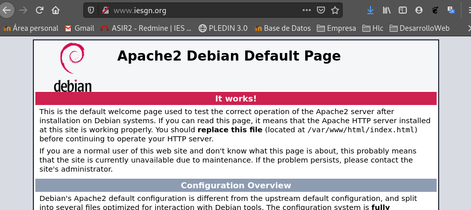
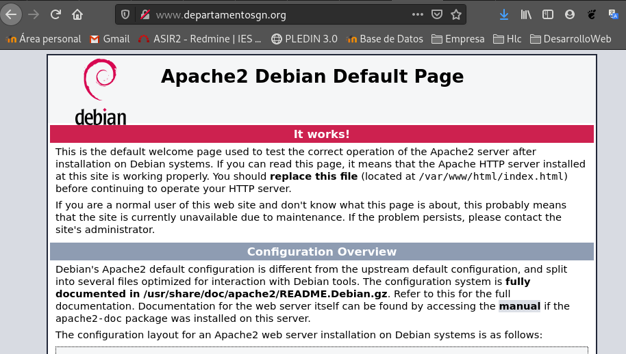
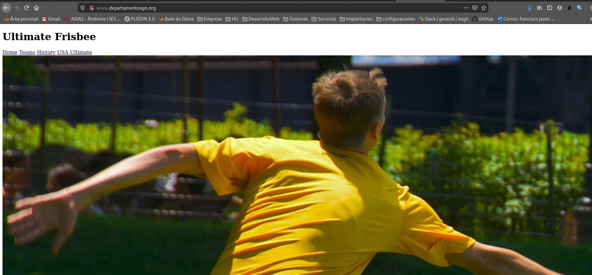
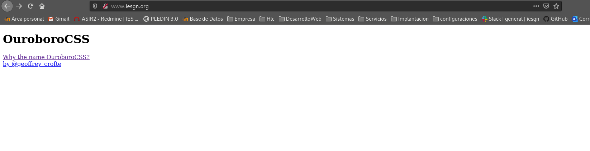

Repite el ejercicio cambiando los directorios de trabajo a /srv/www. ¿Qué modificación debes hacer en el fichero /etc/apache2/apache2.conf?

### Deberemos activar las lineas del directorio srv
```shell
<Directory /srv/>
        Options Indexes FollowSymLinks
        AllowOverride None
        Require all granted
</Directory>
```

### Movemos nuestros archivos
```shell
root@debian:/var/www# mv iesgn/ /srv/www/
root@debian:/var/www# mv departamentosgn/ /srv/www/
```

### Modificaremos la ruta en nuestros archivos de configuración
```shell
DocumentRoot /srv/www/iesgn
DocumentRoot /srv/www/departamentosgn
```

### Recargamaos los servicios:
```shell
root@debian:/etc/apache2/sites-available# systemctl reload apache2
```




