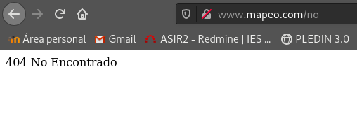

Crea un nuevo host virtual que es accedido con el nombre www.mapeo.com, cuyo DocumentRoot sea /srv/mapeo.
```shell
<VirtualHost *:80>
        ServerName www.mapeo.com

        ServerAdmin webmaster@localhost
        DocumentRoot /srv/mapeo

        ErrorLog ${APACHE_LOG_DIR}/error.log
        CustomLog ${APACHE_LOG_DIR}/access.log combined
</VirtualHost>
```
```shell
#configuramos virtualhost
fran@debian:/etc/apache2/sites-available$ sudo a2ensite mapeo.conf
Enabling site mapeo.
To activate the new configuration, you need to run:
  systemctl reload apache2

#le damos permisos de propietario adecuados
fran@debian:/etc/apache2/sites-available$ sudo chown -R www-data:www-data /srv/mapeo/

#por ultimo recargamos apache para que se inicie la configuración nueva
fran@debian:/etc/apache2/sites-available$ systemctl reload apache2
```

1. Cuando se entre a la dirección www.mapeo.com se redireccionará automáticamente a www.mapeo.com/principal, donde se mostrará el mensaje de bienvenida.*
muevo el index.html a /srv/mapeo/principal
```shell
#en mapeo.conf
Redirect 301 /index.html        /principal
```

2. En el directorio principal no se permite ver la lista de los ficheros, no se permite que se siga los enlaces simbólicos y no se permite negociación de contenido. Muestra al profesor el funcionamiento. ¿Qué configuración tienes que poner?
```shell
        <Directory "/srv/mapeo">
                Options -Indexes -FollowSymLinks -Multiviews
        </Directory>
```

3. Si accedes a la página www.mapeo.com/principal/documentos se visualizarán los documentos que hay en /home/usuario/doc. Por lo tanto se permitirá el listado de fichero y el seguimiento de enlaces simbólicos siempre que el propietario del enlace y del fichero al que apunta sean el mismo usuario. Explica bien y pon una prueba de funcionamiento donde se vea bien el seguimiento de los enlaces simbólicos.

*Creo un directorio llamado documentos en mi carpeta principal y creo los enlaces simbolicos:*
```shell
root@debian:/srv/mapeo/principal/documentos# sudo ln -s /home/fran/Documentos/prueba.txt 
root@debian:/srv/mapeo/principal/documentos# sudo chown -R www-data:www-data prueba.txt 

root@debian:/srv/mapeo/principal/documentos# ln -s /root/prueba/pruebaroot.txt 
root@debian:/srv/mapeo/principal/documentos# chown www-data:www-data pruebaroot.txt 


root@debian:/srv/mapeo/principal/documentos# ls -l
total 0
lrwxrwxrwx 1 root     root     27 oct 22 09:34 pruebaroot.txt -> /root/prueba/pruebaroot.txt
lrwxrwxrwx 1 www-data www-data 32 oct 21 13:20 prueba.txt -> /home/fran/Documentos/prueba.txt
```

He creado varios documentos para probar de diferentes formas he dejado la creación de dos de ellos para que se pueda ver como crear un enlace simbólico.

**Creo la redirección y doy los permisos al directorio /home/fran/Documentos**

Usando:
* Indexes
 Si se solicita una URL que se asigna a un directorio, y no hay DirectoryIndex ( por ejemplo , index.html) en ese directorio, mod_autoindexse devolverá una lista formateada del directorio.
* SymLinksIfOwnerMatch
 El servidor solo seguirá enlaces simbólicos para los cuales el archivo o directorio de destino es propiedad del mismo ID de usuario que el enlace.

```shell
<VirtualHost *:80>

        ServerName www.mapeo.com

        ServerAdmin webmaster@localhost
        DocumentRoot /srv/mapeo/

        Redirect 301 /index.html        /principal
        Redirect 301 /srv/mapeo/principal/documentos    /principal/documentos

        <Directory "/home/fran/Documentos">
                Options Indexes SymLinksIfOwnerMatch
        </Directory>


        ErrorLog ${APACHE_LOG_DIR}/error.log
        CustomLog ${APACHE_LOG_DIR}/access.log combined

</VirtualHost>
```


**Como podemos ver en la captura no podemos ver el archivo que he creado con el usuario root**

4. En todo el host virtual se debe redefinir los mensajes de error de objeto no encontrado y no permitido. Para el ello se crearan dos ficheros html dentro del directorio error. Entrega las modificaciones necesarias en la configuración y una comprobación del buen funcionamiento.

```shell
root@debian:/srv/mapeo# mkdir error
root@debian:/srv/mapeo/error# nano error403.html
root@debian:/srv/mapeo/error# nano error404.html

#Añadimos las siguientes lineas a nuestro archivo de configuración:
        ErrorDocument 403 /error/error403.html
        ErrorDocument 404 /error/error404.html

#Añado la ruta de mi carpeta css y la restrinjo
          <Directory "/srv/mapeo/css">
                Require all denied
        </Directory>
```



