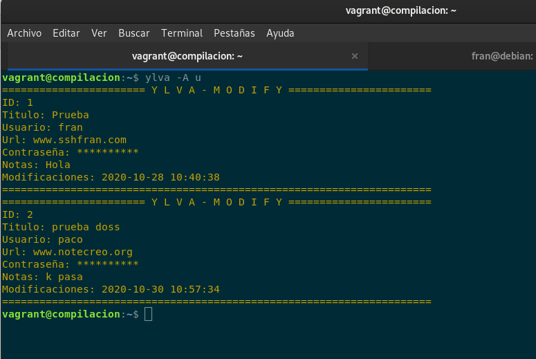
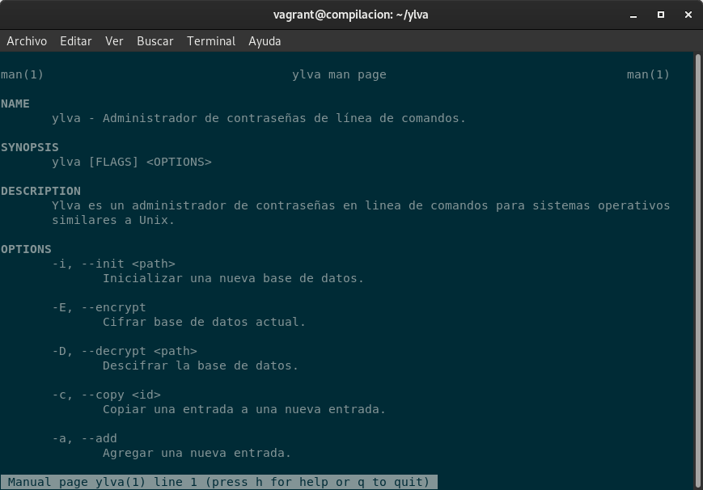

# Ylva - Command line password manager

Ylva es un antiguo nombre femenino sueco, significa "loba", un derivado del nórdico antiguo úlfr. Cuando se trata del administrador de contraseñas, antes del lanzamiento 1.4, Ylva era conocido como Titan.

La administración de contraseñas pertenece a la línea de comandos, en lo más profundo del corazón de Unix, el shell. Ylva hace que la administración de contraseñas sea fácil y segura. Es un software de línea de comandos tradicional escrito en C. Ylva es muy portátil y debería funcionar bien en la mayoría de los sistemas operativos similares a Unix. Ylva se desarrolla principalmente en Linux.

El administrador de contraseñas de la línea de comandos es útil. Puede optar por ejecutarlo en un servidor remoto para que sus contraseñas estén disponibles de forma remota (a través de SSH, etc.). No es necesario sincronizar su base de datos de contraseñas entre máquinas.

Ylva usa OpenSSL (o LibreSSL) para el cifrado. Para la base de datos de contraseñas se utiliza SQLite. Ylva cifra la base de datos usando AES con 256 claves. La base de datos cifrada se autentica mediante HMAC. Para la generación de claves, PKBDF2-SHA256 se utiliza con 200 000 iteraciones.

Ylva no permanece ejecutándose, por lo que las posibles contraseñas de texto sin formato no están en la memoria excepto por un tiempo muy corto. Por ejemplo, ejecutar el comando ylva --auto-encrypt --list-all listaría todas las entradas de contraseña, encriptaría la base de datos y luego saldría. Las contraseñas de texto sin formato estarán en la memoria solo unos segundos. Esto hace que sea muy difícil para el malware robarlos.

Cuando se descifra la base de datos, solo el propietario la puede leer (chmod 600). Ylva lo hace automáticamente para el archivo de la base de datos para que no tenga que cambiar los permisos.

Después de esta breve introducción cabe destacar que posee un archivo donde guarda las actualizaciones realizadas.
<pre style="background-color:powderblue;">
Release 1.6 (2020-04-17)
        Some changes to command line switches
        Fixing typos in the manual
        Makefile fixes
        Minor code refactoring
        Very stable long term release

Release 1.5 (2019-05-24)
        Password generator now uses RAND_bytes from OpenSSL
        Regex search can now search all the entry fields
        Minor memory leak fixed
        Entries can now be duplicated with -D, --duplicate
        Decrypted database is now only readable by the owner

Release 1.4 (2019-05-18)
        *Titan is now Ylva
        *Ylva no longer supports encrypting individual files or directories, it's not a job for a password manager.
        *Note that if you used colors, change TITAN_COLOR to YLVA_COLOR
        *This release is made mostly because of the name change, but active development will continue
Release 1.3 (2018-09-04)
        *Titan now supports custom count of listing latest entries

Release 1.2 (2017-11-14)
        *Support for colors. See man titan(1) for more information.
        *Added Support encrypting individual files
        *Added support for encrypting directories
        *Many smaller internal changes and bug fixes
</pre>

Comenzaremos descargando el repositorio de debian salsa:
<pre style="background-color:powderblue;">
vagrant@compilacion:~$ git clone https://salsa.debian.org/debian/ylva
Cloning into 'ylva'...
warning: redirecting to https://salsa.debian.org/debian/ylva.git/
remote: Enumerating objects: 75, done.
remote: Counting objects: 100% (75/75), done.
remote: Compressing objects: 100% (69/69), done.
remote: Total 75 (delta 21), reused 0 (delta 0), pack-reused 0
Unpacking objects: 100% (75/75), done.
vagrant@compilacion:~$ cd ylva/
vagrant@compilacion:~/ylva$ ls
cmd_ui.c  crypto.h  debian   LICENSE   pwd-gen.c  regexfind.c  utils.h  ylva.png
cmd_ui.h  db.c      entry.c  Makefile  pwd-gen.h  regexfind.h  ylva.1
crypto.c  db.h      entry.h  NEWS      README.md  utils.c      ylva.c
</pre>

El primer error que encontramos:
<pre style="background-color:powderblue;">
vagrant@compilacion:~/ylva$ make install
cc -g -std=c99 -Wall -c entry.c -o entry.o
cc -g -std=c99 -Wall -c db.c -o db.o
db.c:11:10: fatal error: sqlite3.h: No such file or directory
 #include <sqlite3.h>
          ^~~~~~~~~~~
compilation terminated.
make: *** [Makefile:14: db.o] Error 1
</pre>

Deberemos de crear la librería *libsqlite3-0* que es una libreria compartida de SQLite.
<pre style="background-color:powderblue;">
vagrant@compilacion:~/ylva$ sudo apt install libsqlite3-dev
Reading package lists... Done
Building dependency tree       
Reading state information... Done
Suggested packages:
  sqlite3-doc
The following NEW packages will be installed:
  libsqlite3-dev
0 upgraded, 1 newly installed, 0 to remove and 1 not upgraded.
Need to get 787 kB of archives.
After this operation, 2,288 kB of additional disk space will be used.
Get:1 http://deb.debian.org/debian buster/main amd64 libsqlite3-dev amd64 3.27.2-3 [787 kB]
Fetched 787 kB in 1s (1,331 kB/s)      
Selecting previously unselected package libsqlite3-dev:amd64.
(Reading database ... 73425 files and directories currently installed.)
Preparing to unpack .../libsqlite3-dev_3.27.2-3_amd64.deb ...
Unpacking libsqlite3-dev:amd64 (3.27.2-3) ...
Setting up libsqlite3-dev:amd64 (3.27.2-3) ...
</pre>

Volvemos a tener el mismo caso, ahora con *openssl/evp.h*:
<pre style="background-color:powderblue;">
vagrant@compilacion:~/ylva$ make install
cc -g -std=c99 -Wall -c db.c -o db.o
cc -g -std=c99 -Wall -c crypto.c -o crypto.o
crypto.c:11:10: fatal error: openssl/evp.h: No such file or directory
 #include <openssl/evp.h>
          ^~~~~~~~~~~~~~~
compilation terminated.
make: *** [Makefile:14: crypto.o] Error 1
</pre>

Que lo solucionamos instalando sus dependencias:
<pre style="background-color:powderblue;">
vagrant@compilacion:~/ylva$ sudo apt install libssl-dev 
Reading package lists... Done
Building dependency tree       
Reading state information... Done
Suggested packages:
  libssl-doc
The following NEW packages will be installed:
  libssl-dev
0 upgraded, 1 newly installed, 0 to remove and 1 not upgraded.
Need to get 1,793 kB of archives.
After this operation, 8,072 kB of additional disk space will be used.
Get:1 http://deb.debian.org/debian buster/main amd64 libssl-dev amd64 1.1.1d-0+deb10u3 [1,793 kB]
Fetched 1,793 kB in 1s (1,972 kB/s)     
Selecting previously unselected package libssl-dev:amd64.
(Reading database ... 73437 files and directories currently installed.)
Preparing to unpack .../libssl-dev_1.1.1d-0+deb10u3_amd64.deb ...
Unpacking libssl-dev:amd64 (1.1.1d-0+deb10u3) ...
Setting up libssl-dev:amd64 (1.1.1d-0+deb10u3) ...
</pre>

Ahora podremos instalar sin problemas:
<pre style="background-color:powderblue;">
vagrant@compilacion:~/ylva$ sudo make install
if [ ! -d /usr//share/man/man1 ];then	\
	mkdir -p /usr//share/man/man1;	\
fi
install -m644 ylva.1 /usr//share/man/man1/
gzip -f /usr//share/man/man1/ylva.1
if [ ! -d /usr//bin ] ; then \
	mkdir -p /usr//bin ; \
fi
install -m755 ylva /usr//bin/
</pre>

Comprobamos su ubicación:
<pre style="background-color:powderblue;">
vagrant@compilacion:~/ylva$ which ylva
/usr/bin/ylva

vagrant@compilacion:~/ylva$ whereis ylva
ylva: /usr/bin/ylva /usr/share/man/man1/ylva.1.gz
</pre>

Comprobamos que tambien esta su manual.
<pre style="background-color:powderblue;">
man(1)                                                 ylva man page                                                 man(1)

NAME
       ylva - command line password manager

SYNOPSIS
       ylva [FLAGS] <OPTIONS>

DESCRIPTION
       Ylva is a command line password manager program for Unix-like operating systems.

OPTIONS
       -i, --init <path>
              Initialize new database

       -E, --encrypt
              Encrypt current database

       -D, --decrypt <path>
              Decrypt database

       -c, --copy <id>
              Copy an entry to a new entry

       -a, --add
              Add new entry

       -p, --show-db-path
              Show current database path
...
</pre>

Comprobamos su utilización:
<pre style="background-color:powderblue;">
vagrant@compilacion:~$ ylva -i contraseñas
Existing database is already active. Encrypt it before creating a new one.
vagrant@compilacion:~$ ylva -a 
Title: Prueba
Username: fran
Url: www.sshfran.com
Notes: Hola
Password (empty to generate new): 

vagrant@compilacion:~$ ylva -A
=====================================================================
ID: 1
Title: Prueba
User: fran
Url: www.sshfran.com
Password: **********
Notes: Hola
Modified: 2020-10-28 10:40:38
=====================================================================

vagrant@compilacion:~$ ylva --show-passwords -A
=====================================================================
ID: 1
Title: Prueba
User: fran
Url: www.sshfran.com
Password: segura
Notes: Hola
Modified: 2020-10-28 10:40:38
=====================================================================
</pre>

Este programa nos da dos opciones para limpiar o borrar su rastro de nuestra maquina, el pimero es:
*make clean*
<pre style="background-color:powderblue;">
clean:
	rm -f *.o
	rm -f $(PROG)
</pre>
Borrará los directorios junto con sus configuraciones, tambien tenemos:
*make unistall*
<pre style="background-color:powderblue;">
uninstall:
	rm $(PREFIX)/bin/ylva
	rm $(DESTDIR)$(MANDIR)/man1/ylva.1.gz
</pre>
Desistalará el programa de nuestra maquina y tambien borrará su manual.

Comprobamos el funcionamiento de *make uninstall*:
<pre style="background-color:powderblue;">
vagrant@compilacion:~/ylva$ sudo make uninstall
rm /usr//bin/ylva
rm /usr//share/man/man1/ylva.1.gz
vagrant@compilacion:~/ylva$ whereis ylva
ylva:
vagrant@compilacion:~/ylva$ man ylva
No manual entry for ylva
vagrant@compilacion:~/ylva$ man -W ylva
No manual entry for ylva
</pre>
Como hemos comprobado el desistalador funciona y borrar tanto la carpeta dentro de /bin como su manual.

h4. Añadiremos algunas funcionalidades.

Dado que hemos tenido que instalar algunas dependencias podemos añadir en el README que ejecutaramos un script que añadiremos en el Makefile antes de realizar el make install donde instalar las dependencias necesarias:

* dep: libc6 (>= 2.17) [arm64, ppc64el]
 Biblioteca de C de GNU: Bibliotecas compartidas
 also a virtual package provided by libc6-udeb 
** dep: libc6 (>= 2.4) [not arm64, ppc64el]

* dep: libsqlite3-0 (>= 3.5.9)
 biblioteca compartida de SQLite 

* dep: libssl1.1 (>= 1.1.0)
 juego de herramientas de capa de conexión segura («Secure Sockets Layer») - bibliotecas compartidas 

<pre style="background-color:powderblue;">
instdep:
        sudo apt install libc6
        sudo apt install libssl-dev
        sudo apt install libsqlite3-dev
</pre>
Con esto podremos ejecutar un nuevo script con make:
<pre style="background-color:powderblue;">
vagrant@compilacion:~/ylva$ make instdep
sudo apt install libc6
Reading package lists... Done
Building dependency tree       
Reading state information... Done
libc6 is already the newest version (2.28-10).
0 upgraded, 0 newly installed, 0 to remove and 1 not upgraded.
sudo apt install libssl-dev
Reading package lists... Done
Building dependency tree       
Reading state information... Done
libssl-dev is already the newest version (1.1.1d-0+deb10u3).
0 upgraded, 0 newly installed, 0 to remove and 1 not upgraded.
sudo apt install libsqlite3-dev
Reading package lists... Done
Building dependency tree       
Reading state information... Done
libsqlite3-dev is already the newest version (3.27.2-3).
0 upgraded, 0 newly installed, 0 to remove and 1 not upgraded.
</pre>
Este paso nos ayudará a ahorrarnos tiempo en instalar dependencias y volverá la instalación mas fluida.

*Tambien he traducido el programa y le he añadido un poco de color, para ello he estado modificando el fichero utils.c*

*Además he traducido su manual*

