### Crea un escenario en Vagrant o reutiliza uno de los que tienes en ejercicios anteriores, que tenga un servidor con una red publica, y una privada y un cliente conectada a la red privada. Crea un host virtual departamentos.iesgn.org.

* Escenario:
```shell
Vagrant.configure("2") do |config|

        config.vm.define :servidor do |servidor|
                servidor.vm.box = "debian/buster64"
                servidor.vm.hostname = "servidor"
                servidor.vm.network :public_network,:bridge=>"wlo1"
                servidor.vm.network :private_network, ip: "192.168.100.25", virtualbox__intnet: "redinterna"
        end

        config.vm.define :cliente do |cliente|
                cliente.vm.box = "debian/buster64"
                cliente.vm.hostname = "cliente"
                cliente.vm.network :private_network, ip: "192.168.100.26", virtualbox__intnet: "redinterna"
        end
end
```

## A la URL departamentos.iesgn.org/intranet sólo se debe tener acceso desde el cliente de la red local, y no se pueda acceder desde la anfitriona por la red pública. A la URL departamentos.iesgn.org/internet, sin embargo, sólo se debe tener acceso desde la anfitriona por la red pública, y no desde la red local.

* Intalaremos Apache en nuestro servidor
* Crearemos un fichero llamado departamentos.conf ubicado en sites-avaliable, haremos que solo se pueda acceder al derectorio desde una ip externa a la red privada.
```shell
<Directory /var/www/departamentos/internet/>
                Options Indexes FollowSymLinks MultiViews
                <RequireAll>
                        Require not ip 192.168.100
                        Require all granted
                </RequireAll>
</Directory>
```
Ahora la intranet, permitiremos que solo las ips de la red local puedan entrar al directorio.
```shell
<Directory /var/www/departamentos/intranet/>
                Options Indexes FollowSymLinks MultiViews
                <RequireAll>
                        Require ip 192.168.100
                        Require all granted
                </RequireAll>
</Directory>
```

Modificaremos nuetros archivo </etc/hosts> tanto es nuesta maquina(internet) como en nuestro cliente (intranet).
```shell
192.168.100.25   www.departamentos.iesgn.org
192.168.2.161    www.departamentos.iesgn.org
```
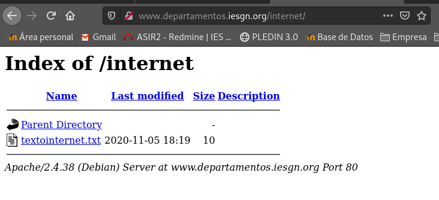

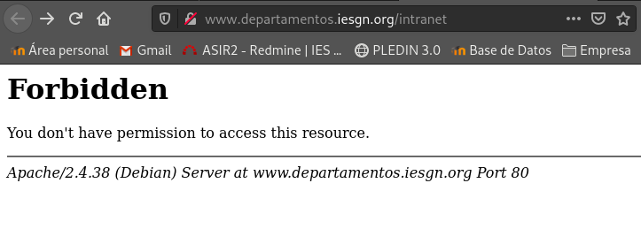

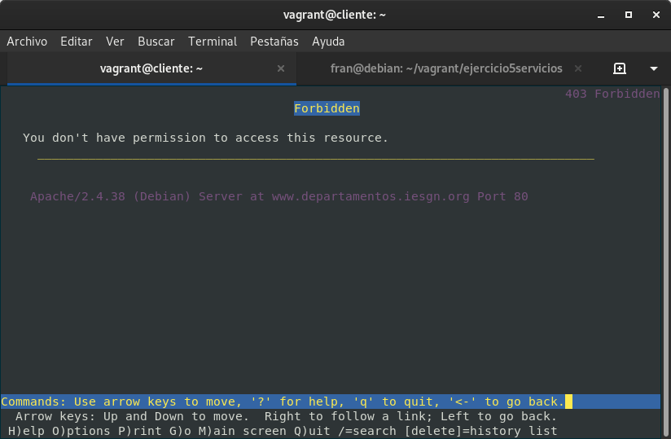

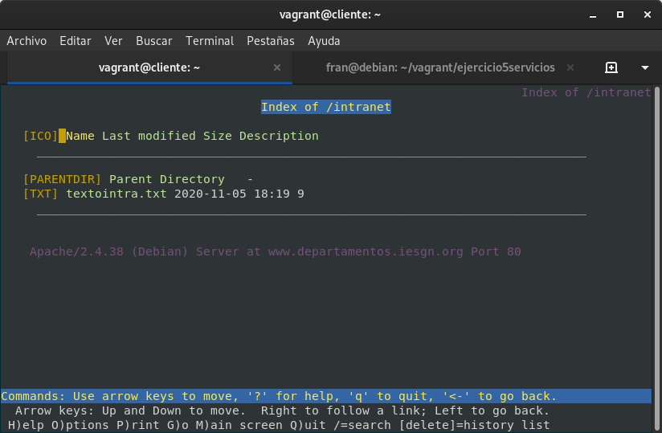

## Autentificación básica. Limita el acceso a la URL departamentos.iesgn.org/secreto. Comprueba las cabeceras de los mensajes HTTP que se intercambian entre el servidor y el cliente. ¿Cómo se manda la contraseña entre el cliente y el servidor?. Entrega una breve explicación del ejercicio.

Crearemos un directorio el directorio secreto:
```shell
root@servidor:/etc/apache2/sites-available# mkdir /var/www/departamentos/secreto
```
Crearemos un otro directorio llamado registro donde guardaremos un fichero de contraseñas y le daré la psw de root:
```shell
root@servidor:/var/www/departamentos/registro# htpasswd -c psw.txt root
New password: 
Re-type new password: 
Adding password for user root
```

En departamentos.conf
```shell
<Directory /var/www/departamentos/secreto> 
                Options Indexes FollowSymLinks MultiViews
                AuthType Basic
                AuthName "¿Quien eres?"
                AuthUserFile "/var/www/departamentos/registro/psw.txt"
                Require valid-user
</Directory>
```
Recargamos Apache
```shell
root@servidor:/etc/apache2/sites-available# systemctl reload apache2
```
Desde mi maquina:
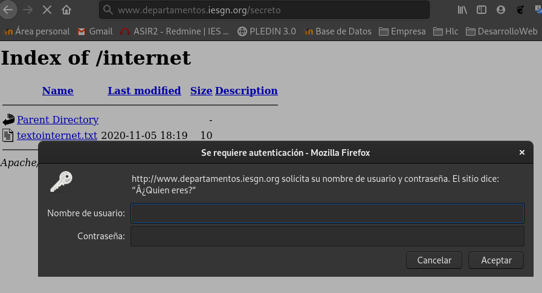
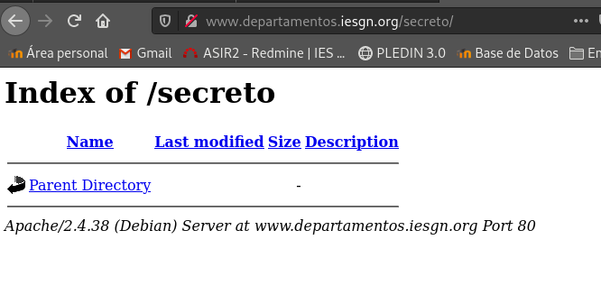

Desde el cliente:
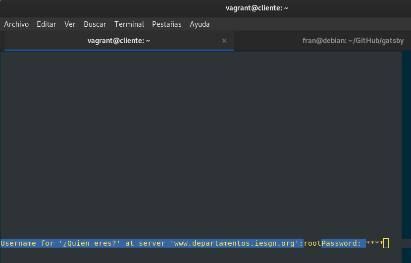
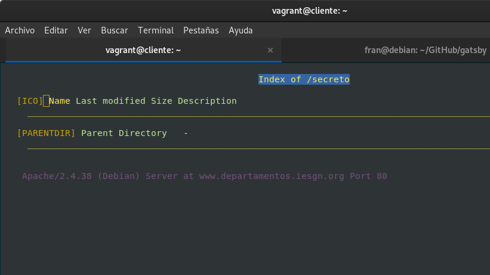

## Cómo hemos visto la autentificación básica no es segura, modifica la autentificación para que sea del tipo digest, y sólo sea accesible a los usuarios pertenecientes al grupo directivos. Comprueba las cabeceras de los mensajes HTTP que se intercambian entre el servidor y el cliente. ¿Cómo funciona esta autentificación?

1. Activar modulo digest.
```shell
sudo a2enmod auth_digest
```
2. Modificar el virtualhost para cambiar el tipo de autentificación.
```shell
<Directory /var/www/departamentos/secreto> 
                Options Indexes FollowSymLinks MultiViews
                AuthType Digest
                AuthName "autorizados"
                AuthUserFile "/var/www/departamentos/registro/psw.txt"
                Require valid-user
</Directory>
```
**Reiniciamos servicios**

3. Crearemos un usuario autorizado a acceder y otro restringido.
```shell
root@servidor:/etc/apache2/sites-available# htdigest -c /var/www/departamentos/registro/psw.txt autorizados paco
Adding password for paco in realm autorizados.
New password: 
Re-type new password:
root@servidor:/etc/apache2/sites-available# htdigest -c /var/www/departamentos/registro/psw.txt restringidos pepe
Adding password for pepe in realm restringidos.
New password: 
Re-type new password: 
```
Usuario autorizado
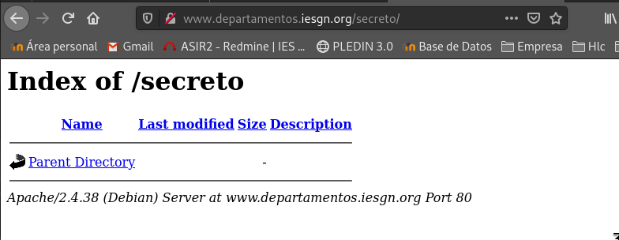
Usuario no autorizado
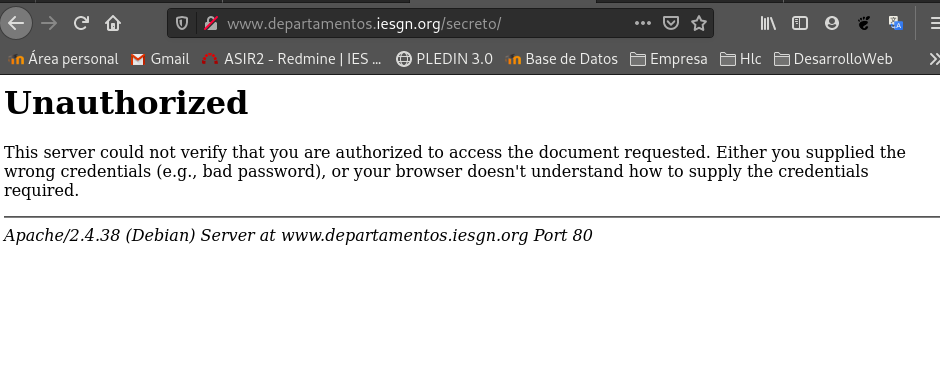

Usuario no autorizado, en cliente el usuario autorizado es la misma captura que en el ejercicio 2.
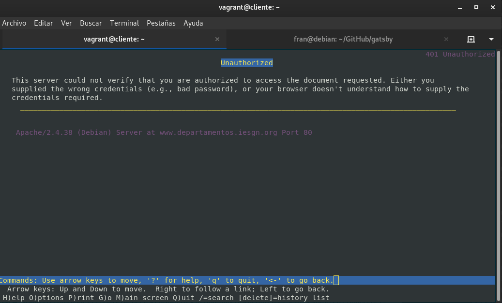

## Vamos a combinar el control de acceso (ejercicio 1) y la autentificación (Ejercicios 2 y 3), y vamos a configurar el virtual host para que se comporte de la siguiente manera: el acceso a la URL departamentos.iesgn.org/secreto se hace forma directa desde la intranet, desde la red pública te pide la autentificación. Muestra el resultado al profesor.

Modificamos la configuracion de /secreto en departamentos.conf
```shell
<Directory /var/www/departamentos/secreto>
                Options Indexes FollowSymLinks MultiViews
                AuthType Digest
                AuthName "autorizados"
                AuthUserFile "/var/www/departamentos/registro/psw.txt"
                <RequireAny>
                        Require ip 192.168.100
			Require valid-user
                </RequireAny>
</Directory>
```
Como podemos ver si intentamos acceder desde nuestra maquina vemos como nos pide autentificación.
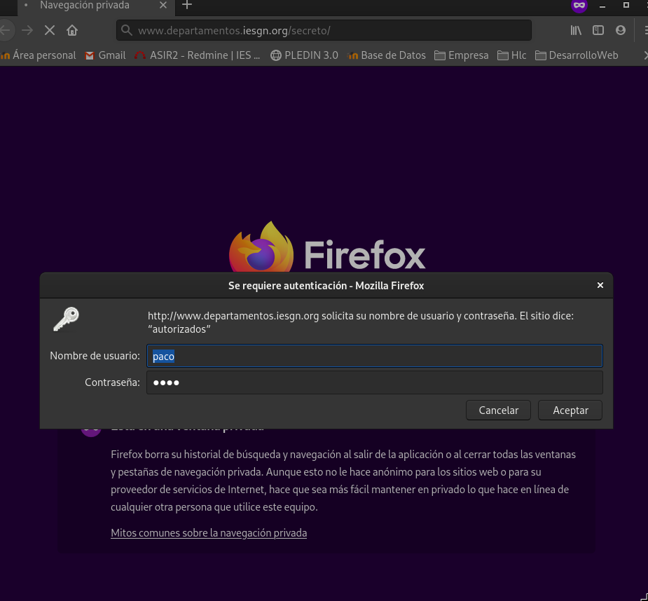

Mientras que desde nuestro cliente no.
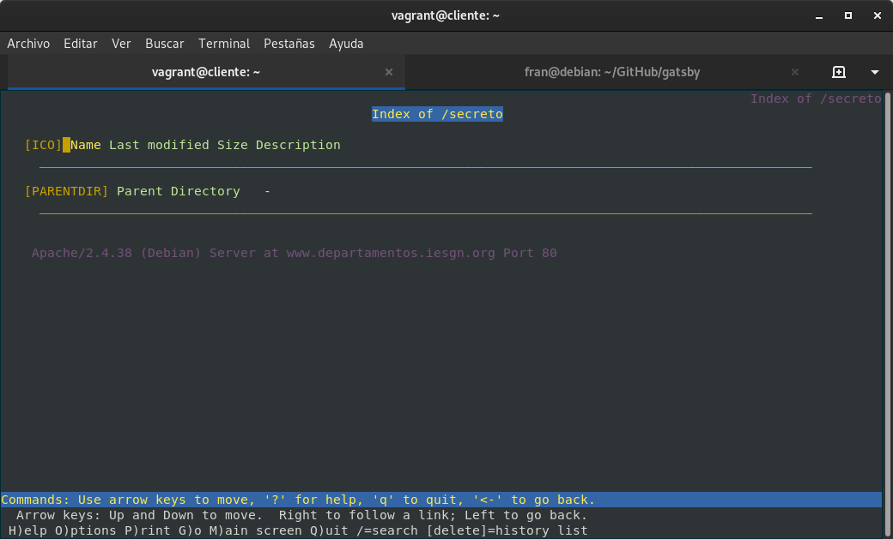