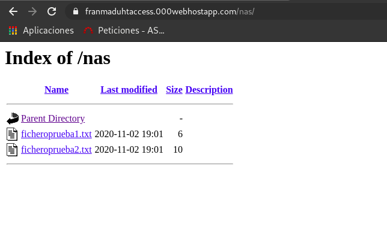

Date de alta en un proveedor de hosting. ¿Si necesitamos configurar el servidor web que han configurado los administradores del proveedor?, ¿qué podemos hacer? Explica la directiva AllowOverride de apache2. Utilizando archivos .htaccess realiza las siguientes configuraciones:

Con 000webhost -> https://franmaduhtaccess.000webhostapp.com/

* Habilita el listado de ficheros en la URL http://host.dominio/nas.

Creo en mi host el directorio nas y añado contenido
Dentro de mi directorio nas añado un archivo .htaccess y le añado la siguiente linea
<pre style="background-color:powderblue;">
Options +Indexes
</pre>

* Crea una redirección permanente: cuando entremos en ttp://host.dominio/google salte a www.google.es.
<pre style="background-color:powderblue;">
Redirect 301 /google http://www.google.es
</pre>
Comprobación -> https://franmaduhtaccess.000webhostapp.com/google

* Pedir autentificación para entrar en la URL http://host.dominio/prohibido. (No la hagas si has elegido como proveedor CDMON, en la plataforma de prueba, no funciona.)

Creo un directorio llamado prohibido en el añado un fichero con la contraseña guardada.
<pre style="background-color:powderblue;">
#generacion de fichero
htpasswd -c seguro.txt fran
New password: 
Re-type new password: 
Adding password for user fran
</pre>
Añado las siguientes lineas en mi fichero .htaccess que creo dentro de ese directorio(prohibido)
<pre style="background-color:powderblue;">
AuthType Basic
AuthName "Inicio de sesión"
AuthUserFile franmaduhtaccess.000webhostapp.com/prohibido/seguro.txt
Require valid-user
</pre>

Como podemos comprobar nos pide que nos logeemos para poder acceder a ese directorio.