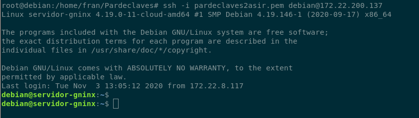
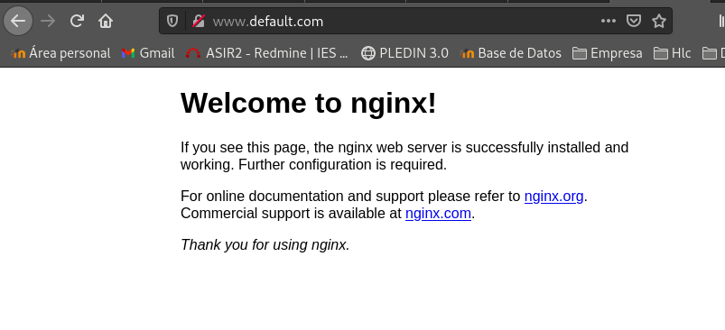
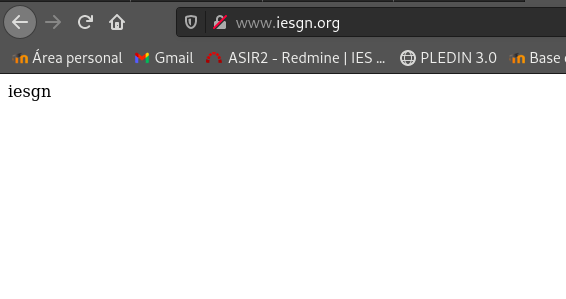
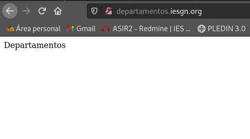
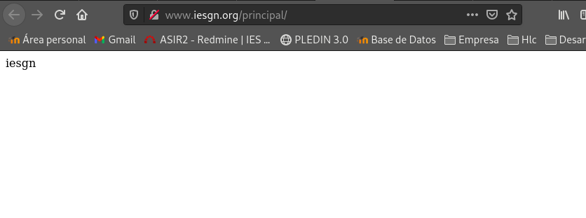

## Tarea 1 (1 punto)(Obligatorio): Crea una máquina del cloud con una red pública. Añade la clave pública del profesor a la máquina. Instala el servidor web nginx en la máquina. Modifica la página index.html que viene por defecto y accede a ella desde un navegador.

### Entrega la ip flotante de la máquina para que el profesor pueda acceder a ella.
Ip flotante de la maquina es ->  *172.22.200.137*


Añadiremos la clave pública de nuestro profesor:
```shell

```

Primero instalaremos el servidor Gninx en nuestra maquina.
```shell
debian@servidor-gninx:~$ sudo apt-get install nginx
```

Nos iremos al archivo default de sites-avaliable y le cambiaremos el server name para acceder a el desde afuera.

### Entrega una captura de pantalla accediendo a ella


# Virtual Hosting 

## Tarea 2 (2 punto)(Obligatorio): Configura la resolución estática en los clientes y muestra el acceso a cada una de las páginas.

Copiaremos el archivo default para crear la base de nuestros dos sitios web.
```shell
debian@servidor-gninx:/etc/nginx/sites-available$ sudo cp default iesgn
debian@servidor-gninx:/etc/nginx/sites-available$ sudo cp default departamentos
debian@servidor-gninx:/etc/nginx/sites-available$ ls
default  departamentos  iesgn
```

**Ficheros de configuración**
iesgn:
```shell
server {
        listen 80;
        listen [::]:80;

        server_name www.iesgn.org;

        root /srv/www/iesgn;
        index index.html;

        location / {
                try_files $uri $uri/ =404;
        }
}
```

departamentos:
```shell
server {
        listen 80;
        listen [::]:80;

        server_name departamentos.iesgn.org;

        root /srv/www/departamentos;
        index index.html;

        location / {
                try_files $uri $uri/ =404;
        }
}
```

Enlaces simbólicos:
```shell
debian@servidor-gninx:/etc/nginx/sites-available$ sudo ln -s /etc/nginx/sites-available/iesgn /etc/nginx/sites-enabled/

debian@servidor-gninx:/etc/nginx/sites-available$ sudo ln -s /etc/nginx/sites-available/departamentos /etc/nginx/sites-enabled/
```

Reiniciamos el servidor Nginx:
```shell
/etc/init.d/nginx restart
```

Modificamos nuestro archivo /etc/hosts de nuestra maquina local:
```shell
172.22.200.137  www.iesgn.org
172.22.200.137  departamentos.iesgn.org
```

**He creado los respectivos directorios en "/srv/www" para añadir algo de contenido.**

www.iesgn.org:


departamenots.iesgn.org:


# Mapeo de URL
Cambia la configuración del sitio web www.iesgn.org para que se comporte de la siguiente forma:

## Tarea 3 (1 punto)(Obligatorio): Cuando se entre a la dirección www.iesgn.org se redireccionará automáticamente a www.iesgn.org/principal, donde se mostrará el mensaje de bienvenida. En el directorio principal no se permite ver la lista de los ficheros, no se permite que se siga los enlaces simbólicos y no se permite negociación de contenido. Muestra al profesor el funcionamiento.

Crearemos la carpeta /principal dentro de moveremos su index.html.  
En iesgn:
```shell
location / {
                return 301 /principal/index.html;
                autoindex off;
                try_files $uri $uri/ =404;
                location /principal {
                        disable_symlinks on;
                        autoindex off;
                }
        }
```

Creamos ficheros en el directorio principal para comprobar si los podemos ver.
departamenots.iesgn.org:



## Tarea 4 (1 punto)(Obligatorio): Si accedes a la página www.iesgn.org/principal/documentos se visualizarán los documentos que hay en /srv/doc. Por lo tanto se permitirá el listado de fichero y el seguimiento de enlaces simbólicos siempre que sean a ficheros o directorios cuyo dueño sea el usuario. Muestra al profesor el funcionamiento.


## Tarea 5 (1 punto): En todo el host virtual se debe redefinir los mensajes de error de objeto no encontrado y no permitido. Para el ello se crearan dos ficheros html dentro del directorio error. Entrega las modificaciones necesarias en la configuración y una comprobación del buen funcionamiento.

