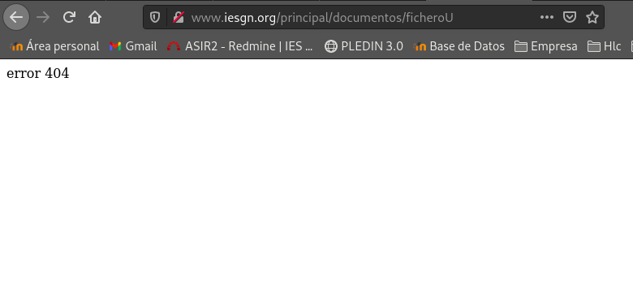

## Tarea 1 (1 punto)(Obligatorio): Crea una máquina del cloud con una red pública. Añade la clave pública del profesor a la máquina. Instala el servidor web nginx en la máquina. Modifica la página index.html que viene por defecto y accede a ella desde un navegador.

### Entrega la ip flotante de la máquina para que el profesor pueda acceder a ella.
Ip flotante de la maquina es ->  *172.22.200.137*


Añadiremos la clave pública de nuestro profesor:
```shell
#la descargaremos directamente desde redmine
debian@servidor-gninx:~$ wget https://dit.gonzalonazareno.org/redmine/attachments/download/1996/id_rsa.pub
--2020-11-16 11:05:02--  https://dit.gonzalonazareno.org/redmine/attachments/download/1996/id_rsa.pub
Resolving dit.gonzalonazareno.org (dit.gonzalonazareno.org)... 192.168.203.2
Connecting to dit.gonzalonazareno.org (dit.gonzalonazareno.org)|192.168.203.2|:443... connected.
HTTP request sent, awaiting response... 302 Found
Location: https://dit.gonzalonazareno.org/redmine/login?back_url=https%3A%2F%2Fdit.gonzalonazareno.org%2Fredmine%2Fattachments%2Fdownload%2F1996%2Fid_rsa.pub [following]
--2020-11-16 11:05:02--  https://dit.gonzalonazareno.org/redmine/login?back_url=https%3A%2F%2Fdit.gonzalonazareno.org%2Fredmine%2Fattachments%2Fdownload%2F1996%2Fid_rsa.pub
Reusing existing connection to dit.gonzalonazareno.org:443.
HTTP request sent, awaiting response... 200 OK
Length: unspecified [text/html]
Saving to: ‘id_rsa.pub’

id_rsa.pub                 [ <=>                       ]   5.08K  --.-KB/s    in 0s      

2020-11-16 11:05:02 (102 MB/s) - ‘id_rsa.pub’ saved [5199]

debian@servidor-gninx:~$ ls
id_rsa.pub
#añadir a .ssh/authorized_keys para que pueda acceder nuestro profesor con su clave.
debian@servidor-gninx:~$ echo `cat id_rsa.pub` >> .ssh/authorized_keys
```

Primero instalaremos el servidor Gninx en nuestra maquina.
```shell
debian@servidor-gninx:~$ sudo apt-get install nginx
```

Nos iremos al archivo default de sites-avaliable y le cambiaremos el server name para acceder a el desde afuera.

### Entrega una captura de pantalla accediendo a ella


# Virtual Hosting 

## Tarea 2 (2 punto)(Obligatorio): Configura la resolución estática en los clientes y muestra el acceso a cada una de las páginas.

Copiaremos el archivo default para crear la base de nuestros dos sitios web.
```shell
debian@servidor-gninx:/etc/nginx/sites-available$ sudo cp default iesgn
debian@servidor-gninx:/etc/nginx/sites-available$ sudo cp default departamentos
debian@servidor-gninx:/etc/nginx/sites-available$ ls
default  departamentos  iesgn
```

**Ficheros de configuración**
iesgn:
```shell
server {
        listen 80;
        listen [::]:80;

        server_name www.iesgn.org;

        root /srv/www/iesgn;
        index index.html;

        location / {
                try_files $uri $uri/ =404;
        }
}
```

departamentos:
```shell
server {
        listen 80;
        listen [::]:80;

        server_name departamentos.iesgn.org;

        root /srv/www/departamentos;
        index index.html;

        location / {
                try_files $uri $uri/ =404;
        }
}
```

Enlaces simbólicos:
```shell
debian@servidor-gninx:/etc/nginx/sites-available$ sudo ln -s /etc/nginx/sites-available/iesgn /etc/nginx/sites-enabled/

debian@servidor-gninx:/etc/nginx/sites-available$ sudo ln -s /etc/nginx/sites-available/departamentos /etc/nginx/sites-enabled/
```

Reiniciamos el servidor Nginx:
```shell
/etc/init.d/nginx restart
```

Modificamos nuestro archivo /etc/hosts de nuestra maquina local:
```shell
172.22.200.137  www.iesgn.org
172.22.200.137  departamentos.iesgn.org
```

**He creado los respectivos directorios en "/srv/www" para añadir algo de contenido.**

www.iesgn.org:


departamenots.iesgn.org:


# Mapeo de URL
Cambia la configuración del sitio web www.iesgn.org para que se comporte de la siguiente forma:

## Tarea 3 (1 punto)(Obligatorio): Cuando se entre a la dirección www.iesgn.org se redireccionará automáticamente a www.iesgn.org/principal, donde se mostrará el mensaje de bienvenida. En el directorio principal no se permite ver la lista de los ficheros, no se permite que se siga los enlaces simbólicos y no se permite negociación de contenido. Muestra al profesor el funcionamiento.

Crearemos la carpeta /principal dentro de moveremos su index.html y la cambiare de propietario.
```shell
#cambio de propietario
debian@servidor-gninx:/srv/www/iesgn$ sudo chown www-data:www-data principal/
```

En iesgn:
```shell
location / {
                return 301 http://www.iesgn.org/principal;
        }
        location /principal {
                try_files $uri $uri/ =404;
                disable_symlinks on;

        }
```

Creamos ficheros en el directorio principal para comprobar si los podemos ver, reiniciamos el servicio para que se efectuen los cambios.

Cuando vamos a acceder a www.iesgn.org nos redirecciona a:


## Tarea 4 (1 punto)(Obligatorio): Si accedes a la página www.iesgn.org/principal/documentos se visualizarán los documentos que hay en /srv/doc. Por lo tanto se permitirá el listado de fichero y el seguimiento de enlaces simbólicos siempre que sean a ficheros o directorios cuyo dueño sea el usuario. Muestra al profesor el funcionamiento.

Creamos el directorio y añadimos documentos:
```shell
debian@servidor-gninx:/srv$ sudo mkdir doc
debian@servidor-gninx:/srv$ sudo chown www-data:www-data doc/
debian@servidor-gninx:/srv$ cd doc
debian@servidor-gninx:/srv/doc$ sudo touch texto1 texto2
```

creamos el redirección:
```shell
location /principal/documentos {
                try_files $uri $uri/ =404;
                alias /srv/doc;
                disable_symlinks if_not_owner;
                autoindex on;
        }
```

Comprobamos los cambios realizados:


Ahora crearemos enlaces simbolicos y los comprobaremos:
```shell
debian@servidor-gninx:~$ nano ficheroU
debian@servidor-gninx:~$ sudo ln -s /home/debian/ficheroU /srv/doc/
debian@servidor-gninx:~$ sudo nano ficheroR
debian@servidor-gninx:~$ sudo ln -s /home/debian/ficheroR /srv/doc/
```


Como podemos comprobar el fichero creado por root lo podemos descargar mientras que creado por el usuario nos da un error 404.

## Tarea 5 (1 punto): En todo el host virtual se debe redefinir los mensajes de error de objeto no encontrado y no permitido. Para el ello se crearan dos ficheros html dentro del directorio error. Entrega las modificaciones necesarias en la configuración y una comprobación del buen funcionamiento.

Creo un directorio donde guardar los errores:
```shell
debian@servidor-gninx:/srv/www/iesgn$ sudo mkdir error
debian@servidor-gninx:/srv/www/iesgn/error$ sudo nano error403.html
debian@servidor-gninx:/srv/www/iesgn/error$ sudo nano error404.html
debian@servidor-gninx:/srv/www/iesgn/error$ ls
error403.html  error404.html
debian@servidor-gninx:/srv/www/iesgn/error$ sudo chown -R www-data:www-data /srv/www/iesgn/error/
```

En iesgn config:
```shell
       error_page 403 /error/error403.html;
                location /error/error403.html {
                        internal;
                }

        error_page 404 /error/error404.html;
                location /error/error404.html {
                        internal;
                }
```
Como podemos comprobar ahora nos salta a nuestro archivo de error indicado:


# Autentificación, Autorización, y Control de Acceso

## Tarea 6 (1 punto)(Obligatorio): Añade al escenario otra máquina conectada por una red interna al servidor. A la URL departamentos.iesgn.org/intranet sólo se debe tener acceso desde el cliente de la red local, y no se pueda acceder desde la anfitriona por la red pública. A la URL departamentos.iesgn.org/internet, sin embargo, sólo se debe tener acceso desde la anfitriona por la red pública, y no desde la red local.


## Tarea 7 (1 punto): Autentificación básica. Limita el acceso a la URL departamentos.iesgn.org/secreto. Comprueba las cabeceras de los mensajes HTTP que se intercambian entre el servidor y el cliente.


## Tarea 8 (2 punto): Vamos a combinar el control de acceso (tarea 6) y la autentificación (tarea 7), y vamos a configurar el virtual host para que se comporte de la siguiente manera: el acceso a la URL departamentos.iesgn.org/secreto se hace forma directa desde la intranet, desde la red pública te pide la autentificación. Muestra el resultado al profesor.

