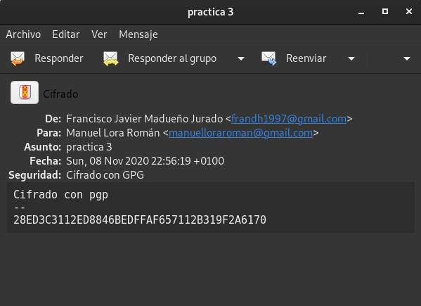

## Práctica: Integridad, firmas y autenticación

### Tarea 1: Firmas electrónicas (3 puntos)

**GPG**  

### Manda un documento y la firma electrónica del mismo a un compañero. Verifica la firma que tu has recibido.

* Con este comando firmamos nuestro documento .gpg
```shell
fran@debian:~/Cifrado$ gpg --sign firma2.pdf
```
* En caso de tener varias firmas para seleccionar la que deseemos usar utilizariamos el comando extendido:
```shell
fran@debian:~/Cifrado$ gpg --sign --default-key frandh1997@gmail.com firma2.pdf
gpg: usando "frandh1997@gmail.com" como clave secreta predeterminada para firmar
El fichero 'firma2.pdf.gpg' ya existe. ¿Sobreescribir? (s/N) s
```

```shell
fran@debian:~/Cifrado$ gpg --verify prueba.txt.gpg 
gpg: Firmado el jue 22 oct 2020 12:16:17 CEST
gpg:                usando RSA clave 443D661D9AAF3ABAEDCA93E1C3B291882C4EE5DF
gpg:                emisor "tojandro@gmail.com"
gpg: Firma correcta de "Alejandro Gutierrez Valencia <tojandro@gmail.com>" [desconocido]
gpg: ATENCIÓN: ¡Esta clave no está certificada por una firma de confianza!
gpg:          No hay indicios de que la firma pertenezca al propietario.
Huellas dactilares de la clave primaria: 443D 661D 9AAF 3ABA EDCA  93E1 C3B2 9188 2C4E E5DF

fran@debian:~/Cifrado$ gpg --verify doc.sig 
gpg: Firmado el jue 22 oct 2020 10:38:11 CEST
gpg:                usando RSA clave 9233303D1F5495739A6D2CB4636AE9EBCB7E3294
gpg: Firma correcta de "Manuel Lora Román <manuelloraroman@gmail.com>" [desconocido]
gpg: ATENCIÓN: ¡Esta clave no está certificada por una firma de confianza!
gpg:          No hay indicios de que la firma pertenezca al propietario.
Huellas dactilares de la clave primaria: 9233 303D 1F54 9573 9A6D  2CB4 636A E9EB CB7E 3294
```

* ¿Qué significa el mensaje que aparece en el momento de verificar la firma?
```shell
     gpg: Firma correcta de "Pepe D <josedom24@gmail.com>" [desconocido]
     gpg: ATENCIÓN: ¡Esta clave no está certificada por una firma de confianza!
     gpg:          No hay indicios de que la firma pertenezca al propietario.
     Huellas dactilares de la clave primaria: E8DD 5DA9 3B88 F08A DA1D  26BF 5141 3DDB 0C99 55FC
```

Significa que no confiamos esa firma de confianza ni nosotros ni nuestro anillo de confianzas.

### Vamos a crear un anillo de confianza entre los miembros de nuestra clase, para ello.
 - Tu clave pública debe estar en un servidor de claves  
 - Escribe tu fingerprint en un papel y dárselo a tu compañero, para que puede descargarse tu clave pública.  
 - Te debes bajar al menos tres claves públicas de compañeros. Firma estas claves.  
 - Tu te debes asegurar que tu clave pública es firmada por al menos tres compañeros de la clase.  
 - Una vez que firmes una clave se la tendrás que devolver a su dueño, para que otra persona se la firme.  
 - Cuando tengas las tres firmas sube la clave al servidor de claves y rellena tus datos en la tabla Claves públicas PGP 2020-2021  
 - Asegurate que te vuelves a bajar las claves públicas de tus compañeros que tengan las tres firmas.  

* Añadir firma a un servidor en este caso a Rediris → 
```shell
fran@debian:~/Cifrado/cifrado2$ gpg --keyserver pgp.rediris.es --send-key 9F2A6170
gpg: enviando clave 57112B319F2A6170 a hkp://pgp.rediris.es
```
* Bajar Clave de compañero de rediris →
```shell
fran@debian:~/Cifrado$ gpg --keyserver keyserver.ubuntu.com --recv-key 9987B52D
gpg: clave 4F54B5799987B52D: clave pública "Juan Antonio Reifs <initategnat9@gmail.com>" importada
gpg: Cantidad total procesada: 1
gpg:               importadas: 1
fran@debian:~/Cifrado$ gpg --keyserver pgp.rediris.es --recv-key 2C4EE5DF
gpg: clave C3B291882C4EE5DF: "Alejandro Gutierrez Valencia <tojandro@gmail.com>" sin cambios
gpg: Cantidad total procesada: 1
gpg:              sin cambios: 1
```

* Firmar claves de compañeros →
```shell
fran@debian:~/Cifrado$ gpg --sign-key 2C4EE5DF
#
pub  rsa3072/C3B291882C4EE5DF
     creado: 2020-10-08  caduca: 2020-11-07  uso: SC  
     confianza: desconocido   validez: desconocido
sub  rsa3072/3C5DBE21F6961E37
     creado: 2020-10-08  caduca: 2020-11-07  uso: E   
[desconocida] (1). Alejandro Gutierrez Valencia <tojandro@gmail.com>
#
pub  rsa3072/C3B291882C4EE5DF
     creado: 2020-10-08  caduca: 2020-11-07  uso: SC  
     confianza: desconocido   validez: desconocido
 Huella clave primaria: 443D 661D 9AAF 3ABA EDCA  93E1 C3B2 9188 2C4E E5DF

     Alejandro Gutierrez Valencia <tojandro@gmail.com>
#
Esta clave expirará el 2020-11-07.
¿Está realmente seguro de querer firmar esta clave
con su clave: "Francisco Javier Madueño Jurado <frandh1997@gmail.com>" (57112B319F2A6170)?
#
¿Firmar de verdad? (s/N) s
```

* Muestra las firmas que tiene tu clave pública.
```shell
fran@debian:~/Descargas$ gpg --list-sign
/home/fran/.gnupg/pubring.kbx
-----------------------------
pub   rsa3072 2020-10-06 [SC] [caduca: 2022-10-06]
      28ED3C3112ED8846BEDFFAF657112B319F2A6170
uid        [  absoluta ] Francisco Javier Madueño Jurado <frandh1997@gmail.com>
sig 3        57112B319F2A6170 2020-10-06  Francisco Javier Madueño Jurado <frandh1997@gmail.com>
sig          C3B291882C4EE5DF 2020-10-28  Alejandro Gutierrez Valencia <tojandro@gmail.com>
sub   rsa3072 2020-10-06 [E] [caduca: 2022-10-06]
sig          57112B319F2A6170 2020-10-06  Francisco Javier Madueño Jurado <frandh1997@gmail.com>
#
pub   rsa3072 2020-10-06 [SC] [caduca: 2022-10-06]
      9233303D1F5495739A6D2CB4636AE9EBCB7E3294
uid        [   total   ] Manuel Lora Román <manuelloraroman@gmail.com>
sig 3        636AE9EBCB7E3294 2020-10-06  Manuel Lora Román <manuelloraroman@gmail.com>
sig          57112B319F2A6170 2020-10-28  Francisco Javier Madueño Jurado <frandh1997@gmail.com>
sub   rsa3072 2020-10-06 [E] [caduca: 2022-10-06]
sig          636AE9EBCB7E3294 2020-10-06  Manuel Lora Román <manuelloraroman@gmail.com>
#
pub   rsa3072 2020-10-08 [SC] [caduca: 2020-11-07]
      443D661D9AAF3ABAEDCA93E1C3B291882C4EE5DF
uid        [   total   ] Alejandro Gutierrez Valencia <tojandro@gmail.com>
sig 3        C3B291882C4EE5DF 2020-10-08  Alejandro Gutierrez Valencia <tojandro@gmail.com>
sig          57112B319F2A6170 2020-10-22  Francisco Javier Madueño Jurado <frandh1997@gmail.com>
sig          A52A681834F0E596 2020-10-28  [ID de usuario no encontrado]
sub   rsa3072 2020-10-08 [E] [caduca: 2020-11-07]
sig          C3B291882C4EE5DF 2020-10-08  Alejandro Gutierrez Valencia <tojandro@gmail.com>
#
pub   rsa3072 2020-10-22 [SC] [caduca: 2022-10-22]
      AD19812061DA946F8DA70E0C4F54B5799987B52D
uid        [   total   ] Juan Antonio Reifs <initategnat9@gmail.com>
sig 3        4F54B5799987B52D 2020-10-22  Juan Antonio Reifs <initategnat9@gmail.com>
sig          57112B319F2A6170 2020-10-28  Francisco Javier Madueño Jurado <frandh1997@gmail.com>
sub   rsa3072 2020-10-22 [E] [caduca: 2022-10-22]
sig          4F54B5799987B52D 2020-10-22  Juan Antonio Reifs <initategnat9@gmail.com>
```

### Comprueba que puedes verificar con confianza una firma de una persona en las que no confías, pero sin embargo si confía otra persona en la que tu tienes confianza total.
```shell
#firmo un documento y lo envio(aunque por defecto suele coger tu propia firma he leido que puede generar errores asi que he añadido la linea default key para asegurarlo.
fran@debian:~/Cifrado/cifrado2$ gpg --sign --default-key frandh1997@gmail.com fockiu.txt 
gpg: usando "frandh1997@gmail.com" como clave secreta predeterminada para firmar

fran@debian:~/Cifrado/cifrado2$ gpg --import jose.key 
gpg: clave A52A681834F0E596: clave pública "José Miguel Calderón Frutos <josemiguelcalderonfrutos@gamil.com>" importada
gpg: Cantidad total procesada: 1
gpg:               importadas: 1
gpg: marginals needed: 3  completes needed: 1  trust model: pgp
gpg: nivel: 0  validez:   1  firmada:   3  confianza: 0-, 0q, 0n, 0m, 0f, 1u
gpg: nivel: 1  validez:   3  firmada:   1  confianza: 2-, 0q, 0n, 1m, 0f, 0u
gpg: siguiente comprobación de base de datos de confianza el: 2020-11-07
fran@debian:~/Cifrado/cifrado2$ gpg -d hola.sig 
Tonto el que lo lea
gpg: Firmado el mar 03 nov 2020 12:31:01 CET
gpg:                usando RSA clave DCFB091C5495684E59BC061EA52A681834F0E596
gpg: Firma correcta de "José Miguel Calderón Frutos <josemiguelcalderonfrutos@gamil.com>" [dudosa]
gpg: ATENCIÓN: ¡Esta clave no está certificada con firmas de suficiente confianza!
gpg:          No es seguro que la firma pertenezca al propietario.
Huellas dactilares de la clave primaria: DCFB 091C 5495 684E 59BC  061E A52A 6818 34F0 E596

```

## Tarea 2: Correo seguro con evolution/thunderbird (2 puntos)

Ahora vamos a configurar nuestro cliente de correo electrónico para poder mandar correos cifrados, para ello:

1. Configura el cliente de correo evolution con tu cuenta de correo habitual.

Nos instalaremos thunderbird.

Pondremos nuestro nombre para la configuración y añadiremos una de nuestras cuentas.

OAuth2

Como podemos ver ya tenemos instalado y configurado nuestro cliente.


2. Añade a la cuenta las opciones de seguridad para poder enviar correos firmados con tu clave privada o cifrar los mensajes para otros destinatarios.


3. Envía y recibe varios mensajes con tus compañeros y comprueba el funcionamiento adecuado de GPG.


## Tarea 3: Integridad de ficheros (1 punto)

Vamos a descargarnos la ISO de debian, y posteriormente vamos a comprobar su integridad.

Puedes encontrar la ISO en la dirección: https://cdimage.debian.org/debian-cd/current/amd64/iso-cd/.

    Para validar el contenido de la imagen CD, solo asegúrese de usar la herramienta apropiada para sumas de verificación. Para cada versión publicada existen archivos de suma de comprobación con algoritmos fuertes (SHA256 y SHA512); debería usar las herramientas sha256sum o sha512sum para trabajar con ellos.
    Verifica que el contenido del hash que has utilizado no ha sido manipulado, usando la firma digital que encontrarás en el repositorio. Puedes encontrar una guía para realizarlo en este artículo: How to verify an authenticity of downloaded Debian ISO images

## Tarea 4: Integridad y autenticidad (apt secure) (2 puntos)

Cuando nos instalamos un paquete en nuestra distribución linux tenemos que asegurarnos que ese paquete es legítimo. Para conseguir este objetivo se utiliza criptografía asimétrica, y en el caso de Debian a este sistema se llama apt secure. Esto lo debemos tener en cuenta al utilizar los repositorios oficiales. Cuando añadamos nuevos repositorios tendremos que añadir las firmas necesarias para confiar en que los paquetes son legítimos y no han sido modificados.

Busca información sobre apt secure y responde las siguientes preguntas:

¿Qué software utiliza apt secure para realizar la criptografía asimétrica?
¿Para que sirve el comando apt-key? ¿Qué muestra el comando apt-key list?
En que fichero se guarda el anillo de claves que guarda la herramienta apt-key?
¿Qué contiene el archivo Release de un repositorio de paquetes?. ¿Y el archivo Release.gpg?. Puedes ver estos archivos en el repositorio http://ftp.debian.org/debian/dists/Debian10.1/. Estos archivos se descargan cuando hacemos un apt update.
Explica el proceso por el cual el sistema nos asegura que los ficheros que estamos descargando son legítimos.
añade de forma correcta el repositorio de virtualbox añadiendo la clave pública de virtualbox como se indica en la documentación.

## Tarea 5: Autentificación: ejemplo SSH (2 puntos)
Vamos a estudiar como la criptografía nos ayuda a cifrar las comunicaciones que hacemos utilizando el protocolo ssh, y cómo nos puede servir también para conseguir que un cliente se autentifique contra el servidor. Responde las siguientes cuestiones:

Explica los pasos que se producen entre el cliente y el servidor para que el protocolo cifre la información que se transmite? ¿Para qué se utiliza la criptografía simétrica? ¿Y la asimétrica?
Explica los dos métodos principales de autentificación: por contraseña y utilizando un par de claves públicas y privadas.
En el cliente para que sirve el contenido que se guarda en el fichero ~/.ssh/know_hosts?

¿Qué significa este mensaje que aparece la primera vez que nos conectamos a un servidor?

     $ ssh debian@172.22.200.74
     The authenticity of host '172.22.200.74 (172.22.200.74)' can't be established.
     ECDSA key fingerprint is SHA256:7ZoNZPCbQTnDso1meVSNoKszn38ZwUI4i6saebbfL4M.
     Are you sure you want to continue connecting (yes/no)? 

En ocasiones cuando estamos trabajando en el cloud, y reutilizamos una ip flotante nos aparece este mensaje:

     $ ssh debian@172.22.200.74
     @@@@@@@@@@@@@@@@@@@@@@@@@@@@@@@@@@@@@@@@@@@@@@@@@@@@@@@@@@@
     @    WARNING: REMOTE HOST IDENTIFICATION HAS CHANGED!     @
     @@@@@@@@@@@@@@@@@@@@@@@@@@@@@@@@@@@@@@@@@@@@@@@@@@@@@@@@@@@
     IT IS POSSIBLE THAT SOMEONE IS DOING SOMETHING NASTY!
     Someone could be eavesdropping on you right now (man-in-the-middle attack)!
     It is also possible that a host key has just been changed.
     The fingerprint for the ECDSA key sent by the remote host is
     SHA256:W05RrybmcnJxD3fbwJOgSNNWATkVftsQl7EzfeKJgNc.
     Please contact your system administrator.
     Add correct host key in /home/jose/.ssh/known_hosts to get rid of this message.
     Offending ECDSA key in /home/jose/.ssh/known_hosts:103
       remove with:
       ssh-keygen -f "/home/jose/.ssh/known_hosts" -R "172.22.200.74"
     ECDSA host key for 172.22.200.74 has changed and you have requested strict checking.

¿Qué guardamos y para qué sirve el fichero en el servidor ~/.ssh/authorized_keys?

