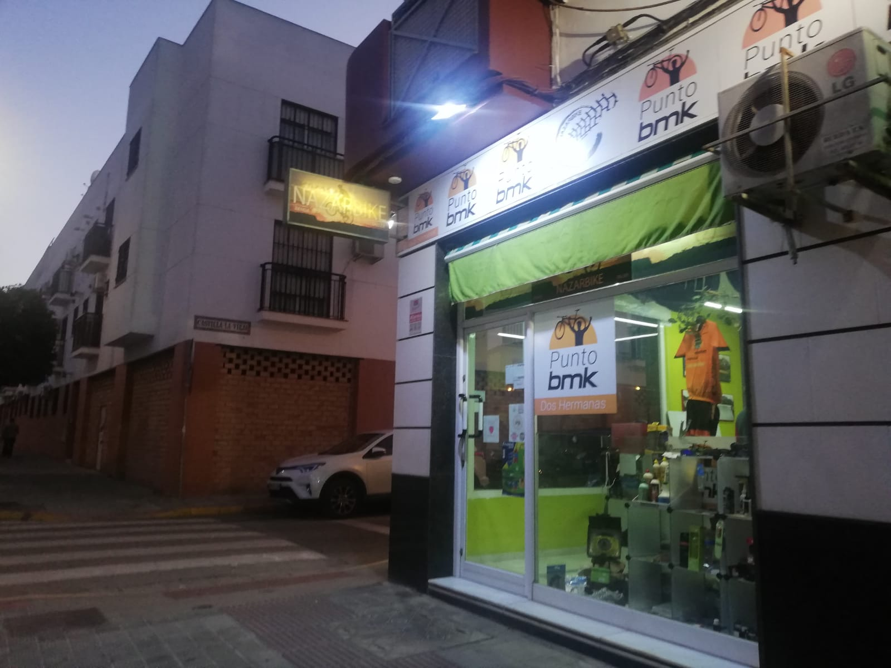

## Añade una foto de la imagen de un comercio o negocio de la zona donde residas, realizando un análisis de la misma. Comenta qué tipo de información te aporta, si tiene relación con el producto o servicio que oferta, si te parece adecuada o añadirías/eliminarías algo.

# Nazarbike

**Nazarbike** es un taller de bicicletas y a su vez franquicia de BiciMarket, su logo ya nos deja ver el tipo de sector en el que esta envuelta la actividad de la empresa. En cuanto a la fachada de la tienda es bastante vistosa ya que tiene varios muestrarios donde enseñan cajas de cambio, frenos, camisetas o mallots de cliclimos, cadenas, manguitos y demas articulos relacionados a la bicicleta. Tambien tienen una bici despiezada puesta en la pared donde se puede diferenciar bien sus partes. A pesar de ser una franquicia, al ser un pequeño negocio se ve bastante acogedor y cercano. Al ser franquicia con BiciMarket puede llegar a tener precios mas competitivos en temas de recambios y piezas, y además es punto de recogida de los productos de las misma que se encarga o bien online o bien en la misma tienda, tambien se pueden pedir bicicletas.

**Bicimarket**:  
 Es la mayor red de tiendas especializadas de ciclismo de España. En nuestras tiendas encontrarás todas las ventajas de la tienda online, como es nuestro catálogo de más de 20.000 referencias con precios sin competencia, junto a las propias de una tienda física; asesoramiento de personal especializado, servicio técnico profesional y la posibilidad de realizar tu compra online desde la tienda desde casa y recogerla en tu tienda Bicimarket.com más cercana, sin pagar portes y pudiendo ver y tocar el producto antes de llevártelo.