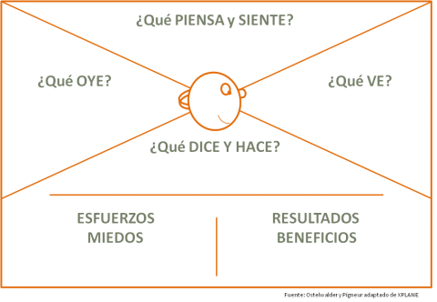

* Qué ve: cuál es su entorno y cómo es; qué amistades posee; qué propuestas le ofrece ya el mercado…

El entorno es el el
* Qué dice y hace; cuál es su actitud en público, qué aspecto tiene; cómo se comporta, qué contradicciones tiene…

* Qué oye: qué dicen (o le dicen) sus amistades, su familia, su personal, sus jefes o jefas, las personas influyentes de su entorno; a través de qué canales multimedia le llega la información…

* Qué piensa y siente: qué es lo que realmente le importa; cuáles son sus principales preocupaciones, inquietudes, sueños y aspiraciones.

A partir de estas cuatro se obtienen otras dos:

* Cuáles son los esfuerzos que realiza: a qué le tiene miedo; cuáles son las barreras y obstáculos que se encuentra para obtener lo que desea; con qué riesgos se tropieza en su camino y debe asumir; qué esfuerzos o riesgos no asumirá…

* Cuáles son los resultados, los beneficios que espera obtener: cuáles son sus necesidades o deseos reales; cómo mide el éxito, en función de qué; cómo podría alcanzar sus objetivos…
