## Tarea 1: Entorno de desarrollo
Vamos a desarrollar la aplicación del tutorial de django 3.1. Vamos a configurar tu equipo como entorno de desarrollo para trabajar con la aplicación, para ello:

* Realiza un fork del repositorio de GitHub: https://github.com/josedom24/django_tutorial.

Realizamos el fork y añadimos el repositorio a nuestros repositorios, luego lo clonamos a nuestra maquina.
```shell
fran@debian:~/GitHub/django_tutorial$ ls
django_tutorial  manage.py  polls  README.md  requirements.txt
```

* Crea un entorno virtual de python3 e instala las dependencias necesarias para que funcione el proyecto (fichero requirements.txt).

```shell
fran@debian:~/GitHub/django_tutorial$ sudo apt install python3-venv
#creación del entorno
fran@debian:~/GitHub/django_tutorial$ python3 -m venv django
#activación del entorno
fran@debian:~/GitHub/django_tutorial$ source django/bin/activate
(django) fran@debian:~/GitHub/django_tutorial$ 
#instalación del paquete equirements.txt
(django) fran@debian:~/GitHub/django_tutorial$ pip install -r requirements.txt
Collecting asgiref==3.3.0 (from -r requirements.txt (line 1))
  Downloading https://files.pythonhosted.org/packages/c0/e8/578887011652048c2d273bf98839a11020891917f3aa638a0bc9ac04d653/asgiref-3.3.0-py3-none-any.whl
Collecting Django==3.1.3 (from -r requirements.txt (line 2))
  Downloading https://files.pythonhosted.org/packages/7f/17/16267e782a30ea2ce08a9a452c1db285afb0ff226cfe3753f484d3d65662/Django-3.1.3-py3-none-any.whl (7.8MB)
    100% |████████████████████████████████| 7.8MB 241kB/s 
Collecting pytz==2020.4 (from -r requirements.txt (line 3))
  Downloading https://files.pythonhosted.org/packages/12/f8/ff09af6ff61a3efaad5f61ba5facdf17e7722c4393f7d8a66674d2dbd29f/pytz-2020.4-py2.py3-none-any.whl (509kB)
    100% |████████████████████████████████| 512kB 2.1MB/s 
Collecting sqlparse==0.4.1 (from -r requirements.txt (line 4))
  Downloading https://files.pythonhosted.org/packages/14/05/6e8eb62ca685b10e34051a80d7ea94b7137369d8c0be5c3b9d9b6e3f5dae/sqlparse-0.4.1-py3-none-any.whl (42kB)
    100% |████████████████████████████████| 51kB 4.9MB/s 
Installing collected packages: asgiref, sqlparse, pytz, Django
Successfully installed Django-3.1.3 asgiref-3.3.0 pytz-2020.4 sqlparse-0.4.1
```

* Comprueba que vamos a trabajar con una base de datos sqlite (django_tutorial/settings.py). ¿Cómo se llama la base de datos que vamos a crear?

Siguiendo el tutorial en django_tutorial/settings.py
```shell
DATABASES = {
    'default': {
        'ENGINE': 'django.db.backends.sqlite3',
        'NAME': BASE_DIR / 'db.sqlite3',
    }
}
```
Como podemos ver, la base de datos que vamos a crear se llama 'db.sqlite3'.

* Crea la base de datos: python3 manage.py migrate. A partir del modelo de datos se crean las tablas de la base de datos.

```shell
(django) fran@debian:~/GitHub/django_tutorial$ python3 manage.py migrate
Operations to perform:
  Apply all migrations: admin, auth, contenttypes, polls, sessions
Running migrations:
  Applying contenttypes.0001_initial... OK
  Applying auth.0001_initial... OK
  Applying admin.0001_initial... OK
  Applying admin.0002_logentry_remove_auto_add... OK
  Applying admin.0003_logentry_add_action_flag_choices... OK
  Applying contenttypes.0002_remove_content_type_name... OK
  Applying auth.0002_alter_permission_name_max_length... OK
  Applying auth.0003_alter_user_email_max_length... OK
  Applying auth.0004_alter_user_username_opts... OK
  Applying auth.0005_alter_user_last_login_null... OK
  Applying auth.0006_require_contenttypes_0002... OK
  Applying auth.0007_alter_validators_add_error_messages... OK
  Applying auth.0008_alter_user_username_max_length... OK
  Applying auth.0009_alter_user_last_name_max_length... OK
  Applying auth.0010_alter_group_name_max_length... OK
  Applying auth.0011_update_proxy_permissions... OK
  Applying auth.0012_alter_user_first_name_max_length... OK
  Applying polls.0001_initial... OK
  Applying sessions.0001_initial... OK
```

* Crea un usuario administrador: python3 manage.py createsuperuser.

```shell
(django) fran@debian:~/GitHub/django_tutorial$ python3 manage.py createsuperuser
Username (leave blank to use 'fran'): admin
Email address: frandh1997@gmail.com
Password: 
Password (again): 
The password is too similar to the username.
This password is too short. It must contain at least 8 characters.
This password is too common.
Bypass password validation and create user anyway? [y/N]: y       
Superuser created successfully.
(django) fran@debian:~/GitHub/dj
```
(admin,admin)

* Ejecuta el servidor web de desarrollo y entra en la zona de administración (\admin) para comprobar que los datos se han añadido correctamente.

```shell
(django) fran@debian:~/GitHub/django_tutorial$ python manage.py runserver
```
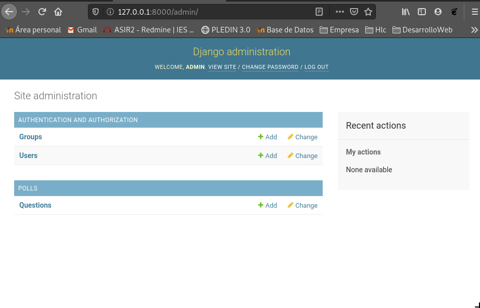
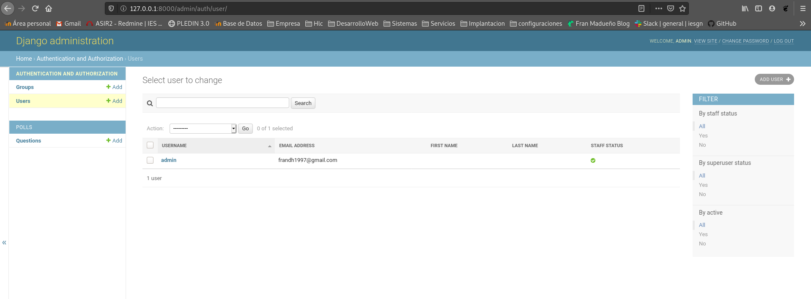

* Crea dos preguntas, con posibles respuestas.

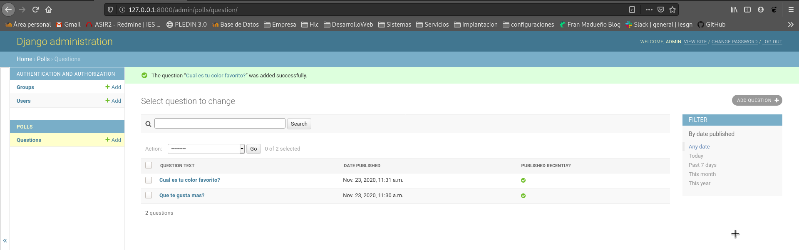


* Comprueba en el navegador que la aplicación está funcionando, accede a la url \polls.

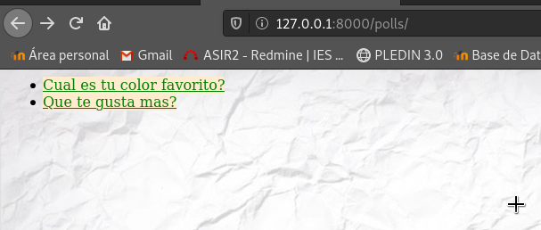
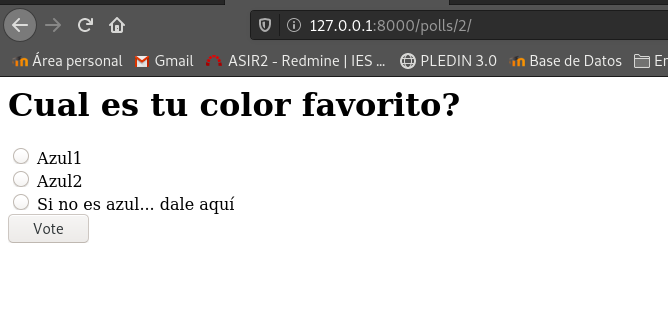

**En este momento, muestra al profesor la aplicación funcionando. Entrega una documentación resumida donde expliques los pasos fundamentales para realizar esta tarea. (2 puntos)**


## Tarea 2: Entorno de producción
Vamos a realizar el despliegue de nuestra aplicación en un entorno de producción, para ello vamos a utilizar una instancia del cloud, sigue los siguientes pasos:

* Instala en el servidor los servicios necesarios (apache2). Instala el módulo de apache2 para ejecutar código python.

Tras crear una máquina Debian Buster en el cloud, se accede a ella y se añaden los siguientes paquetes:

```shell
debian@tareadjango:~$ sudo apt-get install libapache2-mod-wsgi-py3
debian@tareadjango:~$ sudo apt-get install apache2
```

* Clona el repositorio en el DocumentRoot de tu virtualhost.

```shell
debian@tareadjango:~$ sudo apt-get install git
debian@tareadjango:~$ git clone https://github.com/josedom24/django_tutorial
debian@tareadjango:~$ sudo mkdir /var/www/app-python
debian@tareadjango:~$ sudo cp -R django_tutorial/ /var/www/app-python/
```

* Crea un entorno virtual e instala las dependencias de tu aplicación.

```shell
debian@tareadjango:~$ sudo apt-get install python-virtualenv virtualenv
debian@tareadjango:~$ virtualenv django -p python3
debian@tareadjango:~$ source ~/django/bin/activate
(django) debian@tareadjango:~$ python -m pip install Django
(django) debian@tareadjango:/var/www/app-python/django_tutorial$ pip install -r requirements.txt
Requirement already satisfied: pytz==2020.4 in /home/debian/django/lib/python3.7/site-packages (from -r requirements.txt (line 3)) (2020.4)
Requirement already satisfied: sqlparse==0.4.1 in /home/debian/django/lib/python3.7/site-packages (from -r requirements.txt (line 4)) (0.4.1)
Collecting asgiref==3.3.0
  Downloading asgiref-3.3.0-py3-none-any.whl (19 kB)
Collecting Django==3.1.3
  Downloading Django-3.1.3-py3-none-any.whl (7.8 MB)
     |████████████████████████████████| 7.8 MB 12.0 MB/s 
Requirement already satisfied: pytz==2020.4 in /home/debian/django/lib/python3.7/site-packages (from -r requirements.txt (line 3)) (2020.4)
Requirement already satisfied: sqlparse==0.4.1 in /home/debian/django/lib/python3.7/site-packages (from -r requirements.txt (line 4)) (0.4.1)
Installing collected packages: asgiref, Django
  Attempting uninstall: asgiref
    Found existing installation: asgiref 3.3.1
    Uninstalling asgiref-3.3.1:
      Successfully uninstalled asgiref-3.3.1
  Attempting uninstall: Django
    Found existing installation: Django 3.1.4
    Uninstalling Django-3.1.4:
      Successfully uninstalled Django-3.1.4
Successfully installed Django-3.1.3 asgiref-3.3.0
```

* Instala el módulo que permite que python trabaje con mysql:

```shell
(django) debian@tareadjango:/var/www/app-python/django_tutorial$ sudo apt-get install python3-mysqldb

(django) debian@tareadjango:/var/www/app-python/django_tutorial$ pip install mysql-connector-python
Collecting mysql-connector-python
  Downloading mysql_connector_python-8.0.22-cp37-cp37m-manylinux1_x86_64.whl (18.0 MB)
     |████████████████████████████████| 18.0 MB 11.3 MB/s 
Collecting protobuf>=3.0.0
  Downloading protobuf-3.14.0-cp37-cp37m-manylinux1_x86_64.whl (1.0 MB)
     |████████████████████████████████| 1.0 MB 5.1 MB/s 
Collecting six>=1.9
  Downloading six-1.15.0-py2.py3-none-any.whl (10 kB)
Installing collected packages: six, protobuf, mysql-connector-python
Successfully installed mysql-connector-python-8.0.22 protobuf-3.14.0 six-1.15.0
```

*  Crea una base de datos y un usuario en mysql.

```shell
(django) debian@tareadjango:/var/www/app-python/django_tutorial$ sudo apt-get install default-mysql-server

(django) debian@tareadjango:/var/www/app-python/django_tutorial$ sudo mysql -u root -p
Enter password: 
Welcome to the MariaDB monitor.  Commands end with ; or \g.
Your MariaDB connection id is 49
Server version: 10.3.23-MariaDB-0+deb10u1 Debian 10

Copyright (c) 2000, 2018, Oracle, MariaDB Corporation Ab and others.

Type 'help;' or '\h' for help. Type '\c' to clear the current input statement.

MariaDB [(none)]> create database django;
Query OK, 1 row affected (0.001 sec)

MariaDB [(none)]>  create user django@localhost identified by 'root';
Query OK, 0 rows affected (0.001 sec)

MariaDB [(none)]> grant all privileges on django.* to django@localhost;
Query OK, 0 rows affected (0.001 sec)
```


* Configura la aplicación para trabajar con mysql, para ello modifica la configuración de la base de datos en el archivo settings.py:

```shell
(django) debian@tareadjango:/var/www/app-python/django_tutorial/django_tutorial$ sudo nano settings.py 

# Database
# https://docs.djangoproject.com/en/3.1/ref/settings/#databases

DATABASES = {
          'default': {
              'ENGINE': 'mysql.connector.django',
              'NAME': 'django',
              'USER': 'django',
              'PASSWORD': 'root',
              'HOST': 'localhost',
              'PORT': '',
          }
      }
```

* Como en la tarea 1, realiza la migración de la base de datos que creará la estructura de datos necesrias. comprueba en mariadb que la base de datos y las tablas se han creado.

```shell
(django) debian@tareadjango:/var/www/app-python/django_tutorial$ python3 manage.py migrate
Operations to perform:
  Apply all migrations: admin, auth, contenttypes, polls, sessions
Running migrations:
  Applying contenttypes.0001_initial... OK
  Applying auth.0001_initial... OK
  Applying admin.0001_initial... OK
  Applying admin.0002_logentry_remove_auto_add... OK
  Applying admin.0003_logentry_add_action_flag_choices... OK
  Applying contenttypes.0002_remove_content_type_name... OK
  Applying auth.0002_alter_permission_name_max_length... OK
  Applying auth.0003_alter_user_email_max_length... OK
  Applying auth.0004_alter_user_username_opts... OK
  Applying auth.0005_alter_user_last_login_null... OK
  Applying auth.0006_require_contenttypes_0002... OK
  Applying auth.0007_alter_validators_add_error_messages... OK
  Applying auth.0008_alter_user_username_max_length... OK
  Applying auth.0009_alter_user_last_name_max_length... OK
  Applying auth.0010_alter_group_name_max_length... OK
  Applying auth.0011_update_proxy_permissions... OK
  Applying auth.0012_alter_user_first_name_max_length... OK
  Applying polls.0001_initial... OK
  Applying sessions.0001_initial... OK
```

Comprobamos la base de datos:
```shell
MariaDB [django]> show tables;
+----------------------------+
| Tables_in_django           |
+----------------------------+
| auth_group                 |
| auth_group_permissions     |
| auth_permission            |
| auth_user                  |
| auth_user_groups           |
| auth_user_user_permissions |
| django_admin_log           |
| django_content_type        |
| django_migrations          |
| django_session             |
| polls_choice               |
| polls_question             |
+----------------------------+
12 rows in set (0.001 sec)
```

* Crea un usuario administrador: python3 manage.py createsuperuser.

```shell
(django) debian@tareadjango:/var/www/app-python/django_tutorial$ python3 manage.py createsuperuser
Username (leave blank to use 'debian'): django
Email address: frandh1997@gmail.com
Password: 
Password (again): 
This password is too short. It must contain at least 8 characters.
This password is too common.
Bypass password validation and create user anyway? [y/N]: y
Superuser created successfully.
```
(django,root)


* Configura un virtualhost en apache2 con la configuración adecuada para que funcione la aplicación. El punto de entrada de nuestro servidor será django_tutorial/django_tutorial/wsgi.py. Puedes guiarte por el Ejercicio: Desplegando aplicaciones flask, por la documentación de django: How to use Django with Apache and mod_wsgi,…


```shell
(django) debian@tareadjango:/etc/apache2/sites-available$ sudo cp 000-default.conf app-python.conf
(django) debian@tareadjango:/etc/apache2/sites-available$ sudo nano app-python.conf 
<VirtualHost *:80>
        ServerName www.app-python.org

        ServerAdmin webmaster@localhost
        DocumentRoot /var/www/app-python/django_tutorial

        WSGIDaemonProcess app-python user=www-data group=www-data processes=1 threads=5 python-path=/var/www/app-python/django_tutorial:/home/debian/django/lib/python3.7/site-packages
        WSGIScriptAlias / /var/www/app-python/django_tutorial/django_tutorial/wsgi.py

        <Directory /var/www/app-python/django_tutorial/django_tutorial>
                WSGIProcessGroup app-python
                WSGIApplicationGroup %{GLOBAL}
                Require all granted
        </Directory>

        ErrorLog ${APACHE_LOG_DIR}/error.log
        CustomLog ${APACHE_LOG_DIR}/access.log combined
</VirtualHost>
(django) debian@tareadjango:/etc/apache2/sites-available$ sudo a2ensite app-python.conf
#en /var/www/app-python/django_tutorial/django_tutorial/settings.py
ALLOWED_HOSTS = ['www.app-python.org']
```
Añadieremos nuestra pagina al /etc/hosts de nuestra maquina local y comprobaremos el resultado:

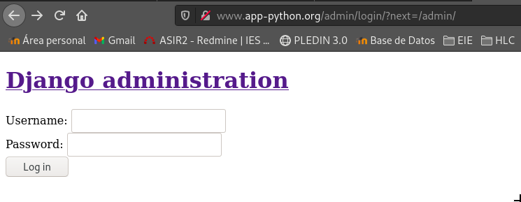
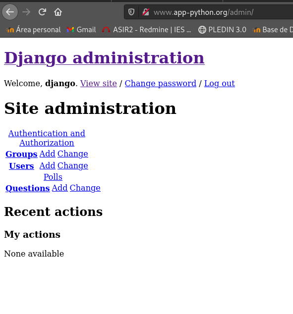

* Debes asegurarte que el contenido estático se está sirviendo: ¿Se muestra la imagen de fondo de la aplicación? ¿Se ve de forma adecuada la hoja de estilo de la zona de administración?. Para arreglarlo puedes encontrar documentación en How to use Django with Apache and mod_wsgi.

Como nos indica el manual deberemos utilizar un alias para enlazar nuestro directorio /static/ con el proporcionado en el entorno virtual.
```shell
        Alias /static/ /home/debian/django/lib/python3.7/site-packages/django/contrib/admin/static/
        <Directory /home/debian/django/lib/python3.7/site-packages/django/contrib/admin/static>
                Require all granted
        </Directory>
```

Como podemos comprobar nuestra pagina ya hace uso de hojas de estilo:
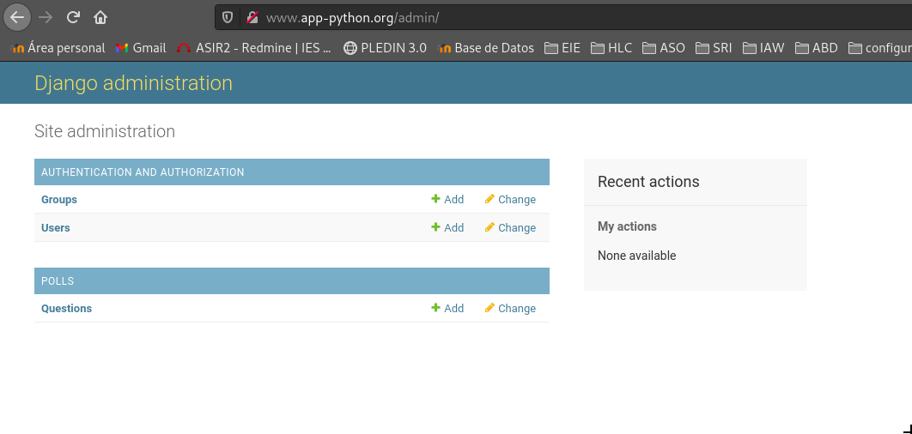

* Desactiva en la configuración (fichero settings.py) el modo debug a False. Para que los errores de ejecución no den información sensible de la aplicación.

Modificaremos el modo debug a false:
```shell
# SECURITY WARNING: don't run with debug turned on in production!
DEBUG = False
```

* Muestra la página funcionando. En la zona de administración se debe ver de forma adecuada la hoja de estilo.

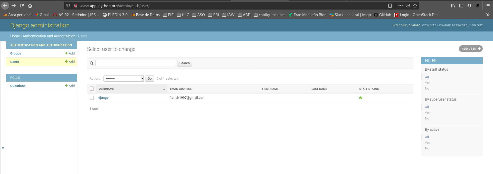

**En este momento, muestra al profesor la aplicación funcionando. Entrega una documentación resumida donde expliques los pasos fundamentales para realizar esta tarea. (4 puntos)**


## Tarea 3: Modificación de nuestra aplicación

Vamos a realizar cambios en el entorno de desarrollo y posteriormente vamos a subirlas a producción. Vamos a realizar tres modificaciones (entrega una captura de pantalla donde se ven cada una de ellas). Recuerda que primero lo haces en el entrono de desarrollo, y luego tendrás que llevar los cambios a producción:

* Modifica la página inicial donde se ven las encuestas para que aparezca tu nombre: Para ello modifica el archivo <span style="background-color:#ff5733; border-radius:1em;"> django_tutorial/polls/templates/polls/index.html.</span> 

```shell


<link rel="stylesheet" type="text/css" href="">

<h1>Francisco Javier Madueño Jurado</h1>


    <ul>
    
    <li><a href="">{{ question.question_text }}</a></li>
    
    </ul>

    <p>No polls are available.</p>

```

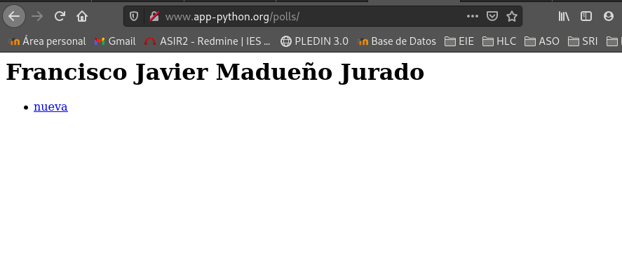

* Modifica la imagen de fondo que se ve la aplicación.

```shell
(django) debian@tareadjango:~/django/lib/python3.7/site-packages/django/contrib/admin/static/admin/css$ sudo nano base.css 
#modificamos el color del backgroud
body {
    margin: 0;
    padding: 0;
    font-size: 14px;
    font-family: "Roboto","Lucida Grande","DejaVu Sans","Bitstream Vera Sans",Verdana,Arial,sans-serif;
    color: #333;
    background: #fb5858;
}
```

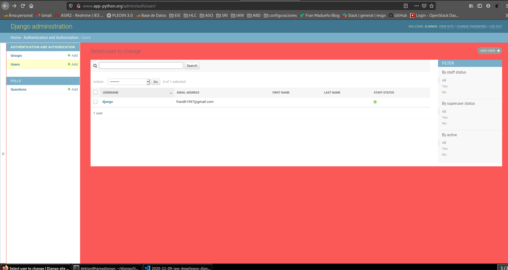

* Vamos a crear una nueva tabla en la base de datos, para ello sigue los siguientes pasos:
    * Añade un nuevo modelo al fichero polls/models.py:
        ```shell
        (django) debian@tareadjango:/var/www/app-python/django_tutorial/polls$ sudo nano models.py 
          class Categoria(models.Model):	
          	Abr = models.CharField(max_length=4)
          	Nombre = models.CharField(max_length=50)

          	def __str__(self):
          		return self.Abr+" - "+self.Nombre 		
        ```
    *  Crea una nueva migración: python3 manage.py makemigrations.
        Y realiza la migración: python3 manage.py migrate

```shell
(django) debian@tareadjango:/var/www/app-python/django_tutorial$ python3 manage.py makemigrations
Traceback (most recent call last):
  File "manage.py", line 22, in <module>
    main()
  File "manage.py", line 18, in main
    execute_from_command_line(sys.argv)
  File "/home/debian/django/lib/python3.7/site-packages/django/core/management/__init__.py", line 401, in execute_from_command_line
    utility.execute()
  File "/home/debian/django/lib/python3.7/site-packages/django/core/management/__init__.py", line 377, in execute
    django.setup()
  File "/home/debian/django/lib/python3.7/site-packages/django/__init__.py", line 24, in setup
    apps.populate(settings.INSTALLED_APPS)
  File "/home/debian/django/lib/python3.7/site-packages/django/apps/registry.py", line 114, in populate
    app_config.import_models()
  File "/home/debian/django/lib/python3.7/site-packages/django/apps/config.py", line 211, in import_models
    self.models_module = import_module(models_module_name)
  File "/home/debian/django/lib/python3.7/importlib/__init__.py", line 127, in import_module
    return _bootstrap._gcd_import(name[level:], package, level)
  File "<frozen importlib._bootstrap>", line 1006, in _gcd_import
  File "<frozen importlib._bootstrap>", line 983, in _find_and_load
  File "<frozen importlib._bootstrap>", line 967, in _find_and_load_unlocked
  File "<frozen importlib._bootstrap>", line 677, in _load_unlocked
  File "<frozen importlib._bootstrap_external>", line 724, in exec_module
  File "<frozen importlib._bootstrap_external>", line 860, in get_code
  File "<frozen importlib._bootstrap_external>", line 791, in source_to_code
  File "<frozen importlib._bootstrap>", line 219, in _call_with_frames_removed
  File "/var/www/app-python/django_tutorial/polls/models.py", line 30
    django_tutorial/polls$ sudo nano models.py
                         ^
SyntaxError: invalid syntax
```

    *  Añade el nuevo modelo al sitio de administración de django:

    *  Para ello cambia la siguiente línea en el fichero polls/admin.py:
        ```shell
           from .models import Choice, Question
        ```
        Por esta otra:
        ```shell
           from .models import Choice, Question, Categoria
        ```
        Y añade al final la siguiente línea:
        ```shell
           admin.site.register(Categoria)
        ```


    *  Despliega el cambio producido al crear la nueva tabla en el entorno de producción.


**Explica los cambios que has realizado en el entorno de desarrollo y cómo lo has desplegado en producción para cada una de las modificaciones (4 puntos).**
