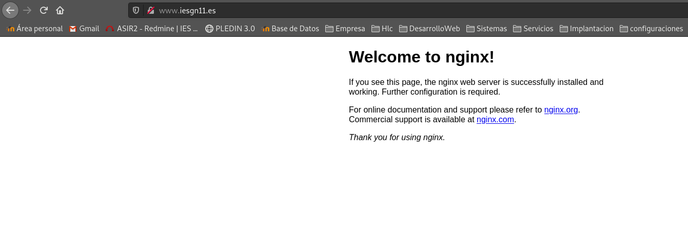
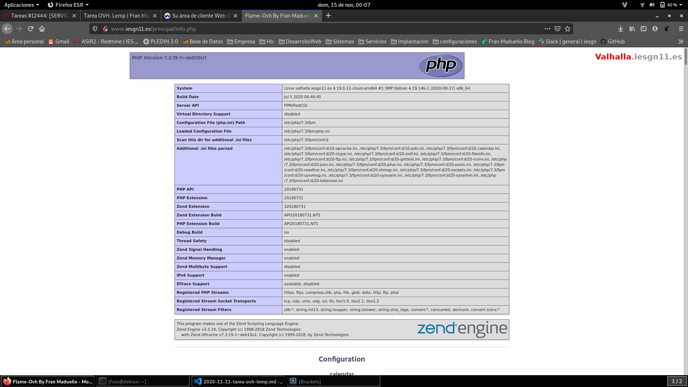

## Configuración inicial de OVH

Añadir clave de los profesores:
```shell
#con wget desde la pag de redmine.
debian@valhalla:~/claves$ ls
clave-openstack.pub  id_rsa.pub  nota.txt  rafa.pub
#la mia con scp
root@debian:/home/fran/.ssh# scp maduovh.pub debian@valhalla.iesgn11.es:/home/debian/claves
The authenticity of host 'valhalla.iesgn11.es (146.59.196.81)' can't be established.
ECDSA key fingerprint is SHA256:HBSKW/gGZRGIBLQ1M28AGyb8jKujW2w9A+NuisTLqic.
Are you sure you want to continue connecting (yes/no)? ye
Please type 'yes' or 'no': yes
Warning: Permanently added 'valhalla.iesgn11.es' (ECDSA) to the list of known hosts.
debian@valhalla.iesgn11.es's password: 
maduovh.pub     
#añadir a .ssh/authorized_keys
debian@valhalla:~$ echo `cat claves/id_rsa.pub` >> .ssh/authorized_keys
debian@valhalla:~$ echo `cat claves/rafa.pub` >> .ssh/authorized_keys
debian@valhalla:~$ echo `cat claves/clave-openstack.pub` >> .ssh/authorized_keys
debian@valhalla:~$ echo `cat claves/maduovh.pub` >> .ssh/authorized_keys
```

Resolución de nombres
```shell
#en /etc/hostname
valhalla.iesgn11.es
#en /etc/hosts
127.0.1.1       valhalla.iesgn11.es
```
Reiniciamos la maquina.

Accedemos y verificamos su nombre:
```shell
debian@valhalla:~$ hostname -f
valhalla.iesgn11.es
```

Añadimos registro de tipo A en la zona DNS de mi dominio.


```shell
root@debian:/home/fran# ssh -i .ssh/maduovh.pub debian@valhalla.iesgn11.es
Linux valhalla.iesgn11.es 4.19.0-11-cloud-amd64 #1 SMP Debian 4.19.146-1 (2020-09-17) x86_64

The programs included with the Debian GNU/Linux system are free software;
the exact distribution terms for each program are described in the
individual files in /usr/share/doc/*/copyright.

Debian GNU/Linux comes with ABSOLUTELY NO WARRANTY, to the extent
permitted by applicable law.
Last login: Fri Nov 13 09:49:57 2020 from 85.55.236.72
debian@valhalla:~$ 
```

## Instalación de un servidor LEMP (Servicios)

1. Instala un servidor web nginx
```shell
root@valhalla:/home/debian# apt-get install nginx
```
2. Instala un servidor de base de datos MariaDB. Ejecuta el programa necesario para asegurar el servicio, ya que lo vamos a tener corriendo en el entorno de producción.
```shell
root@valhalla:/home/debian# apt-get apt-get install mariadb-server
root@valhalla:/home/debian# mysql_secure_installation

NOTE: RUNNING ALL PARTS OF THIS SCRIPT IS RECOMMENDED FOR ALL MariaDB
      SERVERS IN PRODUCTION USE!  PLEASE READ EACH STEP CAREFULLY!

In order to log into MariaDB to secure it, we'll need the current
password for the root user.  If you've just installed MariaDB, and
you haven't set the root password yet, the password will be blank,
so you should just press enter here.

Enter current password for root (enter for none): 
OK, successfully used password, moving on...

Setting the root password ensures that nobody can log into the MariaDB
root user without the proper authorisation.

Set root password? [Y/n] y

New password: root
Re-enter new password: root
Password updated successfully!
Reloading privilege tables..
 ... Success!


By default, a MariaDB installation has an anonymous user, allowing anyone
to log into MariaDB without having to have a user account created for
them.  This is intended only for testing, and to make the installation
go a bit smoother.  You should remove them before moving into a
production environment.

Remove anonymous users? [Y/n] y
 ... Success!

Normally, root should only be allowed to connect from 'localhost'.  This
ensures that someone cannot guess at the root password from the network.

Disallow root login remotely? [Y/n] y
 ... Success!

By default, MariaDB comes with a database named 'test' that anyone can
access.  This is also intended only for testing, and should be removed
before moving into a production environment.

Remove test database and access to it? [Y/n] y
 - Dropping test database...
 ... Success!
 - Removing privileges on test database...
 ... Success!

Reloading the privilege tables will ensure that all changes made so far
will take effect immediately.

Reload privilege tables now? [Y/n] y
 ... Success!

Cleaning up...

All done!  If you've completed all of the above steps, your MariaDB
installation should now be secure.

Thanks for using MariaDB!
```

3. Instala un servidor de aplicaciones php php-fpm.
```shell
root@valhalla:/home/debian# apt-get install php php-fpm
```

4. Crea un virtualhost al que vamos acceder con el nombre www.iesgnXX.es. Recuerda que tendrás que crear un registro CNAME en la zona DNS.

Primero borrare las 3 configuraciones predeterminadas que habia hacer www.iesgn11.es y luego añadire la siguiente:


Crearemos un fichero para www.iesgn11.es, para ello copiaremos el fichero default y lo modificaremos
```shell
debian@valhalla:/etc/nginx/sites-available$ sudo cp default iesgn11
debian@valhalla:/etc/nginx/sites-available$ sudo nano iesgn11
server {
	listen 80;
	listen [::]:80;

	root /var/www/iesgn11;

	index index.html index.htm index.nginx-debian.html;

	server_name www.iesgn11.es;

	location / {

		try_files $uri $uri/ =404;
	}

}
```
Crearemos el document root copiando de nuevo el default para el ejemplo.

Crearemos el enlace simbólico:
```shell
debian@valhalla:/etc/nginx/sites-available$ sudo ln -s /etc/nginx/sites-available/iesgn11 /etc/nginx/sites-enabled/
```
Añadimos la ruta en nuestro /hosts local.


5. Cuando se acceda al virtualhost por defecto default nos tiene que redirigir al virtualhost que hemos creado en el punto anterior.

crearemos un directorio en la ubicación de la paguina por defecto llamado /default.

Modificaremos el archivo de configuración default:
```shell
server {
        listen 80 default_server;
        listen [::]:80 default_server;

        root /var/www/html/default;

        index index.html index.htm index.nginx-debian.html;

        server_name _;
        return 301 $scheme://www.iesgn11.es$request_uri;

        location / {

                try_files $uri $uri/ =404;
        }
}
```
y por ultimo añadimos la ruta en /etc/hosts.


6. Cuando se acceda a www.iesgnXX.es se nos redigirá a la página www.iesgnXX.es/principal

```shell
        location / {

                try_files $uri $uri/ =404;
                return 301 /principal/index.html;
                location /principal {
                        autoindex off;
                }
        }
```
Crearemos el directorio y el index.html.

7. En la página www.iesgnXX.es/principal se debe mostrar una página web estática (utiliza alguna plantilla para que tenga hoja de estilo). En esta página debe aparecer tu nombre, y una lista de enlaces a las aplicaciones que vamos a ir desplegando posteriormente.

He descargado esta plantilla https://plantillashtmlgratis.com/todas-las-plantillas/plantilla/plantillas-html-css-para-descargar-gratis-flame/ y la he modificado un poco para hacerla mas simple y accesible para este proyecto, la he subido a github modificada así que la descargare desde ahi con git.
Repositorio: https://github.com/franmadu6/FlameOvh


8. Configura el nuevo virtualhost, para que pueda ejecutar PHP. Determina que configuración tiene por defecto php-fpm (socket unix o socket TCP) para configurar nginx de forma adecuada.

Deberemos tener instalado php-fpm (ya instalado en el punto 3).

Para que nginx pueda ejecutar php modificaremos nuestro fichero de nuevo:
```shell
location ~ \.php$ {

        include snippets/fastcgi-php.conf;
        fastcgi_pass unix:/var/run/php/php7.3-fpm.sock;
}
```

9. Crea un fichero info.php que demuestre que está funcionando el servidor LEMP.

creamos el fichero info.php y dentro le añadiremos lo siguiente:
```shell
<?php
phpinfo();
?>
```
le he añadido un logo que vuelva a la pagina principal.

Comprobaremos su funcionamiento, además añadiremos un link en nuestra pagina principal para que podamos acceder de manera inmediata.

