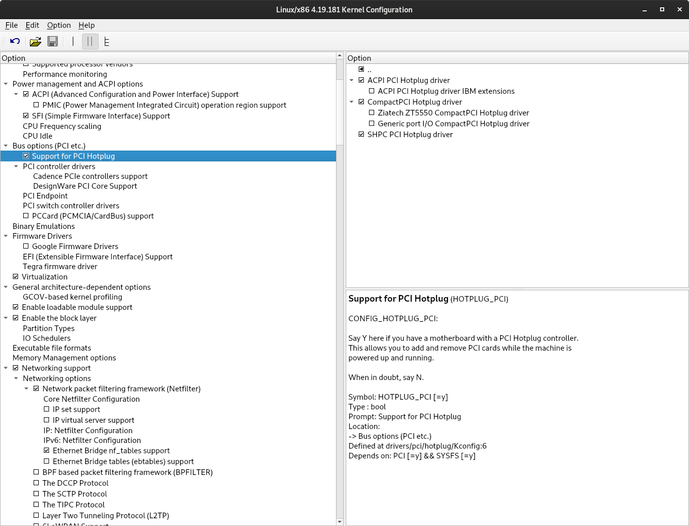

Al ser linux un kérnel libre, es posible descargar el código fuente, configurarlo y comprimirlo. Además, esta tarea a priori compleja, es más sencilla de lo que parece gracias a las herramientas disponibles.

En esta tarea debes tratar de compilar un kérnel completamente funcional que reconozca todo el hardware básico de tu equipo y que sea a la vez lo más pequeño posible, es decir que incluya un vmlinuz lo más pequeño posible y que incorpore sólo los módulos imprescindibles. Para ello utiliza el método explicado en clase y entrega finalmente el fichero deb con el kérnel compilado por ti.

El hardware básico incluye como mínimo el teclado, la interfaz de red y la consola gráfica (texto).

### Pasos a seguir

Comprobaremos nuestra versión de kernel y la descargaremos:
```shell
debian@fran:~/compilacionkernel$ uname -r
4.19.0-16-amd64
debian@fran:~/compilacionkernel$ wget https://mirrors.edge.kernel.org/pub/linux/kernel/v4.x/linux-4.19.tar.xz
--2021-06-08 21:33:35--  https://mirrors.edge.kernel.org/pub/linux/kernel/v4.x/linux-4.19.tar.xz
Resolving mirrors.edge.kernel.org (mirrors.edge.kernel.org)... 147.75.101.1, 2604:1380:2001:3900::1
Connecting to mirrors.edge.kernel.org (mirrors.edge.kernel.org)|147.75.101.1|:443... connected.
HTTP request sent, awaiting response... 200 OK
Length: 103117552 (98M) [application/x-xz]
Saving to: ‘linux-4.19.tar.xz’

linux-4.19.tar.xz     100%[=======================>]  98.34M  5.26MB/s    in 23s     

2021-06-08 21:33:59 (4.25 MB/s) - ‘linux-4.19.tar.xz’ saved [103117552/103117552]
```

Descomprimiremos y checkearemos su contenido:
```shell
debian@fran:~/compilacionkernel$ tar xf linux-4.19.tar.xz
debian@fran:~/compilacionkernel$ cd linux-4.19/
debian@fran:~/compilacionkernel/linux-4.19$ 
debian@fran:~/compilacionkernel/linux-4.19$ ls
COPYING        Kconfig      README  crypto    include  lib      scripts   usr
CREDITS        LICENSES     arch    drivers   init     mm       security  virt
Documentation  MAINTAINERS  block   firmware  ipc      net      sound
Kbuild         Makefile     certs   fs        kernel   samples  tools
```

Para realizarse la compilación se utiliza un fichero llamado **.config** que contiene la información de los componentes que se enlazaran y los que no. Para generar dicho fichero haremos uso del comando **make oldconfig**:
```shell
debian@fran:~/compilacionkernel/linux-4.19$ make oldconfig
  HOSTCC  scripts/basic/fixdep
  HOSTCC  scripts/kconfig/conf.o
  YACC    scripts/kconfig/zconf.tab.c
  LEX     scripts/kconfig/zconf.lex.c
  HOSTCC  scripts/kconfig/zconf.tab.o
  HOSTLD  scripts/kconfig/conf
scripts/kconfig/conf  --oldconfig Kconfig
#
# using defaults found in /boot/config-4.19.0-16-amd64
#
#
# configuration written to .config
#
```

Tras negar el enlace a varios componentes que no seran necesarios con el comando anteriormente comentado obtendremos el fichero **.config**.
```shell
debian@fran:~/compilacionkernel/linux-4.19$ ls -la | egrep '.config'
-rw-r--r--   1 vagrant vagrant     59 Mar 17 15:43 .cocciconfig
-rw-r--r--   1 vagrant vagrant 206240 Jun  8 20:15 .config
-rw-r--r--   1 vagrant vagrant    563 Mar 17 15:43 Kconfig
```

Comprobaremos la cantidad de componentes enlazados estáticamente(y) y dinámicamente(m) de nuestra configuración actual.
```shell
debian@fran:~/compilacionkernel/linux-4.19$ egrep '=y' .config | wc -l
2016
debian@fran:~/compilacionkernel/linux-4.19$ egrep '=m' .config | wc -l
3381
```

Son mas de 5000 elementos los que poseemos ahora mismo en nuestra configuración, para rebajarlos de manera significativa haremos uso del comando **make localmodconfig** que comprobará los componentes que se estan usando actualmente descartando el resto modificando así nuestro **.config**.
```shell
debian@fran:~/compilacionkernel/linux-4.19$ make localmodconfig
using config: '.config'
vboxsf config not found!!
System keyring enabled but keys "debian/certs/debian-uefi-certs.pem" not found. Resetting keys to default value.
*
* Restart config...
*
*
* PCI GPIO expanders
*
AMD 8111 GPIO driver (GPIO_AMD8111) [N/m/y/?] n
BT8XX GPIO abuser (GPIO_BT8XX) [N/m/y/?] (NEW) n
OKI SEMICONDUCTOR ML7213 IOH GPIO support (GPIO_ML_IOH) [N/m/y/?] n
ACCES PCI-IDIO-16 GPIO support (GPIO_PCI_IDIO_16) [N/m/y/?] n
ACCES PCIe-IDIO-24 GPIO support (GPIO_PCIE_IDIO_24) [N/m/y/?] n
RDC R-321x GPIO support (GPIO_RDC321X) [N/m/y/?] n
#
# configuration written to .config
#
```


Nota: Para solucionar el error 'System keyring enabled but keys "debian/certs/debian-uefi-certs.pem" not found. Resetting keys to default value.' deberemos comentar la siguiente linea en nuestro archivo **.config**.
```shell
debian@fran:~/compilacionkernel/linux-4.19$ sed -ri '/CONFIG_SYSTEM_TRUSTED_KEYS/s/=.+/=""/g' .config
```

Una vez realizado el comando **make localmodconfig** podemos comprobrar que satisfactoriamente hemos reducido la cantidad de componente necesarios de mas de 5000 a al menos de 1550 componentes.
```shell
debian@fran:~/compilacionkernel/linux-4.19$ egrep '=y' .config | wc -l
1325
debian@fran:~/compilacionkernel/linux-4.19$ egrep '=m' .config | wc -l
193
```

Con el comando **nproc** podremos ver la cantidad de hilos existentes que nos haran falta saber para la implementación del siguiente comando:
```shell
debian@fran:~/compilacionkernel/linux-4.19$ nproc
2
```

Ya podríamos compilar dicho kernel con el comando **make -j 'numero de hilos' bindeb-pkg** construyendo asi un paquete **.deb** para que pudiéramos instalarlo en nuestra máquina:

Nota: Paquetería necesaria **sudo apt install libelf-dev libssl-dev**
```shell
debian@fran:~/compilacionkernel/linux-4.19$ make -j2 bindeb-pkg
/bin/bash ./scripts/package/mkdebian
dpkg-buildpackage -r"fakeroot -u" -a$(cat debian/arch) -b -nc -uc
dpkg-buildpackage: info: source package linux-4.19.181
dpkg-buildpackage: info: source version 4.19.181-1
dpkg-buildpackage: info: source distribution buster
dpkg-buildpackage: info: source changed by vagrant <debian@fran>
dpkg-buildpackage: info: host architecture amd64
```

Podemos comprobar el tamaño del paquete **.deb** que posee el kernel.
```shell
debian@fran:~/compilacionkernel/linux-4.19$ du -hs ../linux-image-4.19.181_4.19.181-1_amd64.deb 
13M	linux-image-4.19.181_4.19.181-1_amd64.deb
```

En este momento ya tendriamos compilado nuesto kernel, pero queremos descargarlo un poco mas y hacerlo mas liviano.


Para ello borraremos lo echo anteriormente:
```shell
debian@fran:~/compilacionkernel/linux-4.19$ make clean
```

Y generamos un nuevo fichero **.config**
```shell
debian@fran:~/compilacionkernel/linux-4.19$ make localmodconfig
```

Deberemos reducirlo lo máximo posible quitando así funcionalidades para ello haremos uso del comando **make xconfig**.

Nota: No sin antes instalar **sudo apt install pkg-config**:
```shell
debian@fran:~/compilacionkernel/linux-4.19$ make xconfig
```



El uso de la interfaz dada por xconfig es sencillo:  
los marcados con un · son módulos, los marcados con ✓ son estáticos y los que no están marcados, no serán añadidos a la compilación.  

Cuando hayamos finalizado la configuración pulsamos el disquete para guardar los cambios.

Despues de ir reduciendo tediosamente los componentes he llegado al siguiente punto:
```shell
fran@debian:~/prueba/kernel/linux-source-4.19$ egrep '=y' .config | wc -l
781
fran@debian:~/prueba/kernel/linux-source-4.19$ egrep '=m' .config | wc -l
107
```

Con un antiguo **make localmodconfig** llegamos a:
```shell
debian@fran:~/compilacionkernel/linux-4.19$ egrep '=y' .config | wc -l
1325
debian@fran:~/compilacionkernel/linux-4.19$ egrep '=m' .config | wc -l
193
```

Por lo que hemos bajado aun mas los componentes necesarios para nuestro **kernel a medida** a menos de 1000!.

[Imagen final del kernel compilado](documents/linux-image-4.19.181_4.19.181-3_amd64.deb)