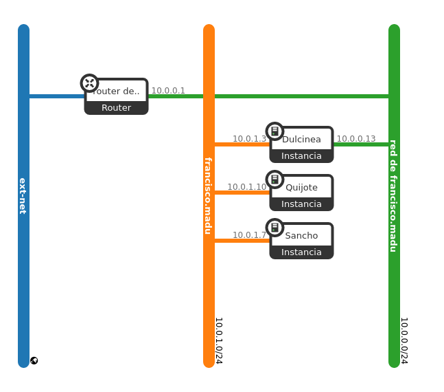
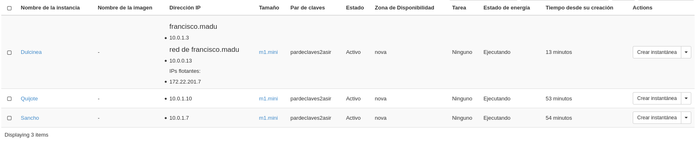
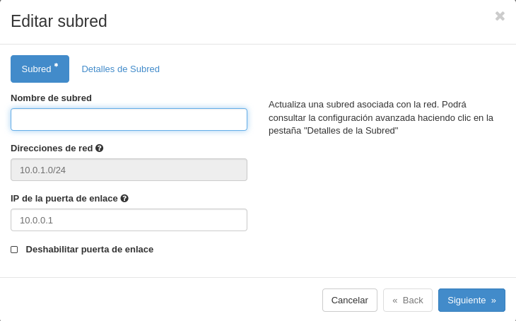
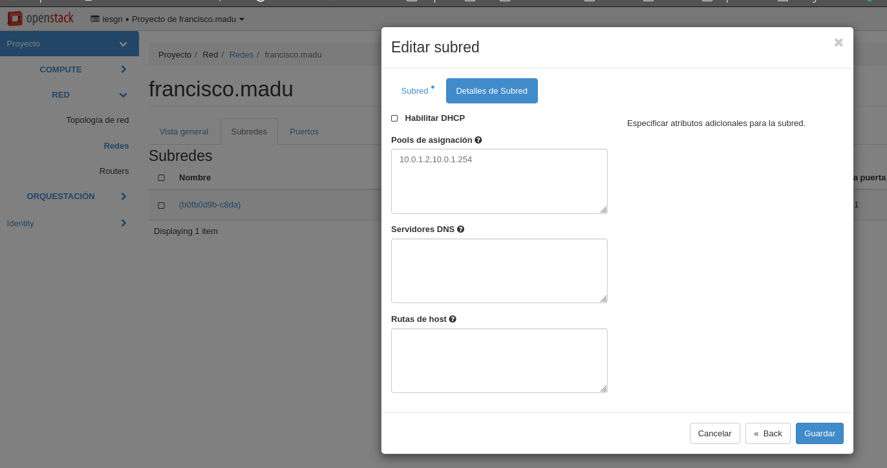

En esta tarea se va a crear el escenario de trabajo que se va a usar durante todo el curso, que va a constar inicialmente de 3 instancias con nombres relacionados con el libro "Don Quijote de la Mancha".



Pasos a realizar:

1. Creación de la red interna:
    * Nombre red interna de < nombre de usuario>
    * 10.0.1.0/24  


2. Creación de las instancias
    * Dulcinea:
        * Debian Buster sobre volumen de 10GB con sabor m1.mini
        * Accesible directamente a través de la red externa y con una IP flotante
        * Conectada a la red interna, de la que será la puerta de enlace
    * Sancho:
        * Ubuntu 20.04 sobre volumen de 10GB con sabor m1.mini
        * Conectada a la red interna
        * Accesible indirectamente a través de dulcinea
    * Quijote:
        * CentOS 7 sobre volumen de 10GB con sabor m1.mini
        * Conectada a la red interna
        * Accesible indirectamente a través de dulcinea  



3. Configuración de NAT en Dulcinea (Es necesario deshabilitar la seguridad en todos los puertos de dulcinea) [https://youtu.be/jqfILWzHrS0].


Deshabilitar los puertos de Dulcinea
```shell
#remover grupo de seguridad y deshabilitar cortafuegos de ambas redes
(openstackclient) fran@debian:~/Documentos$ openstack server remove security group Dulcinea default
(openstackclient) fran@debian:~/Documentos$ openstack port list
+--------------------------------------+------+-------------------+--------------------------------------------------------------------------+--------+
| ID                                   | Name | MAC Address       | Fixed IP Addresses                                                       | Status |
+--------------------------------------+------+-------------------+--------------------------------------------------------------------------+--------+
| 280e513f-5016-44b5-a66e-fb6960e4f8fa |      | fa:16:3e:23:87:b2 | ip_address='10.0.1.7', subnet_id='b0fb0d9b-c8da-4790-888c-e190e588d551'  | ACTIVE |
| 3148cbad-a46e-41ea-829e-5cfcd1f00f78 |      | fa:16:3e:01:01:01 | ip_address='10.0.1.10', subnet_id='b0fb0d9b-c8da-4790-888c-e190e588d551' | ACTIVE |
| 4ff047c4-14b4-43f4-8395-7f95b4023a6a |      | fa:16:3e:24:24:93 | ip_address='10.0.0.12', subnet_id='46cd68e1-2e88-4ba6-9970-431f6f53c13f' | ACTIVE |
| 53665f0f-e35a-44d9-896a-313861310021 |      | fa:16:3e:18:49:cd | ip_address='10.0.0.1', subnet_id='46cd68e1-2e88-4ba6-9970-431f6f53c13f'  | ACTIVE |
| 5f4ef06d-17cf-49e3-b30e-54bcd8a04465 |      | fa:16:3e:36:da:86 | ip_address='10.0.0.2', subnet_id='46cd68e1-2e88-4ba6-9970-431f6f53c13f'  | ACTIVE |
| 87e6c7e2-ea9a-4d17-8549-b51c78e7fd2a |      | fa:16:3e:30:7b:05 | ip_address='10.0.1.13', subnet_id='b0fb0d9b-c8da-4790-888c-e190e588d551' | ACTIVE |
+--------------------------------------+------+-------------------+--------------------------------------------------------------------------+--------+

(openstackclient) fran@debian:~/Documentos$ openstack port set --disable-port-security 4ff047c4-14b4-43f4-8395-7f95b4023a6a

(openstackclient) fran@debian:~/Documentos$ openstack port set --disable-port-security 87e6c7e2-ea9a-4d17-8549-b51c78e7fd2a

#Comprobación de acceso
fran@debian:~/Pardeclaves$ sudo ssh -i pardeclaves2asir.pem debian@172.22.201.13
The authenticity of host '172.22.201.13 (172.22.201.13)' can't be established.
ECDSA key fingerprint is SHA256:24bafQ0pMtYZxUMY0iq2SkQ4vLigux3MHHcqMEQdYKw.
Are you sure you want to continue connecting (yes/no)? yes
Warning: Permanently added '172.22.201.13' (ECDSA) to the list of known hosts.
Linux dulcinea 4.19.0-11-cloud-amd64 #1 SMP Debian 4.19.146-1 (2020-09-17) x86_64

The programs included with the Debian GNU/Linux system are free software;
the exact distribution terms for each program are described in the
individual files in /usr/share/doc/*/copyright.

Debian GNU/Linux comes with ABSOLUTELY NO WARRANTY, to the extent
permitted by applicable law.
Last login: Wed Nov 25 07:58:06 2020 from 172.23.0.94
debian@dulcinea:~$ 
```

**Configuración de NAT**
(Dulcinea)Activamos el bit de enrutamiento en «/etc/sysctl.conf»:
```shell
# Uncomment the next line to enable packet forwarding for IPv4
net.ipv4.ip_forward=1
```

Añadimos las reglas de iptable de postrouting y las guardamos con **iptables-save**, para ponerlas de nuevo usaremos **iptables-restore**.
```shell
debian@dulcinea:~$ sudo iptables -t nat -A POSTROUTING -s 10.0.1.0/24 -o eth0 -j MASQUERADE

debian@dulcinea:~$ sudo iptables-save
# Generated by xtables-save v1.8.2 on Tue Nov 24 20:36:37 2020
*nat
:PREROUTING ACCEPT [0:0]
:INPUT ACCEPT [0:0]
:POSTROUTING ACCEPT [0:0]
:OUTPUT ACCEPT [0:0]
-A POSTROUTING -s 10.0.1.0/24 -o eth0-j MASQUERADE
COMMIT
# Completed on Tue Nov 24 20:36:37 2020
```

Modificamos el fichero «/etc/network/interfaces»:
```shell
#tambien añadimos la ip estatica de dulcinea
# The normal eth0
allow-hotplug eth0
iface eth0 inet static
 address 10.0.0.8
 netmask 255.255.255.0
 broadcast 10.0.0.255

# Additional interfaces, just in case we're using
# multiple networks
allow-hotplug eth1
iface eth1 inet static
 address 10.0.1.8
 netmask 255.255.255.0
 broadcast 10.0.1.255
 gateway 10.0.1.1
```


Ahora si podemos reiniciar nuestro servicio de red y comprobamos su conectividad:
```shell
#reinicio de la maquina
debian@dulcinea:~$ sudo systemctl restart networking
#hacemos ping a la red 10.0.0.1 y maquinas
debian@dulcinea:~$ ping 10.0.0.1
PING 10.0.0.1 (10.0.0.1) 56(84) bytes of data.
64 bytes from 10.0.0.1: icmp_seq=1 ttl=64 time=0.539 ms
64 bytes from 10.0.0.1: icmp_seq=2 ttl=64 time=0.759 ms
--- 10.0.0.1 ping statistics ---
2 packets transmitted, 2 received, 0% packet loss, time 3ms
rtt min/avg/max/mdev = 0.539/0.649/0.759/0.110 ms

debian@dulcinea:~$ ping 10.0.1.6
PING 10.0.1.6 (10.0.1.6) 56(84) bytes of data.
64 bytes from 10.0.1.6: icmp_seq=1 ttl=64 time=0.031 ms
64 bytes from 10.0.1.6: icmp_seq=2 ttl=64 time=0.071 ms
^C
--- 10.0.1.6 ping statistics ---
2 packets transmitted, 2 received, 0% packet loss, time 24ms
rtt min/avg/max/mdev = 0.031/0.051/0.071/0.020 ms
debian@dulcinea:~$ ping 10.0.0.9
PING 10.0.0.9 (10.0.0.9) 56(84) bytes of data.
64 bytes from 10.0.0.9: icmp_seq=1 ttl=64 time=0.035 ms
64 bytes from 10.0.0.9: icmp_seq=2 ttl=64 time=0.062 ms
^C
--- 10.0.0.9 ping statistics ---
2 packets transmitted, 2 received, 0% packet loss, time 15ms
rtt min/avg/max/mdev = 0.035/0.048/0.062/0.015 ms


#conexion internet
debian@dulcinea:~$ ping 8.8.8.8
PING 8.8.8.8 (8.8.8.8) 56(84) bytes of data.
64 bytes from 8.8.8.8: icmp_seq=1 ttl=112 time=41.9 ms
64 bytes from 8.8.8.8: icmp_seq=2 ttl=112 time=42.3 ms
^C
--- 8.8.8.8 ping statistics ---
2 packets transmitted, 2 received, 0% packet loss, time 2ms
rtt min/avg/max/mdev = 41.870/42.062/42.255/0.281 ms

debian@dulcinea:~$ ping www.google.es
PING www.google.es (216.58.209.67) 56(84) bytes of data.
64 bytes from mad07s22-in-f3.1e100.net (216.58.209.67): icmp_seq=1 ttl=113 time=42.2 ms
64 bytes from mad07s22-in-f3.1e100.net (216.58.209.67): icmp_seq=2 ttl=113 time=55.6 ms
64 bytes from mad07s22-in-f3.1e100.net (216.58.209.67): icmp_seq=3 ttl=113 time=77.5 ms
^C
--- www.google.es ping statistics ---
3 packets transmitted, 3 received, 0% packet loss, time 5ms
rtt min/avg/max/mdev = 42.222/58.412/77.454/14.524 ms


#hacemos ping a Sancho y Quijote
debian@dulcinea:~$ ping 10.0.1.7
PING 10.0.1.7 (10.0.1.7) 56(84) bytes of data.
64 bytes from 10.0.1.7: icmp_seq=1 ttl=64 time=2.05 ms
64 bytes from 10.0.1.7: icmp_seq=2 ttl=64 time=0.701 ms
^C
--- 10.0.1.7 ping statistics ---
2 packets transmitted, 2 received, 0% packet loss, time 3ms
rtt min/avg/max/mdev = 0.701/1.375/2.050/0.675 ms
debian@dulcinea:~$ ping 10.0.1.10
PING 10.0.1.10 (10.0.1.10) 56(84) bytes of data.
64 bytes from 10.0.1.10: icmp_seq=1 ttl=64 time=2.07 ms
64 bytes from 10.0.1.10: icmp_seq=2 ttl=64 time=0.589 ms
64 bytes from 10.0.1.10: icmp_seq=3 ttl=64 time=0.748 ms
^C
--- 10.0.1.10 ping statistics ---
3 packets transmitted, 3 received, 0% packet loss, time 28ms
rtt min/avg/max/mdev = 0.589/1.134/2.065/0.661 ms
```


4. Definición de contraseña en todas las instancias (para poder modificarla desde consola en caso necesario).

```shell
#Dulcinea
debian@dulcinea:~$ sudo passwd
New password: 
Retype new password: 
passwd: password updated successfully
debian@dulcinea:~$ 

#Sancho
#Modificamos /etc/ssh/sshd_config:
PermitRootLogin yes
PasswordAuthentication yes

ubuntu@sancho:~$ sudo passwd
New password: 
Retype new password: 
passwd: password updated successfully

#Quijote
[centos@quijote ~]$ sudo passwd
Changing password for user root.
New password: 
BAD PASSWORD: The password is shorter than 8 characters
Retype new password: 
passwd: all authentication tokens updated successfully.
[centos@quijote ~]$
```

5. Modificación de las instancias sancho y quijote para que usen direccionamiento estático y dulcinea como puerta de enlace.

Modificamos desde horizon la red y ponemos de puerta de enlace Dulcinea:


**Ubuntu**
En /etc/netplan/50-cloud-init.yaml: 
```shell
# This file is generated from information provided by the datasource.  Changes
# to it will not persist across an instance reboot.  To disable cloud-init's
# network configuration capabilities, write a file
# /etc/cloud/cloud.cfg.d/99-disable-network-config.cfg with the following:
# network: {config: disable}

network:
  version: 2
  renderer: networkd
  ethernets:
    ens3:
      dhcp4: no
      addresses:
        - 10.0.1.7/24
      gateway4: 10.0.1.8
      nameservers:
          addresses: [192.168.202.2, 8.8.8.8, 8.8.4.4]
```
Comprobamos su conectividad:
```shell
ubuntu@sancho:~$ ping 8.8.8.8
PING 8.8.8.8 (8.8.8.8) 56(84) bytes of data.
64 bytes from 8.8.8.8: icmp_seq=1 ttl=111 time=43.1 ms
64 bytes from 8.8.8.8: icmp_seq=2 ttl=111 time=42.7 ms
64 bytes from 8.8.8.8: icmp_seq=3 ttl=111 time=43.3 ms
64 bytes from 8.8.8.8: icmp_seq=4 ttl=111 time=42.7 ms
64 bytes from 8.8.8.8: icmp_seq=5 ttl=111 time=42.5 ms
64 bytes from 8.8.8.8: icmp_seq=6 ttl=111 time=43.0 ms
64 bytes from 8.8.8.8: icmp_seq=7 ttl=111 time=43.1 ms
64 bytes from 8.8.8.8: icmp_seq=8 ttl=111 time=42.7 ms
64 bytes from 8.8.8.8: icmp_seq=9 ttl=111 time=42.8 ms
^C
--- 8.8.8.8 ping statistics ---
9 packets transmitted, 9 received, 0% packet loss, time 13021ms
rtt min/avg/max/mdev = 42.477/42.873/43.265/0.242 ms
```

**CentoS**
En _/etc/sysconfig/network-scripts/ifcfg-eth0:
```shell
# Created by cloud-init on instance boot automatically, do not edit.
#
DEVICE="eth0"
BOOTPROTO="static"
IPADDR="10.0.1.10"
NETMASK="255.255.255.0"
NETWORK="10.0.1.0"
GATEWAY="10.0.1.8"
ONBOOT="yes"
TYPE="Ethernet"
```

Como podemos observar ya tenemos ping hacia afuera tambien:
```shell
[centos@quijote ~]$ ping 8.8.8.8
PING 8.8.8.8 (8.8.8.8) 56(84) bytes of data.
64 bytes from 8.8.8.8: icmp_seq=1 ttl=111 time=94.2 ms
64 bytes from 8.8.8.8: icmp_seq=2 ttl=111 time=42.7 ms
64 bytes from 8.8.8.8: icmp_seq=3 ttl=111 time=43.0 ms
^C
--- 8.8.8.8 ping statistics ---
3 packets transmitted, 3 received, 0% packet loss, time 2003ms
rtt min/avg/max/mdev = 42.705/60.023/94.287/24.229 ms
```


6. Modificación de la subred de la red interna, deshabilitando el servidor DHCP.



7. Utilización de ssh-agent para acceder a las instancias.


```shell
#activamos ssh-agent
debian@dulcinea:~$ eval `ssh-agent`
Agent pid 1290
#verificación de variable de entorno
debian@dulcinea:~$ echo $SSH_AUTH_SOCK
/tmp/ssh-1qfNizt7G2zn/agent.1289
#con ssh-add añadimos las identidades
debian@dulcinea:~/.ssh$ chmod 400 pardeclaves2asir.pem 
debian@dulcinea:~/.ssh$ ssh-add pardeclaves2asir.pem 
Identity added: pardeclaves2asir.pem (pardeclaves2asir.pem)
debian@dulcinea:~/.ssh$ ssh-add -l
2048 SHA256:JRwFzvnkuNHJV3VxpVpVrJU7d2hFG+H+wzSbB62NdsQ pardeclaves2asir.pem (RSA)
```

Para utilizar el reenvio de angentes, modificamos los ficheros /etc/ssh/ssh_config y /etc/ssh/sshd_config:
```shell
#en ssh/ssh_config
ForwardAgent yes

#en ssh/sshd_config
AllowAgentForwarding yes
```

Comprobamos para ambas maquinas:
```shell
debian@dulcinea:~$ ssh ubuntu@sancho
Welcome to Ubuntu 20.04.1 LTS (GNU/Linux 5.4.0-48-generic x86_64)

 * Documentation:  https://help.ubuntu.com
 * Management:     https://landscape.canonical.com
 * Support:        https://ubuntu.com/advantage

  System information as of Wed Nov 25 19:05:45 UTC 2020

  System load:  0.08              Processes:             103
  Usage of /:   14.7% of 9.52GB   Users logged in:       1
  Memory usage: 39%               IPv4 address for ens3: 10.0.1.7
  Swap usage:   0%

 * Introducing self-healing high availability clustering for MicroK8s!
   Super simple, hardened and opinionated Kubernetes for production.

     https://microk8s.io/high-availability

1 update can be installed immediately.
0 of these updates are security updates.
To see these additional updates run: apt list --upgradable


The list of available updates is more than a week old.
To check for new updates run: sudo apt update
Failed to connect to https://changelogs.ubuntu.com/meta-release-lts. Check your Internet connection or proxy settings


Last login: Wed Nov 25 16:58:27 2020 from 10.0.1.8
ubuntu@sancho:~$
```
```shell
debian@dulcinea:~$ ssh centos@quijote
Last login: Wed Nov 25 19:08:57 2020 from gateway
[centos@quijote ~]$ 
```

8. Creación del usuario profesor en todas las instancias. Usuario que puede utilizar sudo sin contraseña.

```shell
debian@dulcinea:~$ sudo adduser profesor
Adding user `profesor' ...
Adding new group `profesor' (1001) ...
Adding new user `profesor' (1001) with group `profesor' ...
Creating home directory `/home/profesor' ...
Copying files from `/etc/skel' ...
New password: 
Retype new password: 
passwd: password updated successfully
Changing the user information for profesor
Enter the new value, or press ENTER for the default
	Full Name []: profesor
	Room Number []: 
	Work Phone []: 
	Home Phone []: 
	Other []: 
Is the information correct? [Y/n] y
debian@dulcinea:~$ 
```
(pwd:profesor)

El siguiente paso es añadirlo al grupo de super usuarios en /etc/sudoers:
```shell
# User privilege specification
root    ALL=(ALL:ALL) ALL
profesor ALL=(ALL:ALL) NOPASSWD:ALL
```
En Ubuntu:
```shell
ubuntu@sancho:~$ sudo adduser profesor
Adding user `profesor' ...
Adding new group `profesor' (1001) ...
Adding new user `profesor' (1001) with group `profesor' ...
Creating home directory `/home/profesor' ...
Copying files from `/etc/skel' ...
New password: 
Retype new password: 
passwd: password updated successfully
Changing the user information for profesor
Enter the new value, or press ENTER for the default
	Full Name []: profesor
	Room Number []: 
	Work Phone []: 
	Home Phone []: 
	Other []: 
Is the information correct? [Y/n] 
#modificamos en /etc/sudoers
# Members of the admin group may gain root privileges
%admin ALL=(ALL) ALL
%profesor ALL=(ALL) NOPASSWD:ALL
```

En CentOS:
```shell
debian@dulcinea:~$ ssh centos@quijote
Last login: Wed Nov 25 19:10:05 2020 from gateway
[centos@quijote ~]$ sudo adduser profesor
[centos@quijote ~]$ sudo passwd profesor
Changing password for user profesor.
New password: 
BAD PASSWORD: The password contains the user name in some form
Retype new password: 
passwd: all authentication tokens updated successfully.
[centos@quijote ~]$ sudo usermod -aG wheel profesor
[centos@quijote ~]$ sudo visudo
## Allow root to run any commands anywhere
root    ALL=(ALL)       ALL
profesor ALL=(ALL)      NOPASSWD:ALL
```

9. Copia de las claves públicas de todos los profesores en las instancias para que puedan acceder con el usuario profesor.

Pasamos las claves por scp y las añadimos a authorized_keys en .ssh:
```shell
debian@dulcinea:~$ echo `cat .ssh/clave-openstack.pub` >> .ssh/authorized_keys 
debian@dulcinea:~$ echo `cat .ssh/rafa.pub` >> .ssh/authorized_keys 
debian@dulcinea:~$ echo `cat .ssh/id_rsa.pub` >> .ssh/authorized_keys
```

10. Realiza una actualización completa de todos los servidores.

En Dulcinea:
```shell
debian@dulcinea:~$ sudo apt-get update
Hit:1 http://deb.debian.org/debian buster InRelease                                 
Get:2 http://security.debian.org/debian-security buster/updates InRelease [65.4 kB] 
Get:3 http://deb.debian.org/debian buster-updates InRelease [51.9 kB]
Get:4 http://security.debian.org/debian-security buster/updates/main Sources [155 kB]
Ign:4 http://security.debian.org/debian-security buster/updates/main Sources
Get:5 http://deb.debian.org/debian buster-updates/main Sources.diff/Index [5,528 B]
Get:6 http://deb.debian.org/debian buster-updates/main amd64 Packages.diff/Index [5,528 B]
Get:7 http://security.debian.org/debian-security buster/updates/main amd64 Packages [251 kB]
Get:8 http://deb.debian.org/debian buster-updates/main Sources 2020-10-24-2001.35.pdiff [414 B]
Get:8 http://deb.debian.org/debian buster-updates/main Sources 2020-10-24-2001.35.pdiff [414 B]
Get:9 http://deb.debian.org/debian buster-updates/main amd64 Packages 2020-10-24-2001.35.pdiff [286 B]
Get:9 http://deb.debian.org/debian buster-updates/main amd64 Packages 2020-10-24-2001.35.pdiff [286 B]
Get:10 http://security.debian.org/debian-security buster/updates/main Translation-en [137 kB]
Get:4 http://security.debian.org/debian-security buster/updates/main Sources [155 kB]
Err:4 http://security.debian.org/debian-security buster/updates/main Sources
  Hash Sum mismatch
  Hashes of expected file:
   - Filesize:154868 [weak]
   - SHA256:120cecc6342d092232f5f17d8c34c709b88a5d249d5060a428eec8e97f99c81f
   - MD5Sum:4d5d0f8e586c020100efa3617e4db634 [weak]
  Hashes of received file:
   - SHA256:c19949c7284aa6aa9bbd74e1155114f53351da2982cb190db7465cc2950c5580
   - MD5Sum:b666a24d54c79b0d557621c74ef0d07d [weak]
   - Filesize:154868 [weak]
  Last modification reported: Wed, 25 Nov 2020 07:55:06 +0000
  Release file created at: Wed, 25 Nov 2020 07:55:15 +0000
Fetched 670 kB in 5s (132 kB/s)  
Reading package lists... Done
E: Failed to fetch http://security.debian.org/debian-security/dists/buster/updates/main/source/Sources.xz  Hash Sum mismatch
   Hashes of expected file:
    - Filesize:154868 [weak]
    - SHA256:120cecc6342d092232f5f17d8c34c709b88a5d249d5060a428eec8e97f99c81f
    - MD5Sum:4d5d0f8e586c020100efa3617e4db634 [weak]
   Hashes of received file:
    - SHA256:c19949c7284aa6aa9bbd74e1155114f53351da2982cb190db7465cc2950c5580
    - MD5Sum:b666a24d54c79b0d557621c74ef0d07d [weak]
    - Filesize:154868 [weak]
   Last modification reported: Wed, 25 Nov 2020 07:55:06 +0000
   Release file created at: Wed, 25 Nov 2020 07:55:15 +0000
E: Some index files failed to download. They have been ignored, or old ones used instead.
```

En Sancho:
```shell
ubuntu@sancho:~$ sudo apt-get update
Hit:1 http://archive.ubuntu.com/ubuntu focal InRelease
Get:2 http://archive.ubuntu.com/ubuntu focal-updates InRelease [114 kB]
Get:3 http://security.ubuntu.com/ubuntu focal-security InRelease [109 kB]
Get:4 http://archive.ubuntu.com/ubuntu focal-backports InRelease [101 kB]
Get:5 http://security.ubuntu.com/ubuntu focal-security/main amd64 Packages [372 kB]
Get:6 http://archive.ubuntu.com/ubuntu focal/universe amd64 Packages [8628 kB]
Get:7 http://security.ubuntu.com/ubuntu focal-security/main Translation-en [85.1 kB]                           
Get:8 http://security.ubuntu.com/ubuntu focal-security/main amd64 c-n-f Metadata [5428 B]                            
Get:9 http://archive.ubuntu.com/ubuntu focal/universe Translation-en [5124 kB]          
Get:10 http://security.ubuntu.com/ubuntu focal-security/restricted amd64 Packages [69.9 kB]
Get:11 http://security.ubuntu.com/ubuntu focal-security/restricted Translation-en [11.4 kB]                         
Get:12 http://archive.ubuntu.com/ubuntu focal/universe amd64 c-n-f Metadata [265 kB]                
Get:13 http://security.ubuntu.com/ubuntu focal-security/universe amd64 Packages [519 kB]            
Get:14 http://security.ubuntu.com/ubuntu focal-security/universe Translation-en [68.0 kB]           
Get:15 http://archive.ubuntu.com/ubuntu focal/multiverse amd64 Packages [144 kB]                    
Get:16 http://security.ubuntu.com/ubuntu focal-security/universe amd64 c-n-f Metadata [9364 B]      
Get:17 http://archive.ubuntu.com/ubuntu focal/multiverse Translation-en [104 kB]                    
Get:18 http://archive.ubuntu.com/ubuntu focal/multiverse amd64 c-n-f Metadata [9136 B]              
Get:19 http://archive.ubuntu.com/ubuntu focal-updates/main amd64 Packages [670 kB]                 
Get:20 http://security.ubuntu.com/ubuntu focal-security/multiverse amd64 Packages [1256 B]
Get:21 http://security.ubuntu.com/ubuntu focal-security/multiverse Translation-en [540 B]                            
Get:22 http://archive.ubuntu.com/ubuntu focal-updates/main Translation-en [167 kB]                        
Get:23 http://archive.ubuntu.com/ubuntu focal-updates/main amd64 c-n-f Metadata [11.1 kB]                 
Get:24 http://security.ubuntu.com/ubuntu focal-security/multiverse amd64 c-n-f Metadata [116 B]           
Get:25 http://archive.ubuntu.com/ubuntu focal-updates/restricted amd64 Packages [95.6 kB]
Get:26 http://archive.ubuntu.com/ubuntu focal-updates/restricted Translation-en [14.8 kB]
Get:27 http://archive.ubuntu.com/ubuntu focal-updates/universe amd64 Packages [697 kB]
Get:28 http://archive.ubuntu.com/ubuntu focal-updates/universe Translation-en [136 kB]
Get:29 http://archive.ubuntu.com/ubuntu focal-updates/universe amd64 c-n-f Metadata [13.3 kB]                                                                                                                     
Get:30 http://archive.ubuntu.com/ubuntu focal-updates/multiverse amd64 Packages [19.9 kB]                                                                                                                         
Get:31 http://archive.ubuntu.com/ubuntu focal-updates/multiverse Translation-en [4668 B]                                                                                                                          
Get:32 http://archive.ubuntu.com/ubuntu focal-updates/multiverse amd64 c-n-f Metadata [552 B]                                                                                                                     
Get:33 http://archive.ubuntu.com/ubuntu focal-backports/main amd64 c-n-f Metadata [112 B]                                                                                                                         
Get:34 http://archive.ubuntu.com/ubuntu focal-backports/restricted amd64 c-n-f Metadata [116 B]                                                                                                                   
Get:35 http://archive.ubuntu.com/ubuntu focal-backports/universe amd64 Packages [5304 B]                                                                                                                          
Get:36 http://archive.ubuntu.com/ubuntu focal-backports/universe Translation-en [1448 B]                                                                                                                          
Get:37 http://archive.ubuntu.com/ubuntu focal-backports/universe amd64 c-n-f Metadata [224 B]                                                                                                                     
Get:38 http://archive.ubuntu.com/ubuntu focal-backports/multiverse amd64 c-n-f Metadata [116 B]                                                                                                                   
Fetched 17.6 MB in 8s (2326 kB/s)                                                                                                                                                                                 
Reading package lists... Done
```

En Quijote:
```shell
[centos@quijote ~]$ sudo yum update
Loaded plugins: fastestmirror
Determining fastest mirrors
Could not retrieve mirrorlist http://mirrorlist.centos.org/?release=7&arch=x86_64&repo=os&infra=genclo error was
14: curl#6 - "Could not resolve host: mirrorlist.centos.org; Unknown error"


 One of the configured repositories failed (Unknown),
 and yum doesn't have enough cached data to continue. At this point the only
 safe thing yum can do is fail. There are a few ways to work "fix" this:

     1. Contact the upstream for the repository and get them to fix the problem.

     2. Reconfigure the baseurl/etc. for the repository, to point to a working
        upstream. This is most often useful if you are using a newer
        distribution release than is supported by the repository (and the
        packages for the previous distribution release still work).

     3. Run the command with the repository temporarily disabled
            yum --disablerepo=<repoid> ...

     4. Disable the repository permanently, so yum won't use it by default. Yum
        will then just ignore the repository until you permanently enable it
        again or use --enablerepo for temporary usage:

            yum-config-manager --disable <repoid>
        or
            subscription-manager repos --disable=<repoid>

     5. Configure the failing repository to be skipped, if it is unavailable.
        Note that yum will try to contact the repo. when it runs most commands,
        so will have to try and fail each time (and thus. yum will be be much
        slower). If it is a very temporary problem though, this is often a nice
        compromise:

            yum-config-manager --save --setopt=<repoid>.skip_if_unavailable=true

Cannot find a valid baseurl for repo: base/7/x86_64
```

Tuve que modificar el fichero /etc/resolv.conf:
```shell
nameserver 9.9.9.9
```

Y volví a probar:
```shell
[centos@quijote ~]$ sudo yum update
Loaded plugins: fastestmirror
Loading mirror speeds from cached hostfile
 * base: ftp.cixug.es
 * extras: mirror.airenetworks.es
 * updates: ftp.cixug.es
base                                                                              | 3.6 kB  00:00:00     
extras                                                                            | 2.9 kB  00:00:00     
updates                                                                           | 2.9 kB  00:00:00     
(1/4): base/7/x86_64/group_gz                                                     | 153 kB  00:00:00     
(2/4): extras/7/x86_64/primary_db                                                 | 222 kB  00:00:00     
(3/4): base/7/x86_64/primary_db                                                   | 6.1 MB  00:00:02     
(4/4): updates/7/x86_64/primary_db                                                | 3.7 MB  00:00:02     
Resolving Dependencies
--> Running transaction check
---> Package bind-export-libs.x86_64 32:9.11.4-16.P2.el7_8.2 will be updated
---> Package bind-export-libs.x86_64 32:9.11.4-26.P2.el7_9.2 will be an update
---> Package binutils.x86_64 0:2.27-43.base.el7 will be updated
---> Package binutils.x86_64 0:2.27-44.base.el7 will be an update
---> Package ca-certificates.noarch 0:2019.2.32-76.el7_7 will be updated
---> Package ca-certificates.noarch 0:2020.2.41-70.0.el7_8 will be an update
---> Package centos-release.x86_64 0:7-8.2003.0.el7.centos will be updated
---> Package centos-release.x86_64 0:7-9.2009.0.el7.centos will be an update
---> Package chkconfig.x86_64 0:1.7.4-1.el7 will be updated
```
(Es una muestra porque se descargo demasiados archivos...)

Si lo volvemos a ejecutar vemos como ya esta completamente actualizado:
```shell
[centos@quijote ~]$ sudo yum update
Loaded plugins: fastestmirror
Loading mirror speeds from cached hostfile
 * base: ftp.rediris.es
 * extras: repo.ifca.es
 * updates: ftp.uma.es
No packages marked for update
```

11. Configura el servidor con el nombre de dominio <nombre-usuario>.gonzalonazareno.org.

En /etc/hostname:
```shell
francisco-madu.gonzalonazareno.org
```
En /etc/hosts:
```shell
127.0.1.1 francisco-madu.gonzalonazareno.org dulcinea
127.0.0.1 localhost
```

12. Hasta que no esté configurado el servidor DNS, incluye resolución estática en las tres instancias tanto usando nombre completo como hostname.

En Dulcinea:
```shell
#en /etc/hosts
10.0.1.10 quijote
10.0.1.7 sancho

debian@dulcinea:~$ ping sancho
PING sancho (10.0.1.7) 56(84) bytes of data.
64 bytes from sancho (10.0.1.7): icmp_seq=1 ttl=64 time=1.38 ms
64 bytes from sancho (10.0.1.7): icmp_seq=2 ttl=64 time=0.622 ms
64 bytes from sancho (10.0.1.7): icmp_seq=3 ttl=64 time=0.742 ms
^C
--- sancho ping statistics ---
3 packets transmitted, 3 received, 0% packet loss, time 27ms
rtt min/avg/max/mdev = 0.622/0.916/1.384/0.334 ms
debian@dulcinea:~$ ping quijote
PING quijote (10.0.1.10) 56(84) bytes of data.
64 bytes from quijote (10.0.1.10): icmp_seq=1 ttl=64 time=1.34 ms
64 bytes from quijote (10.0.1.10): icmp_seq=2 ttl=64 time=0.810 ms
^C
--- quijote ping statistics ---
2 packets transmitted, 2 received, 0% packet loss, time 3ms
rtt min/avg/max/mdev = 0.810/1.076/1.343/0.268 ms
```

En Sancho:
```shell
#en /etc/hosts
10.0.1.8        dulcinea
10.0.1.10        quijote

ubuntu@sancho:~$ ping dulcinea
PING dulcinea (10.0.1.8) 56(84) bytes of data.
64 bytes from dulcinea (10.0.1.8): icmp_seq=1 ttl=64 time=0.502 ms
64 bytes from dulcinea (10.0.1.8): icmp_seq=2 ttl=64 time=0.697 ms
64 bytes from dulcinea (10.0.1.8): icmp_seq=3 ttl=64 time=0.699 ms
64 bytes from dulcinea (10.0.1.8): icmp_seq=4 ttl=64 time=0.611 ms
^C
--- dulcinea ping statistics ---
4 packets transmitted, 4 received, 0% packet loss, time 3048ms
rtt min/avg/max/mdev = 0.502/0.627/0.699/0.080 ms
ubuntu@sancho:~$ ping quijote
PING quijote (10.0.1.10) 56(84) bytes of data.
64 bytes from quijote (10.0.1.10): icmp_seq=1 ttl=64 time=2.30 ms
64 bytes from quijote (10.0.1.10): icmp_seq=2 ttl=64 time=0.855 ms
64 bytes from quijote (10.0.1.10): icmp_seq=3 ttl=64 time=0.509 ms
^C
--- quijote ping statistics ---
3 packets transmitted, 3 received, 0% packet loss, time 2003ms
rtt min/avg/max/mdev = 0.509/1.221/2.299/0.775 ms
```

En Quijote:
```shell
#en /etc/hosts
10.0.1.8        dulcinea
10.0.1.7        sancho
[centos@quijote ~]$ ping sancho
PING sancho (10.0.1.7) 56(84) bytes of data.
64 bytes from sancho (10.0.1.7): icmp_seq=1 ttl=64 time=1.18 ms
64 bytes from sancho (10.0.1.7): icmp_seq=2 ttl=64 time=0.802 ms
^C
--- sancho ping statistics ---
2 packets transmitted, 2 received, 0% packet loss, time 1001ms
rtt min/avg/max/mdev = 0.802/0.991/1.181/0.192 ms
[centos@quijote ~]$ ping dulcinea
PING dulcinea (10.0.1.8) 56(84) bytes of data.
64 bytes from dulcinea (10.0.1.8): icmp_seq=1 ttl=64 time=0.479 ms
64 bytes from dulcinea (10.0.1.8): icmp_seq=2 ttl=64 time=0.673 ms
64 bytes from dulcinea (10.0.1.8): icmp_seq=3 ttl=64 time=0.738 ms
^C
--- dulcinea ping statistics ---
3 packets transmitted, 3 received, 0% packet loss, time 2000ms
rtt min/avg/max/mdev = 0.479/0.630/0.738/0.110 ms
```

13. Asegúrate que el servidor tiene sincronizado su reloj utilizando un servidor NTP externo.

Para poder utilizar la utilidad de NTP deberemos instalar sus paquetes:
```shell
debian@dulcinea:~$ sudo apt-get install ntp
Reading package lists... Done
Building dependency tree       
Reading state information... Done
ntp is already the newest version (1:4.2.8p12+dfsg-4).
0 upgraded, 0 newly installed, 0 to remove and 1 not upgraded.
debian@dulcinea:~$ sudo systemctl enable ntp
Synchronizing state of ntp.service with SysV service script with /lib/systemd/systemd-sysv-install.
Executing: /lib/systemd/systemd-sysv-install enable ntp
debian@dulcinea:~$ sudo apt-get install ntpdate
Reading package lists... Done
Building dependency tree       
Reading state information... Done
The following NEW packages will be installed:
  ntpdate
0 upgraded, 1 newly installed, 0 to remove and 1 not upgraded.
Need to get 153 kB of archives.
After this operation, 242 kB of additional disk space will be used.
Get:1 http://deb.debian.org/debian buster/main amd64 ntpdate amd64 1:4.2.8p12+dfsg-4 [153 kB]
Fetched 153 kB in 1s (163 kB/s)
Selecting previously unselected package ntpdate.
(Reading database ... 27036 files and directories currently installed.)
Preparing to unpack .../ntpdate_1%3a4.2.8p12+dfsg-4_amd64.deb ...
Unpacking ntpdate (1:4.2.8p12+dfsg-4) ...
Setting up ntpdate (1:4.2.8p12+dfsg-4) ...
```

En /etc/ntp.conf:
```shell
server 0.es.pool.ntp.org
server 0.europe.pool.ntp.org
server 2.europe.pool.ntp.org
```

Reiniciamos servicio:
```shell
sudo service ntp restart
```

Ejecutamos:
```shell
debian@dulcinea:~$ sudo ntpdate -u pool.ntp.org
25 Nov 20:46:17 ntpdate[2325]: adjust time server 147.156.7.26 offset -0.008066 sec
```

Comprobación:
```shell
debian@dulcinea:~$ sudo ntpdate -u pool.ntp.org
25 Nov 20:46:17 ntpdate[2325]: adjust time server 147.156.7.26 offset -0.008066 sec
```