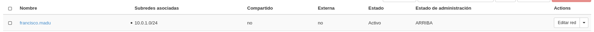

En esta tarea se va a crear el escenario de trabajo que se va a usar durante todo el curso, que va a constar inicialmente de 3 instancias con nombres relacionados con el libro "Don Quijote de la Mancha".


Pasos a realizar:

1. Creación de la red interna:
    * Nombre red interna de < nombre de usuario>
    * 10.0.1.0/24  



2. Creación de las instancias
    * Dulcinea:
        * Debian Buster sobre volumen de 10GB con sabor m1.mini
        * Accesible directamente a través de la red externa y con una IP flotante
        * Conectada a la red interna, de la que será la puerta de enlace
    * Sancho:
        * Ubuntu 20.04 sobre volumen de 10GB con sabor m1.mini
        * Conectada a la red interna
        * Accesible indirectamente a través de dulcinea
    * Quijote:
        * CentOS 7 sobre volumen de 10GB con sabor m1.mini
        * Conectada a la red interna
        * Accesible indirectamente a través de dulcinea  


3. Configuración de NAT en Dulcinea (Es necesario deshabilitar la seguridad en todos los puertos de dulcinea) [https://youtu.be/jqfILWzHrS0].


Deshabilitar los puertos de Dulcinea
```shell
#remover grupo de seguridad y deshabilitar cortafuegos de ambas redes
(openstackclient) fran@debian:~/Documentos$ openstack server remove security group Dulcinea default
(openstackclient) fran@debian:~/Documentos$ openstack port list
+--------------------------------------+------+-------------------+--------------------------------------------------------------------------+--------+
| ID                                   | Name | MAC Address       | Fixed IP Addresses                                                       | Status |
+--------------------------------------+------+-------------------+--------------------------------------------------------------------------+--------+
| 280e513f-5016-44b5-a66e-fb6960e4f8fa |      | fa:16:3e:23:87:b2 | ip_address='10.0.1.7', subnet_id='b0fb0d9b-c8da-4790-888c-e190e588d551'  | ACTIVE |
| 3148cbad-a46e-41ea-829e-5cfcd1f00f78 |      | fa:16:3e:01:01:01 | ip_address='10.0.1.10', subnet_id='b0fb0d9b-c8da-4790-888c-e190e588d551' | ACTIVE |
| 4ff047c4-14b4-43f4-8395-7f95b4023a6a |      | fa:16:3e:24:24:93 | ip_address='10.0.0.12', subnet_id='46cd68e1-2e88-4ba6-9970-431f6f53c13f' | ACTIVE |
| 53665f0f-e35a-44d9-896a-313861310021 |      | fa:16:3e:18:49:cd | ip_address='10.0.0.1', subnet_id='46cd68e1-2e88-4ba6-9970-431f6f53c13f'  | ACTIVE |
| 5f4ef06d-17cf-49e3-b30e-54bcd8a04465 |      | fa:16:3e:36:da:86 | ip_address='10.0.0.2', subnet_id='46cd68e1-2e88-4ba6-9970-431f6f53c13f'  | ACTIVE |
| 87e6c7e2-ea9a-4d17-8549-b51c78e7fd2a |      | fa:16:3e:30:7b:05 | ip_address='10.0.1.13', subnet_id='b0fb0d9b-c8da-4790-888c-e190e588d551' | ACTIVE |
+--------------------------------------+------+-------------------+--------------------------------------------------------------------------+--------+

(openstackclient) fran@debian:~/Documentos$ openstack port set --disable-port-security 4ff047c4-14b4-43f4-8395-7f95b4023a6a

(openstackclient) fran@debian:~/Documentos$ openstack port set --disable-port-security 87e6c7e2-ea9a-4d17-8549-b51c78e7fd2a

#Comprobación de acceso
fran@debian:~/Pardeclaves$ sudo ssh -i pardeclaves2asir.pem debian@172.22.201.13
The authenticity of host '172.22.201.13 (172.22.201.13)' can't be established.
ECDSA key fingerprint is SHA256:24bafQ0pMtYZxUMY0iq2SkQ4vLigux3MHHcqMEQdYKw.
Are you sure you want to continue connecting (yes/no)? yes
Warning: Permanently added '172.22.201.13' (ECDSA) to the list of known hosts.
Linux dulcinea 4.19.0-11-cloud-amd64 #1 SMP Debian 4.19.146-1 (2020-09-17) x86_64

The programs included with the Debian GNU/Linux system are free software;
the exact distribution terms for each program are described in the
individual files in /usr/share/doc/*/copyright.

Debian GNU/Linux comes with ABSOLUTELY NO WARRANTY, to the extent
permitted by applicable law.
Last login: Wed Nov 25 07:58:06 2020 from 172.23.0.94
debian@dulcinea:~$ 
```

**Configuración de NAT**
(Dulcinea)Activamos el bit de enrutamiento en «/etc/sysctl.conf»:
```shell
# Uncomment the next line to enable packet forwarding for IPv4
net.ipv4.ip_forward=1
```

Añadimos las reglas de iptable de postrouting y las guardamos con **iptables-save**, para ponerlas de nuevo usaremos **iptables-restore**.
```shell
debian@dulcinea:~$ sudo iptables -t nat -A POSTROUTING -s 10.0.1.0/24 -o eth1 -j MASQUERADE

debian@dulcinea:~$ sudo iptables-save
# Generated by xtables-save v1.8.2 on Tue Nov 24 20:36:37 2020
*nat
:PREROUTING ACCEPT [0:0]
:INPUT ACCEPT [0:0]
:POSTROUTING ACCEPT [0:0]
:OUTPUT ACCEPT [0:0]
-A POSTROUTING -s 10.0.1.0/24 -o eth1 -j MASQUERADE
COMMIT
# Completed on Tue Nov 24 20:36:37 2020
```

Modificamos el fichero «/etc/network/interfaces»:
```shell
#tambien añadimos la ip estatica de dulcinea
# The normal eth0
allow-hotplug eth0
iface eth0 inet dhcp
 address 10.0.0.8
 netmask 255.255.255.0
 broadcast 10.0.0.255

# Additional interfaces, just in case we're using
# multiple networks
allow-hotplug eth1
iface eth1 inet dhcp
 address 10.0.1.8
 netmask 255.255.255.0
 broadcast 10.0.1.255
 gateway 10.0.1.1
```


Ahora si podemos reiniciar nuestro servicio de red y comprobamos su conectividad:
```shell
#reinicio de la maquina
debian@dulcinea:~$ sudo systemctl restart networking
#hacemos ping a la red 10.0.0.1 y maquinas
debian@dulcinea:~$ ping 10.0.0.1
PING 10.0.0.1 (10.0.0.1) 56(84) bytes of data.
64 bytes from 10.0.0.1: icmp_seq=1 ttl=64 time=0.539 ms
64 bytes from 10.0.0.1: icmp_seq=2 ttl=64 time=0.759 ms
--- 10.0.0.1 ping statistics ---
2 packets transmitted, 2 received, 0% packet loss, time 3ms
rtt min/avg/max/mdev = 0.539/0.649/0.759/0.110 ms

debian@dulcinea:~$ ping 10.0.1.6
PING 10.0.1.6 (10.0.1.6) 56(84) bytes of data.
64 bytes from 10.0.1.6: icmp_seq=1 ttl=64 time=0.031 ms
64 bytes from 10.0.1.6: icmp_seq=2 ttl=64 time=0.071 ms
^C
--- 10.0.1.6 ping statistics ---
2 packets transmitted, 2 received, 0% packet loss, time 24ms
rtt min/avg/max/mdev = 0.031/0.051/0.071/0.020 ms
debian@dulcinea:~$ ping 10.0.0.9
PING 10.0.0.9 (10.0.0.9) 56(84) bytes of data.
64 bytes from 10.0.0.9: icmp_seq=1 ttl=64 time=0.035 ms
64 bytes from 10.0.0.9: icmp_seq=2 ttl=64 time=0.062 ms
^C
--- 10.0.0.9 ping statistics ---
2 packets transmitted, 2 received, 0% packet loss, time 15ms
rtt min/avg/max/mdev = 0.035/0.048/0.062/0.015 ms


#conexion internet
debian@dulcinea:~$ ping 8.8.8.8
PING 8.8.8.8 (8.8.8.8) 56(84) bytes of data.
64 bytes from 8.8.8.8: icmp_seq=1 ttl=112 time=41.9 ms
64 bytes from 8.8.8.8: icmp_seq=2 ttl=112 time=42.3 ms
^C
--- 8.8.8.8 ping statistics ---
2 packets transmitted, 2 received, 0% packet loss, time 2ms
rtt min/avg/max/mdev = 41.870/42.062/42.255/0.281 ms

debian@dulcinea:~$ ping www.google.es
PING www.google.es (216.58.209.67) 56(84) bytes of data.
64 bytes from mad07s22-in-f3.1e100.net (216.58.209.67): icmp_seq=1 ttl=113 time=42.2 ms
64 bytes from mad07s22-in-f3.1e100.net (216.58.209.67): icmp_seq=2 ttl=113 time=55.6 ms
64 bytes from mad07s22-in-f3.1e100.net (216.58.209.67): icmp_seq=3 ttl=113 time=77.5 ms
^C
--- www.google.es ping statistics ---
3 packets transmitted, 3 received, 0% packet loss, time 5ms
rtt min/avg/max/mdev = 42.222/58.412/77.454/14.524 ms


#hacemos ping a Sancho y Quijote
debian@dulcinea:~$ ping 10.0.1.7
PING 10.0.1.7 (10.0.1.7) 56(84) bytes of data.
64 bytes from 10.0.1.7: icmp_seq=1 ttl=64 time=2.05 ms
64 bytes from 10.0.1.7: icmp_seq=2 ttl=64 time=0.701 ms
^C
--- 10.0.1.7 ping statistics ---
2 packets transmitted, 2 received, 0% packet loss, time 3ms
rtt min/avg/max/mdev = 0.701/1.375/2.050/0.675 ms
debian@dulcinea:~$ ping 10.0.1.10
PING 10.0.1.10 (10.0.1.10) 56(84) bytes of data.
64 bytes from 10.0.1.10: icmp_seq=1 ttl=64 time=2.07 ms
64 bytes from 10.0.1.10: icmp_seq=2 ttl=64 time=0.589 ms
64 bytes from 10.0.1.10: icmp_seq=3 ttl=64 time=0.748 ms
^C
--- 10.0.1.10 ping statistics ---
3 packets transmitted, 3 received, 0% packet loss, time 28ms
rtt min/avg/max/mdev = 0.589/1.134/2.065/0.661 ms
```


4. Definición de contraseña en todas las instancias (para poder modificarla desde consola en caso necesario).

```shell
#Dulcinea
debian@dulcinea:~$ sudo passwd
New password: 
Retype new password: 
passwd: password updated successfully
debian@dulcinea:~$ 

#Sancho
#Modificamos /etc/ssh/sshd_config:
PermitRootLogin yes
PasswordAuthentication yes

ubuntu@sancho:~$ sudo passwd
New password: 
Retype new password: 
passwd: password updated successfully

#Quijote
[centos@quijote ~]$ sudo passwd
Changing password for user root.
New password: 
BAD PASSWORD: The password is shorter than 8 characters
Retype new password: 
passwd: all authentication tokens updated successfully.
[centos@quijote ~]$
```

5. Modificación de las instancias sancho y quijote para que usen direccionamiento estático y dulcinea como puerta de enlace.

En /etc/netplan/50-cloud-init.yaml: 
```shell
# This file is generated from information provided by the datasource.  Changes
# to it will not persist across an instance reboot.  To disable cloud-init's
# network configuration capabilities, write a file
# /etc/cloud/cloud.cfg.d/99-disable-network-config.cfg with the following:
# network: {config: disable}

network:
  version: 2
  renderer: networkd
  ethernets:
    ens3:
      dhcp4: no
      addresses:
        - 10.0.1.7/24
      gateway4: 10.0.1.8
      nameservers:
          addresses: [192.168.202.2, 8.8.8.8, 8.8.4.4]
```

6. Modificación de la subred de la red interna, deshabilitando el servidor DHCP.


7. Utilización de ssh-agent para acceder a las instancias.

8. Creación del usuario profesor en todas las instancias. Usuario que puede utilizar sudo sin contraseña.

9. Copia de las claves públicas de todos los profesores en las instancias para que puedan acceder con el usuario profesor.

10. Realiza una actualización completa de todos los servidores.

11. Configura el servidor con el nombre de dominio <nombre-usuario>.gonzalonazareno.org.

12. Hasta que no esté configurado el servidor DNS, incluye resolución estática en las tres instancias tanto usando nombre completo como hostname.

13. Asegúrate que el servidor tiene sincronizado su reloj utilizando un servidor NTP externo