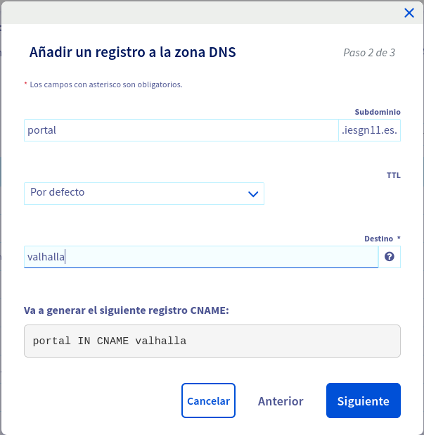
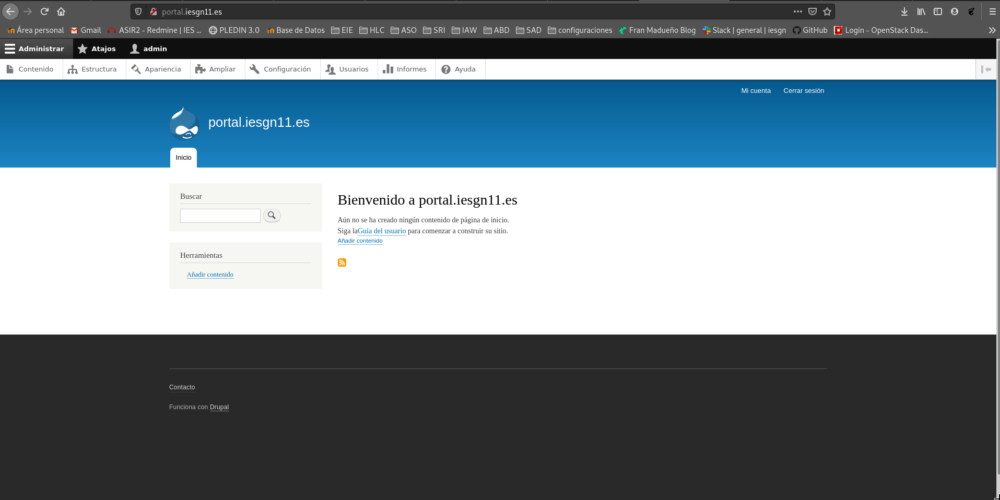
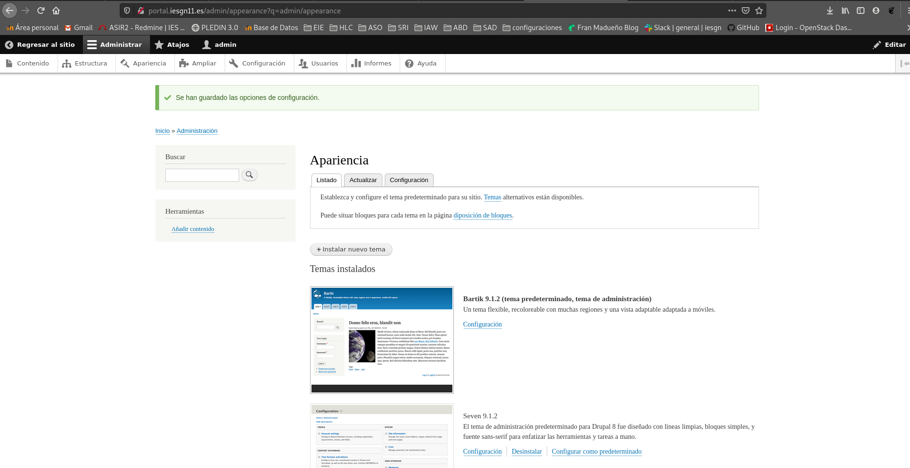
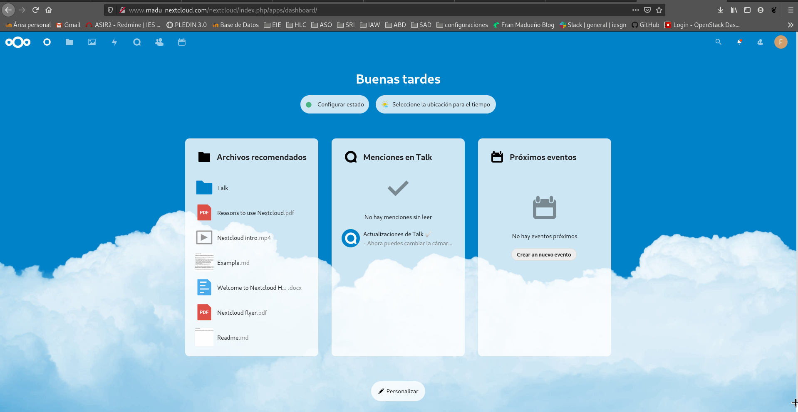
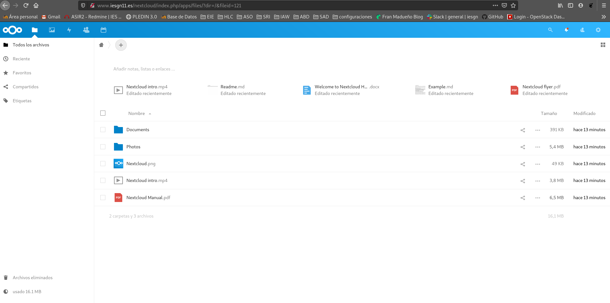

## Instalación/migración de aplicaciones web PHP
<hr>

Realizar la migración de la aplicación drupal que tienes instalada en el entorno de desarrollo a nuestro entorno de producción, para ello ten en cuenta lo siguiente:

1. La aplicación se tendrá que migrar a un nuevo virtualhost al que se accederá con el nombre portal.iesgnXX.es.



```shell
server {
        listen 80;
        listen [::]:80;
        
	root /var/www/portal;
        
	index index.php index.html;
        
	server_name portal.iesgn11.es;
        
	location / {
                try_files $uri $uri/ =404;
        }

	location ~ \.php$ {
                include snippets/fastcgi-php.conf;
                fastcgi_pass unix:/var/run/php/php7.3-fpm.sock;
        }
}
```

2. Vamos a nombrar el servicio de base de datos que tenemos en producción. Como es un servicio interno no la vamos a nombrar en la zona DNS, la vamos a nombrar usando resolución estática. El nombre del servicio de base de datos se debe llamar: bd.iesgnXX.es.
```shell
127.0.1.1       bd.iesgn11.es
```

3. Por lo tanto los recursos que deberás crear en la base de datos serán (respeta los nombres):

    Dirección de la base de datos: bd.iesgnXX.es
    Base de datos: bd_drupal
    Usuario: user_drupal
    Password: pass_drupal

Creación de la base de datos:
```shell
debian@valhalla:~$ sudo mysql -u root -p
Enter password: 
Welcome to the MariaDB monitor.  Commands end with ; or \g.
Your MariaDB connection id is 60
Server version: 10.3.25-MariaDB-0+deb10u1 Debian 10

Copyright (c) 2000, 2018, Oracle, MariaDB Corporation Ab and others.

Type 'help;' or '\h' for help. Type '\c' to clear the current input statement.

MariaDB [(none)]> CREATE DATABASE fran_drupal;
Query OK, 1 row affected (0.001 sec)

MariaDB [(none)]> CREATE USER fran_drupal@localhost IDENTIFIED BY '1234';
Query OK, 0 rows affected (0.000 sec)

MariaDB [(none)]> GRANT ALL PRIVILEGES ON fran_drupal.* to fran_drupal@localhost;
Query OK, 0 rows affected (0.001 sec)

MariaDB [(none)]> quit
Bye
```

Pasamos por scp nuestra bdd:
```shell
vagrant@drupalm:~/migraciondrupal$ scp frandb.sql debian@51.178.19.140:/home/debian/
The authenticity of host '51.178.19.140 (51.178.19.140)' can't be established.
ECDSA key fingerprint is SHA256:jD9z/tBIbJ7yPS7sE7cyOTNfHLaVP1SWnqjWa1FyK24.
Are you sure you want to continue connecting (yes/no)? ye
Please type 'yes' or 'no': yes
Warning: Permanently added '51.178.19.140' (ECDSA) to the list of known hosts.
debian@51.178.19.140's password: 
frandb.sql                                              100% 6938KB   1.6MB/s   00:04   
```

En  /etc/mysql/mariadb.conf.d/50-server.cnf
```shell
bind-address            = 127.0.1.1
```

Migramos la bdd:
```shell
debian@valhalla:~$ mysql -u fran_drupal -p fran_drupal < frandb.sql 
Enter password: 
```

4. Realiza la migración de la aplicación.

Lo primero que hacemos para que no se nos olvide es modificar el propietario.
```shell
debian@valhalla:~$ sudo chown -R www-data: /var/www/portal/
```

Pasamos por scp la carpeta que teniamos en nuestro servidor vagrant.
```shell
root@drupalm:/home/vagrant# sudo scp -r /var/www/drupal-9.1.2/ debian@51.178.19.140:/home/debian/
```

Modificamos el archivo /var/www/portal/drupal-9.1.2/sites/default/default.settings.php :
```shell
$databases['default']['default'] = array (
  'database' => 'fran_drupal',
  'username' => 'fran_drupal',
  'password' => '1234',
  'prefix' => '',
  'host' => '127.0.1.1',
  'port' => '3306',
  'namespace' => 'Drupal\\Core\\Database\\Driver\\mysql',
  'driver' => 'mysql',
);
```
Reiniciamos el servicio de nginx y comprobamos.
```shell
sudo /usr/sbin/nginx -s reload
```




5. Asegurate que las URL limpias de drupal siguen funcionando en nginx.

Las URLS no funcionaban, para ello deberemos añadir las siguientes lineas:
```shell
	location / {
                try_files $uri @rewrite;
        }

	location @rewrite {
                rewrite ^/(.*)$ /index.php?q=$1;
        }
```


Ahora si podemos acceder y utilizar drupal correctamente.

6. La aplicación debe estar disponible en la URL: portal.iesgnXX.es (Sin ningún directorio).

http://portal.iesgn11.es/

## Instalación / migración de la aplicación Nextcloud
<hr>

1. Instala la aplicación web Nextcloud en tu entorno de desarrollo.

Nos instalamos nextcloud.
```shell
vagrant@drupalm:~$ wget https://download.nextcloud.com/server/releases/nextcloud-19.0.3.tar.bz2
```

Creamos el directorio y le damos permisos.
```shell
vagrant@drupalm:/var/www$ sudo chown -R www-data: /var/www/nextcloud/
```

Movemos la carpeta al directorio que usaremos para la web en apache2.
```shell
vagrant@drupalm:/var/www$ sudo mv nextcloud /var/www/
```

Instalación de los paquetes requeridos.
```shell
vagrant@drupalm~$ sudo apt-get install -y php-bcmath php-curl php-gd php-gmp php-imagick php-intl php-mbstring php-xml php-zip php-mysql php-pgsql
```

Creamos el archivo de configuración de nextcloud en apache2 y lo copiaremos a sites-enabled con la función a2ensite.
```shell
vagrant@drupalm:/var/www$ cat /etc/apache2/sites-available/nextcloud.conf 
<VirtualHost *:80>

	ServerAdmin webmaster@localhost
	DocumentRoot /var/www/nextcloud

	ServerName www.madu-nextcloud.com

	ErrorLog ${APACHE_LOG_DIR}/error.log
	CustomLog ${APACHE_LOG_DIR}/access.log combined

	<Directory /var/www/nextcloud>
		AllowOverride all
		php_value memory_limit "512M"
	</Directory>
</VirtualHost>
```

```shell
vagrant@drupalm:/etc/apache2/sites-available$ sudo mysql -u root -p
Enter password: 
Welcome to the MariaDB monitor.  Commands end with ; or \g.
Your MariaDB connection id is 50
Server version: 10.3.27-MariaDB-0+deb10u1 Debian 10

Copyright (c) 2000, 2018, Oracle, MariaDB Corporation Ab and others.

Type 'help;' or '\h' for help. Type '\c' to clear the current input statement.

MariaDB [(none)]> create user 'fran@localhost' identified by 'fran';
Query OK, 0 rows affected (0.002 sec)

MariaDB [(none)]> create database nextcloud charset utf8mb4 collate utf8mb4_unicode_ci;
Query OK, 1 row affected (0.045 sec)

MariaDB [(none)]> grant all privileges on nextcloud.* to fran@localhost identified by 'fran';
Query OK, 0 rows affected (0.001 sec)

MariaDB [(none)]> flush privileges;
Query OK, 0 rows affected (0.002 sec)

MariaDB [(none)]> exit
Bye
```

Para poder utilizar nextcloud correctamente tuve que descargar adicionalmente un fichero de configuración:
```shell
vagrant@drupalm:/var/www/nextcloud$ sudo wget https://download.nextcloud.com/server/installer/setup-nextcloud.php
```
y comenzar su instalación en www.madu-nextcloud.com/setup-nextcloud.php una vez realizada la instalación completa podremos utilizar nextcloud en nuestro servidor.



2. Realiza la migración al servidor en producción, para que la aplicación sea accesible en la URL: www.iesgnXX.es/cloud

Copiaremos la carpeta de nuestro vagrant y la comprimiremos para pasarla al servidor de OVH.
```shell
vagrant@drupalm:~$ scp nextcloud.tar.gz debian@51.178.19.140:/home/debian/
debian@51.178.19.140's password: 
nextcloud.tar.gz                                                                                                             100%  606MB   2.9MB/s   03:29    
```

Migramos la BBDD.
```shell
vagrant@drupalm:~$ sudo mysqldump -u fran -p nextcloud > nextcloud.sql
```

Creamos una base de datos nueva a la que volcaremos los datos.
```shell
debian@valhalla:~$ sudo mysql -u root -p
Enter password: 
Welcome to the MariaDB monitor.  Commands end with ; or \g.
Your MariaDB connection id is 142
Server version: 10.3.27-MariaDB-0+deb10u1 Debian 10

Copyright (c) 2000, 2018, Oracle, MariaDB Corporation Ab and others.

Type 'help;' or '\h' for help. Type '\c' to clear the current input statement.

MariaDB [(none)]> create database nextcloud11;
Query OK, 1 row affected (0.001 sec)

MariaDB [(none)]> grant all privileges on nextcloud11.* to fran@localhost identified by 'fran';
Query OK, 0 rows affected (0.001 sec)

MariaDB [(none)]> create user 'fran@localhost' identified by 'fran';
Query OK, 0 rows affected (0.001 sec)

MariaDB [(none)]> exit
Bye
```
```shell
debian@valhalla:~$ sudo mysql -u fran -p nextcloud11 < nextcloud.sql 
Enter password: 
```


Modificamos el fichero de configuración de Nginx para el nuevo servicio:
```shell
server {
        listen 80;
        listen [::]:80;

        root /var/www/iesgn11;

        index index.html index.htm index.nginx-debian.html;

        server_name www.iesgn11.es;

        location / {
                return 301 /principal/index.html;
                try_files $uri $uri/ =404;
                location /principal {
                        autoindex on;
                }
        }
	location /nextcloud {
                error_page 403 = /nextloud/core/templates/403.php;
                error_page 404 = /nextcloud/core/templates/404.php;

                rewrite ^/nextcloud/caldav(.*)$ /remote.php/caldav$1 redirect;
                rewrite ^/nextcloud/carddav(.*)$ /remote.php/carddav$1 redirect;
                rewrite ^/nextcloud/webdav(.*)$ /remote.php/webdav$1 redirect;

                rewrite ^(/nextcloud/core/doc[^\/]+/)$ $1/index.html;

                try_files $uri $uri/ index.php;


        }
	location ~ \.php(?:$|/) {

                fastcgi_pass unix:/var/run/php/php7.3-fpm.sock;
                include snippets/fastcgi-php.conf;

        }
}
```

Accederemos a nextcloud y comenzaremos su instalación y nos dara un error, para que que funcione modifiquemos el archivo en /iesgn11/nextcloud/config/config.php
```shell
<?php
$CONFIG = array (
  'instanceid' => 'oc7xw3tt2a14',
  'passwordsalt' => '8Adw7vZ8RThbq0GWfu5vj116JTN9UZ',
  'secret' => 'nUg5WRccpEck7KO5su6eH/0nD/ZcC2zyKB/m4stTKRjrIRKS',
  'trusted_domains' => 
  array (
    0 => 'www.iesgn11.es',
  ),
  'datadirectory' => '/var/www/iesgn11/nextcloud/data',
  'dbtype' => 'mysql',
  'version' => '19.0.3.1',
  'overwrite.cli.url' => 'http://www.iesgn11.es/nextcloud',
  'dbname' => 'nextcloud11',
  'dbhost' => '127.0.1.1',
  'dbport' => '',
  'dbtableprefix' => 'oc_',
  'mysql.utf8mb4' => true,
  'dbuser' => 'fran',
  'dbpassword' => 'fran',
  'installed' => true,
  'theme' => '',
  'loglevel' => 0,
  'maintenance' => false,
);
```
En este archivo modificaremos las lineas:

* <span style="background-color:#ff5733; border-radius:1em; border-color: black;"> 'maintenance' => true, </span> ➜ <span style="background-color:#16ca5e; border-radius:1em; border-color: black;"> 'maintenance' => false,</span>
para que la pagina deje de estar en mantenimeinto.

* <span style="background-color:#ff5733; border-radius:1em; border-color: black;"> 'dbhost' => 'localhost',</span> ➜ <span style="background-color:#16ca5e; border-radius:1em; border-color: black;"> 'dbhost' => '127.0.1.1',</span>



3. Instala en un ordenador el cliente de nextcloud y realiza la configuración adecuada para acceder a "tu nube".

