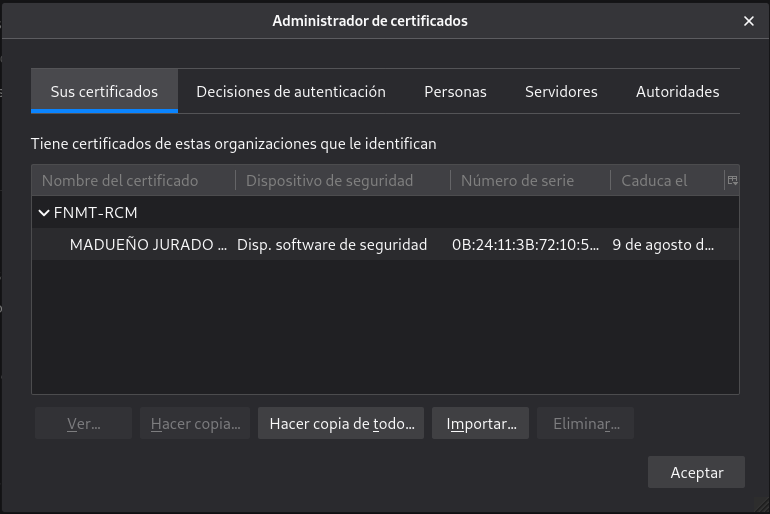
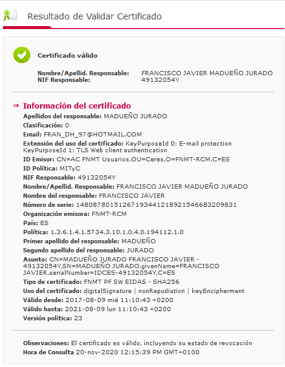
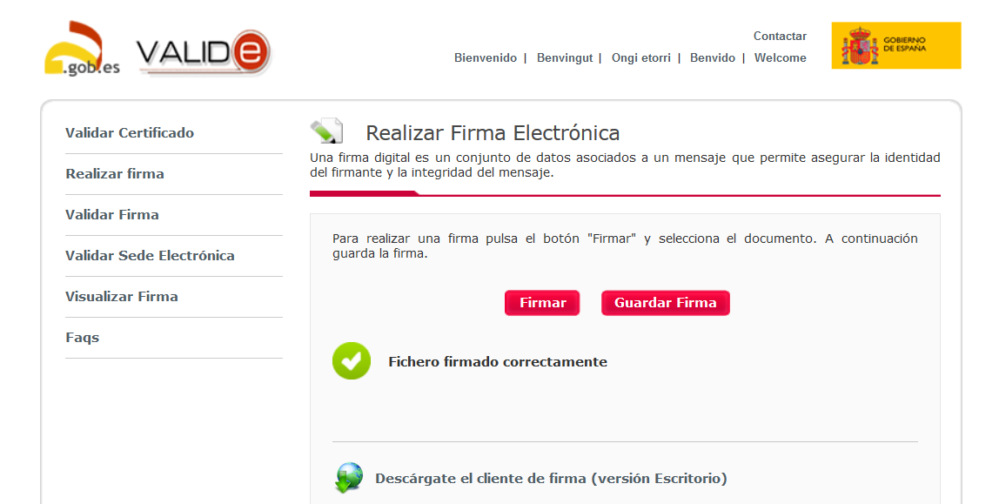
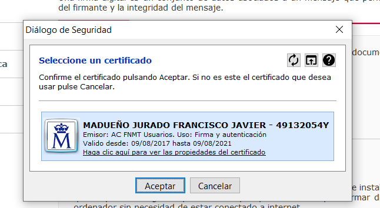
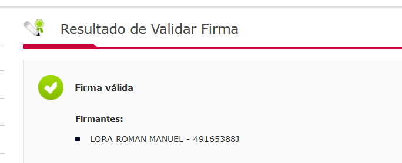
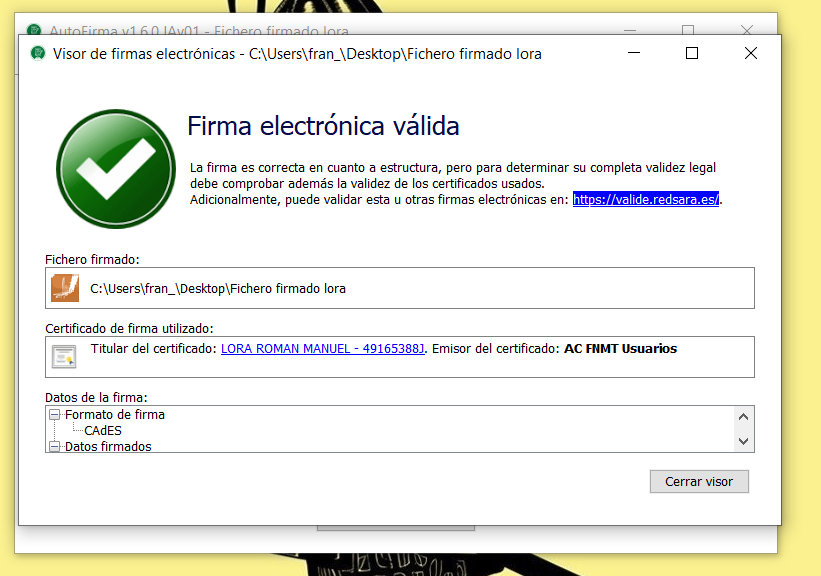
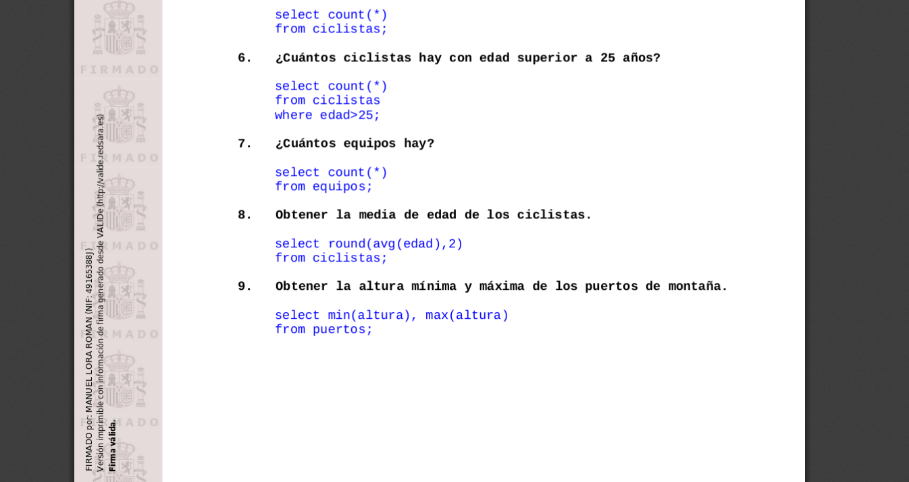
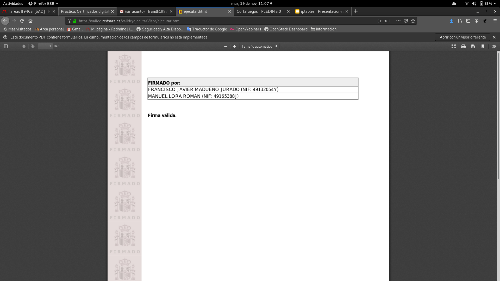
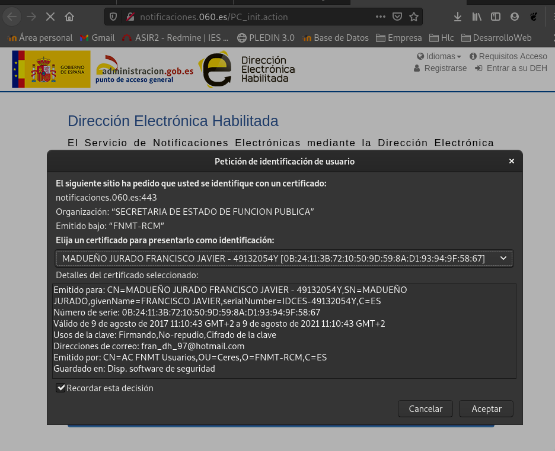

#### Certificado digital de persona física
<hr>  

## Tarea 1: Instalación del certificado

1. Una vez que hayas obtenido tu certificado, explica brevemente como se instala en tu navegador favorito.

Preferencias -> Privacidad&Seguridad -> Ver Certificados... -> Sus Certificados -> Importar

2. Muestra una captura de pantalla donde se vea las preferencias del navegador donde se ve instalado tu certificado.


3. ¿Cómo puedes hacer una copia de tu certificado?, ¿Como vas a realizar la copia de seguridad de tu certificado?. Razona la respuesta.

Tomando en cuenta la imagen anterior, como podemos comprobar si seleccionamos la firma podremos copiarla y añadirle una contraseña por seguridad para a la hora de añadirla en otro navegador o maquina.

4. Investiga como exportar la clave pública de tu certificado.

    * Paso 1. Inicia el proceso de exportación. Accede a Herramientas>Opciones de Internet. Una vez allí selecciona la pestaña "Contenido". En el apartado de certificados haz clic en el botón de "Certificados" y, una vez en la nueva ventana, pulsa la pestaña "Personal". Aparecerá una relación de los certificados instalados en el navegador. Si aparece más de uno, selecciona el que te interesa y haz clic en "Exportar". 

    * Paso 2. Elige si deseas exportar la clave privada o no. El asistente te preguntará si deseas exportar tu clave privada. Escoge con cuidado dependiendo del uso que vayas a dar al certificado exportado. Posteriormente, deja las opciones tal y como aparecen por defecto y pulsa "Siguiente". 

    * Paso 3. Protege tu certificado. El sistema te pedirá una contraseña. Es necesario introducirla y hacer clic en "Siguiente". Conviene memorizar adecuadamente esta contraseña ya que, en caso de pérdida, no se puede recuperar. Una vez establecida la contraseña, indica la ruta y el nombre del archivo que contendrá el certificado. 

    * Paso 4. Comprueba las características del certificado. La ventana que se abre a continuación especifica dichas características. Si todo es correcto, pulsa "Finalizar" y, posteriormente, "Aceptar". Aparecerá un cuadro para informarte de que el certificado ha sido exportado con éxito. 

## Tarea 2: Validación del certificado

1. Instala en tu ordenador el software autofirma y desde la página de VALIDe valida tu certificado. Muestra capturas de pantalla donde se comprueba la validación.

Enlace: https://ws024.juntadeandalucia.es/clienteafirma/autofirma/AutoFirma_v1_6_0_JAv01.deb



## Tarea 3: Firma electrónica

1. Utilizando la página VALIDe y el programa autofirma, firma un documento con tu certificado y envíalo por correo a un compañero.




2. Tu debes recibir otro documento firmado por un compañero y utilizando las herramientas anteriores debes visualizar la firma (Visualizar Firma) y (Verificar Firma). ¿Puedes verificar la firma aunque no tengas la clave pública de tu compañero?, ¿Es necesario estar conectado a internet para hacer la validación de la firma?. Razona tus respuestas.





3. Entre dos compañeros, firmar los dos un documento, verificar la firma para comprobar que está firmado por los dos.



## Tarea 4: Autentificación

1. Utilizando tu certificado accede a alguna página de la administración pública )cita médica, becas, puntos del carnet,…). Entrega capturas de pantalla donde se demuestre el acceso a ellas.



#### HTTPS / SSL
<hr>
<span style="background-color:red">Antes de hacer esta práctica vamos a crear una página web (puedes usar una página estática o instalar una aplicación web) en un servidor web apache2 que se acceda con el nombre tunombre.iesgn.org.</span>

## Tarea 1: Certificado autofirmado

* El alumno que hace de Autoridad Certificadora deberá entregar una documentación donde explique los siguientes puntos:

1. Crear su autoridad certificadora (generar el certificado digital de la CA). Mostrar el fichero de configuración de la AC.

Lo primero que deberemos hacer es crear un espacio de directorios para poder trabajar:
```shell
mkdir -m 0755 /CA
mkdir -m 0755 /CA/privado
mkdir -m 0755 /CA/certificados
mkdir -m 0755 /CA/nuevoscerts
mkdir -m 0755 /CA/crl
```

Copiaremos nuestro default de openssl:
```shell
cp /etc/ssl/openssl.cnf /CA
chmod 0600 /CA/openssl.cnf
```

Generaremos estos archivos para la base de datos de openssl:
```shell
nano /CA/index.txt
echo '01' > /CA/serial
```

Crearemos nuestro certificado autofimado:
```shell
root@madueno:/CA# openssl req -config openssl.cnf -new -x509 -extensions v3_ca -keyout privado/ca.key -out ./certificados/camadu.crt
Generating a RSA private key
.+++++
..............................
writing new private key to 'privado/ca.key'
Enter PEM pass phrase:
Verifying - Enter PEM pass phrase:
-----
You are about to be asked to enter information that will be incorporated
into your certificate request.
What you are about to enter is what is called a Distinguished Name or a DN.
There are quite a few fields but you can leave some blank
For some fields there will be a default value,
If you enter '.', the field will be left blank.
-----
Country Name (2 letter code) [AU]:ES
State or Province Name (full name) [Some-State]:Sevilla
Locality Name (eg, city) []:Dos Hermanas
Organization Name (eg, company) [Internet Widgits Pty Ltd]:Potato Company
Organizational Unit Name (eg, section) []:Potato Company
Common Name (e.g. server FQDN or YOUR name) []:CA                           
Email Address []:frandh1997@gmail.com

root@madueno:/CA# tree
.
├── certificados
│   └── camadu.crt
├── crl
├── index.txt
├── nuevoscerts
├── openssl.cnf
├── privado
│   └── ca.key
└── serial
```

El certificado será de lectura para todo el mundo y en la clave privada restringiremos su uso:
```shell
chmod 0400 /CA/privado/ca.key
```

Modificaremos el archivo de configuracion de openssl para crear unos directorios personalizados:
```shell
dir = /CA # Where everything is kept
certs = $dir/certificados # Where the issued certs are kept
crl_dir = $dir/crl # Where the issued crl are kept
database = $dir/index.txt # database index file.
new_certs_dir = $dir/nuevoscerts # default place for new certs.

certificate = $dir/certificados/ca.crt # The CA certificate
serial = $dir/serial # The current serial number
crl = $dir/crl.pem # The current CRL
private_key = $dir/privado/ca.key# The private key
RANDFILE = $dir/privado/.rand
x509_extensions = usr_cert # The extensions to add to the cert

name_opt = ca_default # Subject Name options
cert_opt = ca_default # Certificate field options

default_days = 365 # how long to certify for
default_crl_days= 30 # how long before next CRL
default_md = default # use public key default MD
preserve = no # keep passed DN ordering

policy = policy_match
```


2. Debe recibir el fichero CSR (Solicitud de Firmar un Certificado) de su compañero, debe firmarlo y enviar el certificado generado a su compañero.

```shell
root@madueno:/CA# openssl ca -cert /CA/certificados/camadu.crt -keyfile /CA/privado/ca.key -in ../home/fran/Descargas/
Using configuration from /CA/openssl.cnf
Enter pass phrase for /CA/privado/ca.key:
Check that the request matches the signature
Signature ok
Certificate Details:
        Serial Number: 1 (0x1)
        Validity
            Not Before: Nov 13 17:52:27 2019 GMT
            Not After : Nov 12 17:52:27 2020 GMT
        Subject:
            countryName               = ES
            stateOrProvinceName       = Sevilla
            organizationName          = Potato Company
            organizationalUnitName    = Potato Company
            commonName                = www.manuelloraroman.iesgn.org
            emailAddress              = manuelloraroman(arroba)gmail.
        X509v3 extensions:
            X509v3 Basic Constraints: 
                CA:FALSE
            Netscape Comment: 
                OpenSSL Generated Certificate
            X509v3 Subject Key Identifier: 
                5F:75:3D:B8:45:E4:C9:97:1F:3B:
            X509v3 Authority Key Identifier: 
                keyid:FE:E7:AA:87:09:A2:2C:AE:

Certificate is to be certified until Nov 12 17:52:27 2020 GMT (365 days)
Sign the certificate? [y/n]:y

1 out of 1 certificate requests certified, commit? [y/n]y
Write out database with 1 new entries
Data Base Updated
```

3. ¿Qué otra información debes aportar a tu compañero para que éste configure de forma adecuada su servidor web con el certificado generado?

Debemos aportar nuestro certificado de la identidad certificadora y el csr que certificamos de nuestro compañero.
```shell
server.crt
camadu.crt
```

* El alumno que hace de administrador del servidor web, debe entregar una documentación que describa los siguientes puntos:

1. Crea una clave privada RSA de 4096 bits para identificar el servidor.
```shell
root@madueno:~# ssh-keygen -b 4096
Generating public/private rsa key pair.
Enter file in which to save the key (/root/.ssh/id_rsa): /var/www/madueno.iesgn.org/claveapache_rsa
Enter passphrase (empty for no passphrase): 
Enter same passphrase again: 
Your identification has been saved in /var/www/madueno.iesgn.org/claveapache_rsa.
Your public key has been saved in /var/www/madueno.iesgn.org/claveapache_rsa.pub.
The key fingerprint is:
SHA256:VyOk3qd8tgQSWMad4GOg4HBD5xFSpRBSTto7afvf64M root@madueno.iesgn.org
The keys randomart image is:
+---[RSA 4096]----+
|oo@o=oo.+o..     |
| X B + *.oo      |
|. + + . * . o    |
|   o   o + o .   |
|  =     S + .    |
| . o     + +     |
|  .    .  o +    |
|   .  E..  + .   |
|    ....+o  .    |
+----[SHA256]-----+
root@madueno:~# exit
cerrar sesión
fran@madueno:/var/www/madueno.iesgn.org$ ls
claveapache_rsa  claveapache_rsa.pub  html
```

2. Utiliza la clave anterior para generar un CSR, considerando que deseas acceder al servidor con el FQDN (tunombre.iesgn.org).

Añadimos los nombres alternativos en openssl.conf:
```shell
[ req ]
default_bits            = 2048
default_keyfile         = privkey.pem
distinguished_name      = req_distinguished_name
attributes              = req_attributes
x509_extensions = v3_ca # The extensions to add to the self signed cert

#Linea añadidda para nombres alternativos
[alt_names]
DNS.1 = madueno
DNS.2 = patatacompany
```

Generamos nuestro certificado y la key:
```shell
root@madueno:/var/www/madueno.iesgn.org# openssl req -new -newkey rsa:4096 -nodes -keyout madueno.iesgn.org.key -out madueno.iesgn.org.csr
Generating a RSA private key
.................................................................................................................................................................................................................................................................................................++++
.................................................................................................................++++
writing new private key to 'madueno.iesgn.org.key'
-----
You are about to be asked to enter information that will be incorporated
into your certificate request.
What you are about to enter is what is called a Distinguished Name or a DN.
There are quite a few fields but you can leave some blank
For some fields there will be a default value,
If you enter '.', the field will be left blank.
-----
Country Name (2 letter code) [AU]:ES
State or Province Name (full name) [Some-State]:Sevilla
Locality Name (eg, city) []:Dos Hermanas
Organization Name (eg, company) [Internet Widgits Pty Ltd]:Patata Company
Organizational Unit Name (eg, section) []:Pat&co
Common Name (e.g. server FQDN or YOUR name) []:madueno.iesgn.org
Email Address []:frandh1997@gmail.com

Please enter the following 'extra' attributes
to be sent with your certificate request
A challenge password []:fran
An optional company name []:Patata Company SL
```

3. Envía la solicitud de firma a la entidad certificadora (su compañero).

Le enviamos nuestra entidad a nuestro compañero y el nos la firmara convirtiéndola en crt.
```shell
csrmadulora.crt
```

4. Recibe como respuesta un certificado X.509 para el servidor firmado y el certificado de la autoridad certificadora.

certificado X.509
```shell
csrmadulora.crt
```

Y el certificado de la autoridad.
```shell
ca.crt
```

5. Configura tu servidor web con https en el puerto 443, haciendo que las peticiones http se redireccionen a https (forzar https).

Una vez creado nuestro servidor deberemos de crear el archivo de configuración para el certificado ssl.
```shell
root@debian:/etc/apache2/sites-available# cat 000-default-ssl.conf 
<IfModule mod_ssl.c>
    <VirtualHost _default_:443>
        ServerName madueno.iesgn.org
        ServerAdmin webmaster@localhost

        DocumentRoot "/var/www/html" 
        DirectoryIndex index.html        

        ErrorLog ${APACHE_LOG_DIR}/error.log
        CustomLog ${APACHE_LOG_DIR}/access.log combined

        SSLEngine on

        SSLCertificateFile "/etc/apache2/ssl/csrmadulora.crt" 
        SSLCertificateKeyFile "/etc/apache2/ssl/server.key" 

    </VirtualHost>
</IfModule>
```

Modificaremos nuestro archivo por defecto y añadiremos la linea Redirect permanent / https://madueno.iesgn.org para forzar que la pagina se abra desde el puerto 443(https).
```shell
root@debian:/etc/apache2/sites-available# cat 000-default.conf 
<VirtualHost *:80>
    ServerName madueno.iesgn.org

    ServerAdmin webmaster@localhost
    DocumentRoot "/var/www/html" 
    DirectoryIndex index.html

    ErrorLog /var/log/apache2/error.log
    CustomLog /var/log/apache2/access.log combined

    Redirect permanent / https://madueno.iesgn.org

</VirtualHost>
```
Para añadir algunos subnombres de manera manual me voy al archivo hosts de /etc y lo modifique de la siguiente manera:
```shell
root@debian:/etc# cat hosts
127.0.0.1    madueno.iesgn.org
127.0.1.1    patatacompany.org
127.0.2.1    www.maduenopatata.com

# The following lines are desirable for IPv6 capable hosts
::1     localhost ip6-localhost ip6-loopback
ff02::1 ip6-allnodes
ff02::2 ip6-allrouters
```

De esta manera podremos acceder con diferentes subnombres que nos redireccionaran a madueno.iesgn,org

Añadiremos nuestro archivo ca.crt que genero nuestro compañero a nuestro navegador para ello accederemos a lo siguiente campos.
Preferencias -> Seguridad&Privacidad -> Ver Certificados -> Importar -> Importamos nuestro archivo "ca.crt"

6. Instala ahora un servidor nginx, y realiza la misma configuración que anteriormente para que se sirva la página con HTTPS.

    * Paso 1: Generar la clave privada (.key)
    ```shell
    vagrant@buster:~$ cd /etc/ssl/
    vagrant@buster:/etc/ssl$ sudo openssl genrsa -des3 -out tudominio.key 2048
    Generating RSA private key, 2048 bit long modulus (2 primes)
    ..................................................+++++
    ...................+++++
    e is 65537 (0x010001)
    Enter pass phrase for tudominio.key:
    Verifying - Enter pass phrase for tudominio.key:
    ```

    * Paso 2: Crear la solicitud de certificado (.csr)
    ```shell
    vagrant@buster:/etc/ssl$ sudo openssl req -new -newkey rsa:2048 -nodes -keyout tudominio.key -out tudominio.csr
    Generating a RSA private key
    ...............+++++
    ......................................+++++
    writing new private key to 'tudominio.key'
    -----
    You are about to be asked to enter information that will be incorporated
    into your certificate request.
    What you are about to enter is what is called a Distinguished Name or a DN.
    There are quite a few fields but you can leave some blank
    For some fields there will be a default value,
    If you enter '.', the field will be left blank.
    -----
    Country Name (2 letter code) [AU]:ES
    State or Province Name (full name) [Some-State]:Sevilla
    Locality Name (eg, city) []:Dos Hermanas
    Organization Name (eg, company) [Internet Widgits Pty Ltd]:IES Gonzalo Nazareno
    Organizational Unit Name (eg, section) []:
    Common Name (e.g. server FQDN or YOUR name) []:madu.iesgn.org
    Email Address []:frandh1997@gmail.com

    Please enter the following 'extra' attributes
    to be sent with your certificate request
    A challenge password []:
    An optional company name []:
    ```
    * Paso 3: Generar los certificados intermedios (.crt)

    Copia el contenido de todo el fichero CSR generado y pégalo/subelo a la autoridad certificadora. En mi caso lo hice con GoDaddy, ya que tenían los certificados a 5$. En este paso se generán dos certificados intermedios

    * Paso 4: Contatenar los certificados intermedios (.crt)
    ```shell
    cat certificado1.crt certificado2.crt >> tudominio.crt
    ```

    * Paso 5: Configurar Nginx
    ```shell
    server {
    listen 443;
    server_name tudominio.com;

    root /var/www/;
    index index.html index.htm;

    ssl on;
    ssl_certificate /etc/ssl/tudominio.crt;
    ssl_certificate_key /etc/ssl/tudominio.key;
    }
    ```
Si además queremos que todo nuestro trafico http sea redireccionado a https añadimos lo siguiente:

```shell
    server {
    listen 80;
    server_name tudominio.com www.tudominio.com;
    return 301 https://$host$request_uri;
    }
```