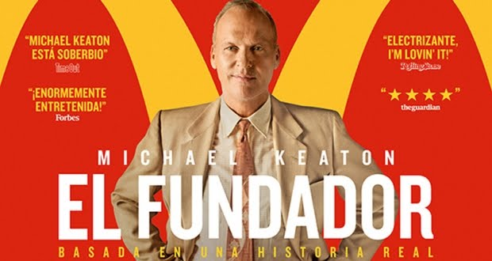

## Análisis

El Fundador, es una película basada en la franquicia de McDonald's no nos cuenta la historia de los creadores en si, sino de Ray Croc un emprendedor que no llegaba a tener exito hasta que se cruza con el restaurante de comida rapida de los hermanos Richard y Maurice McDonald al sur de California.

Este análisis no tratará de la pelicula en si, sino del modelo de emprendedor que propone, al mas estilo Americano (The American Dream), 