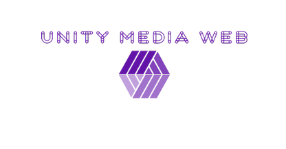

Siguiendo las directrices del Marketing Mix, hemos de reflexionar sobre los cuatro puntos que lo componen:

## 1. El producto, diseñándolo teniendo en cuenta sus dimensiones.

Mi empresa consta de varios productos a ofrecer siempre de manera digital el principal el desarrollo y diseño de paginas webs,
pero tambien consta de marketing digital en el engloba (Posicionamiento SEO, Publicidad Online, Social Media Marketing y Vender en Amazon)

**El producto:**

El paquete completo que ofrecemos es un lanzamiento global de tu empresa a nivel digital en el que engloba su posicionamiento en internet asi como su parte social al publico en el mundo digital y exportar su producto de manera internacional al alcance de cualquiera.

Así mismo tambien podemos desglosar y ofrece cualquier opcion del paquete de manera aislada.

Tambien atendemos al mantenimiento de dichas plataformas tanto las creadas por nosotros como otras que quieran migrar sus serivicios.

Crearemos una plataforma atractiva hacia nuevos clientes para negocios que quieran adentrarse en el mundo digital o hacer un lavado de cara al entorno que ya poseen.

Las diferencias de este producto con el resto es su gran capacidad de personalización practicamente podemos hacer posible la web de tus sueños nuestras plantillas son modelos iniciales que modificamos al gusto del cliente mientras que la competencias las usa por defecto y sin muchos cambios, nuestro posicionamiento es el mas optimos, ofrecer al cliente que su pagina esta la primera en el buscador sera nuestra premisa para acaparar todos los clientes posibles.

## 2. El precio, en este apartado estableceréis vuestra política de precios y muchos más aspectos a tener en cuenta. Recordad que no se recomienda la política de precios bajos.

Los precios son indicativos en función de los servicios requeridos,su amplitud(Local, Nacional o Internacional), el tipo de tienda que desee,etc...

Para ello, he creado varios paquetes en función de los intereses de las empresas:

| **Prestaciones** | **Pack Inicial** | **Pack Business** | **Plan Digital** |  
| -- | -- | -- | -- |
| Diseño Web  | Si | Si | No  |
| Desarrollo Web  | Si | Si | No  |
| Paguina Principal  | Si | Si | No  |
| Subpaginas  | 5  | 10  | No |
| Posicionamiento SEO  | Básico | Completo | No |
| Mantenimiento  | No | 6 Primeros Meses | 3 Primeros Meses |
| Publicidad Online  | No | Si | Si |
| Social Media Marketing  | No | Si | Si |
| Tienda Online  | No  | Si | No |
| Precio Estimado  | (300-500€) | (600-1500€) | (120-200€) |

Estos son precios estandares orientativos puesto que pueden variar según lo solicitado por el cliente.

A su vez poner una tienda digital inicial costara sobre 300€ con los primeros 50 elementos y 30€+ por cada lote de 50 elementos añadidos.

Las opciones sueltas deberán de acordarse con los clientes en una reunión en función de alcance o la maginitud de las mismas.

## 3. La promoción, cómo os vais a dar a conocer vuestro producto o servicio. 

El primer año en el que la empresa se forme todos los lotes estaran un 20% rebajados de su precio inicial con la función de atrer nuevos clientes y darnos a conocer.

Trabajaremos el marketing digital para que a toda persona interesada en el area de Sevilla le llegue un anuncio nuestro (ya sea instagram facebook o google), ofreciendo nuestros servicios.

Nos moveremos por los poligonos indrustriales que mas nos interesen así como comercios emergentes que veamos como clientes potenciales.

Tambien asistiremos a cualquier charla o feria relacionada con nuestro sector realizada por España según su magnitud.

Nos moveremos por nuestro entorno cercano ofreciendo nuestro servicios a comercios locales(Boca a Boca).

Otra manera de promoción son los concursos realizados sobre este sector nos merecerá la pena participar en todos los posibles y intentar obtener buenos resultados con los que poder reflejar nuestro trabajo. Ejemplo: https://sevillaworld.com/premios-web/

## 4. La distribución, cómo haréis llegar el producto a vuestros clientes.

Nuesta empresa es practicamente digital, el contacto fisico unico es con el cliente es una **reunión** que tambien se puede realizar de manera online si se desea o se es imposible el desplazamiento.

La entrega en algunos casos es inmediata o para un plazo previamente acordado.

El contacto constante con nuestro cliente nos asegura un trabajo grato y al gusto del mismo.

Nuestros canales de contacto son o mediante el apartado de contactos que tendra nuestra web, telefono o correo electronico.

Nos pueden encontrar donde se ubica nuestra empresa o realizar una reunion donde se proponga con el cliente(sitio previamente acordado).
También realizaremos un posicionamiento SEO optimo de nosotros mismo para que cuando alguien busque por internet aparezca nuestra empresa de las primeras.

**Añadida**  

Imagen de Empresa. (Marca – diseña el nombre y justifícalo con los principios básicos de la brandemia- , colores que os representan, es decir diseñad vuestra imagen corporativa, etc.)

**Color:**   
**Morado**, no es un color fácil ya que para muchas marcas tiene connotaciones negativas. Pero, por esto mismo, por el hecho de no ser un color habitual, es una apuesta original y valiente. Un diseño simple y atractivo en el que refleja la indentidad de una empresa dividida en varias areas, que son las areas sociales o mas visibles al cliente que trabajamos en nuestra empresa(social media, posicionamiento, tienda, diseño...).

**Nombre:**  
En cuanto al nombre de la empresa es un poco los conceptos que tratamos en la misma, la union mediatica y social a traves de la web que da visibilidad y personalidad a tu empresa.

La tipologia elegida en el logo refuerza mas el caracter de union(Unity) que posee nuestra empresa.