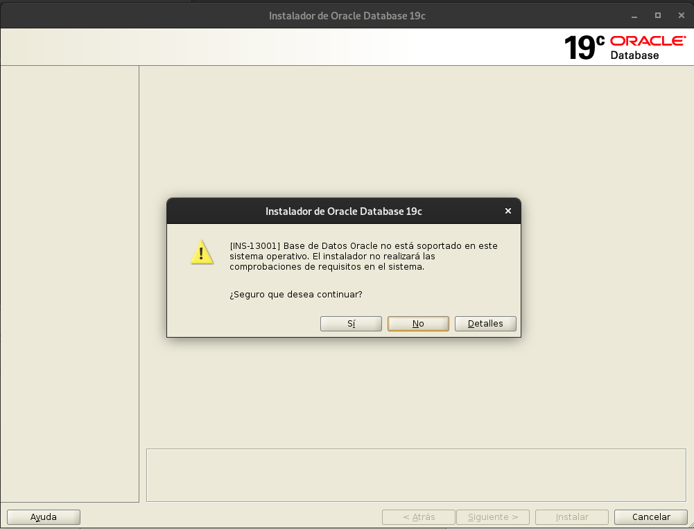
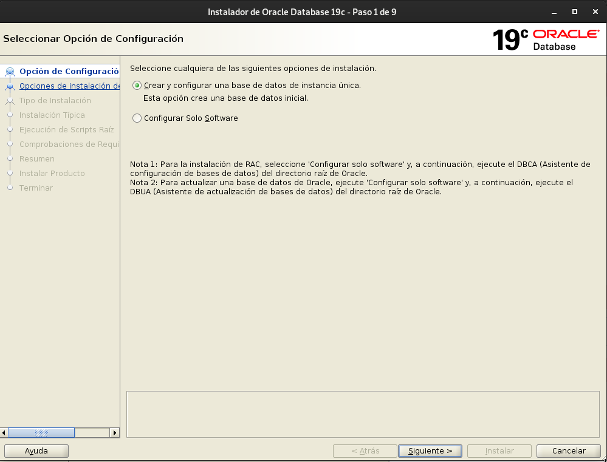
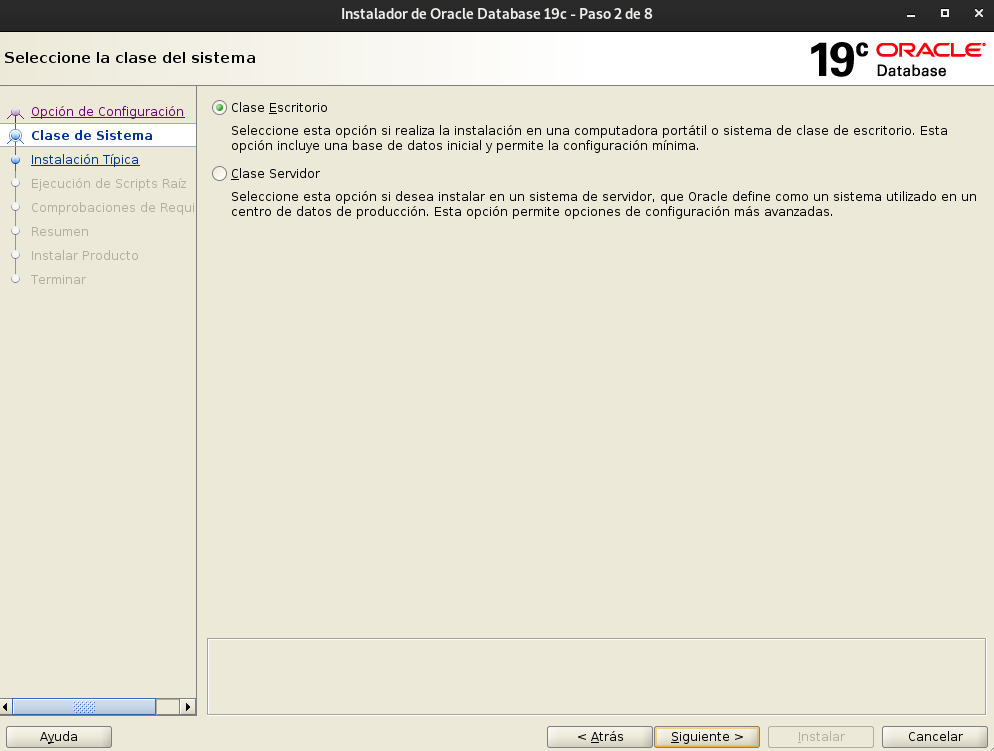
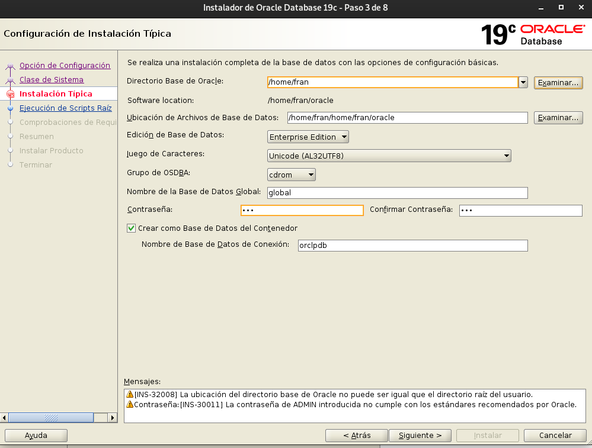
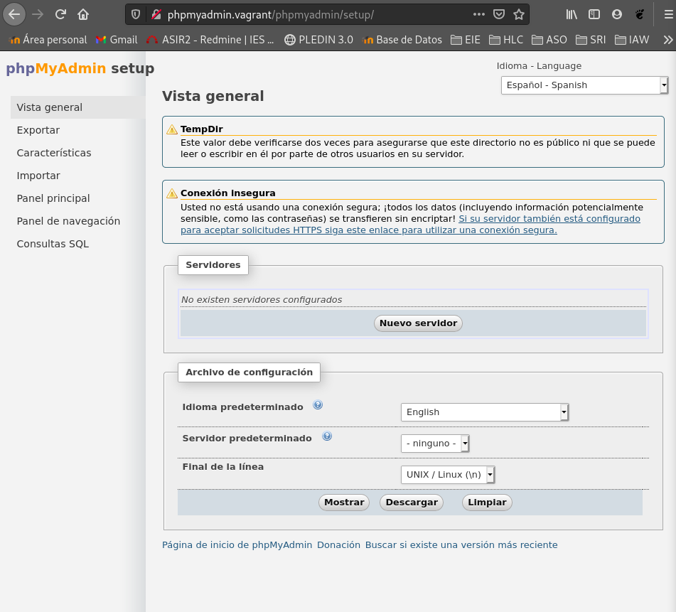
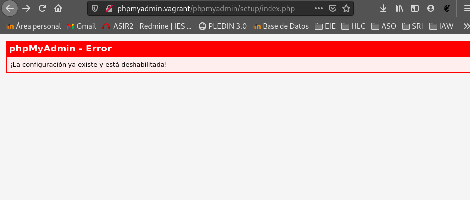
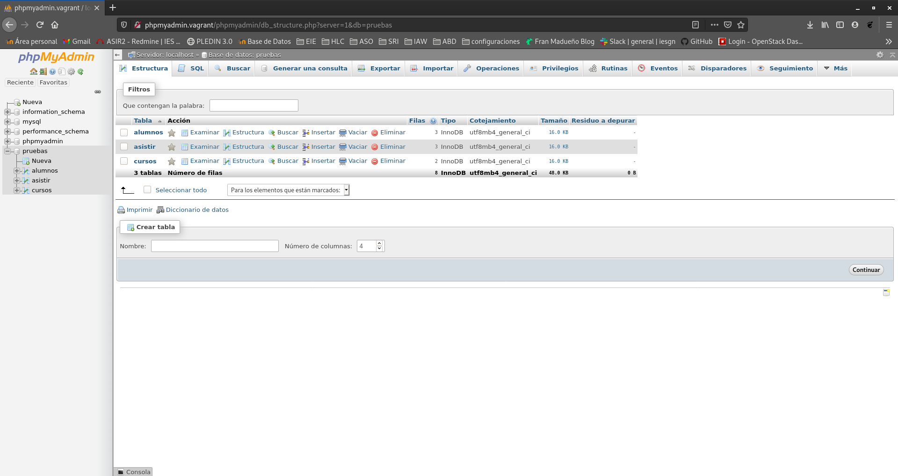

## ABD PRÁCTICA 2.
### Instalación de Servidores y Clientes.
#### Tipo D

Con esta práctica aprenderéis la instalación y configuración de distintos servidores y clientes de bases de datos.
Tras la instalación de cada servidor,  debe crearse una base de datos con al menos tres tablas o colecciones y poblarse de datos adecuadamente. Debe crearse un usuario y dotarlo de los privilegios necesarios para acceder remotamente a los datos.
Los clientes deben estar siempre en máquinas diferentes de los respectivos servidores a los que acceden.
Se documentará todo el proceso de configuración de los servidores.
Se aportarán pruebas del funcionamiento remoto de cada uno de los clientes.
Se aportará el código de las aplicaciones realizadas y prueba de funcionamiento de las mismas.

El trabajo constará de las siguientes partes:

* Leer bien el enunciado y comprobar que se entiende lo que se pide.

* ## Instalación de un servidor de ORACLE 19c sobre Linux

Nos descargamos la version zip de la web oficial de Oracle → https://www.oracle.com/es/database/technologies/oracle19c-linux-downloads.html#license-lightbox

Lo descomprimimos dentro de un directorio:
```shell
fran@debian:~$ unzip ../Descargas/LINUX.X64_193000_db_home.zip /oracle
```
Ejecutamos sun instalador:
```shell
fran@debian:~$ . runInstaller
```





* ## Instalación de un servidor MongoDB y configuración para permitir el acceso remoto desde la red local.

### Requisitos:
<hr>
Instalamos herramientas:
```shell
sudo apt install -y gnupg
```

Como los paquetes del repositorio que vamos a añadir están firmados, tenemos que importar la clave pública del certificado con que se firman:
```shell
fran@debian:~/Descargas$ sudo wget https://www.mongodb.org/static/pgp/server-4.4.asc -qO- | sudo apt-key add -
OK
```

Ahora debemos añadir un nuevo repositorio a la configuración de apt:
```shell
fran@debian:~$ sudo nano /etc/apt/sources.list.d/mongodb-org.list

deb http://repo.mongodb.org/apt/debian buster/mongodb-org/4.4 main
```

### Comenzamos la instalación
<hr>
```shell
fran@debian:~$ sudo apt update
Obj:1 http://deb.debian.org/debian buster InRelease
Obj:2 http://deb.debian.org/debian buster-updates InRelease                              
Obj:3 http://security.debian.org/debian-security buster/updates InRelease                
Obj:4 http://dl.google.com/linux/chrome/deb stable InRelease                             
Des:5 http://packages.microsoft.com/repos/vscode stable InRelease [3.959 B]              
Obj:6 https://download.virtualbox.org/virtualbox/debian buster InRelease                 
Ign:7 http://repo.mongodb.org/apt/debian buster/mongodb-org/4.4 InRelease          
Des:8 http://repo.mongodb.org/apt/debian buster/mongodb-org/4.4 Release [1.488 B]
Des:9 http://repo.mongodb.org/apt/debian buster/mongodb-org/4.4 Release.gpg [801 B]
Des:10 http://packages.microsoft.com/repos/vscode stable/main amd64 Packages [216 kB]
Des:11 http://repo.mongodb.org/apt/debian buster/mongodb-org/4.4/main amd64 Packages [7.912 B]
Descargados 230 kB en 1s (228 kB/s)                     
Leyendo lista de paquetes... Hecho
Creando árbol de dependencias       
Leyendo la información de estado... Hecho
Todos los paquetes están actualizados.
```

El paquete que necesitamos instalar es mongodb-org, así que usaremos el comando apt para hacerlo:
```shell
fran@debian:~$ sudo apt install -y mongodb-org
```

Como el nuevo servicio de MongoDB no queda en ejecución ni habilitado, lo arrancaremos de forma manual la primera vez, y lo habilitaremos para que inicie automáticamente en cada arranque de Debian 10:
```shell
fran@debian:~$ sudo systemctl enable --now mongod
Created symlink /etc/systemd/system/multi-user.target.wants/mongod.service → /lib/systemd/system/mongod.service.
```

Comprobamos:
```shell
fran@debian:~$ systemctl status mongod
● mongod.service - MongoDB Database Server
   Loaded: loaded (/lib/systemd/system/mongod.service; enabled; vendor preset: enabled)
   Active: active (running) since Thu 2020-12-10 19:31:00 CET; 13s ago
     Docs: https://docs.mongodb.org/manual
 Main PID: 11344 (mongod)
   Memory: 62.0M
   CGroup: /system.slice/mongod.service
           └─11344 /usr/bin/mongod --config /etc/mongod.conf
```

### Permitir acceso remoto:
<hr>

1. Conectar a la BD.
```shell
$ mongo --port 27017
```

2. Crear usuario administrador.
```shell
> use admin
switched to db admin
> db.createUser(
...   {
...     user: "admin",
...     pwd: "123",
...     roles: [ { role: "root", db: "admin" } ]
...   })
Successfully added user: {
	"user" : "admin",
	"roles" : [
		{
			"role" : "root",
			"db" : "admin"
		}
	]
}
```

3. Habilitar la autenticación y abrir el acceso a MongoDB a todas las IPs.
```shell
fran@debian:~$ sudo nano /etc/mongod.conf
# network interfaces
net:
  port: 27017
#  bindIp: 127.0.0.1  <- comentamos esta linea

#Añadimos en security la siguiente linea.(descomentamos securitys)
security:
 authorization: 'enabled'
```

4. Reiniciamos MongoDB.
```shell
fran@debian:~$ sudo service mongod restart
```

5. Conéctate a la BD de manera local con tu cuenta de admin.
```shell
mongo --port 27017 -u "admin" -p "123" --authenticationDatabase "admin"
```

6. Abrir puertos en el servidor para el acceso remoto.
```shell
fran@debian:~$ sudo iptables -A INPUT -p tcp --dport 27017 -j ACCEPT
```

7. Prueba de conexión remota
```shell
fran@debian:~/vagrant/compilacion$ mongo -u admin -p 123 10.0.2.15
MongoDB shell version v4.4.2
connecting to: mongodb://10.0.2.15:27017/test?compressors=disabled&gssapiServiceName=mongodb
Implicit session: session { "id" : UUID("979d89ec-26cc-4701-912e-6c749f906ccd") }
MongoDB server version: 4.4.2
> 
```


* ## Prueba desde un cliente remoto del intérprete de comandos de MySQL.


* ## Realización de una aplicación web en cualquier lenguaje que conecte con el servidor ORACLE tras autenticarse y muestre alguna información almacenada en el mismo.


* ## Instalación de una herramienta de administración web para MySQL y prueba desde un cliente remoto.

La herramienta que utilizare para la administración web de mysql sera PhpMyAdmin comenzaremos con los pasos para su instalación.

#### Requisitos:

Instalar módulos de PHP:
```shell
fran@debian:~$ sudo apt-get install php
fran@debian:~$ sudo apt -y install php-bz2 php-mbstring php-zip
fran@debian:~$ install libapache2-mod-php
fran@debian:~$ sudo systemctl reload apache2
```

Nos vamos a la pagina principal de PhpMyAdmin y nos descargaremos la ultima versión, descomprimimos y movemos la carpeta a donde la vamos a utilizar:
```shell
fran@debian:~/Descargas$ sudo mv phpMyAdmin-4.9.7-all-languages/ /var/www/html/phpmyadmin
```

Concederemos la propiedad de este directorio al usuario con que corre el servidor web, para que pueda escribir en él:
```shell
fran@debian:~$ sudo chown www-data /var/www/html/phpmyadmin/
```

Por ultimo nos instalaremos mysql en nuestra terminal:
```shell
fran@debian:/var/www/phpmyadmin$ sudo apt-get install default-mysql-server
```

### Preparación de la base de datos de PhpMyAdmin.

```shell
fran@debian:/var/www/phpmyadmin$ sudo mysql -u root -p
> create user fran@localhost identified by 'fran';
> grant all privileges on phpmyadmin.* to fran@localhost;
> GRANT ALL PRIVILEGES ON * . * TO 'fran'@'localhost';
> FLUSH PRIVILEGES;
> exit
```

Para inicializar la base de datos necesaria utilizaremos desde consola un archivo SQL previsto al efecto:
```shell
fran@debian:/var/www/phpmyadmin$ cat /var/www/html/phpmyadmin/sql/create_tables.sql | mysql -u fran -p
Enter password: 
```

### Configurar phpMyAdmin en Debian 10 Buster.

Crearemos una pagina desde apache donde le daremos la función:

```shell
fran@debian:/etc/apache2/sites-available$ sudo a2ensite pypmyadmin.conf 
Enabling site pypmyadmin.
To activate the new configuration, you need to run:
  systemctl reload apache2
fran@debian:/etc/apache2/sites-available$ sudo systemctl reload apache2
fran@debian:/etc/apache2/sites-available$ 
```

Deberemos añadir la ip a nuestro archivo /etc/hosts de nuestra maquina local.

Como podemos comprobar estamos usando el cliente de phpmyadmin de mi maquina vagrant desde mi maquina local.


**Usar configuración por defecto**

Para ello copia el archivo de configuración mínima de muestra presente en la carpeta de phpMyAdmin:
```shell
vagrant@servidorBDD:~$ sudo cp /var/www/html/phpmyadmin/config.sample.inc.php /var/www/html/phpmyadmin/config.inc.php
```

Editaremos este archivo para establecer un par de ajustes necesarios:

Se trata de una clave para cifrar las cookies de sesión. Especificaremos como valor una cadena de 32 caracteres aleatorios:
```shell
...
$cfg['blowfish_secret'] = 'qweqweqweqweqweqweqweqweqweqweqwe';
...
```

Y activaremos las líneas del usuario y la contraseña, especificando la contraseña:
```shell
$cfg['Servers'][$i]['controluser'] = 'fran';
$cfg['Servers'][$i]['controlpass'] = 'fran';
```

También activaremos todas las variables de la sección «Storage and tables«:
```shell
...
/* Storage database and tables */
$cfg['Servers'][$i]['pmadb'] = 'phpmyadmin';
$cfg['Servers'][$i]['bookmarktable'] = 'pma__bookmark';
...
$cfg['Servers'][$i]['designer_settings'] = 'pma__designer_settings';
$cfg['Servers'][$i]['export_templates'] = 'pma__export_templates';
...
```
Guardamos los cambios y cerramos el archivo.

Al existir ya un archivo de configuración, el configurador queda bloqueado:

Justo lo que pretendíamos, bloqueamos el configurador, pero phpMyAdmin funciona perfectamente con los valores por defecto.

Con esto mejoraremos la seguridad de nuestra base de datos.


**Inserción de datos**
* Debe crearse una base de datos con al menos tres tablas o colecciones y poblarse de datos adecuadamente.:


