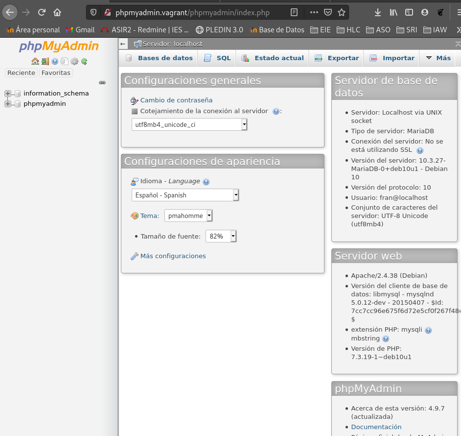

## ABD PRÁCTICA 2.
### Instalación de Servidores y Clientes.
#### Tipo D

Con esta práctica aprenderéis la instalación y configuración de distintos servidores y clientes de bases de datos.
Tras la instalación de cada servidor,  debe crearse una base de datos con al menos tres tablas o colecciones y poblarse de datos adecuadamente. Debe crearse un usuario y dotarlo de los privilegios necesarios para acceder remotamente a los datos.
Los clientes deben estar siempre en máquinas diferentes de los respectivos servidores a los que acceden.
Se documentará todo el proceso de configuración de los servidores.
Se aportarán pruebas del funcionamiento remoto de cada uno de los clientes.
Se aportará el código de las aplicaciones realizadas y prueba de funcionamiento de las mismas.

El trabajo constará de las siguientes partes:

* Leer bien el enunciado y comprobar que se entiende lo que se pide.

* ## Instalación de un servidor de ORACLE 19c sobre Linux

Lo instalaremos en Centos8.

Para comenzar nos lo descargaremos de la web oficial de Oracle → https://www.oracle.com/es/database/technologies/oracle19c-linux-downloads.html#license-lightbox

Instalación del paquete.
```shell
dnf install https://yum.oracle.com/repo/OracleLinux/OL8/baseos/latest/x86_64/getPackage/oracle-database-preinstall-19c-1.0-1.el8.x86_64.rpm
```

Instalación del fichero rpm.
```shell
rpm -Uhv oracle-database-ee-19c-1.0-1.x86_64.rpm
```

```shell
cat /etc/sysconfig/oracledb_ORCLCDB-19c.conf
```

Creación de base de datos de ejemplo.
```shell
/etc/init.d/oracledb_ORCLCDB-19c configure
```

Usuario Oracle.
```shell
su - oracle
vi ~/.bash_profile

if [ -f ~/.bashrc ]; then
        . ~/.bashrc
fi

umask 022
export ORACLE_SID=ORCLCDB
export ORACLE_BASE=/opt/oracle/oradata
export ORACLE_HOME=/opt/oracle/product/19c/dbhome_1
export PATH=$PATH:$ORACLE_HOME/bin
```

```shell
source ~/.bash_profile
```

```shell
sqlplus / as sysdba 
 
SQL*Plus: Release 19.0.0.0.0 - Production on Tue Dec 21 09:11:12 2020
Version 19.3.0.0.0
 
Copyright (c) 1982, 2019, Oracle.  All rights reserved.
 
Connected to an idle instance.
 
SQL>
```

Usuario
```shell
SQL> CREATE USER c##fran IDENTIFIED BY fran;
SQL> GRANT ALL PRIVILEGES TO c##fran;
```

```shell
SQL> DISCONNECT
Desconectado de Oracle Database 19c Enterprise Edition Release 19.0.0.0.0 - Production
Version 19.3.0.0.0
#
SQL> CONNECT c##fran/fran
Conectado.
```

```shell
SQL> SELECT * FROM cat;

TABLE_NAME
--------------------------------------------------------------------------------

TABLE_TYPE
-----------

HOTELES
TABLE

EMPLEADOS
TABLE

HABITACIONES
TABLE
```

* ## Instalación de un servidor MongoDB y configuración para permitir el acceso remoto desde la red local.

### Requisitos:
<hr>
Instalamos herramientas:
```shell
sudo apt install -y gnupg
```

Como los paquetes del repositorio que vamos a añadir están firmados, tenemos que importar la clave pública del certificado con que se firman:
```shell
fran@debian:~/Descargas$ sudo wget https://www.mongodb.org/static/pgp/server-4.4.asc -qO- | sudo apt-key add -
OK
```

Ahora debemos añadir un nuevo repositorio a la configuración de apt:
```shell
fran@debian:~$ sudo nano /etc/apt/sources.list.d/mongodb-org.list

deb http://repo.mongodb.org/apt/debian buster/mongodb-org/4.4 main
```

### Comenzamos la instalación
<hr>
```shell
fran@debian:~$ sudo apt update
Obj:1 http://deb.debian.org/debian buster InRelease
Obj:2 http://deb.debian.org/debian buster-updates InRelease                              
Obj:3 http://security.debian.org/debian-security buster/updates InRelease                
Obj:4 http://dl.google.com/linux/chrome/deb stable InRelease                             
Des:5 http://packages.microsoft.com/repos/vscode stable InRelease [3.959 B]              
Obj:6 https://download.virtualbox.org/virtualbox/debian buster InRelease                 
Ign:7 http://repo.mongodb.org/apt/debian buster/mongodb-org/4.4 InRelease          
Des:8 http://repo.mongodb.org/apt/debian buster/mongodb-org/4.4 Release [1.488 B]
Des:9 http://repo.mongodb.org/apt/debian buster/mongodb-org/4.4 Release.gpg [801 B]
Des:10 http://packages.microsoft.com/repos/vscode stable/main amd64 Packages [216 kB]
Des:11 http://repo.mongodb.org/apt/debian buster/mongodb-org/4.4/main amd64 Packages [7.912 B]
Descargados 230 kB en 1s (228 kB/s)                     
Leyendo lista de paquetes... Hecho
Creando árbol de dependencias       
Leyendo la información de estado... Hecho
Todos los paquetes están actualizados.
```

El paquete que necesitamos instalar es mongodb-org, así que usaremos el comando apt para hacerlo:
```shell
fran@debian:~$ sudo apt install -y mongodb-org
```

Como el nuevo servicio de MongoDB no queda en ejecución ni habilitado, lo arrancaremos de forma manual la primera vez, y lo habilitaremos para que inicie automáticamente en cada arranque de Debian 10:
```shell
fran@debian:~$ sudo systemctl enable --now mongod
Created symlink /etc/systemd/system/multi-user.target.wants/mongod.service → /lib/systemd/system/mongod.service.
```

Comprobamos:
```shell
fran@debian:~$ systemctl status mongod
● mongod.service - MongoDB Database Server
   Loaded: loaded (/lib/systemd/system/mongod.service; enabled; vendor preset: enabled)
   Active: active (running) since Thu 2020-12-10 19:31:00 CET; 13s ago
     Docs: https://docs.mongodb.org/manual
 Main PID: 11344 (mongod)
   Memory: 62.0M
   CGroup: /system.slice/mongod.service
           └─11344 /usr/bin/mongod --config /etc/mongod.conf
```

### Permitir acceso remoto:
<hr>

1. Conectar a la BD.
```shell
$ mongo --port 27017
```

2. Crear usuario administrador.
```shell
> use admin
switched to db admin
> db.createUser(
...   {
...     user: "admin",
...     pwd: "123",
...     roles: [ { role: "root", db: "admin" } ]
...   })
Successfully added user: {
	"user" : "admin",
	"roles" : [
		{
			"role" : "root",
			"db" : "admin"
		}
	]
}
```

3. Habilitar la autenticación y abrir el acceso a MongoDB a todas las IPs.
```shell
fran@debian:~$ sudo nano /etc/mongod.conf
# network interfaces
net:
  port: 27017
  bindIp: 0.0.0.0

#Añadimos en security la siguiente linea.(descomentamos securitys)
security:
 authorization: 'enabled'
```

4. Reiniciamos MongoDB.
```shell
fran@debian:~$ sudo service mongod restart
```

5. Conéctate a la BD de manera local con tu cuenta de admin.
```shell
mongo --port 27017 -u "admin" -p "123" --authenticationDatabase "admin"
```

6. Abrir puertos en el servidor para el acceso remoto.
```shell
fran@debian:~$ sudo iptables -A INPUT -p tcp --dport 27017 -j ACCEPT
```

7. Prueba de conexión remota
```shell
#Creamos un usuario para la prueba
> db.createUser(
...   {
...     user: "superAdmin",
...     pwd: "pass1234",
...     roles: [ { role: "root", db: "admin" } ]
...   })
Successfully added user: {
	"user" : "superAdmin",
	"roles" : [
		{
			"role" : "root",
			"db" : "admin"
		}
	]
}
```

Probamos la conexión desde mi maquina local hacia el servidor.
```shell
fran@debian:~/vagrant/Basesdedatos$ mongo -u superAdmin -p pass1234 192.168.2.24
MongoDB shell version v4.4.2
connecting to: mongodb://192.168.2.24:27017/test?compressors=disabled&gssapiServiceName=mongodb
Implicit session: session { "id" : UUID("23aa24a8-5c21-4d24-be8f-dc16c1c629b8") }
MongoDB server version: 4.4.2
---
The server generated these startup warnings when booting: 
        2020-12-16T13:28:48.110+00:00: Using the XFS filesystem is strongly recommended with the WiredTiger storage engine. See http://dochub.mongodb.org/core/prodnotes-filesystem
        2020-12-16T13:28:48.822+00:00: /sys/kernel/mm/transparent_hugepage/enabled is 'always'. We suggest setting it to 'never'
---
---
        Enable MongoDB's free cloud-based monitoring service, which will then receive and display
        metrics about your deployment (disk utilization, CPU, operation statistics, etc).

        The monitoring data will be available on a MongoDB website with a unique URL accessible to you
        and anyone you share the URL with. MongoDB may use this information to make product
        improvements and to suggest MongoDB products and deployment options to you.

        To enable free monitoring, run the following command: db.enableFreeMonitoring()
        To permanently disable this reminder, run the following command: db.disableFreeMonitoring()
---
> 
```

**Inserción de datos**

```shell
> use apple
switched to db apple
> db.products.insertMany([
... { "name" : "MacBook" },
... { "name" : "MacBook Air" },
... { "name" : "MacBook Pro" },
... { "name" : "iPhone X" },
... { "name" : "iPhone 8" },
... { "name" : "iPhone 7" },
... { "name" : "iPhone 6s" },
... { "name" : "iPhone SE" }
... ])
{
	"acknowledged" : true,
	"insertedIds" : [
		ObjectId("5fda0f65c78f616fad2b6aec"),
		ObjectId("5fda0f65c78f616fad2b6aed"),
		ObjectId("5fda0f65c78f616fad2b6aee"),
		ObjectId("5fda0f65c78f616fad2b6aef"),
		ObjectId("5fda0f65c78f616fad2b6af0"),
		ObjectId("5fda0f65c78f616fad2b6af1"),
		ObjectId("5fda0f65c78f616fad2b6af2"),
		ObjectId("5fda0f65c78f616fad2b6af3")
	]
}
> db.products.find()
{ "_id" : ObjectId("5fda0f5cc78f616fad2b6ae4"), "name" : "MacBook" }
{ "_id" : ObjectId("5fda0f5cc78f616fad2b6ae5"), "name" : "MacBook Air" }
{ "_id" : ObjectId("5fda0f5cc78f616fad2b6ae6"), "name" : "MacBook Pro" }
{ "_id" : ObjectId("5fda0f5cc78f616fad2b6ae7"), "name" : "iPhone X" }
{ "_id" : ObjectId("5fda0f5cc78f616fad2b6ae8"), "name" : "iPhone 8" }
{ "_id" : ObjectId("5fda0f5cc78f616fad2b6ae9"), "name" : "iPhone 7" }
{ "_id" : ObjectId("5fda0f5cc78f616fad2b6aea"), "name" : "iPhone 6s" }
{ "_id" : ObjectId("5fda0f5cc78f616fad2b6aeb"), "name" : "iPhone SE" }
{ "_id" : ObjectId("5fda0f65c78f616fad2b6aec"), "name" : "MacBook" }
{ "_id" : ObjectId("5fda0f65c78f616fad2b6aed"), "name" : "MacBook Air" }
{ "_id" : ObjectId("5fda0f65c78f616fad2b6aee"), "name" : "MacBook Pro" }
{ "_id" : ObjectId("5fda0f65c78f616fad2b6aef"), "name" : "iPhone X" }
{ "_id" : ObjectId("5fda0f65c78f616fad2b6af0"), "name" : "iPhone 8" }
{ "_id" : ObjectId("5fda0f65c78f616fad2b6af1"), "name" : "iPhone 7" }
{ "_id" : ObjectId("5fda0f65c78f616fad2b6af2"), "name" : "iPhone 6s" }
{ "_id" : ObjectId("5fda0f65c78f616fad2b6af3"), "name" : "iPhone SE" }
> 
```

```shell
> db.brands.insertMany([
... ... { "name" : "Samsung" , "sede" : "Japon" },
... ... { "name" : "Apple" , "sede" : "China"},
... ... { "name" : "Xiaomi" , "sede" : "China" },
... ... { "name" : "Nokia" , "sede" : "Chino"},
... ... { "name" : "Motorola" , "sede" : "Alemania"}
... ... ])
{
	"acknowledged" : true,
	"insertedIds" : [
		ObjectId("5fda27a3c78f616fad2b6af9"),
		ObjectId("5fda27a3c78f616fad2b6afa"),
		ObjectId("5fda27a3c78f616fad2b6afb"),
		ObjectId("5fda27a3c78f616fad2b6afc"),
		ObjectId("5fda27a3c78f616fad2b6afd")
	]
}
```

```shell
> db.shops.insertMany([
... ... ... { "name" : "Paco Moviles" , "location" : "la paz 9" , "Pais" : "Portugal" , "CodPostal" : "41222" },
... ... ... { "name" : "Phones House" , "location" : "avenida san blas 12" , "Pais" : "España" , "CodPostal" : "24776" },
... ... ... { "name" : "PepePhone" , "location" : "lima 18" , "Pais" : "España" , "CodPostal" : "21468" },
... ... ... { "name" : "MariaMoviles" , "location" : "Alamo 34" , "Pais" : "España" , "CodPostal" : "24575" },
... ... ... { "name" : "Apple Shop" , "location" : "Roma 37" , "Pais" : "España" , "CodPostal" : "24877" }
... ... ... ])
{
	"acknowledged" : true,
	"insertedIds" : [
		ObjectId("5fda28d0534029f735a6940a"),
		ObjectId("5fda28d0534029f735a6940b"),
		ObjectId("5fda28d0534029f735a6940c"),
		ObjectId("5fda28d0534029f735a6940d"),
		ObjectId("5fda28d0534029f735a6940e")
	]
}
```

```shell
> show collections
brands
products
shops
```


* ## Prueba desde un cliente remoto del intérprete de comandos de MySQL.

**En el servidor.**

Instalamos nuestro server de mariadb.
```shell
vagrant@servidorBDD:~$ sudo apt-get install mariadb-server
Reading package lists... Done
Building dependency tree       
Reading state information... Done
The following NEW packages will be installed:
  mariadb-server
0 upgraded, 1 newly installed, 0 to remove and 0 not upgraded.
Need to get 31.2 kB of archives.
After this operation, 67.6 kB of additional disk space will be used.
Get:1 http://deb.debian.org/debian buster/main amd64 mariadb-server all 1:10.3.27-0+deb10u1 [31.2 kB]
Fetched 31.2 kB in 0s (207 kB/s)    
Selecting previously unselected package mariadb-server.
(Reading database ... 84471 files and directories currently installed.)
Preparing to unpack .../mariadb-server_1%3a10.3.27-0+deb10u1_all.deb ...
Unpacking mariadb-server (1:10.3.27-0+deb10u1) ...
Setting up mariadb-server (1:10.3.27-0+deb10u1) ...
```

En /etc/mysql/mariadb.conf.d/50-server.cnf
```shell
vagrant@servidorBDD:~$ sudo nano /etc/mysql/mariadb.conf.d/50-server.cnf 
#modificamos la linea bind-address
bind-address            = 0.0.0.0
```

Creamos el usuario que usaremos remotamente.
```shell
sudo mysql -u root
CREATE USER 'franremote'@'%' IDENTIFIED BY 'fran';
GRANT ALL PRIVILEGES ON *.* TO 'franremote'@'%';
FLUSH PRIVILEGES;
exit
```

**Desde el cliente**

Conectamos a nuestro server.
```shell
fran@debian:~/vagrant/Basesdedatos$ sudo mysql -h 192.168.100.78 -u franremote -p
Enter password: 
Welcome to the MariaDB monitor.  Commands end with ; or \g.
Your MariaDB connection id is 36
Server version: 10.3.27-MariaDB-0+deb10u1 Debian 10

Copyright (c) 2000, 2018, Oracle, MariaDB Corporation Ab and others.

Type 'help;' or '\h' for help. Type '\c' to clear the current input statement.

MariaDB [(none)]> 
```
Como podemos comprobar ya podemos acceder via local a nuestra base datos alojada en el servidor.

**Inserción de datos.**

```shell
fran@debian:~/vagrant/Basesdedatos$ sudo mysql -h 192.168.100.78 -u franremote -p
Enter password: 
Welcome to the MariaDB monitor.  Commands end with ; or \g.
Your MariaDB connection id is 36
Server version: 10.3.27-MariaDB-0+deb10u1 Debian 10

Copyright (c) 2000, 2018, Oracle, MariaDB Corporation Ab and others.

Type 'help;' or '\h' for help. Type '\c' to clear the current input statement.

MariaDB [(none)]> create database pruebasmariadb;
Query OK, 1 row affected (0.001 sec)

MariaDB [(none)]> use pruebasmariadb;
Database changed
MariaDB [pruebasmariadb]> CREATE TABLE `director` (
    ->   `id` int(11) NOT NULL,
    ->   `nombre` varchar(45) COLLATE utf8_spanish_ci NOT NULL,
    ->   `apellidos` varchar(45) COLLATE utf8_spanish_ci NOT NULL
    -> ) ENGINE=InnoDB DEFAULT CHARSET=utf8 COLLATE=utf8_spanish_ci;
Query OK, 0 rows affected (0.032 sec)

MariaDB [pruebasmariadb]> INSERT INTO `director` (`id`, `nombre`, `apellidos`) VALUES
    -> (1, 'Francis', 'Ford Coppola'),
    -> (2, 'Steven', 'Spielberg'),
    -> (3, 'Frank', 'Darabont'),
    -> (4, 'Lee', 'Unkrich'),
    -> (5, 'Christopher', 'Nolan'),
    -> (6, 'Eric', 'Toledano'),
    -> (7, 'Roger', 'Allers'),
    -> (8, 'Roberto', 'Benigni'),
    -> (9, 'Michael', 'Gracey'),
    -> (10, 'George', 'Lucas'),
    -> (11, 'Jonathan', 'Demme');
Query OK, 11 rows affected (0.008 sec)
Records: 11  Duplicates: 0  Warnings: 0

MariaDB [pruebasmariadb]> CREATE TABLE `peliculas` (
    ->   `id` int(10) UNSIGNED NOT NULL,
    ->   `nombre` varchar(100) COLLATE utf8_spanish_ci NOT NULL,
    ->   `CalifEdad` int(2) DEFAULT NULL,
    ->   `Estreno` date NOT NULL,
    ->   `idSala` int(10) UNSIGNED NOT NULL,
    ->   `idDirector` int(10) NOT NULL
    -> ) ENGINE=InnoDB DEFAULT CHARSET=utf8 COLLATE=utf8_spanish_ci;
Query OK, 0 rows affected (0.013 sec)

MariaDB [pruebasmariadb]> INSERT INTO `peliculas` (`id`, `nombre`, `CalifEdad`, `Estreno`, `idSala`, `idDirector`) VALUES
    -> (1, 'El padrino', 16, '1972-10-20', 1, 1),
    -> (2, 'La lista de Schindler', 18, '1994-03-04', 2, 2),
    -> (3, 'Cadena Perpetua', 13, '1995-02-24', 1, 3),
    -> (4, 'Coco', NULL, '2017-12-01', 6, 4),
    -> (5, 'El caballero oscuro', 7, '2008-08-13', 3, 5),
    -> (6, 'Intocable', NULL, '2012-03-09', 5, 6),
    -> (7, 'El rey León', NULL, '2011-12-21', 2, 7),
    -> (8, 'La vida es bella', 18, '1999-02-26', 5, 6),
    -> (9, 'El gran Showman', NULL, '2017-12-29', 1, 9),
    -> (10, 'El silencio de los corderos', 18, '1991-09-06', 2, 11);
Query OK, 10 rows affected (0.009 sec)
Records: 10  Duplicates: 0  Warnings: 0

MariaDB [pruebasmariadb]> CREATE TABLE `sala` (
    ->   `id` int(10) UNSIGNED NOT NULL,
    ->   `Capacidad` int(11) NOT NULL
    -> ) ENGINE=InnoDB DEFAULT CHARSET=utf8 COLLATE=utf8_spanish_ci;
Query OK, 0 rows affected (0.023 sec)

MariaDB [pruebasmariadb]> INSERT INTO `sala` (`id`, `Capacidad`) VALUES
    -> (1, 100),
    -> (2, 50),
    -> (3, 80),
    -> (4, 78),
    -> (5, 120),
    -> (6, 200);
Query OK, 6 rows affected (0.005 sec)
Records: 6  Duplicates: 0  Warnings: 0
```

```shell
MariaDB [pruebasmariadb]> select * from director;
+----+-------------+--------------+
| id | nombre      | apellidos    |
+----+-------------+--------------+
|  1 | Francis     | Ford Coppola |
|  2 | Steven      | Spielberg    |
|  3 | Frank       | Darabont     |
|  4 | Lee         | Unkrich      |
|  5 | Christopher | Nolan        |
|  6 | Eric        | Toledano     |
|  7 | Roger       | Allers       |
|  8 | Roberto     | Benigni      |
|  9 | Michael     | Gracey       |
| 10 | George      | Lucas        |
| 11 | Jonathan    | Demme        |
+----+-------------+--------------+
11 rows in set (0.001 sec)

MariaDB [pruebasmariadb]> select * from peliculas;
+----+-----------------------------+-----------+------------+--------+------------+
| id | nombre                      | CalifEdad | Estreno    | idSala | idDirector |
+----+-----------------------------+-----------+------------+--------+------------+
|  1 | El padrino                  |        16 | 1972-10-20 |      1 |          1 |
|  2 | La lista de Schindler       |        18 | 1994-03-04 |      2 |          2 |
|  3 | Cadena Perpetua             |        13 | 1995-02-24 |      1 |          3 |
|  4 | Coco                        |      NULL | 2017-12-01 |      6 |          4 |
|  5 | El caballero oscuro         |         7 | 2008-08-13 |      3 |          5 |
|  6 | Intocable                   |      NULL | 2012-03-09 |      5 |          6 |
|  7 | El rey León                 |      NULL | 2011-12-21 |      2 |          7 |
|  8 | La vida es bella            |        18 | 1999-02-26 |      5 |          6 |
|  9 | El gran Showman             |      NULL | 2017-12-29 |      1 |          9 |
| 10 | El silencio de los corderos |        18 | 1991-09-06 |      2 |         11 |
+----+-----------------------------+-----------+------------+--------+------------+
10 rows in set (0.001 sec)

MariaDB [pruebasmariadb]> select * from sala;
+----+-----------+
| id | Capacidad |
+----+-----------+
|  1 |       100 |
|  2 |        50 |
|  3 |        80 |
|  4 |        78 |
|  5 |       120 |
|  6 |       200 |
+----+-----------+
6 rows in set (0.001 sec)
```


* ## Realización de una aplicación web en cualquier lenguaje que conecte con el servidor ORACLE tras autenticarse y muestre alguna información almacenada en el mismo.


* ## Instalación de una herramienta de administración web para MySQL y prueba desde un cliente remoto.

La herramienta que utilizare para la administración web de mysql sera PhpMyAdmin comenzaremos con los pasos para su instalación.

#### Requisitos:

Instalar módulos de PHP:
```shell
fran@debian:~$ sudo apt-get install php
fran@debian:~$ sudo apt -y install php-bz2 php-mbstring php-zip
fran@debian:~$ install libapache2-mod-php
fran@debian:~$ sudo systemctl reload apache2
```

Nos vamos a la pagina principal de PhpMyAdmin y nos descargaremos la ultima versión, descomprimimos y movemos la carpeta a donde la vamos a utilizar:
```shell
fran@debian:~/Descargas$ sudo mv phpMyAdmin-4.9.7-all-languages/ /var/www/html/phpmyadmin
```

Concederemos la propiedad de este directorio al usuario con que corre el servidor web, para que pueda escribir en él:
```shell
fran@debian:~$ sudo chown www-data /var/www/html/phpmyadmin/
```

Por ultimo nos instalaremos mysql en nuestra terminal:
```shell
fran@debian:/var/www/phpmyadmin$ sudo apt-get install default-mysql-server
```

### Preparación de la base de datos de PhpMyAdmin.

```shell
fran@debian:/var/www/phpmyadmin$ sudo mysql -u root -p
> create user fran@localhost identified by 'fran';
> grant all privileges on phpmyadmin.* to fran@localhost;
> GRANT ALL PRIVILEGES ON * . * TO 'fran'@'localhost';
> FLUSH PRIVILEGES;
> exit
```

Para inicializar la base de datos necesaria utilizaremos desde consola un archivo SQL previsto al efecto:
```shell
fran@debian:/var/www/phpmyadmin$ cat /var/www/html/phpmyadmin/sql/create_tables.sql | mysql -u fran -p
Enter password: 
```

### Configurar phpMyAdmin en Debian 10 Buster.

Crearemos una pagina desde apache donde le daremos la función:

```shell
fran@debian:/etc/apache2/sites-available$ sudo a2ensite pypmyadmin.conf 
Enabling site pypmyadmin.
To activate the new configuration, you need to run:
  systemctl reload apache2
fran@debian:/etc/apache2/sites-available$ sudo systemctl reload apache2
fran@debian:/etc/apache2/sites-available$ 
```

Deberemos añadir la ip a nuestro archivo /etc/hosts de nuestra maquina local.

Como podemos comprobar estamos usando el cliente de phpmyadmin de mi maquina vagrant desde mi maquina local.


**Usar configuración por defecto**

Para ello copia el archivo de configuración mínima de muestra presente en la carpeta de phpMyAdmin:
```shell
vagrant@servidorBDD:~$ sudo cp /var/www/html/phpmyadmin/config.sample.inc.php /var/www/html/phpmyadmin/config.inc.php
```

Editaremos este archivo para establecer un par de ajustes necesarios:

Se trata de una clave para cifrar las cookies de sesión. Especificaremos como valor una cadena de 32 caracteres aleatorios:
```shell
...
$cfg['blowfish_secret'] = 'qweqweqweqweqweqweqweqweqweqweqwe';
...
```

Y activaremos las líneas del usuario y la contraseña, especificando la contraseña:
```shell
$cfg['Servers'][$i]['controluser'] = 'fran';
$cfg['Servers'][$i]['controlpass'] = 'fran';
```

También activaremos todas las variables de la sección «Storage and tables«:
```shell
...
/* Storage database and tables */
$cfg['Servers'][$i]['pmadb'] = 'phpmyadmin';
$cfg['Servers'][$i]['bookmarktable'] = 'pma__bookmark';
...
$cfg['Servers'][$i]['designer_settings'] = 'pma__designer_settings';
$cfg['Servers'][$i]['export_templates'] = 'pma__export_templates';
...
```
Guardamos los cambios y cerramos el archivo.

Al existir ya un archivo de configuración, el configurador queda bloqueado:

Justo lo que pretendíamos, bloqueamos el configurador, pero phpMyAdmin funciona perfectamente con los valores por defecto.

Con esto mejoraremos la seguridad de nuestra base de datos.


**Inserción de datos**
* Debe crearse una base de datos con al menos tres tablas o colecciones y poblarse de datos adecuadamente.:


