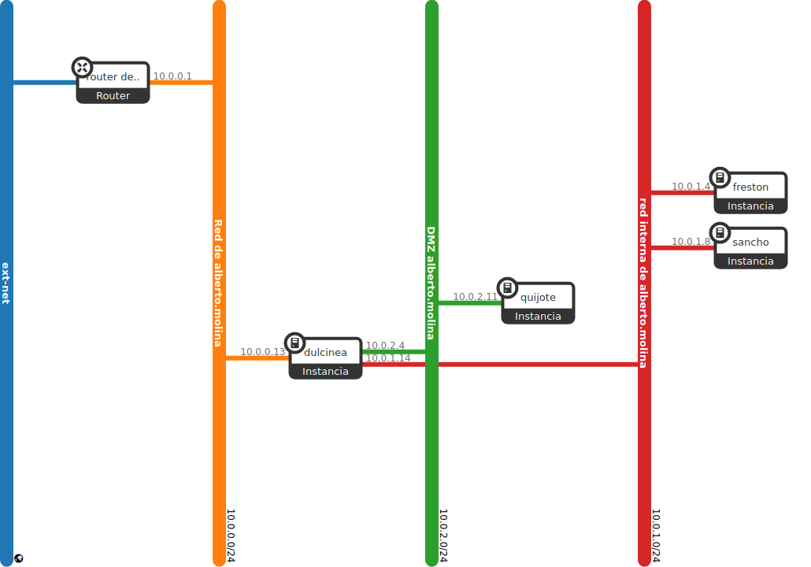
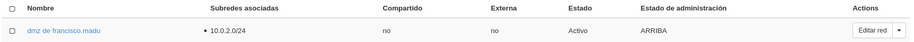
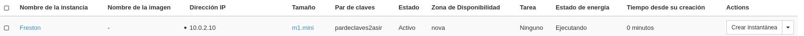

Vamos a modificar el escenario que tenemos actualmente en OpenStack para que se adecúe a la realización de todas las prácticas en todos los módulos de 2º, en particular para que tenga una estructura más real a la de varios equipos detrás de un cortafuegos, separando los servidores en dos redes: red interna y DMZ. Para ello vamos a reutilizar todo lo hecho hasta ahora y añadiremos una máquina más: Frestón



* Creación de la red DMZ:
      * Nombre: DMZ de <nombre de usuario>
      * 10.0.2.0/24


* Creación de las instancias:
      * freston:
          - Debian Buster sobre volumen de 10GB con sabor m1.mini
          - Conectada a la red interna
          - Accesible indirectamente a través de dulcinea
          - IP estática


Desde el cliente de openstack deshabilitamos la seguridad.
```shell
fran@debian:~$  source ~/.virtualenvs/openstackclient/bin/activate
(openstackclient) fran@debian:~/Documentos$ source Proyecto\ de\ francisco.madu-openrc.sh 
Please enter your OpenStack Password for project Proyecto de francisco.madu as user francisco.madu: 
(openstackclient) fran@debian:~/Documentos$ openstack server remove security group Freston default
(openstackclient) fran@debian:~/Documentos$ openstack port list
+--------------------------------------+----------------------------------------+-------------------+--------------------------------------------------------------------------+--------+
| ID                                   | Name                                   | MAC Address       | Fixed IP Addresses                                                       | Status |
+--------------------------------------+----------------------------------------+-------------------+--------------------------------------------------------------------------+--------+
| 00f11b41-5147-43b4-96b4-b4afbc541eaf |                                        | fa:16:3e:79:4a:4f | ip_address='10.0.2.10', subnet_id='be50df48-1769-4b53-9886-7f5352bc086f' | ACTIVE |
| 280e513f-5016-44b5-a66e-fb6960e4f8fa |                                        | fa:16:3e:23:87:b2 | ip_address='10.0.1.7', subnet_id='b0fb0d9b-c8da-4790-888c-e190e588d551'  | ACTIVE |
| 3148cbad-a46e-41ea-829e-5cfcd1f00f78 |                                        | fa:16:3e:01:01:01 | ip_address='10.0.1.10', subnet_id='b0fb0d9b-c8da-4790-888c-e190e588d551' | ACTIVE |
| 3d001afd-f6d2-4348-abb0-70b8babaf005 |                                        | fa:16:3e:8a:5c:d5 | ip_address='10.0.0.8', subnet_id='46cd68e1-2e88-4ba6-9970-431f6f53c13f'  | ACTIVE |
| 4e921875-0585-4258-b7e9-d8c63e23c5c4 |                                        | fa:16:3e:fc:a2:8c | ip_address='10.0.1.8', subnet_id='b0fb0d9b-c8da-4790-888c-e190e588d551'  | ACTIVE |
| 53665f0f-e35a-44d9-896a-313861310021 |                                        | fa:16:3e:18:49:cd | ip_address='10.0.0.1', subnet_id='46cd68e1-2e88-4ba6-9970-431f6f53c13f'  | ACTIVE |
| 5f4ef06d-17cf-49e3-b30e-54bcd8a04465 |                                        | fa:16:3e:36:da:86 | ip_address='10.0.0.2', subnet_id='46cd68e1-2e88-4ba6-9970-431f6f53c13f'  | ACTIVE |
| b4099ac2-bcb7-401f-997c-e826f949e117 | escenario1-r1_network_ext-wajhseltwj2t | fa:16:3e:71:9a:c3 | ip_address='10.0.0.12', subnet_id='46cd68e1-2e88-4ba6-9970-431f6f53c13f' | ACTIVE |
| f3fcc1b8-40fa-45b8-86f3-f98793d75800 |                                        | fa:16:3e:68:b4:c0 | ip_address='10.0.0.3', subnet_id='46cd68e1-2e88-4ba6-9970-431f6f53c13f'  | ACTIVE |
+--------------------------------------+----------------------------------------+-------------------+--------------------------------------------------------------------------+--------+
(openstackclient) fran@debian:~/Documentos$ openstack port set --disable-port-security 00f11b41-5147-43b4-96b4-b4afbc541eaf
```


* Modificación de la ubicación de quijote
    * Pasa de la red interna a la DMZ y su direccionamiento tiene que modificarse apropiadamente.


Añadiremos la nueva interfaz a Dulcinea por OpenStacks y seguido modificamos el fichero de Dulcinea /etc/network/interfaces:
```shell
debian@dulcinea:~$ sudo nano /etc/network/interfaces

allow-hotplug eth2
iface eth2 inet static
 address 10.0.2.7
 netmask 255.255.255.0
 broadcast 10.0.2.255
 gateway 10.0.2.1

debian@dulcinea:~$ sudo systemctl restart networking
```


Añadimos nueva reglas a nuestro cortafuegos en este caso usaré ntfs y ademas la añadire al fichero /etc/ntfstables.conf para que de esta manera nos podamos olvidar de estar añadiendolas cada vez que reiniciemos.
```shell
#Descargar el paquete de ntftable
sudo apt install nftables
#Habilitar ntftables
debian@francisco-madu:~$ sudo systemctl enable  nftables.service
Created symlink /etc/systemd/system/sysinit.target.wants/nftables.service → /lib/systemd/system/nftables.service.
#Añadir la nueva regla
nft add rule inet nat postrouting oifname "eth2" ip saddr 10.0.2.0/24 counter masquerade 
#Añadir la regla del ejercicios pasado
nft add rule inet nat postrouting oifname "eth1" ip saddr 10.0.1.0/24 counter masquerade 
#Mostrar las reglas
debian@francisco-madu:~$ sudo nft list ruleset
table ip nat {
	chain PREROUTING {
		type nat hook prerouting priority -100; policy accept;
	}

	chain INPUT {
		type nat hook input priority 100; policy accept;
	}

	chain POSTROUTING {
		type nat hook postrouting priority 100; policy accept;
		oifname "eth0" ip saddr 10.0.1.0/24 counter packets 12 bytes 902 masquerade 
		oifname "eth2" ip saddr 10.0.2.0/24 counter packets 0 bytes 0 masquerade 
		oifname "eth1" ip saddr 10.0.1.0/24 counter packets 2034 bytes 143017 masquerade 
	}

	chain OUTPUT {
		type nat hook output priority -100; policy accept;
	}
}

#Guardarlo en /etc/ntfstables.conf
```

Le añadimos claves para el usuario debian y root.
```shell
debian@freston:~$ sudo passwd debian
New password: 
Retype new password: 
passwd: password updated successfully
debian@freston:~$ sudo passwd root
New password: 
Retype new password: 
passwd: password updated successfully
```
Una vez configurado esto, la quitamos de la red, y la metemos en la red anteriormente creada.

Configuramos la ip estatica en freston:
```shell
# The normal eth0
allow-hotplug eth0
iface eth0 inet dhcp
 address 10.0.1.14
 netmask 255.255.255.0
 broadcast 10.0.1.255
 gateway 10.0.1.8
 ```

 Reiniciamos el servicio networking y comprobamos la conectividad a las máquinas:

