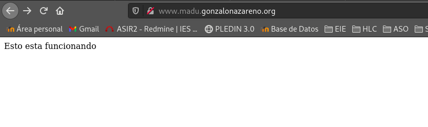

https://dit.gonzalonazareno.org/redmine/projects/asir2/wiki/Servidores_Web_y_DNS

## Servidor DNS

El primer paso será instalar bind9 en nuestro servidro
```shell
root@freston:~# apt-get install bind9
```

Modificaremos /etc/bind/named.conf.options para establecer las opciones de nuestro DNS.
```shell
root@freston:~# nano /etc/bind/named.conf.options
listen-on { any; };
allow-transfer { none; };
recursion yes;
allow-recursion { any; };
```

### Configuración DNS local,DMZ,Externa.

En /etc/bind/named.conf.local
```shell
view interna {
        match-clients { 10.0.1.0/24; localhost; };

        zone "madu.gonzalonazareno.org" {
                type master;
                file "db.madu.interna";
        };

        zone "1.0.10.in-addr.arpa" {
                type master;
                file "db.1.0.10";
        };

        zone "2.0.10.in-addr.arpa" {
                type master;
                file "db.2.0.10";
        };

        include "/etc/bind/zones.rfc1918";
        include "/etc/bind/named.conf.default-zones";
};
view dmz {
        match-clients { 10.0.2.0/24; };

        zone "madu.gonzalonazareno.org" {
                type master;
                file "db.madu.dmz";
        };

        zone "1.0.10.in-addr.arpa" {
                type master;
                file "db.1.0.10";
        };

        zone "2.0.10.in-addr.arpa" {
                type master;
                file "db.2.0.10";
        };

        include "/etc/bind/zones.rfc1918";
        include "/etc/bind/named.conf.default-zones";
};

view externa {
        match-clients { 172.22.0.0/15; 192.168.202.2; };

        zone "madu.gonzalonazareno.org" {
                type master;
                file "db.madu.externa";
        };

        include "/etc/bind/zones.rfc1918";
        include "/etc/bind/named.conf.default-zones";
};
```

Deberemos comentar la siguiente linea en /etc/bind/named.conf
```shell
include "/etc/bind/named.conf.options";
include "/etc/bind/named.conf.local";
//include "/etc/bind/named.conf.default-zones";
```


Crearemos el archivo db.madu.interna:
```shell
root@freston:~# nano /var/cache/bind/db.madu.interna
```
```shell
$TTL    86400
@       IN      SOA     freston.madu.gonzalonazareno.org. admin.madu.gonzalonazareno.org. (
                              1         ; Serial
                         604800         ; Refresh
                          86400         ; Retry
                        2419200         ; Expire
                          86400 )       ; Negative Cache TTL
;
@       IN      NS      freston.madu.gonzalonazareno.org.

$ORIGIN madu.gonzalonazareno.org.

dulcinea        IN      A       10.0.1.7
sancho  IN      A       10.0.1.10
quijote IN      A       10.0.2.4
freston IN      A       10.0.1.3
www     IN      CNAME   quijote
bd      IN      CNAME   sancho
```

Crearemos ahora db.madu.dmz:
```shell
root@freston:~# nano /var/cache/bind/db.madu.dmz
```
```shell
$TTL    86400
@       IN      SOA     freston.madu.gonzalonazareno.org. admin.madu.gonzalonazareno.org. (
                              1         ; Serial
                         604800         ; Refresh
                          86400         ; Retry
                        2419200         ; Expire
                          86400 )       ; Negative Cache TTL
;
@       IN      NS      freston.madu.gonzalonazareno.org.

$ORIGIN madu.gonzalonazareno.org.

dulcinea        IN      A       10.0.2.6
sancho  IN      A       10.0.1.10
quijote IN      A       10.0.2.4
freston IN      A       10.0.1.3
www     IN      CNAME   quijote
bd      IN      CNAME   sancho
```

La externa:
```shell
root@freston:~# nano /var/cache/bind/db.madu.externa
```
```shell
$TTL    86400
@       IN      SOA     dulcinea.madu.gonzalonazareno.org. admin.madu.gonzalonazareno.org. (
                              1         ; Serial
                         604800         ; Refresh
                          86400         ; Retry
                        2419200         ; Expire
                          86400 )       ; Negative Cache TTL
;
@       IN      NS      dulcinea.madu.gonzalonazareno.org.

$ORIGIN madu.gonzalonazareno.org.

dulcinea        IN      A       172.22.201.38
www     IN      CNAME   dulcinea
test    IN      CNAME   dulcinea
```

### Resoluciones inversas:

En /var/cache/bind/db.1.0.10
```shell
root@freston:~# nano /var/cache/bind/db.1.0.10
```
```shell
$TTL    86400
@       IN      SOA     freston.madu.gonzalonazareno.org. admin.madu.gonzalonazareno.org. (
                              1         ; Serial
                         604800         ; Refresh
                          86400         ; Retry
                        2419200         ; Expire
                          86400 )       ; Negative Cache TTL
;
@       IN      NS      freston.madu.gonzalonazareno.org.


$ORIGIN 1.0.10.in-addr.arpa.

7       IN      PTR     dulcinea
10      IN      PTR     sancho
3       IN      PTR     freston
```

En /var/cache/bind/db.2.0.10
```shell
root@freston:~# nano /var/cache/bind/db.2.0.10
```
```shell
$TTL    86400
@       IN      SOA     freston.madu.gonzalonazareno.org. admin.madu.gonzalonazareno.org. (
                               1         ; Serial
                         604800         ; Refresh
                          86400         ; Retry
                        2419200         ; Expire
                          86400 )       ; Negative Cache TTL
;
@       IN      NS      freston.madu.gonzalonazareno.org.


$ORIGIN 2.0.10.in-addr.arpa.

6	IN      PTR     dulcinea
4       IN      PTR     quijote
```

Con este comando comprobaremos que los archivos de configuración que acabamos de crear esten bien escritos.
```shell
root@freston:~# named-checkconf
```

Para finalizar reiniciamos el servicio bind9
```shell
root@freston:~# systemctl restart bind9
```

Tuve problemas con ipv6 asi que la deshabilite.
```shell
debian@freston:~$ sudo nano /etc/default/bind9 
# run resolvconf?
RESOLVCONF=yes

# startup options for the server
OPTIONS="-4 -u bind"
```

STATUS
```shell
debian@freston:~$ sudo systemctl status bind9.service
● bind9.service - BIND Domain Name Server
   Loaded: loaded (/lib/systemd/system/bind9.service; enabled; vendor preset: enabled)
   Active: active (running) since Tue 2021-01-19 20:18:56 CET; 3s ago
     Docs: man:named(8)
  Process: 1482 ExecStart=/usr/sbin/named $OPTIONS (code=exited, status=0/SUCCESS)
 Main PID: 1483 (named)
    Tasks: 4 (limit: 562)
   Memory: 18.3M
   CGroup: /system.slice/bind9.service
           └─1483 /usr/sbin/named -4 -u bind

Jan 19 20:18:56 freston named[1483]: zone 30.172.in-addr.arpa/IN/externa: loaded serial 1
Jan 19 20:18:56 freston named[1483]: all zones loaded
Jan 19 20:18:56 freston systemd[1]: Started BIND Domain Name Server.
Jan 19 20:18:56 freston named[1483]: running
Jan 19 20:18:56 freston named[1483]: managed-keys-zone/externa: Key 20326 for zone . acceptance timer complete: key now trusted
Jan 19 20:18:56 freston named[1483]: resolver priming query complete
Jan 19 20:18:56 freston named[1483]: managed-keys-zone/dmz: Key 20326 for zone . acceptance timer complete: key now trusted
Jan 19 20:18:57 freston named[1483]: managed-keys-zone/interna: Key 20326 for zone . acceptance timer complete: key now trusted
Jan 19 20:18:57 freston named[1483]: resolver priming query complete
Jan 19 20:18:57 freston named[1483]: resolver priming query complete
```

<hr>

### En Dulcinea

Reglas de encaminamiento:
```shell
root@dulcinea:~# nft add chain nat prerouting { type nat hook prerouting priority 0 \; }
root@dulcinea:~# nft add rule ip nat prerouting iifname "eth0" udp dport 53 counter dnat to 10.0.1.3
root@dulcinea:~# nft add rule ip nat prerouting iifname "eth0" tcp dport 80 counter dnat to 10.0.2.4
root@dulcinea:~# nft add rule ip nat prerouting iifname "eth0" tcp dport 443 counter dnat to 10.0.2.4
```

```shell
root@dulcinea:~# nft list ruleset
table ip nat {
	chain PREROUTING {
		type nat hook prerouting priority -100; policy accept;
	}

	chain INPUT {
		type nat hook input priority 100; policy accept;
	}

	chain POSTROUTING {
		type nat hook postrouting priority 100; policy accept;
		oifname "eth0" ip saddr 10.0.1.0/24 counter packets 10167 bytes 767897 masquerade
		oifname "eth0" ip saddr 10.0.2.0/24 counter packets 9015 bytes 626076 masquerade
	}

	chain OUTPUT {
		type nat hook output priority -100; policy accept;
	}

	chain prerouting {
		type nat hook prerouting priority 0; policy accept;
		iifname "eth0" udp dport domain counter packets 0 bytes 0 dnat to 10.0.1.3
		iifname "eth0" tcp dport http counter packets 0 bytes 0 dnat to 10.0.2.4
		iifname "eth0" tcp dport https counter packets 0 bytes 0 dnat to 10.0.2.4
	}
}
```

Moveremos la tabla de las reglas al archivo nftables.conf para cuando reiniciemos el servidor solo debamos activar el servicio nftables.
```shell
root@dulcinea:~# nft list ruleset > /etc/nftables.conf
```

Modificación de el archivo resolv.conf de todas las instacias:

**Dulcinea**
```shell
root@dulcinea:~# nano /etc/resolvconf/resolv.conf.d/head
nameserver 10.0.1.3
root@dulcinea:~# nano /etc/resolvconf/resolv.conf.d/base
search madu.gonzalonazareno.org
root@dulcinea:~# cat /etc/resolv.conf
# Dynamic resolv.conf(5) file for glibc resolver(3) generated by resolvconf(8)
#     DO NOT EDIT THIS FILE BY HAND -- YOUR CHANGES WILL BE OVERWRITTEN
nameserver 10.0.1.3
nameserver 192.168.202.2
nameserver 192.168.200.2
search madu.gonzalonazareno.org
```

**Freston**
```shell
root@freston:~# nano /etc/resolvconf/resolv.conf.d/head
nameserver 10.0.1.3
root@freston:~# nano /etc/resolvconf/resolv.conf.d/base
nameserver 192.168.202.2
search madu.gonzalonazareno.org
root@dulcinea:~# cat /etc/resolv.conf
nameserver 10.0.1.3
nameserver 192.168.200.2
nameserver 192.168.202.2
search madu.gonzalonazareno.org
```

**Sancho**
```shell
root@sancho:~# nano /etc/netplan/50-cloud-init.yaml
network:
    version: 2
    ethernets:
        ens6:
            dhcp4: false
            match:
                macaddress: fa:16:3e:cb:81:4e
            mtu: 8950
            set-name: ens6
            addresses: [10.0.1.10/24]
            gateway4: 10.0.1.7
            nameservers:
                addresses: [10.0.1.3, 192.168.202.2, 192.168.200.2]
                search: ["madu.gonzalonazareno.org"]
root@sancho:~# cat /etc/resolv.conf
nameserver 127.0.0.53
options edns0 trust-ad
search madu.gonzalonazareno.org
```

**Quijote**
```shell
[centos@quijote ~]$ cat /etc/resolv.conf 
; generated by /usr/sbin/dhclient-script
search openstacklocal madu.gonzalonazareno.org
nameserver 10.0.1.3
nameserver 192.168.202.2
nameserver 192.168.200.2
```

Por ultimo deberemos de deshabilitar la seguridad tanto de puertos como de nuestras maquinas:
```shell
fran@debian:~$ source ~/.virtualenvs/openstackclient/bin/activate
(openstackclient) fran@debian:~$ cd Documentos/
(openstackclient) fran@debian:~/Documentos$ source Proyecto\ de\ francisco.madu-openrc.sh
Please enter your OpenStack Password for project Proyecto de francisco.madu as user francisco.madu: 
(openstackclient) fran@debian:~/Documentos$ openstack port list
+--------------------------------------+----------------------------------------+-------------------+--------------------------------------------------------------------------+--------+
| ID                                   | Name                                   | MAC Address       | Fixed IP Addresses                                                       | Status |
+--------------------------------------+----------------------------------------+-------------------+--------------------------------------------------------------------------+--------+
| 154dc4b3-8e0b-4cf8-8c71-5b136f7a4413 |                                        | fa:16:3e:66:ce:31 | ip_address='10.0.0.8', subnet_id='46cd68e1-2e88-4ba6-9970-431f6f53c13f'  | ACTIVE |
| 378e5acc-4e63-4163-80c6-87dce8659fe4 |                                        | fa:16:3e:7f:79:85 | ip_address='10.0.2.6', subnet_id='41882e15-6703-4dd5-b2d3-18ed7eb88b03'  | ACTIVE |
| 53665f0f-e35a-44d9-896a-313861310021 |                                        | fa:16:3e:18:49:cd | ip_address='10.0.0.1', subnet_id='46cd68e1-2e88-4ba6-9970-431f6f53c13f'  | ACTIVE |
| 5f4ef06d-17cf-49e3-b30e-54bcd8a04465 |                                        | fa:16:3e:36:da:86 | ip_address='10.0.0.2', subnet_id='46cd68e1-2e88-4ba6-9970-431f6f53c13f'  | ACTIVE |
| 64a8862e-7aad-4d81-8cad-b1c2135af81b |                                        | fa:16:3e:97:50:c0 | ip_address='10.0.0.11', subnet_id='46cd68e1-2e88-4ba6-9970-431f6f53c13f' | ACTIVE |
| 7d16cb06-d1f5-47eb-828a-3cd9fa09fc51 |                                        | fa:16:3e:52:99:38 | ip_address='10.0.2.4', subnet_id='41882e15-6703-4dd5-b2d3-18ed7eb88b03'  | ACTIVE |
| 858c1148-d738-413d-8989-9475d0fd3a7d |                                        | fa:16:3e:cb:81:4e | ip_address='10.0.1.10', subnet_id='7877edc3-a5b4-47c2-a0b6-1eb381e7c358' | ACTIVE |
| 92ab186a-b317-41e5-8bac-315524c18c8b |                                        | fa:16:3e:0c:c0:5e | ip_address='10.0.1.7', subnet_id='7877edc3-a5b4-47c2-a0b6-1eb381e7c358'  | ACTIVE |
| b4099ac2-bcb7-401f-997c-e826f949e117 | escenario1-r1_network_ext-wajhseltwj2t | fa:16:3e:71:9a:c3 | ip_address='10.0.0.12', subnet_id='46cd68e1-2e88-4ba6-9970-431f6f53c13f' | DOWN   |
| bd2dabad-a368-40c0-9897-765a9311b4fe |                                        | fa:16:3e:bf:dd:55 | ip_address='10.0.1.3', subnet_id='7877edc3-a5b4-47c2-a0b6-1eb381e7c358'  | ACTIVE |
| f3fcc1b8-40fa-45b8-86f3-f98793d75800 |                                        | fa:16:3e:68:b4:c0 | ip_address='10.0.0.3', subnet_id='46cd68e1-2e88-4ba6-9970-431f6f53c13f'  | ACTIVE |
+--------------------------------------+----------------------------------------+-------------------+--------------------------------------------------------------------------+--------+
(openstackclient) fran@debian:~/Documentos$ openstack server remove security group Freston default
(openstackclient) fran@debian:~/Documentos$ openstack port set --disable-port-security bd2dabad-a368-40c0-9897-765a9311b4fe
(openstackclient) fran@debian:~/Documentos$ openstack server remove security group Quijote default
(openstackclient) fran@debian:~/Documentos$ openstack port set --disable-port-security 7d16cb06-d1f5-47eb-828a-3cd9fa09fc51
(openstackclient) fran@debian:~/Documentos$ openstack server remove security group Sancho default
(openstackclient) fran@debian:~/Documentos$ openstack port set --disable-port-security 858c1148-d738-413d-8989-9475d0fd3a7d
(openstackclient) fran@debian:~/Documentos$ openstack port set --disable-port-security 64a8862e-7aad-4d81-8cad-b1c2135af81b
```

### Comprobaciones
Desde Dulcinea:
```shell
debian@dulcinea:~$ dig +short @10.0.1.3 dulcinea.madu.gonzalonazareno.org
10.0.1.7
debian@dulcinea:~$ dig +short @10.0.1.3 quijote.madu.gonzalonazareno.org
10.0.2.4
debian@dulcinea:~$ dig +short @10.0.1.3 sancho.madu.gonzalonazareno.org
10.0.1.10
debian@dulcinea:~$ dig +short @10.0.1.3 freston.madu.gonzalonazareno.org
10.0.1.3
debian@dulcinea:~$ dig +short @10.0.1.3 www.madu.gonzalonazareno.org
quijote.madu.gonzalonazareno.org.
10.0.2.4
debian@dulcinea:~$ dig +short @10.0.1.3 bd.madu.gonzalonazareno.org
sancho.madu.gonzalonazareno.org.
10.0.1.10
debian@dulcinea:~$ dig +short @10.0.1.3 www.josedomingo.org
endor.josedomingo.org.
37.187.119.60
```

Desde Freston:
```shell
debian@freston:~$ dig +short @localhost -x 10.0.1.7
dulcinea.1.0.10.in-addr.arpa.
debian@freston:~$ dig +short @localhost -x 10.0.1.10
sancho.1.0.10.in-addr.arpa.
```

Desde Sancho:
```shell
ubuntu@sancho:~$ dig +short @10.0.1.3 dulcinea.madu.gonzalonazareno.org
10.0.1.7
ubuntu@sancho:~$ dig @10.0.1.3 www.google.es

; <<>> DiG 9.16.1-Ubuntu <<>> @10.0.1.3 www.google.es
; (1 server found)
;; global options: +cmd
;; Got answer:
;; ->>HEADER<<- opcode: QUERY, status: NOERROR, id: 28000
;; flags: qr rd ra; QUERY: 1, ANSWER: 1, AUTHORITY: 4, ADDITIONAL: 9

;; OPT PSEUDOSECTION:
; EDNS: version: 0, flags:; udp: 4096
; COOKIE: 31fe5c1b0c4f1d2ac21ae12d6008825f343069348e44b29f (good)
;; QUESTION SECTION:
;www.google.es.			IN	A

;; ANSWER SECTION:
www.google.es.		300	IN	A	172.217.17.3

;; AUTHORITY SECTION:
google.es.		86399	IN	NS	ns4.google.com.
google.es.		86399	IN	NS	ns2.google.com.
google.es.		86399	IN	NS	ns3.google.com.
google.es.		86399	IN	NS	ns1.google.com.

;; ADDITIONAL SECTION:
ns1.google.com.		172800	IN	A	216.239.32.10
ns2.google.com.		172800	IN	A	216.239.34.10
ns3.google.com.		172800	IN	A	216.239.36.10
ns4.google.com.		172800	IN	A	216.239.38.10
ns1.google.com.		172800	IN	AAAA	2001:4860:4802:32::a
ns2.google.com.		172800	IN	AAAA	2001:4860:4802:34::a
ns3.google.com.		172800	IN	AAAA	2001:4860:4802:36::a
ns4.google.com.		172800	IN	AAAA	2001:4860:4802:38::a

;; Query time: 2023 msec
;; SERVER: 10.0.1.3#53(10.0.1.3)
;; WHEN: Wed Jan 20 20:19:59 CET 2021
;; MSG SIZE  rcvd: 344
```

Desde Quijote:
```shell
[centos@quijote ~]$ dig +short @10.0.1.3 -x 10.0.2.4
quijote.2.0.10.in-addr.arpa.
[centos@quijote ~]$ dig +short @10.0.1.3 -x 10.0.2.6
dulcinea.2.0.10.in-addr.arpa.
```

Desde Externa:
```shell
debian@ansiblepruebas:~$ dig +short @192.168.202.2 dulcinea.madu.gonzalonazareno.org
172.22.201.38
debian@ansiblepruebas:~$ dig dulcinea.madu.gonzalonazareno.org

; <<>> DiG 9.11.5-P4-5.1+deb10u2-Debian <<>> dulcinea.madu.gonzalonazareno.org
;; global options: +cmd
;; Got answer:
;; ->>HEADER<<- opcode: QUERY, status: NOERROR, id: 19863
;; flags: qr rd ra; QUERY: 1, ANSWER: 1, AUTHORITY: 1, ADDITIONAL: 1

;; OPT PSEUDOSECTION:
; EDNS: version: 0, flags:; udp: 4096
; COOKIE: 6b761c74b57991a3163175f0601c313f6bdc23a9d6c6a050 (good)
;; QUESTION SECTION:
;dulcinea.madu.gonzalonazareno.org. IN	A

;; ANSWER SECTION:
dulcinea.madu.gonzalonazareno.org. 86050 IN A	172.22.201.38

;; AUTHORITY SECTION:
madu.gonzalonazareno.org. 86038	IN	NS	dulcinea.madu.gonzalonazareno.org.

;; Query time: 1 msec
;; SERVER: 192.168.202.2#53(192.168.202.2)
;; WHEN: Thu Feb 04 17:39:11 UTC 2021
;; MSG SIZE  rcvd: 120
```


## Servidor Web
En quijote (CentOs)(Servidor que está en la DMZ) vamos a instalar un servidor web apache. Configura el servidor para que sea capaz de ejecutar código php (para ello vamos a usar un servidor de aplicaciones php-fpm). Entrega una captura de pantalla accediendo a www.tunombre.gonzalonazareno.org/info.php donde se vea la salida del fichero info.php. Investiga la reglas DNAT de cortafuegos que tienes que configurar en dulcinea para, cuando accedemos a la IP flotante se acceda al servidor web.

Instalamos httpd php y php-fpm.
```shell
[root@quijote centos]# dnf install httpd php php-fpm
Last metadata expiration check: 3:55:34 ago on Tue 02 Feb 2021 03:19:48 PM UTC.
Dependencies resolved.
==========================================================================================
 Package              Arch     Version                                  Repository   Size
==========================================================================================
Installing:
 httpd                x86_64   2.4.37-30.module_el8.3.0+561+97fdbbcc    appstream   1.7 M
 php                  x86_64   7.2.24-1.module_el8.2.0+313+b04d0a66     appstream   1.5 M
 php-fpm              x86_64   7.2.24-1.module_el8.2.0+313+b04d0a66     appstream   1.6 M
Installing dependencies:
 apr                  x86_64   1.6.3-11.el8                             appstream   125 k
 apr-util             x86_64   1.6.1-6.el8                              appstream   105 k
 centos-logos-httpd   noarch   80.5-2.el8                               baseos       24 k
 httpd-filesystem     noarch   2.4.37-30.module_el8.3.0+561+97fdbbcc    appstream    37 k
 httpd-tools          x86_64   2.4.37-30.module_el8.3.0+561+97fdbbcc    appstream   104 k
 mailcap              noarch   2.1.48-3.el8                             baseos       39 k
 mod_http2            x86_64   1.15.7-2.module_el8.3.0+477+498bb568     appstream   154 k
 nginx-filesystem     noarch   1:1.14.1-9.module_el8.0.0+184+e34fea82   appstream    24 k
 php-cli              x86_64   7.2.24-1.module_el8.2.0+313+b04d0a66     appstream   3.1 M
 php-common           x86_64   7.2.24-1.module_el8.2.0+313+b04d0a66     appstream   661 k
Installing weak dependencies:
 apr-util-bdb         x86_64   1.6.1-6.el8                              appstream    25 k
 apr-util-openssl     x86_64   1.6.1-6.el8                              appstream    27 k
Enabling module streams:
 httpd                         2.4                                                       
 nginx                         1.14                                                      
 php                           7.2                                                       

Transaction Summary
==========================================================================================
Install  15 Packages

Total download size: 9.2 M
Installed size: 31 M
Is this ok [y/N]: y
Downloading Packages:
(1/15): apr-util-bdb-1.6.1-6.el8.x86_64.rpm               8.1 kB/s |  25 kB     00:03    
(2/15): apr-util-1.6.1-6.el8.x86_64.rpm                    34 kB/s | 105 kB     00:03    
(3/15): apr-1.6.3-11.el8.x86_64.rpm                        40 kB/s | 125 kB     00:03    
(4/15): apr-util-openssl-1.6.1-6.el8.x86_64.rpm           326 kB/s |  27 kB     00:00    
(5/15): httpd-filesystem-2.4.37-30.module_el8.3.0+561+97f 410 kB/s |  37 kB     00:00    
(6/15): httpd-tools-2.4.37-30.module_el8.3.0+561+97fdbbcc 1.1 MB/s | 104 kB     00:00    
(7/15): nginx-filesystem-1.14.1-9.module_el8.0.0+184+e34f 326 kB/s |  24 kB     00:00    
(8/15): mod_http2-1.15.7-2.module_el8.3.0+477+498bb568.x8 1.4 MB/s | 154 kB     00:00    
(9/15): php-7.2.24-1.module_el8.2.0+313+b04d0a66.x86_64.r 3.1 MB/s | 1.5 MB     00:00    
(10/15): httpd-2.4.37-30.module_el8.3.0+561+97fdbbcc.x86_ 2.2 MB/s | 1.7 MB     00:00    
(11/15): php-cli-7.2.24-1.module_el8.2.0+313+b04d0a66.x86 4.2 MB/s | 3.1 MB     00:00    
(12/15): php-common-7.2.24-1.module_el8.2.0+313+b04d0a66. 2.1 MB/s | 661 kB     00:00    
(13/15): php-fpm-7.2.24-1.module_el8.2.0+313+b04d0a66.x86 4.5 MB/s | 1.6 MB     00:00    
(14/15): centos-logos-httpd-80.5-2.el8.noarch.rpm          94 kB/s |  24 kB     00:00    
(15/15): mailcap-2.1.48-3.el8.noarch.rpm                  156 kB/s |  39 kB     00:00    
------------------------------------------------------------------------------------------
Total                                                     1.8 MB/s | 9.2 MB     00:05     
Running transaction check
Transaction check succeeded.
Running transaction test
Transaction test succeeded.
Running transaction
  Preparing        :                                                                  1/1 
  Installing       : php-common-7.2.24-1.module_el8.2.0+313+b04d0a66.x86_64          1/15 
  Running scriptlet: httpd-filesystem-2.4.37-30.module_el8.3.0+561+97fdbbcc.noarc    2/15 
  Installing       : httpd-filesystem-2.4.37-30.module_el8.3.0+561+97fdbbcc.noarc    2/15 
  Installing       : apr-1.6.3-11.el8.x86_64                                         3/15 
  Running scriptlet: apr-1.6.3-11.el8.x86_64                                         3/15 
  Installing       : apr-util-bdb-1.6.1-6.el8.x86_64                                 4/15 
  Installing       : apr-util-openssl-1.6.1-6.el8.x86_64                             5/15 
  Installing       : apr-util-1.6.1-6.el8.x86_64                                     6/15 
  Running scriptlet: apr-util-1.6.1-6.el8.x86_64                                     6/15 
  Installing       : httpd-tools-2.4.37-30.module_el8.3.0+561+97fdbbcc.x86_64        7/15 
  Installing       : php-cli-7.2.24-1.module_el8.2.0+313+b04d0a66.x86_64             8/15 
  Installing       : mailcap-2.1.48-3.el8.noarch                                     9/15 
  Installing       : centos-logos-httpd-80.5-2.el8.noarch                           10/15 
  Installing       : mod_http2-1.15.7-2.module_el8.3.0+477+498bb568.x86_64          11/15 
  Installing       : httpd-2.4.37-30.module_el8.3.0+561+97fdbbcc.x86_64             12/15 
  Running scriptlet: httpd-2.4.37-30.module_el8.3.0+561+97fdbbcc.x86_64             12/15 
  Running scriptlet: nginx-filesystem-1:1.14.1-9.module_el8.0.0+184+e34fea82.noar   13/15 
  Installing       : nginx-filesystem-1:1.14.1-9.module_el8.0.0+184+e34fea82.noar   13/15 
  Installing       : php-fpm-7.2.24-1.module_el8.2.0+313+b04d0a66.x86_64            14/15 
  Running scriptlet: php-fpm-7.2.24-1.module_el8.2.0+313+b04d0a66.x86_64            14/15 
  Installing       : php-7.2.24-1.module_el8.2.0+313+b04d0a66.x86_64                15/15 
  Running scriptlet: httpd-2.4.37-30.module_el8.3.0+561+97fdbbcc.x86_64             15/15 
  Running scriptlet: php-7.2.24-1.module_el8.2.0+313+b04d0a66.x86_64                15/15 
  Running scriptlet: php-fpm-7.2.24-1.module_el8.2.0+313+b04d0a66.x86_64            15/15 
  Verifying        : apr-1.6.3-11.el8.x86_64                                         1/15 
  Verifying        : apr-util-1.6.1-6.el8.x86_64                                     2/15 
  Verifying        : apr-util-bdb-1.6.1-6.el8.x86_64                                 3/15 
  Verifying        : apr-util-openssl-1.6.1-6.el8.x86_64                             4/15 
  Verifying        : httpd-2.4.37-30.module_el8.3.0+561+97fdbbcc.x86_64              5/15 
  Verifying        : httpd-filesystem-2.4.37-30.module_el8.3.0+561+97fdbbcc.noarc    6/15 
  Verifying        : httpd-tools-2.4.37-30.module_el8.3.0+561+97fdbbcc.x86_64        7/15 
  Verifying        : mod_http2-1.15.7-2.module_el8.3.0+477+498bb568.x86_64           8/15 
  Verifying        : nginx-filesystem-1:1.14.1-9.module_el8.0.0+184+e34fea82.noar    9/15 
  Verifying        : php-7.2.24-1.module_el8.2.0+313+b04d0a66.x86_64                10/15 
  Verifying        : php-cli-7.2.24-1.module_el8.2.0+313+b04d0a66.x86_64            11/15 
  Verifying        : php-common-7.2.24-1.module_el8.2.0+313+b04d0a66.x86_64         12/15 
  Verifying        : php-fpm-7.2.24-1.module_el8.2.0+313+b04d0a66.x86_64            13/15 
  Verifying        : centos-logos-httpd-80.5-2.el8.noarch                           14/15 
  Verifying        : mailcap-2.1.48-3.el8.noarch                                    15/15 

Installed:
  apr-1.6.3-11.el8.x86_64                                                                 
  apr-util-1.6.1-6.el8.x86_64                                                             
  apr-util-bdb-1.6.1-6.el8.x86_64                                                         
  apr-util-openssl-1.6.1-6.el8.x86_64                                                     
  centos-logos-httpd-80.5-2.el8.noarch                                                    
  httpd-2.4.37-30.module_el8.3.0+561+97fdbbcc.x86_64                                      
  httpd-filesystem-2.4.37-30.module_el8.3.0+561+97fdbbcc.noarch                           
  httpd-tools-2.4.37-30.module_el8.3.0+561+97fdbbcc.x86_64                                
  mailcap-2.1.48-3.el8.noarch                                                             
  mod_http2-1.15.7-2.module_el8.3.0+477+498bb568.x86_64                                   
  nginx-filesystem-1:1.14.1-9.module_el8.0.0+184+e34fea82.noarch                          
  php-7.2.24-1.module_el8.2.0+313+b04d0a66.x86_64                                         
  php-cli-7.2.24-1.module_el8.2.0+313+b04d0a66.x86_64                                     
  php-common-7.2.24-1.module_el8.2.0+313+b04d0a66.x86_64                                  
  php-fpm-7.2.24-1.module_el8.2.0+313+b04d0a66.x86_64                                     

Complete!
```

Iniciamos el servicio de nttpd y php-fpm y lo habilitamos
```shell
[root@quijote centos]# systemctl start httpd php-fpm
[root@quijote centos]# systemctl enable httpd php-fpm
Created symlink /etc/systemd/system/multi-user.target.wants/httpd.service → /usr/lib/systemd/system/httpd.service.
Created symlink /etc/systemd/system/multi-user.target.wants/php-fpm.service → /usr/lib/systemd/system/php-fpm.service.
```

**Configuración del FireWall**
Ya que el firewall que utiliza Centos8 es muy restrictivo. habilitaremos los puertos 80 y 443 para su uso.
```shell
[root@quijote centos]# firewall-cmd --permanent --add-port=80/tcp
success
[root@quijote centos]# firewall-cmd --permanent --add-port=443/tcp
success
[root@quijote centos]# firewall-cmd --reload
success
[root@quijote centos]# firewall-cmd --list-all
public (active)
  target: default
  icmp-block-inversion: no
  interfaces: eth1
  sources: 
  services: dhcpv6-client ssh
  ports: 80/tcp 443/tcp
  protocols: 
  masquerade: no
  forward-ports: 
  source-ports: 
  icmp-blocks: 
  rich rules: 
```

**Configuración de Httpd**

Crearemos los nuevos directorios que de manera predeterminada no existen.
```shell
[root@quijote centos]# mkdir /etc/httpd/sites-enabled /etc/httpd/sites-available
```

Nos vamos a la ultima linea de httpd.conf y modificamos la directiva IncludeOptional y le añadimos la nueva ruta que usará:
```shell
[root@quijote centos]# vi /etc/httpd/conf/httpd.conf
#IncludeOptional conf.d/*.conf
IncludeOptional sites-enabled/*.conf
```

**Configuración de Php-fpm**
Para comprobar qué configuración está usando actualmente, ejecutaremos el comando:
```shell
[root@quijote centos]# cat /etc/php-fpm.d/www.conf | egrep 'listen ='
listen = /run/php-fpm/www.sock
```
No es necesario modificación ya que por defecto el Socket Unix esta alojado en /run/php-fpm/www.sock.

**Configuración del virtualhost**
```shell
[root@quijote centos]# vi /etc/httpd/sites-available/quijoteweb.conf
<VirtualHost *:80>
    ServerName www.madu.gonzalonazareno.org
    DocumentRoot /var/www/fran

    <Directory /var/www/fran/>
        Options FollowSymLinks
	AllowOverride All
	Order deny,allow
	Allow from all

	<FilesMatch "\.php">
                SetHandler "proxy:unix:/run/php-fpm/www.sock|fcgi://localhost"
        </FilesMatch>

    </Directory>

    ErrorLog /var/www/fran/log/error.log
    CustomLog /var/www/fran/log/requests.log combined
</VirtualHost>
```

Para crear el DocumentRoot y el directorio donde se almacenarán los logs, ejecutaremos el comando:
```shell
[root@quijote centos]# mkdir -p /var/www/fran/log
```

enlace símbolico:
```shell
[root@quijote centos]# ln -s /etc/httpd/sites-available/quijoteweb.conf /etc/httpd/sites-enabled/
```

```shell
[root@quijote centos]# setsebool -P httpd_unified 1
[root@quijote centos]# systemctl restart httpd
```

```shell
[root@quijote fran]# echo "<?php phpinfo(); ?>" > /var/www/fran/info.php
#darle permiso de lectura
```



```shell
PHP logo

PHP Version 7.2.24

   System Linux quijote.madu.gonzalonazareno.org 4.18.0-240.10.1.el8_3.x86_64 #1 SMP Mon Jan 18 17:05:51 UTC 2021 x86_64
   Build Date Oct 22 2019 08:28:36
   Server API FPM/FastCGI
   Virtual Directory Support disabled
   Configuration File (php.ini) Path /etc
   Loaded Configuration File /etc/php.ini
   Scan this dir for additional .ini files /etc/php.d
   Additional .ini files parsed /etc/php.d/20-bz2.ini, /etc/php.d/20-calendar.ini, /etc/php.d/20-ctype.ini, /etc/php.d/20-curl.ini, /etc/php.d/20-exif.ini,
   /etc/php.d/20-fileinfo.ini, /etc/php.d/20-ftp.ini, /etc/php.d/20-gettext.ini, /etc/php.d/20-iconv.ini, /etc/php.d/20-phar.ini, /etc/php.d/20-sockets.ini,
   /etc/php.d/20-tokenizer.ini
   PHP API 20170718
   PHP Extension 20170718
   Zend Extension 320170718
   Zend Extension Build API320170718,NTS
   PHP Extension Build API20170718,NTS
   Debug Build no
   Thread Safety disabled
   Zend Signal Handling enabled
   Zend Memory Manager enabled
   Zend Multibyte Support disabled
   IPv6 Support enabled
   DTrace Support available, disabled
   Registered PHP Streams https, ftps, compress.zlib, php, file, glob, data, http, ftp, compress.bzip2, phar
   Registered Stream Socket Transports tcp, udp, unix, udg, ssl, tls, tlsv1.0, tlsv1.1, tlsv1.2
   Registered Stream Filters zlib.*, string.rot13, string.toupper, string.tolower, string.strip_tags, convert.*, consumed, dechunk, bzip2.*, convert.iconv.*
   Zend logo This program makes use of the Zend Scripting Language Engine:
   Zend Engine v3.2.0, Copyright (c) 1998-2018 Zend Technologies
```


## Servidor de base de datos
En sancho (Ubuntu) vamos a instalar un servidor de base de datos mariadb (bd.tu_nombre.gonzalonazareno.org). Entrega una prueba de funcionamiento donde se vea como se realiza una conexión a la base de datos desde quijote.

**Instalación del servidor.**
```shell
ubuntu@sancho:~$ sudo apt install mariadb-server
ubuntu@sancho:~$ sudo mysql_secure_installation
```

**Configuración de Mariadb.**
```shell
ubuntu@sancho:~$ sudo nano /etc/mysql/mariadb.conf.d/50-server.cnf 
#modificamos la linea bind-address
bind-address            = 0.0.0.0
```

**Creación de usuario remoto.**
```shell
ubuntu@sancho:~$ sudo mysql -u root -p
Enter password: 
Welcome to the MariaDB monitor.  Commands end with ; or \g.
Your MariaDB connection id is 39
Server version: 10.3.25-MariaDB-0ubuntu0.20.04.1 Ubuntu 20.04

Copyright (c) 2000, 2018, Oracle, MariaDB Corporation Ab and others.

Type 'help;' or '\h' for help. Type '\c' to clear the current input statement.

MariaDB [(none)]> CREATE USER 'fran'@'10.0.2.4' IDENTIFIED BY 'fran';
Query OK, 0 rows affected (0.076 sec)

MariaDB [(none)]> create database mundodb;
Query OK, 1 row affected (0.056 sec)

MariaDB [(none)]> GRANT ALL PRIVILEGES ON *.* TO 'fran'@'10.0.2.4';
Query OK, 0 rows affected (0.000 sec)

MariaDB [(none)]> FLUSH PRIVILEGES;
Query OK, 0 rows affected (0.001 sec)

MariaDB [(none)]> quit
Bye    
```

**Creación de la base de datos.**

Nos descargaremos una base de datos de prueba llama world.sql
```shell
MariaDB [(none)]> create database world;
ubuntu@sancho:~$ sudo mysql -u fran -p mundo < world.sql
MariaDB [mundodb]> show tables;
+-----------------+
| Tables_in_world |
+-----------------+
| city            |
| country         |
| countrylanguage |
+-----------------+
3 rows in set (0.001 sec)
MariaDB [mundodb]> select * from city;
+------+------------------------------------+-------------+------------------------+------------+
| ID   | Name                               | CountryCode | District               | Population |
+------+------------------------------------+-------------+------------------------+------------+
|    1 | Kabul                              | AFG         | Kabol                  |    1780000 |
|    2 | Qandahar                           | AFG         | Qandahar               |     237500 |
|    3 | Herat                              | AFG         | Herat                  |     186800 |
|    4 | Mazar-e-Sharif                     | AFG         | Balkh                  |     127800 |
|    5 | Amsterdam                          | NLD         | Noord-Holland          |     731200 |
|    6 | Rotterdam                          | NLD         | Zuid-Holland           |     593321 |
|    7 | Haag                               | NLD         | Zuid-Holland           |     440900 |
|    8 | Utrecht                            | NLD         | Utrecht                |     234323 |
|    9 | Eindhoven                          | NLD         | Noord-Brabant          |     201843 |
...
```

**Prueba de funcionamiento.**
```shell
[centos@quijote ~]$ sudo yum install mariadb-server
[centos@quijote ~]$ sudo systemctl status mariadb
● mariadb.service - MariaDB 10.3 database server
   Loaded: loaded (/usr/lib/systemd/system/mariadb.service; disabled; vendor preset: disabled)
   Active: inactive (dead)
     Docs: man:mysqld(8)
           https://mariadb.com/kb/en/library/systemd/
[centos@quijote ~]$ sudo systemctl start mariadb
[centos@quijote ~]$ sudo systemctl status mariadb
● mariadb.service - MariaDB 10.3 database server
   Loaded: loaded (/usr/lib/systemd/system/mariadb.service; disabled; vendor preset: disabled)
   Active: active (running) since Thu 2020-12-17 12:32:10 UTC; 4s ago
     Docs: man:mysqld(8)
           https://mariadb.com/kb/en/library/systemd/
  Process: 16693 ExecStartPost=/usr/libexec/mysql-check-upgrade (code=exited, status=0/SUCCESS)
  Process: 16558 ExecStartPre=/usr/libexec/mysql-prepare-db-dir mariadb.service (code=exited, status=0/SUCCESS)
  Process: 16534 ExecStartPre=/usr/libexec/mysql-check-socket (code=exited, status=0/SUCCESS)
 Main PID: 16661 (mysqld)
   Status: "Taking your SQL requests now..."
    Tasks: 30 (limit: 2812)
   Memory: 99.8M
   CGroup: /system.slice/mariadb.service
           └─16661 /usr/libexec/mysqld --basedir=/usr     
```


**Configuración para la conexión desde Quijote.**

Instalamos mariadb-server.
```shell
[root@quijote ~]# dnf -y install mariadb-server
Last metadata expiration check: 5:26:30 ago on Tue 02 Feb 2021 03:19:48 PM UTC.

Installed:
  libaio-0.3.112-1.el8.x86_64                                         mariadb-3:10.3.27-3.module_el8.3.0+599+c587b2e7.x86_64                    
  mariadb-backup-3:10.3.27-3.module_el8.3.0+599+c587b2e7.x86_64       mariadb-connector-c-3.1.11-2.el8_3.x86_64                                 
  mariadb-errmsg-3:10.3.27-3.module_el8.3.0+599+c587b2e7.x86_64       mariadb-gssapi-server-3:10.3.27-3.module_el8.3.0+599+c587b2e7.x86_64      
  mariadb-server-3:10.3.27-3.module_el8.3.0+599+c587b2e7.x86_64       mariadb-server-utils-3:10.3.27-3.module_el8.3.0+599+c587b2e7.x86_64       
  perl-Carp-1.42-396.el8.noarch                                       perl-DBD-MySQL-4.046-3.module_el8.1.0+203+e45423dc.x86_64                 
  perl-DBI-1.641-3.module_el8.1.0+199+8f0a6bbd.x86_64                 perl-Data-Dumper-2.167-399.el8.x86_64                                     
  perl-Digest-1.17-395.el8.noarch                                     perl-Digest-MD5-2.55-396.el8.x86_64                                       
  perl-Encode-4:2.97-3.el8.x86_64                                     perl-Errno-1.28-416.el8.x86_64                                            
  perl-Exporter-5.72-396.el8.noarch                                   perl-File-Path-2.15-2.el8.noarch                                          
  perl-File-Temp-0.230.600-1.el8.noarch                               perl-Getopt-Long-1:2.50-4.el8.noarch                                      
  perl-HTTP-Tiny-0.074-1.el8.noarch                                   perl-IO-1.38-416.el8.x86_64                                               
  perl-IO-Socket-IP-0.39-5.el8.noarch                                 perl-IO-Socket-SSL-2.066-4.module_el8.3.0+410+ff426aa3.noarch             
  perl-MIME-Base64-3.15-396.el8.x86_64                                perl-Math-BigInt-1:1.9998.11-7.el8.noarch                                 
  perl-Math-Complex-1.59-416.el8.noarch                               perl-Mozilla-CA-20160104-7.module_el8.3.0+416+dee7bcef.noarch             
  perl-Net-SSLeay-1.88-1.module_el8.3.0+410+ff426aa3.x86_64           perl-PathTools-3.74-1.el8.x86_64                                          
  perl-Pod-Escapes-1:1.07-395.el8.noarch                              perl-Pod-Perldoc-3.28-396.el8.noarch                                      
  perl-Pod-Simple-1:3.35-395.el8.noarch                               perl-Pod-Usage-4:1.69-395.el8.noarch                                      
  perl-Scalar-List-Utils-3:1.49-2.el8.x86_64                          perl-Socket-4:2.027-3.el8.x86_64                                          
  perl-Storable-1:3.11-3.el8.x86_64                                   perl-Term-ANSIColor-4.06-396.el8.noarch                                   
  perl-Term-Cap-1.17-395.el8.noarch                                   perl-Text-ParseWords-3.30-395.el8.noarch                                  
  perl-Text-Tabs+Wrap-2013.0523-395.el8.noarch                        perl-Time-Local-1:1.280-1.el8.noarch                                      
  perl-URI-1.73-3.el8.noarch                                          perl-Unicode-Normalize-1.25-396.el8.x86_64                                
  perl-constant-1.33-396.el8.noarch                                   perl-interpreter-4:5.26.3-416.el8.x86_64                                  
  perl-libnet-3.11-3.el8.noarch                                       perl-libs-4:5.26.3-416.el8.x86_64                                         
  perl-macros-4:5.26.3-416.el8.x86_64                                 perl-parent-1:0.237-1.el8.noarch                                          
  perl-podlators-4.11-1.el8.noarch                                    perl-threads-1:2.21-2.el8.x86_64                                          
  perl-threads-shared-1.58-2.el8.x86_64                              

Complete!
```

**Prueba de conexión**
```shell
[centos@quijote ~]$ sudo mysql -u fran -p mundodb -h bd.madu.gonzalonazareno.org
Enter password: 
Welcome to the MariaDB monitor.  Commands end with ; or \g.
Your MariaDB connection id is 48
Server version: 10.3.25-MariaDB-0ubuntu0.20.04.1 Ubuntu 20.04

Copyright (c) 2000, 2018, Oracle, MariaDB Corporation Ab and others.

Type 'help;' or '\h' for help. Type '\c' to clear the current input statement.

MariaDB [mundodb]> 
```