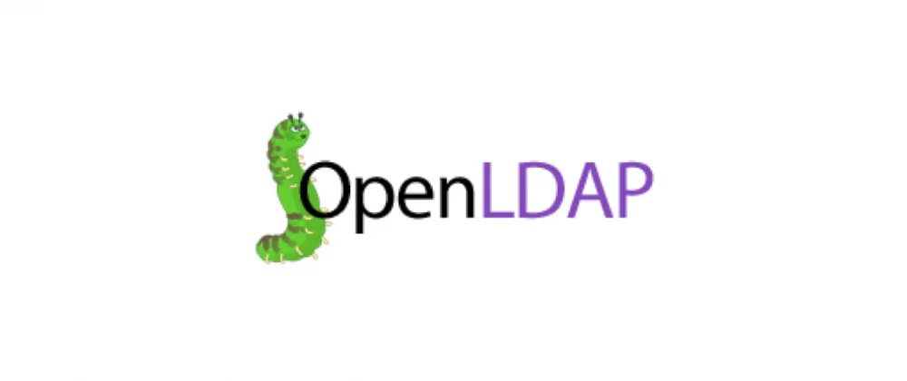
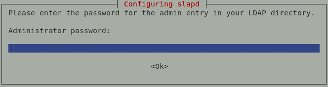

## Realiza la instalación y configuración básica de OpenLDAP en frestón utilizando como base el nombre DNS asignado.



OpenLDAP es una implementación libre y de código abierto del protocolo Lightweight Directory Access Protocol (LDAP) desarrollada por el proyecto OpenLDAP.

Está liberada bajo su propia licencia OpenLDAP Public License. LDAP es un protocolo de comunicación independiente de la plataforma.

Muchas distribuciones GNU/Linux incluyen el software OpenLDAP para el soporte LDAP. Este software también corre en plataformas BSD, AIX, HP-UX, Mac OS X, Solaris, Microsoft Windows (NT y derivados, incluyendo 2000, XP, Vista), y z/OS. 

<hr>

Para comenzar deberemos verificar que nuestro FQDN de la máquina este correctamentez, ya que se hará uso de el para la configuración base inicial.
```shell
debian@freston:~$ hostname -f
freston.madu.gonzalonazareno.org
```

Actualizaremos la máquina y procederemos a la instalación de **OpenLdap**(slapd).
```shell
root@freston:/home/debian# apt update && apt upgrade && apt install slapd
```

Durante la instalación nos pedirán una contraseña para el administrador.

contraseña: fran

Una vez finalizada la instalacion tendremos un nuevo puerto abierto por defecto para LDAP(389) que estará escuchando peticiones de todas las interfaces de la máquina(0.0.0.0).
```shell
root@freston:/home/debian# netstat -tlnp
Active Internet connections (only servers)
Proto Recv-Q Send-Q Local Address           Foreign Address         State       PID/Program name    
tcp        0      0 127.0.0.1:3306          0.0.0.0:*               LISTEN      11772/mysqld        
tcp        0      0 10.0.1.3:53             0.0.0.0:*               LISTEN      19788/named         
tcp        0      0 127.0.0.1:53            0.0.0.0:*               LISTEN      19788/named         
tcp        0      0 0.0.0.0:22              0.0.0.0:*               LISTEN      446/sshd            
tcp        0      0 127.0.0.1:953           0.0.0.0:*               LISTEN      19788/named         
tcp        0      0 0.0.0.0:10050           0.0.0.0:*               LISTEN      13773/zabbix_agentd 
tcp        0      0 0.0.0.0:10051           0.0.0.0:*               LISTEN      13704/zabbix_server 
tcp        0      0 0.0.0.0:389             0.0.0.0:*               LISTEN      22466/slapd         
tcp6       0      0 :::80                   :::*                    LISTEN      13627/apache2       
tcp6       0      0 :::22                   :::*                    LISTEN      446/sshd            
tcp6       0      0 :::10050                :::*                    LISTEN      13773/zabbix_agentd 
tcp6       0      0 :::10051                :::*                    LISTEN      13704/zabbix_server 
tcp6       0      0 :::389                  :::*                    LISTEN      22466/slapd         
```

Una vez que tenemos el proceso de **slapd** operativo procederemos a la intalación de **ldap-utils**, nos permitirá interactuar de una manera mas desarrollada con nuestro servidor (busquedas,modificaciones,nuevas inserciones...)
```shell
root@freston:/home/debian# apt install ldap-utils
```

Una vez instalado procederemos a ver su uso, con **ldapsearch** podremos realzar una búsqueda con datos abreviados sobre el directorio.
```shell
root@freston:/home/debian# ldapsearch -x -b "dc=madu,dc=gonzalonazareno,dc=org"
# extended LDIF
#
# LDAPv3
# base <dc=madu,dc=gonzalonazareno,dc=org> with scope subtree
# filter: (objectclass=*)
# requesting: ALL
#

# madu.gonzalonazareno.org
dn: dc=madu,dc=gonzalonazareno,dc=org
objectClass: top
objectClass: dcObject
objectClass: organization
o: madu.gonzalonazareno.org
dc: madu

# admin, madu.gonzalonazareno.org
dn: cn=admin,dc=madu,dc=gonzalonazareno,dc=org
objectClass: simpleSecurityObject
objectClass: organizationalRole
cn: admin
description: LDAP administrator

# search result
search: 2
result: 0 Success

# numResponses: 3
# numEntries: 2
```

Ahora realizaremos una busqueda completa, en la cual es necesario una autentificación puesto que muestra datos con mayor nivel de seguridad.(como por ejemplo contraseñas, aunque esten encriptadas.)
```shell
root@freston:/home/debian# ldapsearch -x -D "cn=admin,dc=madu,dc=gonzalonazareno,dc=org" -b "dc=madu,dc=gonzalonazareno,dc=org" -W
Enter LDAP Password: 
# extended LDIF
#
# LDAPv3
# base <dc=madu,dc=gonzalonazareno,dc=org> with scope subtree
# filter: (objectclass=*)
# requesting: ALL
#

# madu.gonzalonazareno.org
dn: dc=madu,dc=gonzalonazareno,dc=org
objectClass: top
objectClass: dcObject
objectClass: organization
o: madu.gonzalonazareno.org
dc: madu

# admin, madu.gonzalonazareno.org
dn: cn=admin,dc=madu,dc=gonzalonazareno,dc=org
objectClass: simpleSecurityObject
objectClass: organizationalRole
cn: admin
description: LDAP administrator
userPassword:: e1NTSEF9bVVHb08vRDFNdk1qZUxRRFVBWm82WWVsVURwelVDbGk=

# search result
search: 2
result: 0 Success

# numResponses: 3
# numEntries: 2
```

Los usuarios, grupos y unidades organizativas pueden realizarse a través de un único fichero con extensión **.ldif** :
```shell
root@freston:/home/debian# nano ramas.ldif

dn: ou=Personas,dc=madu,dc=gonzalonazareno,dc=org
objectClass: organizationalUnit
ou: Personas 

dn: ou=Grupos,dc=madu,dc=gonzalonazareno,dc=org
objectClass: organizationalUnit
ou: Grupos
```

Una vez definido el fichero, lo importaremos con el comando **ldapadd**.
```shell
root@freston:/home/debian# ldapadd -x -D "cn=admin,dc=madu,dc=gonzalonazareno,dc=org" -f ramas.ldif -W
Enter LDAP Password: 
adding new entry "ou=Personas,dc=madu,dc=gonzalonazareno,dc=org"

adding new entry "ou=Grupos,dc=madu,dc=gonzalonazareno,dc=org"
```

Comprobaremos que las nuevas entradas han sido correctamente añadidas, para ello realizaremos una busqueda anónima:
```shell
root@freston:/home/debian# ldapsearch -x -b "dc=madu,dc=gonzalonazareno,dc=org"
# extended LDIF
#
# LDAPv3
# base <dc=madu,dc=gonzalonazareno,dc=org> with scope subtree
# filter: (objectclass=*)
# requesting: ALL
#

# madu.gonzalonazareno.org
dn: dc=madu,dc=gonzalonazareno,dc=org
objectClass: top
objectClass: dcObject
objectClass: organization
o: madu.gonzalonazareno.org
dc: madu

# admin, madu.gonzalonazareno.org
dn: cn=admin,dc=madu,dc=gonzalonazareno,dc=org
objectClass: simpleSecurityObject
objectClass: organizationalRole
cn: admin
description: LDAP administrator

# Personas, madu.gonzalonazareno.org
dn: ou=Personas,dc=madu,dc=gonzalonazareno,dc=org
objectClass: organizationalUnit
ou:: UGVyc29uYXMg

# Grupos, madu.gonzalonazareno.org
dn: ou=Grupos,dc=madu,dc=gonzalonazareno,dc=org
objectClass: organizationalUnit
ou: Grupos

# search result
search: 2
result: 0 Success

# numResponses: 5
# numEntries: 4
```

Como hemos comprado de la base (dc=madu,dc=gonzalonazareno,dc=org) se despliegan tres objetos, estando añadidas las unidades organizativas que acabamos de crear, desde esas unidades podremos añadir nuevas ramas, tantas como nos sea necesario para el desarrollo de nuestra base.