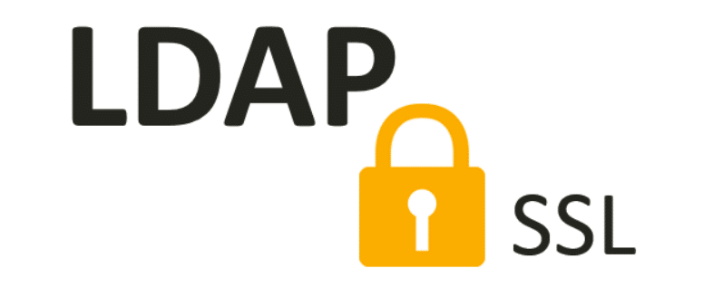

## Configura el servidor LDAP de frestón para que utilice el protocolo ldaps:// a la vez que el ldap:// utilizando el certificado x509 de la práctica de https o solicitando el correspondiente a través de gestiona. Realiza las modificaciones adecuadas en el cliente ldap de frestón para que todas las consultas se realicen por defecto utilizando ldaps://



En este apartado utilizaremos los certificados generados anteriormente en [Quijote](https://franmadu6.github.io/gatsbyjs/sa-open-stack-configuracion-https) para la realización de esta practica.

```shell
debian@freston:~$ tree claves/
claves/
├── gonzalonazareno.crt
├── openstack.crt
└── openstack.key

0 directories, 3 files
```

Moveremos los archivos a los diferentes directorios pertinentes para la realización de este ejercicio.
```shell
debian@freston:~/claves$ sudo mv gonzalonazareno.crt /etc/ssl/certs/
debian@freston:~/claves$ sudo mv openstack.crt /etc/ssl/certs/
debian@freston:~/claves$ sudo mv openstack.key /etc/ssl/private/
```

Vamos a otorgar los permisos necesarios sobre el fichero y directorio que lo contiene al usuario openldap, para ello necesitaremos instalar el paquete **acl** para una mejor y mas precisa asignación de permisos.
```shell
root@freston:/home/debian/claves# setfacl -m u:openldap:r-x /etc/ssl/private
root@freston:/home/debian/claves# setfacl -m u:openldap:r-x /etc/ssl/private/openstack.key
```

Antes de comenzar la configuración verificaremos el puerto que utiliza el servicio **slapd** que deberán ser el mismo que ldap (389/TCP).
```shell
root@freston:/home/debian/claves# netstat -tlnp | egrep 'slapd'
tcp        0      0 0.0.0.0:389             0.0.0.0:*               LISTEN      506/slapd           
tcp6       0      0 :::389                  :::*                    LISTEN      506/slapd     
```


Dado que vamos a tratar los parámetros de configuración como si fuesen atributos de un objeto en el directorio, tendremos que crear un fichero de extensión **.ldif** que contenga las modificaciones a llevar a cabo:
```shell
root@freston:/home/debian# nano secure.ldif
dn: cn=config
changetype: modify
replace: olcTLSCACertificateFile
olcTLSCACertificateFile: /etc/ssl/certs/gonzalonazareno.crt           
-
replace: olcTLSCertificateKeyFile
olcTLSCertificateKeyFile: /etc/ssl/private/openstack.key
-
replace: olcTLSCertificateFile
olcTLSCertificateFile: /etc/ssl/certs/openstack.crt
```

Ahora lo importaremos, para modificar los atributos a la configuración, haciendo uso de **ldapmodify**:
```shell
root@freston:/home/debian# ldapmodify -Y EXTERNAL -H ldapi:/// -f secure.ldif 
SASL/EXTERNAL authentication started
SASL username: gidNumber=0+uidNumber=0,cn=peercred,cn=external,cn=auth
SASL SSF: 0
modifying entry "cn=config"
```

Por defecto el protocolo no contempla la opción de ldaps así que deberemos implementarla:
```shell
root@freston:/home/debian# nano /etc/default/slapd 
SLAPD_SERVICES="ldap:/// ldapi:/// ldaps:///"
```

Reiniciaremos y veremos el estado del servicio **slapd**.
```shell
root@freston:/home/debian# systemctl restart slapd
root@freston:/home/debian# systemctl status slapd
● slapd.service - LSB: OpenLDAP standalone server (Lightweight Directory Access Protocol)
   Loaded: loaded (/etc/init.d/slapd; generated)
   Active: active (running) since Wed 2021-05-19 21:06:42 CEST; 1min 52s ago
     Docs: man:systemd-sysv-generator(8)
  Process: 19189 ExecStart=/etc/init.d/slapd start (code=exited, status=0/SUCCESS)
    Tasks: 3 (limit: 562)
   Memory: 3.7M
   CGroup: /system.slice/slapd.service
           └─19197 /usr/sbin/slapd -h ldap:/// ldapi:/// ldaps:/// -g openldap -u openldap -F /etc

May 19 21:06:42 freston systemd[1]: Starting LSB: OpenLDAP standalone server (Lightweight Director
May 19 21:06:42 freston slapd[19194]: @(#) $OpenLDAP: slapd  (Feb 14 2021 18:32:34) $
                                              Debian OpenLDAP Maintainers <pkg-openldap-devel@list
May 19 21:06:42 freston slapd[19197]: slapd starting
May 19 21:06:42 freston slapd[19189]: Starting OpenLDAP: slapd.
May 19 21:06:42 freston systemd[1]: Started LSB: OpenLDAP standalone server (Lightweight Directory
```

Comprobaremos que el nuevo protocolo escucha por el puerto **636/TCP** correctamente:
```shell
root@freston:/home/debian# netstat -tlnp | egrep 'slapd'
tcp        0      0 0.0.0.0:389             0.0.0.0:*               LISTEN      19197/slapd         
tcp        0      0 0.0.0.0:636             0.0.0.0:*               LISTEN      19197/slapd         
tcp6       0      0 :::389                  :::*                    LISTEN      19197/slapd         
tcp6       0      0 :::636                  :::*                    LISTEN      19197/slapd         
```

Pasando al lado del cliente en el que al igual que importamos certificados de autoridades certificadoras en el navegador para poder hacer uso del protocolo HTTPS, tendremos que hacerlo para aquellas aplicaciones manejadas desde línea de comandos, que hacen uso de otros protocolos cifrados, como por ejemplo **ldaps://**, el paquete encargado de la lista de autoridades certificadoras es **ca-certificates**, deberemos copiar el certificado de la autoridad certificadora IES Gonzalo Nazareno de /etc/ssl/certs/ a /usr/local/share/ca-certificates/ , crear el enlace simbólico y concatenarlo en el fichero **ca-certificates.crt** con los siguientes comandos:
```shell
root@freston:/home/debian# cp /etc/ssl/certs/gonzalonazareno.crt /usr/local/share/ca-certificates/
root@freston:/home/debian# update-ca-certificates 
Updating certificates in /etc/ssl/certs...
rehash: warning: skipping duplicate certificate in gonzalonazareno.pem
1 added, 0 removed; done.
Running hooks in /etc/ca-certificates/update.d...
done.
```

Para comprobarlo haremos una búsqueda anónima sobre el directorio haciendo uso de ldap sobre ssl/tls:
```shell
root@freston:/home/debian# ldapsearch -x -b "dc=madu,dc=gonzalonazareno,dc=org" -H ldaps://localhost:636
# extended LDIF
#
# LDAPv3
# base <dc=madu,dc=gonzalonazareno,dc=org> with scope subtree
# filter: (objectclass=*)
# requesting: ALL
#

# madu.gonzalonazareno.org
dn: dc=madu,dc=gonzalonazareno,dc=org
objectClass: top
objectClass: dcObject
objectClass: organization
o: madu.gonzalonazareno.org
dc: madu

# admin, madu.gonzalonazareno.org
dn: cn=admin,dc=madu,dc=gonzalonazareno,dc=org
objectClass: simpleSecurityObject
objectClass: organizationalRole
cn: admin
description: LDAP administrator

# Personas, madu.gonzalonazareno.org
dn: ou=Personas,dc=madu,dc=gonzalonazareno,dc=org
objectClass: organizationalUnit
ou:: UGVyc29uYXMg

# Grupos, madu.gonzalonazareno.org
dn: ou=Grupos,dc=madu,dc=gonzalonazareno,dc=org
objectClass: organizationalUnit
ou: Grupos

# search result
search: 2
result: 0 Success

# numResponses: 5
# numEntries: 4
```


Ahora deberemos de configurar correctamente ldap para haga uso del protocolo **ldaps://** por defecto, para ello deberemos añadir a la directiva **URI** la especificación **ldaps://localhost**.
```shell
root@freston:/home/debian# nano /etc/ldap/ldap.conf
URI     ldap://ldap.example.com ldap://ldap-master.example.com:666 ldaps://localhost
```

Repetiremos la consulta hecha anteriormente sin indicar el método de conexión:
```shell
root@freston:/home/debian# ldapsearch -x -b "dc=madu,dc=gonzalonazareno,dc=org"
# extended LDIF
#
# LDAPv3
# base <dc=madu,dc=gonzalonazareno,dc=org> with scope subtree
# filter: (objectclass=*)
# requesting: ALL
#

# madu.gonzalonazareno.org
dn: dc=madu,dc=gonzalonazareno,dc=org
objectClass: top
objectClass: dcObject
objectClass: organization
o: madu.gonzalonazareno.org
dc: madu

# admin, madu.gonzalonazareno.org
dn: cn=admin,dc=madu,dc=gonzalonazareno,dc=org
objectClass: simpleSecurityObject
objectClass: organizationalRole
cn: admin
description: LDAP administrator

# Personas, madu.gonzalonazareno.org
dn: ou=Personas,dc=madu,dc=gonzalonazareno,dc=org
objectClass: organizationalUnit
ou:: UGVyc29uYXMg

# Grupos, madu.gonzalonazareno.org
dn: ou=Grupos,dc=madu,dc=gonzalonazareno,dc=org
objectClass: organizationalUnit
ou: Grupos

# search result
search: 2
result: 0 Success

# numResponses: 5
# numEntries: 4
```

Como podemos comprobar ahora hacemos uso del protocolo ssl/tls de manera predeterminada a la hora de usar ldap.