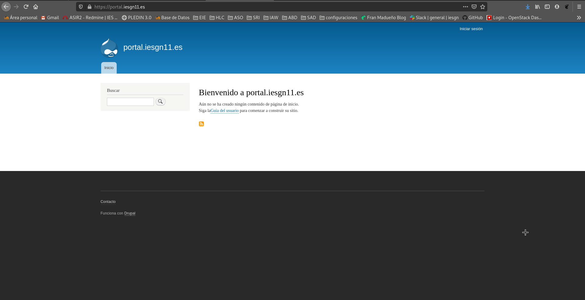
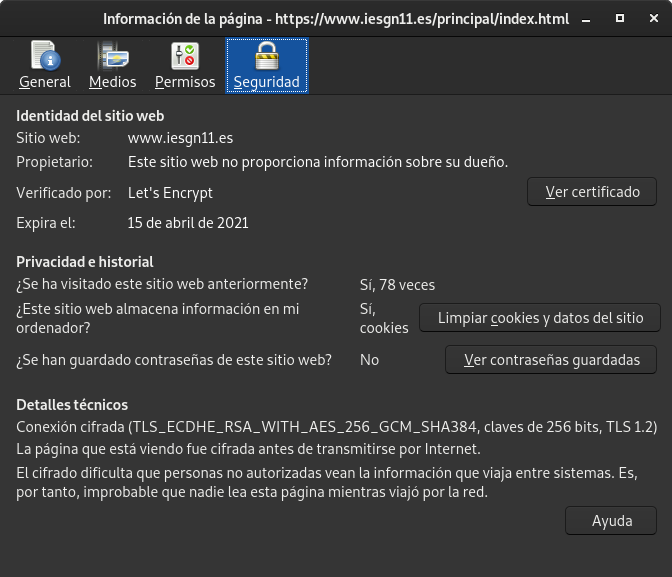
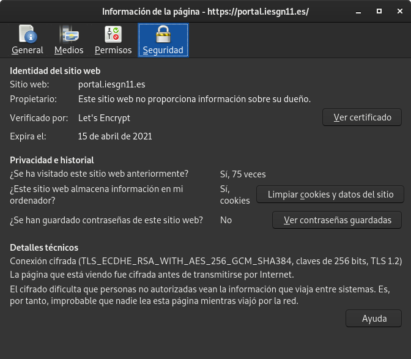

## Vamos a configurar el protocolo HTTPS para el acceso a nuestras aplicaciones, para ello tienes que tener en cuenta los siguiente.

1. Vamos a utilizar el servicio https://letsencrypt.org para solicitar los certificados de nuestras páginas.
2. Explica detenidamente cómo se solicita un certificado en Let's Encrypt. En tu explicación deberás responder a estas preguntas:

    ¿Qué función tiene el cliente ACME?
    ¿Qué configuración se realiza en el servidor web?
    ¿Qué pruebas realiza Let's Encrypt para asegurar que somos los administrados del sitio web?
    ¿Se puede usar el DNS para verificar que somos administradores del sitio?

3. Utiliza dos ficheros de configuración de nginx: uno para la configuración del virtualhost HTTP y otro para la configuración del virtualhost HTTPS.
4. Realiza una redirección o una reescritura para que cuando accedas a HTTP te redirija al sitio HTTPS.
5. Comprueba que se ha creado una tarea cron que renueva el certificado cada 3 meses.
6. Comprueba que las páginas son accesible por HTTPS y visualiza los detalles del certificado que has creado.
7. Modifica la configuración del cliente de Nextcloud para comprobar que sigue en funcionamiento con HTTPS.

<hr>

## Let's Encrypt

* ¿Qué función tiene el cliente ACME?
<p>Let’s Encrypt usa el protocol ACME para verificar que controlas un nombre de dominio determinado y para emitir un certificado. Para obtener un certificado Let’s Encrypt, deberemos elegir un cliente ACME.
En nuestro caso CertBot, es fácil de usar, funciona en muchos sistemas operativos.</p>

* ¿Qué configuración se realiza en el servidor web?
<p>Los datos enviados usando HTTPS están asegurados por el protocolo TLS (Transport Layer Security), que ofrece 3 capas de protección fundamentales:

**Cifrado** ➜ El cifrado de los datos intercambiados los mantiene seguros de miradas indiscretas. Eso significa que mientras el usuario está navegando en un sitio web, nadie puede " escuchar" a sus conversaciones , realizar un seguimiento de sus actividades a través de múltiples páginas o robar su información.

**Integridad de los datos** ➜ Los datos no puede ser modificado o dañado durante la transferencia, intencionadamente o no, sin ser detectado.

**Autenticación** ➜ Demuestra que los usuarios se comunican con la página web deseada. Protege contra los ataques y construye la confianza del usuario, lo que se traduce en más beneficios para el negocio.</p>

* ¿Qué pruebas realiza Let's Encrypt para asegurar que somos los administrados del sitio web?
<p>Let’s Encrypt indentifica el administrador del servidor por llave pública. La primera vez que el software del agente interactúa con Let’s Encrypt, genera un nuevo par de llaves y demuestra al Let’s Encrypt CA que el servidor controla uno o más dominios. Esto es similar al proceso tradicional de un AC de crear una cuenta y agregar dominios a esa cuenta.</p>

* ¿Se puede usar el DNS para verificar que somos administradores del sitio?
<p>Existe una alternativa al método de validación HTTP que es por DNS. Su funcionamiento es sencillo: se basa en publicar un registro TXT con un determinado valor en el DNS del proveedor de forma que Certbot pueda verificar que somos los propietarios del dominio en el momento de creación o renovación de un certificado.</p>

<hr>

## Configuración de https en nuestros sitios web.

Para poder utilizar Let's Encrypt nos instalaremos certbot
```shell
root@valhalla:/home/debian# apt install certbot
```

Pararemos el servicio de nginx
```shell
root@valhalla:/home/debian# systemctl stop nginx
```

Pedimos un certificado para nuestra pagina www.iesgn11.es
```shell
root@valhalla:/home/debian# certbot certonly --standalone -d www.iesgn11.es
Saving debug log to /var/log/letsencrypt/letsencrypt.log
Plugins selected: Authenticator standalone, Installer None
Obtaining a new certificate
Performing the following challenges:
http-01 challenge for www.iesgn11.es
Waiting for verification...
Cleaning up challenges

IMPORTANT NOTES:
 - Congratulations! Your certificate and chain have been saved at:
   /etc/letsencrypt/live/www.iesgn11.es/fullchain.pem
   Your key file has been saved at:
   /etc/letsencrypt/live/www.iesgn11.es/privkey.pem
   Your cert will expire on 2021-04-15. To obtain a new or tweaked
   version of this certificate in the future, simply run certbot
   again. To non-interactively renew *all* of your certificates, run
   "certbot renew"
 - If you like Certbot, please consider supporting our work by:

   Donating to ISRG / Let's Encrypt:   https://letsencrypt.org/donate
   Donating to EFF:                    https://eff.org/donate-le
```

Y otro para portal.iesgn11.es
```shell
root@valhalla:/home/debian# certbot certonly --standalone -d portal.iesgn11.es
Saving debug log to /var/log/letsencrypt/letsencrypt.log
Plugins selected: Authenticator standalone, Installer None
Obtaining a new certificate
Performing the following challenges:
http-01 challenge for portal.iesgn11.es
Waiting for verification...
Cleaning up challenges

IMPORTANT NOTES:
 - Congratulations! Your certificate and chain have been saved at:
   /etc/letsencrypt/live/portal.iesgn11.es/fullchain.pem
   Your key file has been saved at:
   /etc/letsencrypt/live/portal.iesgn11.es/privkey.pem
   Your cert will expire on 2021-04-15. To obtain a new or tweaked
   version of this certificate in the future, simply run certbot
   again. To non-interactively renew *all* of your certificates, run
   "certbot renew"
 - If you like Certbot, please consider supporting our work by:

   Donating to ISRG / Let's Encrypt:   https://letsencrypt.org/donate
   Donating to EFF:                    https://eff.org/donate-le
```

Volvemos a iniciar el servicio de nginx.
```shell
root@valhalla:/home/debian# systemctl start nginx
```

Comprobamos que tenemos los certificados solicitados.
```shell
root@valhalla:/home/debian# certbot certificates
Saving debug log to /var/log/letsencrypt/letsencrypt.log
- - - - - - - - - - - - - - - - - - - - - - - - - - - - - - - - - - - - - - - -
Found the following certs:
  Certificate Name: portal.iesgn11.es
    Domains: portal.iesgn11.es
    Expiry Date: 2021-04-15 17:25:43+00:00 (VALID: 89 days)
    Certificate Path: /etc/letsencrypt/live/portal.iesgn11.es/fullchain.pem
    Private Key Path: /etc/letsencrypt/live/portal.iesgn11.es/privkey.pem
  Certificate Name: www.iesgn11.es
    Domains: www.iesgn11.es
    Expiry Date: 2021-04-15 17:22:36+00:00 (VALID: 89 days)
    Certificate Path: /etc/letsencrypt/live/www.iesgn11.es/fullchain.pem
    Private Key Path: /etc/letsencrypt/live/www.iesgn11.es/privkey.pem
- - - - - - - - - - - - - - - - - - - - - - - - - - - - - - - - - - - - - - - -
```

Ahora toca paso a la modificación de los ficheros de configuración de nginx tanto para portal como para www:

www.iesgn11.es
```shell
server {
        listen 80;
        listen [::]:80;

        server_name www.iesgn11.es;

        return 301 https://$host$request_uri;
}

server {
        listen 443 ssl http2;
        listen [::]:443 ssl http2;

        ssl    on;
        ssl_certificate    /etc/letsencrypt/live/www.iesgn11.es/fullchain.pem;
        ssl_certificate_key    /etc/letsencrypt/live/www.iesgn11.es/privkey.pem;

        root /var/www/iesgn11;

        index index.html index.htm index.nginx-debian.html;

        server_name www.iesgn11.es;

        location / {
                return 301 /principal/index.html;
                try_files $uri $uri/ =404;
                location /principal {
                        autoindex on;
                }
        }
	location /nextcloud {
                error_page 403 = /nextloud/core/templates/403.php;
                error_page 404 = /nextcloud/core/templates/404.php;

                rewrite ^/nextcloud/caldav(.*)$ /remote.php/caldav$1 redirect;
                rewrite ^/nextcloud/carddav(.*)$ /remote.php/carddav$1 redirect;
                rewrite ^/nextcloud/webdav(.*)$ /remote.php/webdav$1 redirect;

                rewrite ^(/nextcloud/core/doc[^\/]+/)$ $1/index.html;

                try_files $uri $uri/ index.php;


        }
	location ~ \.php(?:$|/) {
                fastcgi_pass unix:/var/run/php/php7.3-fpm.sock;
                include snippets/fastcgi-php.conf;

        }
}
```

portal.iesgn11.es
```shell
server {
        listen 80;
        listen [::]:80;

        server_name portal.iesgn11.es;

        return 301 https://$host$request_uri;
}

server {
        listen 443 ssl http2;
        listen [::]:443 ssl http2;

        ssl    on;
        ssl_certificate    /etc/letsencrypt/live/portal.iesgn11.es/fullchain.pem;
        ssl_certificate_key    /etc/letsencrypt/live/portal.iesgn11.es/privkey.pem;

        	root /var/www/portal/drupal-9.1.2;
        
	index index.php index.html;
        
	server_name portal.iesgn11.es;
        
	location / {
		try_files $uri @rewrite;
        }

	location @rewrite {
                rewrite ^/(.*)$ /index.php?q=$1;
        }

	location ~ \.php$ {
                include snippets/fastcgi-php.conf;
                fastcgi_pass unix:/var/run/php/php7.3-fpm.sock;
        }
}
```
Para ambos ficheros lo que hemos modificado es el puerto que utilizarán además de si se llama al antiguo puerto 80(http) lo redirija al nuevo 443(https).

Reiniciamos nginx y comprobamos el resultado:
```shell
root@valhalla:/etc/nginx/sites-available# systemctl reload nginx
```






