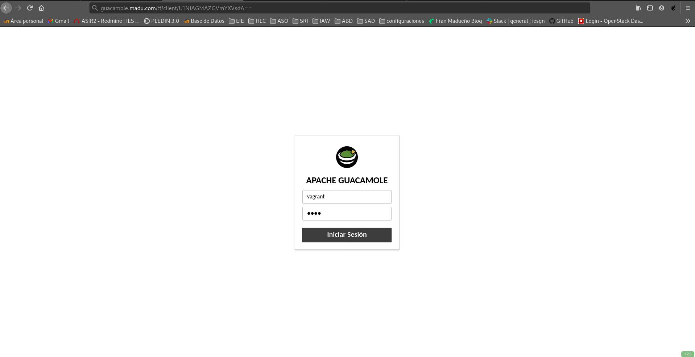

<center></center>

### En esta práctica vamos a desplegar un CMS escrito en java. Puedes escoger la aplicación que vas a desplegar de CMS escritos en Java o de Aplicaciones Java en Bitnami.

## GUACAMOLE
Guacamole es un proyecto de escritorio remoto desarrollado por la Apache Software Foundation. Es un sistema compuesto por una parte cliente y una parte servidor. La aplicación servidor es la que se encarga de la autenticación y precisa de la instalación en infraestructura propia o acogerse la un servicio de terceros y estar accesible desde la parte cliente.

<hr>

**Instalación de la paqueteria necesaria y opcional.**
```shell
root@guacamole:~# apt-get install tomcat9 && apt-get install apache2
root@guacamole:~# apt-get install libcairo2-dev libjpeg62-turbo-dev libpng-dev libossp-uuid-dev libtool
#opcional
root@guacamole:~# apt-get install libavutil-dev libswscale-dev libpango1.0-dev libssh2-1-dev libtelnet-dev libvncserver-dev libpulse-dev libssl-dev libvorbis-dev libwebp-dev 
root@guacamole:~# wget http://archive.apache.org/dist/guacamole/1.2.0/source/guacamole-server-1.2.0.tar.gz
root@guacamole:~# wget http://archive.apache.org/dist/guacamole/1.2.0/binary/guacamole-1.2.0.war
```

**Descomprimimos el archivo de guacamole-server y procedemos al montaje.**
```shell
root@guacamole:~# tar -xvf guacamole-server-1.2.0.tar.gz
root@guacamole:~# cd guacamole-server-1.2.0
root@guacamole:/home/vagrant/guacamole-server-1.2.0# ./configure --with-init-dir=/etc/init.d
root@guacamole:/home/vagrant/guacamole-server-1.2.0# make
root@guacamole:/home/vagrant/guacamole-server-1.2.0# make install
root@guacamole:/home/vagrant/guacamole-server-1.2.0# ldconfig
```

**Reinicio de sistemas**
```shell
root@guacamole:/home/vagrant/guacamole-server-1.2.0# systemctl daemon-reload
root@guacamole:/home/vagrant/guacamole-server-1.2.0# systemctl start guacd
root@guacamole:/home/vagrant/guacamole-server-1.2.0# systemctl enable guacd
guacd.service is not a native service, redirecting to systemd-sysv-install.
Executing: /lib/systemd/systemd-sysv-install enable guacd
```

**Configuración**
```shell
root@guacamole:/home/vagrant# mv guacamole-1.2.0.war /var/lib/tomcat9/webapps/guacamole.war
root@guacamole:/home/vagrant# systemctl restart tomcat9 guacd
root@guacamole:/home/vagrant# mkdir /etc/guacamole
root@guacamole:/home/vagrant# nano  /etc/guacamole/guacamole.properties
# Hostname and port of guacamole proxy
guacd-hostname: localhost
guacd-port:     4822
# Auth provider class (authenticates user/pass combination, needed if using the provided $
user-mapping: /etc/guacamole/user-mapping.xml
auth-provider: net.sourceforge.guacamole.net.basic.BasicFileAuthenticationProvider
basic-user-mapping: /etc/guacamole/user-mapping.xml

vagrant@guacamole:~$ sudo ln -s /etc/guacamole/guacamole.properties /usr/share/tomcat9/.guacamole/
```

```shell
root@guacamole:/home/vagrant# nano /etc/guacamole/user-mapping.xml
#
<user-mapping>
        <authorize 
         username="vagrant" 
         password="2c20cb5558626540a1704b1fe524ea9a"
         encoding="md5">
                <connection name="SSH">
                        <protocol>ssh</protocol>
                        <param name="hostname">192.168.100.158</param>
                        <param name="port">22</param>
                        <param name="username">fran</param>
                </connection>
        </authorize>
</user-mapping>
```

**Permisos necesarios a Tomcat**
```shell
vagrant@guacamole:~$ sudo chmod 600 /etc/guacamole/user-mapping.xml
vagrant@guacamole:~$ sudo chown tomcat:tomcat /etc/guacamole/user-mapping.xml
root@guacamole:/home/vagrant# systemctl restart tomcat9 guacd
```

**Configuración del fichero de Apache2**:
```shell
root@guacamole:/home/vagrant# a2enmod proxy proxy_http headers proxy_wstunnel
root@guacamole:/home/vagrant# nano /etc/apache2/sites-available/guacamole.conf

<VirtualHost *:80>
      ServerName guacamole.madu.com

      ErrorLog ${APACHE_LOG_DIR}/guacamole_error.log
      CustomLog ${APACHE_LOG_DIR}/guacamole_access.log combined

      <Location />
          Require all granted
          ProxyPass http://localhost:8080/guacamole/ flushpackets=on
          ProxyPassReverse http://localhost:8080/guacamole/
      </Location>

     <Location /websocket-tunnel>
         Require all granted
         ProxyPass ws://localhost:8080/guacamole/websocket-tunnel
         ProxyPassReverse ws://localhost:8080/guacamole/websocket-tunnel
     </Location>

     Header always unset X-Frame-Options
</VirtualHost>

root@guacamole:/etc/apache2/sites-available# a2ensite guacamole.conf 
root@guacamole:/etc/apache2/sites-available# systemctl reload apache2
```

**Pruebas de acceso**



