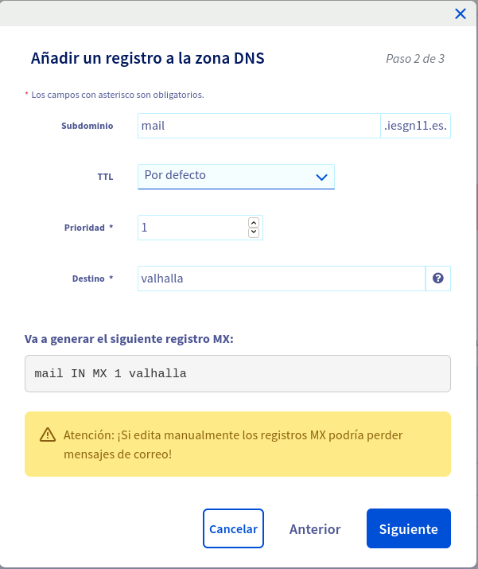

<center></center>

## Práctica: Servidor de correos

### Instala y configura de manera adecuada el servidor de correos en tu máquina de OVH, para tu dominio iesgnXX.es. El nombre del servidor de correo será mail.iesgnXX.es (Este es el nombre que deberá aparecer en el registro MX)

#### Gestión de correos desde el servidor
<hr>

* Tarea 1: Documenta una prueba de funcionamiento, donde envíes desde tu servidor local al exterior. Muestra el log donde se vea el envío. Muestra el correo que has recibido. Muestra el registro SPF.

* Tarea 2: Documenta una prueba de funcionamiento, donde envíes un correo desde el exterior (gmail, hotmail,…) a tu servidor local. Muestra el log donde se vea el envío. Muestra cómo has leído el correo. Muestra el registro MX de tu dominio.

Lo primero que debemos hacer es añadir el registro de mail.iesgn11.es en OVH.


Y ahora comenzaremos la instalación de mi servidor de correos.
```shell
apt install postfix
```
#### Uso de alias y redirecciones
<hr>

* Tarea 3 (No obligatoria): Uso de alias y redirecciones.


#### Para asegurar el envío
<hr>

* Tarea 4 (No obligatoria): Configura de manera adecuada DKIM es tu sistema de correos. Comprueba el registro DKIM en la página https://mxtoolbox.com/dkim.aspx. Configura postfix para que firme los correos que envía. Manda un correo y comprueba la verificación de las firmas en ellos.


#### Para luchar contra el SPAM
<hr>

* Tarea 5 (No obligatorio): Configura de manera adecuada Postfix para que tenga en cuenta el registro SPF de los correos que recibe. Muestra el log del correo para comprobar que se está haciendo el testeo del registro SPF.

* Tarea 6 (No obligatoria): Configura un sistema antispam. Realiza comprobaciones para comprobarlo.

* Tarea 7 (No obligatoria): Configura un sistema antivirus. Realiza comprobaciones para comprobarlo.


#### Gestión de correos desde un cliente
<hr>

* Tarea 8: Configura el buzón de los usuarios de tipo Maildir. Envía un correo a tu usuario y comprueba que el correo se ha guardado en el buzón Maildir del usuario del sistema correspondiente. Recuerda que ese tipo de buzón no se puede leer con la utilidad mail.

* Tarea 9: Instala configura dovecot para ofrecer el protocolo IMAP. Configura dovecot de manera adecuada para ofrecer autentificación y cifrado.

* Tarea 10 (No obligatoria): Instala un webmail (roundcube, horde, rainloop) para gestionar el correo del equipo mediante una interfaz web. Muestra la configuración necesaria y cómo eres capaz de leer los correos que recibe tu usuario.

* Tarea 11: Configura de manera adecuada postfix para que podamos mandar un correo desde un cliente remoto. La conexión entre cliente y servidor debe estar autentificada con SASL usando dovecor y además debe estar cifrada. Para cifrar esta comunicación puedes usar dos opciones:


    * ESMTP + STARTTLS: Usando el puerto 567/tcp enviamos de forma segura el correo al servidor.
    * SMTPS: Utiliza un puerto no estándar (465) para SMTPS (Simple Mail Transfer Protocol Secure). No es una extensión de smtp. Es muy parecido a HTTPS.

Elige una de las opciones anterior para realizar el cifrado. Y muestra la configuración de un cliente de correo (evolution, thunderbird, …) y muestra como puedes enviar los correos.

* Tarea 12 (No obligatoria): Configura el cliente webmail para el envío de correo. Realiza una prueba de envío con el webmail.


#### Comprobación final
<hr>

* Tarea 13 (No obligatoria): Prueba de envío de correo. En esta página tenemos una herramienta completa y fácil de usar a la que podemos enviar un correo para que verifique y puntúe el correo que enviamos. Captura la pantalla y muestra la puntuación que has sacado.

