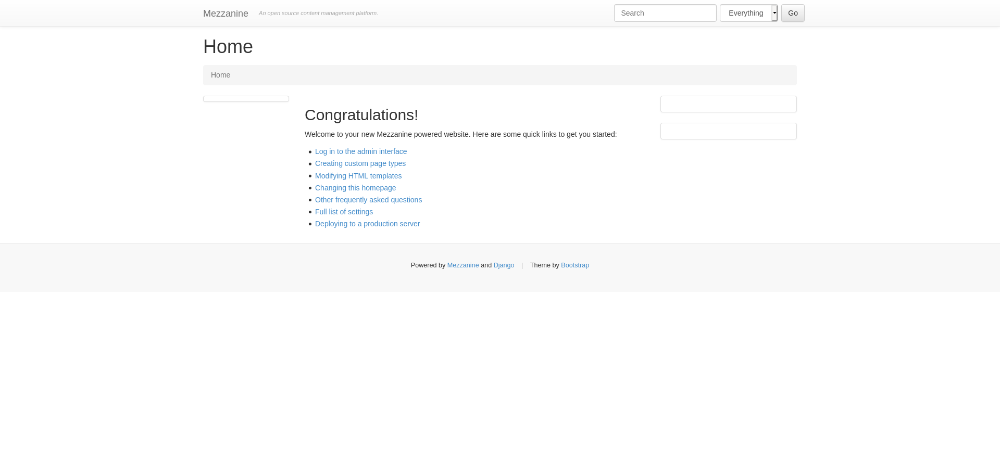
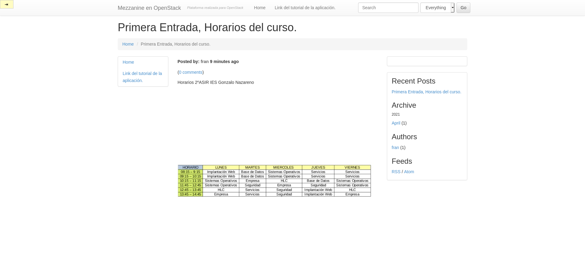
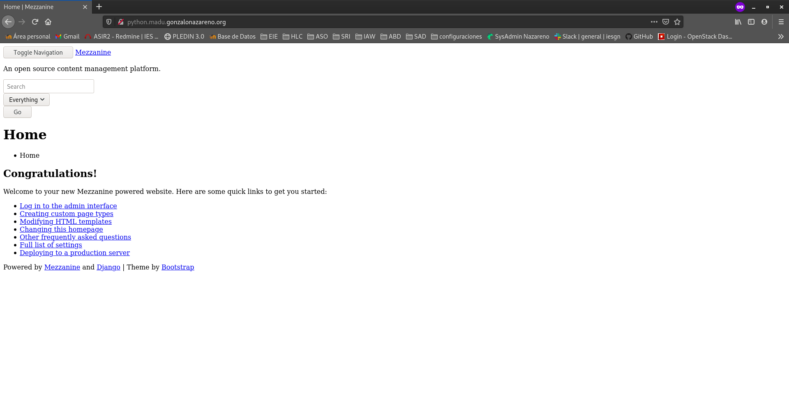

Instalación de aplicación web python

En esta tarea vamos a desplegar un CMS python. Tienes que realizar la instalación de un CMS python basado en django (puedes encontrar varios en el siguiente enlace: https://djangopackages.org/grids/g/cms/


* Instala el CMS en el entorno de desarrollo. Debes utilizar un entorno virtual.

* Personaliza la página (cambia el nombre al blog y pon tu nombre) y añade contenido (algún artículo con alguna imagen).

* Guarda los ficheros generados durante la instalación en un repositorio github. Guarda también en ese repositorio la copia de seguridad de la bese de datos. Te en cuenta que en el entorno de desarrolla vas a tener una base de datos sqlite, y en el entorno de producción una mariadb, por lo tanto es recomendable para hacer la copia de seguridad y recuperarla los comandos: python manage.py dumpdata y python manage.py loaddata, para más información: https://coderwall.com/p/mvsoyg/django-dumpdata-and-loaddata

* Realiza el despliegue de la aplicación en tu entorno de producción (servidor web y servidor de base de datos en el cloud). Utiliza un entorno virtual. Como servidor de aplicación puedes usar gunicorn o uwsgi (crea una unidad systemd para gestionar este servicio). El contenido estático debe servirlo el servidor web. La aplicación será accesible en la url python.tunombre.gonzalonazareno.org.

<hr>

Crearemos un entorno virtual donde instalaremos **Mezzanine**.
```shell
fran@debian:~/.virtualenvs$ python3 -m venv despliegue
fran@debian:~/.virtualenvs$ source despliegue/bin/activate
(despliegue) fran@debian:~/.virtualenvs$ 
```

Instalamos **Mezzanine** haciendo uso de pip y crearemos una nueva carpeta que llamaremos cms(da igual el nombre).
```shell
(despliegue) fran@debian:~/GitHub$ pip install mezzanine
(despliegue) fran@debian:~/GitHub$ mezzanine-project cms
(despliegue) fran@debian:~/GitHub$ tree cms
(despliegue) fran@debian:~/GitHub$ tree cms
cms
├── cms
│   ├── __init__.py
│   ├── local_settings.py
│   ├── settings.py
│   ├── urls.py
│   └── wsgi.py
├── deploy
│   ├── crontab.template
│   ├── gunicorn.conf.py.template
│   ├── local_settings.py.template
│   ├── nginx.conf.template
│   └── supervisor.conf.template
├── fabfile.py
├── manage.py
└── requirements.txt

2 directories, 13 files
```

Modificaremos el fichero cms/settings.py para modificar la base de datos ya que estamos en fase de desarrollo.
```shell
(despliegue) fran@debian:~/GitHub/cms$ nano cms/settings.py
DATABASES = {
    "default": {
        # Add "postgresql_psycopg2", "mysql", "sqlite3" or "oracle".
        "ENGINE": "django.db.backends.sqlite3",
        # DB name or path to database file if using sqlite3.
        "NAME": "",
        # Not used with sqlite3.
        "USER": "",
        # Not used with sqlite3.
        "PASSWORD": "",
        # Set to empty string for localhost. Not used with sqlite3.
        "HOST": "",
        # Set to empty string for default. Not used with sqlite3.
        "PORT": "",
    }
}
```

Haremos una migración para generar tablas en la base de datos.
```shell
(despliegue) fran@debian:~/GitHub/cms$ python3 manage.py migrate
Operations to perform:
  Apply all migrations: admin, auth, blog, conf, contenttypes, core, django_comments, forms, galleries, generic, pages, redirects, sessions, sites, twitter
Running migrations:
  Applying contenttypes.0001_initial... OK
  Applying auth.0001_initial... OK
  Applying admin.0001_initial... OK
  Applying admin.0002_logentry_remove_auto_add... OK
  Applying contenttypes.0002_remove_content_type_name... OK
  Applying auth.0002_alter_permission_name_max_length... OK
  Applying auth.0003_alter_user_email_max_length... OK
  Applying auth.0004_alter_user_username_opts... OK
  Applying auth.0005_alter_user_last_login_null... OK
  Applying auth.0006_require_contenttypes_0002... OK
  Applying auth.0007_alter_validators_add_error_messages... OK
  Applying auth.0008_alter_user_username_max_length... OK
  Applying sites.0001_initial... OK
  Applying blog.0001_initial... OK
  Applying blog.0002_auto_20150527_1555... OK
  Applying blog.0003_auto_20170411_0504... OK
  Applying conf.0001_initial... OK
  Applying core.0001_initial... OK
  Applying core.0002_auto_20150414_2140... OK
  Applying django_comments.0001_initial... OK
  Applying django_comments.0002_update_user_email_field_length... OK
  Applying django_comments.0003_add_submit_date_index... OK
  Applying django_comments.0004_add_object_pk_is_removed_index... OK
  Applying pages.0001_initial... OK
  Applying forms.0001_initial... OK
  Applying forms.0002_auto_20141227_0224... OK
  Applying forms.0003_emailfield... OK
  Applying forms.0004_auto_20150517_0510... OK
  Applying forms.0005_auto_20151026_1600... OK
  Applying forms.0006_auto_20170425_2225... OK
  Applying galleries.0001_initial... OK
  Applying galleries.0002_auto_20141227_0224... OK
  Applying generic.0001_initial... OK
  Applying generic.0002_auto_20141227_0224... OK
  Applying generic.0003_auto_20170411_0504... OK
  Applying pages.0002_auto_20141227_0224... OK
  Applying pages.0003_auto_20150527_1555... OK
  Applying pages.0004_auto_20170411_0504... OK
  Applying redirects.0001_initial... OK
  Applying sessions.0001_initial... OK
  Applying sites.0002_alter_domain_unique... OK
  Applying twitter.0001_initial... OK
```

Crearemos un usuario para poder administrarlas.
```shell
(despliegue) fran@debian:~/GitHub/cms$ python3 manage.py createsuperuser
Username (leave blank to use 'fran'): 
Email address: frandh1997@gmail.com
Password: 
Password (again): 
Superuser created successfully.
```

Ejecutamos el servidor web.
```shell
(despliegue) fran@debian:~/GitHub/cms$ python3 manage.py runserver
              .....
          _d^^^^^^^^^b_
       .d''           ``b.
     .p'                `q.
    .d'                   `b.
   .d'                     `b.   * Mezzanine 4.3.1
   ::                       ::   * Django 1.11.29
  ::    M E Z Z A N I N E    ::  * Python 3.7.3
   ::                       ::   * SQLite 3.27.2
   `p.                     .q'   * Linux 4.19.0-16-amd64
    `p.                   .q'
     `b.                 .d'
       `q..          ..p'
          ^q........p^
              ''''

Performing system checks...

System check identified no issues (0 silenced).
April 13, 2021 - 11:00:12
Django version 1.11.29, using settings 'cms.settings'
Starting development server at http://127.0.0.1:8000/
Quit the server with CONTROL-C.
```

Accedemos al puerto indicado (127.0.0.1:8000) y podremos ver la aplicación.


Ahora procederemos a realizar una nueva entrada y modificaremos algunas cosas como el titulo también añadiremos links.


Ahora realizaremos un dumpdata para guardar información de la base de datos en un fichero para poder migrarlo despues.
```shell
(despliegue) fran@debian:~/GitHub/cms$ python3 manage.py dumpdata > backup.json
```

Crearemos un repositorio en GitHub y guardaremos los datos, en mi caso es: https://github.com/franmadu6/Mezzanine-OpenStack


Accederemos a **Freston** y crearemos un nuevo registro DNS que llamaremos "python".
```shell
debian@freston:~$ sudo nano /var/cache/bind/db.madu.interna 
dulcinea        IN      A       10.0.1.7
sancho  IN      A       10.0.1.10
quijote IN      A       10.0.2.4
freston IN      A       10.0.1.3
www     IN      CNAME   quijote
bd      IN      CNAME   sancho
python  IN      CNAME   quijote

debian@freston:~$ sudo nano /var/cache/bind/db.madu.dmz 
dulcinea        IN      A       10.0.2.6
sancho  IN      A       10.0.1.10
quijote IN      A       10.0.2.4
freston IN      A       10.0.1.3
www     IN      CNAME   quijote
bd      IN      CNAME   sancho
python  IN      CNAME   quijote

debian@freston:~$ sudo nano /var/cache/bind/db.madu.externa 
dulcinea        IN      A       172.22.201.38
www     IN      CNAME   dulcinea
test    IN      CNAME   dulcinea
python  IN      CNAME   dulcinea

debian@freston:~$ sudo systemctl restart bind9
```

Accederemos a **Sancho** y crearemos una base de datos y un usuario con privilegios para acceder.
```shell
ubuntu@sancho:~$ sudo mysql -u root -p
Enter password: 
Welcome to the MariaDB monitor.  Commands end with ; or \g.
Your MariaDB connection id is 126
Server version: 10.3.25-MariaDB-0ubuntu0.20.04.1 Ubuntu 20.04

Copyright (c) 2000, 2018, Oracle, MariaDB Corporation Ab and others.

Type 'help;' or '\h' for help. Type '\c' to clear the current input statement.

MariaDB [(none)]> CREATE DATABASE mezzanine;
Query OK, 1 row affected (0.621 sec)

MariaDB [(none)]> GRANT USAGE ON *.* TO 'quijote'@'10.0.2.4' IDENTIFIED BY 'fran';
Query OK, 0 rows affected (0.230 sec)

MariaDB [(none)]> GRANT ALL PRIVILEGES ON mezzanine.* to 'quijote'@'10.0.2.4';
Query OK, 0 rows affected (0.018 sec)

MariaDB [(none)]> exit
Bye
```

En **Quijote** instalaremos las dependencias necesarias para que nuestra aplicación funcione.
```shell
[root@quijote centos]# dnf install virtualenv git python3-mod_wsgi gcc python3-devel mysql-devel
```

Crearemos un entorno virtual e instalaremos las dependencias:
```shell
[root@quijote centos]# mkdir virtualenv
[root@quijote centos]# cd virtualenv/
[root@quijote virtualenv]# python3 -m venv despliegue
[root@quijote virtualenv]# source despliegue/bin/activate
(despliegue) [root@quijote virtualenv]# 
```

Clonamos nuestro repositorio.
```shell
(despliegue) [root@quijote centos]# git clone https://github.com/franmadu6/Mezzanine-OpenStack.git
Cloning into 'Mezzanine-OpenStack'...
remote: Enumerating objects: 33, done.
remote: Counting objects: 100% (33/33), done.
remote: Compressing objects: 100% (25/25), done.
remote: Total 33 (delta 0), reused 30 (delta 0), pack-reused 0
Unpacking objects: 100% (33/33), 71.16 KiB | 877.00 KiB/s, done.
```

Instalamos los requerimientos y algunos paquetes necesarios para el despliegue.
```shell
(despliegue) [root@quijote Mezzanine-OpenStack]# pip install -r requirements.txt
(despliegue) [root@quijote Mezzanine-OpenStack]# pip install mysql-connector-python uwsgi mysqlclient
```

Modificaremos el fichero settings.py para utilizar una base de datos mysql y acceso desde localhost.

(Nota:Crear una secret key vale cualquier combinacion de números y digitos)

```shell
(despliegue) [root@quijote Mezzanine-OpenStack]# nano cms/settings.py 
SECRET_KEY = '8lu*6g0lg)9z!ba+a$ehk)xt)x%rxgb$i1&amp;022shmi1jcgihb*'
ALLOWED_HOSTS = ['127.0.0.1','python.madu.gonzalonazareno.org']
STATIC_ROOT = '/var/www/mezzanine_django/static/'
DATABASES = {
    "default": {
        # Add "postgresql_psycopg2", "mysql", "sqlite3" or "oracle".
        "ENGINE": "django.db.backends.mysql",
        # DB name or path to database file if using sqlite3.
        "NAME": "mezzanine",
        # Not used with sqlite3.
        "USER": "quijote",
        # Not used with sqlite3.
        "PASSWORD": "fran",
        # Set to empty string for localhost. Not used with sqlite3.
        "HOST": "bd.madu.gonzalonazareno.org",
        # Set to empty string for default. Not used with sqlite3.
        "PORT": "",
    }
}
```
NOTA: Si da el error **django.core.exceptions.ImproperlyConfigured: The SECRET_KEY setting must not be empty.** deberás generar tu una y añadirla a **settings.py**.

```shell
(mezza) [root@quijote cms]# python3 manage.py migrate
Operations to perform:
  Apply all migrations: admin, auth, blog, conf, contenttypes, core, django_comments, forms, galleries, generic, pages, redirects, sessions, sites, twitter
Running migrations:
  Applying contenttypes.0001_initial... OK
  Applying auth.0001_initial... OK
  Applying admin.0001_initial... OK
  Applying admin.0002_logentry_remove_auto_add... OK
  Applying contenttypes.0002_remove_content_type_name... OK
  Applying auth.0002_alter_permission_name_max_length... OK
  Applying auth.0003_alter_user_email_max_length... OK
  Applying auth.0004_alter_user_username_opts... OK
  Applying auth.0005_alter_user_last_login_null... OK
  Applying auth.0006_require_contenttypes_0002... OK
  Applying auth.0007_alter_validators_add_error_messages... OK
  Applying auth.0008_alter_user_username_max_length... OK
  Applying sites.0001_initial... OK
  Applying blog.0001_initial... OK
  Applying blog.0002_auto_20150527_1555... OK
  Applying blog.0003_auto_20170411_0504... OK
  Applying conf.0001_initial... OK
  Applying core.0001_initial... OK
  Applying core.0002_auto_20150414_2140... OK
  Applying django_comments.0001_initial... OK
  Applying django_comments.0002_update_user_email_field_length... OK
  Applying django_comments.0003_add_submit_date_index... OK
  Applying pages.0001_initial... OK
  Applying forms.0001_initial... OK
  Applying forms.0002_auto_20141227_0224... OK
  Applying forms.0003_emailfield... OK
  Applying forms.0004_auto_20150517_0510... OK
  Applying forms.0005_auto_20151026_1600... OK
  Applying forms.0006_auto_20170425_2225... OK
  Applying galleries.0001_initial... OK
  Applying galleries.0002_auto_20141227_0224... OK
  Applying generic.0001_initial... OK
  Applying generic.0002_auto_20141227_0224... OK
  Applying generic.0003_auto_20170411_0504... OK
  Applying pages.0002_auto_20141227_0224... OK
  Applying pages.0003_auto_20150527_1555... OK
  Applying pages.0004_auto_20170411_0504... OK
  Applying redirects.0001_initial... OK
  Applying sessions.0001_initial... OK
  Applying sites.0002_alter_domain_unique... OK
  Applying twitter.0001_initial... OK
```

Importamos el backup.
```shell
(mezza) [root@quijote cms]# python3 manage.py loaddata backup.json
Installed 126 object(s) from 1 fixture(s)
```

Generamos el contenido estático.
```shell
(mezza) [root@quijote cms]# python manage.py collectstatic
412 static files copied to '/home/centos/mezza/cms/static'.
```

Moveremos la carpeta a /www/var/ y crearemos un virtualhost.
```shell
(mezza) [root@quijote cms]# nano /etc/httpd/sites-available/mezzanine.conf
<VirtualHost *:80>
    ServerName python.madu.gonzalonazareno.org
    DocumentRoot /var/www/mezzanine_django/

    WSGIDaemonProcess mysite user=apache group=apache processes=1 threads=5 python-path=/var/www/mezzanine_django
    WSGIScriptAlias / /var/www/mezzanine_django/cms/wsgi.py

    <Directory /var/www/mezzanine_django>
          WSGIProcessGroup mysite
          WSGIApplicationGroup %{GLOBAL}
          Require all granted
    </Directory>

    ProxyPass /static !
    ProxyPass / http://127.0.0.1:8080/
    ProxyPassReverse / http://127.0.0.1:8080/

</VirtualHost>

```

Creamo un directorio para los logs y damos los permisos necesarios para la que la aplicación sea servida.
```shell
(mezza) [root@quijote mezzanine_django]# mkdir log
(mezza) [root@quijote mezzanine_django]# touch log/{error.log,requests.log}
(mezza) [root@quijote mezzanine_django]# chown -R apache:apache ../mezzanine_django/
(mezza) [root@quijote mezzanine_django]# ln -s /etc/httpd/sites-available/mezzanine.conf /etc/httpd/sites-enabled/
(mezza) [root@quijote mezzanine_django]# systemctl restart httpd
```

Configuramos el servidor de aplicaciones uwsgi para que escuche el puerto 8080.
```shell
(mezza) [root@quijote mezzanine_django]# nano uwsgi.ini
[uwsgi]
http = :8080
chdir = /var/www/mezzanine_django
wsgi-file = /var/www/mezzanine_django/cms/wsgi.py
processes = 4
threads = 2
```

Lo activamos y comprobamos
```shell
(mezza) [centos@quijote mezzanine_django]$ uwsgi --ini uwsgi.ini
[uWSGI] getting INI configuration from uwsgi.ini
*** Starting uWSGI 2.0.19.1 (64bit) on [Tue Apr 20 13:46:39 2021] ***
compiled with version: 8.3.1 20191121 (Red Hat 8.3.1-5) on 15 April 2021 10:48:42
os: Linux-4.18.0-240.10.1.el8_3.x86_64 #1 SMP Mon Jan 18 17:05:51 UTC 2021
nodename: quijote.madu.gonzalonazareno.org
machine: x86_64
clock source: unix
detected number of CPU cores: 1
current working directory: /var/www/mezzanine_django
detected binary path: /home/centos/virtualenv/mezza/bin/uwsgi
!!! no internal routing support, rebuild with pcre support !!!
chdir() to /var/www/mezzanine_django
*** WARNING: you are running uWSGI without its master process manager ***
your processes number limit is 1655
your memory page size is 4096 bytes
detected max file descriptor number: 1024
lock engine: pthread robust mutexes
thunder lock: disabled (you can enable it with --thunder-lock)
uWSGI http bound on :8080 fd 4
spawned uWSGI http 1 (pid: 111431)
uwsgi socket 0 bound to TCP address 127.0.0.1:46643 (port auto-assigned) fd 3
Python version: 3.6.8 (default, Aug 24 2020, 17:57:11)  [GCC 8.3.1 20191121 (Red Hat 8.3.1-5)]
Python main interpreter initialized at 0x1b1e0d0
python threads support enabled
your server socket listen backlog is limited to 100 connections
your mercy for graceful operations on workers is 60 seconds
mapped 333504 bytes (325 KB) for 8 cores
*** Operational MODE: preforking+threaded ***
WSGI app 0 (mountpoint='') ready in 4 seconds on interpreter 0x1b1e0d0 pid: 111430 (default app)
*** uWSGI is running in multiple interpreter mode ***
spawned uWSGI worker 1 (pid: 111430, cores: 2)
spawned uWSGI worker 2 (pid: 111433, cores: 2)
spawned uWSGI worker 3 (pid: 111434, cores: 2)
spawned uWSGI worker 4 (pid: 111435, cores: 2)
```



Como se puede apreciar en la imagen la paguina se despliega pero no puede cargar los ficheros css y js.

Econtre un post con varias ideas interesantes que según el motivo alguna puede funcionar:

https://stackoverflow.com/questions/5836674/why-does-debug-false-setting-make-my-django-static-files-access-fail

<VirtualHost *:80>
        ServerAdmin webmaster@localhost
        DocumentRoot /home/usuario/juanluramirez/
 
        Alias /static /home/usuario/juanluramirez/static
 
        <Directory /home/usuario/juanluramirez/static>
                Require all granted
        </Directory>
 
        <Directory /home/usuario/juanluramirez/juanluramirez>
                <Files wsgi.py>
                        Require all granted
                </Files>
        </Directory>
 
        WSGIDaemonProcess mezzanine \
                python-home=/home/usuario/mezzanine \
                python-path=/home/usuario/juanluramirez/:/home/usuario
        WSGIProcessGroup mezzanine
        WSGIScriptAlias / /home/usuario/juanluramirez/juanluramirez/wsgi.py
        
	ErrorLog ${APACHE_LOG_DIR}/error.log
        CustomLog ${APACHE_LOG_DIR}/access.log combined
</VirtualHost>