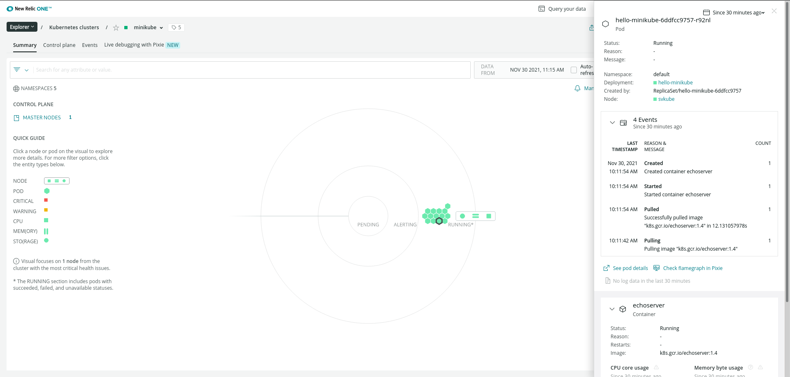
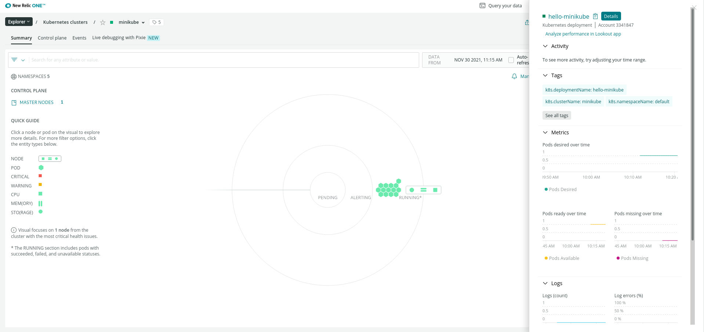

<ol>
  <li><a href="#newrelic">New Relic</a></li>
  <li><a href="#kubernetes">Kubernetes</a></li>
  <li><a href="#pruebasminikube">Pruebas con minikube</a></li>
  <li><a href="#pruebaskubernetes">Monitorización de un escenario desplegado</a></li>
</ol>


Este proyecto contemplará la utilización de **New Relic** para obtener metricas y logs de una **web** desplegada a traves de **kubernetes**, para comenzar explicaremos un poco que es **New Relic** y como funciona.

<hr id="newrelic" >

<br>

# New Relic

## ¿Que es New Relic?

New Relic es una herramienta de medición del rendimiento de una infraestructura de servicios, desde backend hasta frontend: medición del rendimiento de navegadores, APIs, servidores, aplicaciones móviles… ¿Qué nos permite hacer?

**Este software es capaz de realizar las siguientes tareas (entre otras muchas):**

- Monitorizar Conexiones HTTP (tiempos de respuesta, nº de peticiones…).
- Monitorización de errores (avisos cuando se detectan fallos de ejecución o conexión).
- Fijar alertas sobre datos de referencia (tiempos de respuesta, errores de autenticación…).
- Estadísticas de rendimiento en distintos dispositivos (uso de memoria, velocidad de respuesta,…).
- Estadísticas de usuarios que la usen según el SO utilizado.

**Esta herramienta además soporta diferentes plataformas:**
Aplicaciones WEB (APM)

**Permite monitorizar aplicaciones web en los siguientes lenguajes:**

- Ruby
- PHP
- Java (la miraremos un poco más en detalle)
- .NET
- Python
- NodeJs

**Aplicaciones Móviles (Mobile)**
<hr>

**Permite monitorizar nuestras aplicaciones para móviles (Android, iOS y Titanium).**
Navegadores (Browser)

**Permite monitorizar nuestro sitio sobre el navegador del usuario (tiempo de respuesta, tiempo de carga de elementos…).**
Usuarios (Synthetics)

**Permite simular usuarios (tanto flujo como interacciones) para anticiparse a los errores. Usa el servicio de alertas para avisar de esto.**
Servidores (Servers)

**Nos da una vista del servidor desde la perspectiva de la propia aplicación.**
Otros

Además de las características arriba descritas, nos ofrece un amplio abanico de **Plugins** para ayudarnos con ellas, e incluso añadir nuevas funcionalidades, soporte en la nube y integración con kubernete que veremos mas adelante.

## ¿Como funciona?

**New Relic** consta con varias aplicaciones, para no hablar de todas ellas veremos las que utilizaremos en este proyecto:

- **New Relic Browser**: New Relic monitoriza todo lo relacionado a las peticiones HTTP y HTTPs que realizamos dentro de un navegador, desde los tiempos de carga con histogramas, percentiles y gráficos con segmentación hasta reportes geográficos, rendimiento con toda la parte de backend y alertas relacionadas con peticiones AJAX y errores del Javascript. Lógicamente todos los tableros de monitorización son personalizables. 


- **New Relic Synthetics**: Permite monitorizar una aplicación móvil en todo su ciclo de vida, incluso en la fase de preproducción, desde la fase de desarrollo hasta las pruebas de testeo. Y una vez lanzado, también facilita la recolección de insights para medir el rendimiento. 

Ya tenemos una idea de que es **New Relic**, que datos recoge y como funciona, ahora daremos paso al proyecto comenzando con la instalacion de **New Relic**.

<hr>

Para instalar **New Relic** primero deberemos acceder a su [website](https://newrelic.com/) para registrarnos:


Una vez registrado procederemos a su instalación, en la que seleccionamos linux:


En el plan de instalación nos pedira que instalemos el agente de **New Relic**:


- Mensaje:
**Install the New Relic agents**
Install the latest New Relic agents on your host to get insight into the performance of your system and applications

Para ello seguí la [guia](https://docs.newrelic.com/docs/apm/agents/php-agent/installation/php-agent-installation-ubuntu-debian/) proporcionada por **New Relic**.

Configuramos el repositorio de **New Relic**:
```
echo 'deb http://apt.newrelic.com/debian/ newrelic non-free' | sudo tee /etc/apt/sources.list.d/newrelic.list
```

Comprobamos la relación de confianza con la **clave GPG**:
```
wget -O- https://download.newrelic.com/548C16BF.gpg | sudo apt-key add -
```

Actualizamos los paquetes:
```
sudo apt-get update
```

Instalamos el agente de PHP:
```
sudo apt-get install newrelic-php5
```

Y listo! Ya tendremos nuestro agente instalado y listo para usarse.


Para poder añadir nuestra maquina al navegador de new relic deberemos realizar un **curl** para conectarnos.
```
curl -Ls https://download.newrelic.com/install/newrelic-cli/scripts/install.sh | bash && sudo  NEW_RELIC_API_KEY=NRAK-H3WMTJBX8HDGGCWEG3KV1Y407ML NEW_RELIC_ACCOUNT_ID=3341847 NEW_RELIC_REGION=EU /usr/local/bin/newrelic install
```

Podremos elegir que parametros recoje, para este caso cogermos todos los posibles como ejemplo.
```
fran@debian:~$ curl -Ls https://download.newrelic.com/install/newrelic-cli/scripts/install.sh | bash && sudo  NEW_RELIC_API_KEY=NRAK-H3WMTJBX8HDGGCWEG3KV1Y407ML NEW_RELIC_ACCOUNT_ID=3341847 NEW_RELIC_REGION=EU /usr/local/bin/newrelic install
Starting installation.
Installing New Relic CLI v0.37.19
Installing to /usr/local/bin using sudo
[sudo] password for fran: 

   _   _                 ____      _ _
  | \ | | _____      __ |  _ \ ___| (_) ___
  |  \| |/ _ \ \ /\ / / | |_) / _ | | |/ __|
  | |\  |  __/\ V  V /  |  _ |  __| | | (__
  |_| \_|\___| \_/\_/   |_| \_\___|_|_|\___|

  Welcome to New Relic. Let's install some instrumentation.

  Questions? Read more about our installation process at
  https://docs.newrelic.com/

	
INFO Validating connectivity to the New Relic platform... 
The guided installation will begin by installing the latest version of the New Relic Infrastructure agent, which is required for additional instrumentation.

? Please choose from the following instrumentation to be installed: Logs integration, Golden Signal Alerts, Apache Open Source Integration, MySQL Open Source Integration

The following will be installed:
  Infrastructure Agent
  Logs integration
  Golden Signal Alerts
  Apache Open Source Integration
  MySQL Open Source Integration

==> Installing Infrastructure Agent...

Obj:1 http://repo.mysql.com/apt/debian buster InRelease
Ign:2 http://repo.mongodb.org/apt/debian buster/mongodb-org/4.4 InRelease
Obj:3 http://dl.google.com/linux/chrome/deb stable InRelease
Obj:4 http://security.debian.org/debian-security buster/updates InRelease
Obj:5 http://deb.debian.org/debian buster InRelease
Obj:6 http://repo.mongodb.org/apt/debian buster/mongodb-org/4.4 Release
Obj:7 http://packages.microsoft.com/repos/code stable InRelease
Obj:8 http://deb.debian.org/debian buster-updates InRelease
Obj:9 https://download.newrelic.com/infrastructure_agent/linux/apt buster InRelease
Obj:10 https://download.virtualbox.org/virtualbox/debian buster InRelease
Des:11 https://packages.cloud.google.com/apt kubernetes-xenial InRelease [9.383 B]
Descargados 9.383 B en 2s (5.494 B/s)
Leyendo lista de paquetes...
Warning: apt-key output should not be parsed (stdout is not a terminal)
OK
Ign:1 http://repo.mongodb.org/apt/debian buster/mongodb-org/4.4 InRelease
Obj:2 http://repo.mysql.com/apt/debian buster InRelease
Obj:3 http://dl.google.com/linux/chrome/deb stable InRelease
Obj:4 http://repo.mongodb.org/apt/debian buster/mongodb-org/4.4 Release
Obj:5 http://security.debian.org/debian-security buster/updates InRelease
Obj:6 http://deb.debian.org/debian buster InRelease
Obj:7 http://packages.microsoft.com/repos/code stable InRelease
Obj:8 http://deb.debian.org/debian buster-updates InRelease
Obj:9 https://download.newrelic.com/infrastructure_agent/linux/apt buster InRelease
Obj:10 https://download.virtualbox.org/virtualbox/debian buster InRelease
Des:11 https://packages.cloud.google.com/apt kubernetes-xenial InRelease [9.383 B]
Descargados 9.383 B en 1s (8.114 B/s)
Leyendo lista de paquetes...
Running agent status check attempt...
Agent status check ok.

  ✅ Checking for data in New Relic (this may take a few minutes)...success.

  ⚙️  The Infrastructure Agent configuration file can be found in /etc/newrelic-infra.yml
  Edit this file to make changes or configure advanced features for the agent. See the docs for options:
  https://docs.newrelic.com/docs/infrastructure/install-infrastructure-agent/configuration/infrastructure-agent-configuration-settings
  
  Note: Process monitoring has been enabled by default - all other config options are left to the user.

==> Installing Infrastructure Agent...success.

==> Installing Logs integration...

The log files below have been detected:
  /var/log/alternatives.log
  /var/log/auth.log
  /var/log/dpkg.log
  /var/log/messages
  /var/lib/docker/containers/*/*.log
  /var/log/apache2/*access.log
  /var/log/apache2/error.log
  /var/log/mysql/error.log
Would you like to tail those log files to New Relic Y/N (default: Y)? Y  


  ✅ Checking for data in New Relic (this may take a few minutes)...success.

  ⚙️  The Logs configuration file (base configuration) can be found in /etc/newrelic-infra/logging.d/logging.yml
  ⚙️  The Logs configuration file for discovered processes can be found in /etc/newrelic-infra/logging.d/discovered.yml
  Edit these files to make changes or configure advanced features for the Logs integration. See the docs for options:
  https://docs.newrelic.com/docs/logs/enable-log-management-new-relic/enable-log-monitoring-new-relic/forward-your-logs-using-infrastructure-agent#parameters

==> Installing Logs integration...success.

==> Installing Golden Signal Alerts...

  This installation will setup alerts for any existing, and future, hosts and applications reporting to newrelic with the Golden Signal conditions:
  - High CPU
  - High Application Error Rate
  - High Application Response Time
  - Low Application Throughput
  This policy can be modified under Alerts & AI\Policies.

Creating alert policy Golden Signals...
done
Adding alert condition High CPU...
done
Adding alert condition High Application Error percentage...
done
Adding alert condition High Application Response Time...
done
Adding alert condition Low Application Throughput...
done
Would you like to be notified on your registered email address frangodh97@gmail.com when this alert triggers Y/N (default: Y)? Y

Notification channel not found for email address frangodh97@gmail.com, creating notification channel...
done
Subscribing alert policy to notification channel...
done
==> Installing Golden Signal Alerts...success.

==> Installing Apache Open Source Integration...

  To capture data from the Apache integration, you'll first need to meet these prerequisites:
  - Apache version requirement (see https://docs.newrelic.com/docs/integrations/host-integrations/host-integrations-list/apache-monitoring-integration#comp-req)
  - Apache status module enabled and configured for Apache instance
  - Apache status module endpoint (default server-status) available

Obj:1 http://dl.google.com/linux/chrome/deb stable InRelease
Obj:2 http://repo.mysql.com/apt/debian buster InRelease
Ign:3 http://repo.mongodb.org/apt/debian buster/mongodb-org/4.4 InRelease
Obj:4 http://deb.debian.org/debian buster InRelease
Obj:5 http://security.debian.org/debian-security buster/updates InRelease
Obj:6 http://packages.microsoft.com/repos/code stable InRelease
Obj:7 http://repo.mongodb.org/apt/debian buster/mongodb-org/4.4 Release
Obj:8 https://download.virtualbox.org/virtualbox/debian buster InRelease
Obj:9 http://deb.debian.org/debian buster-updates InRelease
Obj:10 https://download.newrelic.com/infrastructure_agent/linux/apt buster InRelease
Obj:11 https://packages.cloud.google.com/apt kubernetes-xenial InRelease
Leyendo lista de paquetes...
Leyendo lista de paquetes...
Creando árbol de dependencias...
Leyendo la información de estado...
nri-apache ya está en su versión más reciente (1.7.1).
0 actualizados, 0 nuevos se instalarán, 0 para eliminar y 0 no actualizados.

  ✅ Checking for data in New Relic (this may take a few minutes)...success.

  ⚙️  The Apache configuration file can be found in /etc/newrelic-infra/integrations.d/apache-config.yml
  Edit this file to make changes or configure advanced features for this integration. See the docs for options:
  https://docs.newrelic.com/docs/integrations/host-integrations/host-integrations-list/apache-monitoring-integration#config

==> Installing Apache Open Source Integration...success.

==> Installing MySQL Open Source Integration...

  To capture data from the MySQL integration, we need to create a new MySql user with specific permissions (REPLICATION, SELECT).
  The installation will create a strong randomly generated password for that new user.
  This installation may prompt for your MySql root user password in order to create this new user.
  More information regarding the prerequisites can be found at https://docs.newrelic.com/docs/integrations/host-integrations/host-integrations-list/mysql-monitoring-integration#req

Obj:1 http://repo.mysql.com/apt/debian buster InRelease
Ign:2 http://repo.mongodb.org/apt/debian buster/mongodb-org/4.4 InRelease
Obj:3 http://dl.google.com/linux/chrome/deb stable InRelease
Obj:4 http://security.debian.org/debian-security buster/updates InRelease
Obj:5 http://repo.mongodb.org/apt/debian buster/mongodb-org/4.4 Release
Obj:6 http://deb.debian.org/debian buster InRelease
Obj:7 http://packages.microsoft.com/repos/code stable InRelease
Obj:8 http://deb.debian.org/debian buster-updates InRelease
Obj:9 https://download.newrelic.com/infrastructure_agent/linux/apt buster InRelease
Obj:10 https://download.virtualbox.org/virtualbox/debian buster InRelease
Obj:11 https://packages.cloud.google.com/apt kubernetes-xenial InRelease
Leyendo lista de paquetes...
Leyendo lista de paquetes...
Creando árbol de dependencias...
Leyendo la información de estado...
nri-mysql ya está en su versión más reciente (1.7.1).
0 actualizados, 0 nuevos se instalarán, 0 para eliminar y 0 no actualizados.

  ✅ Checking for data in New Relic (this may take a few minutes)...success.

  ⚙️  The MySQL configuration file can be found in /etc/newrelic-infra/integrations.d/mysql-config.yml
  Edit this file to make changes or configure advanced features for this integration. See the docs for options:
  https://docs.newrelic.com/docs/integrations/host-integrations/host-integrations-list/mysql-monitoring-integration#config

==> Installing MySQL Open Source Integration...success.


  New Relic installation complete 

  --------------------
  Installation Summary

  ✔  Infrastructure Agent  (installed)  
  ✔  Logs integration  (installed)  
  ✔  Golden Signal Alerts  (installed)  
  ✔  Apache Open Source Integration  (installed)  
  ✔  MySQL Open Source Integration  (installed)  

  View your data at the link below:
  ⮕  https://onenr.io/0dBj39mGvwX

  --------------------
```

Una vez la instalación haya sido finalizada volveremos al navegador y veremos como la pantalla ha cambiado, nos dira que ha finalizado y nos propondra instalar alguna instrumentación adicional.


Si no deseamos instalar mas herramientas le daremos a **See your data** y ya podremos hacer uso de sus herramientas de monitoreo.


<hr id="kubernetes" >

<br>

## Kubernetes

Antes monitorizar nuestro cluster deberemos de confirgurarlo primero, para ello utilizaremos **minikube** para crear nuestros clusters, procederemos a su instalación.
```shell
vagrant@svKube:~$ curl -LO https://storage.googleapis.com/minikube/releases/latest/minikube-linux-amd64
  % Total    % Received % Xferd  Average Speed   Time    Time     Time  Current
                                 Dload  Upload   Total   Spent    Left  Speed
100 66.3M  100 66.3M    0     0  3995k      0  0:00:17  0:00:17 --:--:-- 3952k
vagrant@svKube:~$ sudo install minikube-linux-amd64 /usr/local/bin/minikube
```

Al inicializarlo nos da varios errores en mi casa tuve que ejecutarlo con minikube start --vm-driver=none y instalar docker,docker.io y conntrack, este fue un poco el historial de comandos que ejecute.
```shell
vagrant@svKube:~$ minikube start
vagrant@svKube:~$ minikube start --vm-driver=none
root@svKube:/home/vagrant# apt install docker docker.io
root@svKube:/home/vagrant# minikube start --vm-driver=none
root@svKube:/home/vagrant# sudo apt-get install -y conntrack
```

Ahora si podremos ejecutarlo correctamente:
```shell
root@svKube:/home/vagrant# minikube start --vm-driver=none
😄  minikube v1.24.0 on Debian 10.11 (vbox/amd64)
✨  Using the none driver based on user configuration

🧯  The requested memory allocation of 1995MiB does not leave room for system overhead (total system memory: 1995MiB). You may face stability issues.
💡  Suggestion: Start minikube with less memory allocated: 'minikube start --memory=1995mb'

👍  Starting control plane node minikube in cluster minikube
🤹  Running on localhost (CPUs=2, Memory=1995MB, Disk=20029MB) ...
ℹ️  OS release is Debian GNU/Linux 10 (buster)
    > kubeadm.sha256: 64 B / 64 B [--------------------------] 100.00% ? p/s 0s
    > kubectl.sha256: 64 B / 64 B [--------------------------] 100.00% ? p/s 0s
    > kubelet.sha256: 64 B / 64 B [--------------------------] 100.00% ? p/s 0s
    > kubeadm: 43.71 MiB / 43.71 MiB [---------------] 100.00% 3.84 MiB p/s 12s
    > kubectl: 44.73 MiB / 44.73 MiB [---------------] 100.00% 3.86 MiB p/s 12s
    > kubelet: 115.57 MiB / 115.57 MiB [-------------] 100.00% 4.01 MiB p/s 29s

    ▪ Generating certificates and keys ...
    ▪ Booting up control plane ...
    ▪ Configuring RBAC rules ...
🤹  Configuring local host environment ...

❗  The 'none' driver is designed for experts who need to integrate with an existing VM
💡  Most users should use the newer 'docker' driver instead, which does not require root!
📘  For more information, see: https://minikube.sigs.k8s.io/docs/reference/drivers/none/

❗  kubectl and minikube configuration will be stored in /root
❗  To use kubectl or minikube commands as your own user, you may need to relocate them. For example, to overwrite your own settings, run:

    ▪ sudo mv /root/.kube /root/.minikube $HOME
    ▪ sudo chown -R $USER $HOME/.kube $HOME/.minikube

💡  This can also be done automatically by setting the env var CHANGE_MINIKUBE_NONE_USER=true
🔎  Verifying Kubernetes components...
    ▪ Using image gcr.io/k8s-minikube/storage-provisioner:v5
🌟  Enabled addons: default-storageclass, storage-provisioner
💡  kubectl not found. If you need it, try: 'minikube kubectl -- get pods -A'
🏄  Done! kubectl is now configured to use "minikube" cluster and "default" namespace by default
```

Podremos apreciar su correcta instalación observando que sus pods estan corriendo.
```shell
root@svKube:/home/vagrant# minikube kubectl -- get pods -A
NAMESPACE     NAME                             READY   STATUS    RESTARTS   AGE
kube-system   coredns-78fcd69978-hchrh         1/1     Running   0          2m23s
kube-system   etcd-svkube                      1/1     Running   0          2m36s
kube-system   kube-apiserver-svkube            1/1     Running   0          2m36s
kube-system   kube-controller-manager-svkube   1/1     Running   0          2m38s
kube-system   kube-proxy-hv5zs                 1/1     Running   0          2m23s
kube-system   kube-scheduler-svkube            1/1     Running   0          2m36s
kube-system   storage-provisioner              1/1     Running   0          2m35s
```

Para comenzar su monitorización con **New relic** deberemos instalar **Helm**, la principal función de Helm es definir, instalar y actualizar aplicaciones complejas de Kubernetes. 
```shell
root@svKube:/home/vagrant# curl -fsSL -o get_helm.sh https://raw.githubusercontent.com/helm/helm/main/scripts/get-helm-3
root@svKube:/home/vagrant# chmod 700 get_helm.sh
root@svKube:/home/vagrant# ./get_helm.sh
Downloading https://get.helm.sh/helm-v3.7.1-linux-amd64.tar.gz
Verifying checksum... Done.
Preparing to install helm into /usr/local/bin
helm installed into /usr/local/bin/helm
```

El comando que nos proporciona **New relic** para establece una conexión con nuestro cluster no es valido para minikube, para ejecutarlo correctamente simplemente deberemos modificar la linea:
kubectl create namespace kube-system ; helm upgrade --install newrelic-bundle newrelic/nri-bundle \
por:
minikube kubectl create namespace kube-system ; helm upgrade --install newrelic-bundle newrelic/nri-bundle \

```shell
helm repo add newrelic https://helm-charts.newrelic.com && helm repo update && \
minikube kubectl create namespace kube-system ; helm upgrade --install newrelic-bundle newrelic/nri-bundle \
 --set global.licenseKey=eu01xx48059720c231a1080bc348906513e7NRAL \
 --set global.cluster=minikube \
 --namespace=kube-system \
 --set newrelic-infrastructure.privileged=true \
 --set global.lowDataMode=true \
 --set ksm.enabled=true \
 --set kubeEvents.enabled=true 
 ```


<hr id="pruebasminikube" >

<br>

## Pruebas con kubernetes

Para usar minikube de una manera mucho mas sencilla añadiremos un alias para no tener que estar poniendo minikube en cada linea:
```shell
alias kubectl="minikube kubectl --"
```

Crearemos un deployment sencilla en lo expondremos por el puesto 8080:
```shell
root@svKube:/home/vagrant# kubectl create deployment hello-minikube --image=k8s.gcr.io/echoserver:1.4
deployment.apps/hello-minikube created
root@svKube:/home/vagrant# kubectl expose deployment hello-minikube --type=NodePort --port=8080
service/hello-minikube exposed
```

```shell
root@svKube:/home/vagrant# kubectl get services hello-minikube
NAME             TYPE       CLUSTER-IP     EXTERNAL-IP   PORT(S)          AGE
hello-minikube   NodePort   10.98.127.54   <none>        8080:30972/TCP   46s
```





Como podemos comprobar se han añadido un cluster con su consiguiente deploy nuevos al diagrama.

<hr id="pruebask3s" >

<br>

Hasta ahora hemos visualizado un cluster simple, añadamos dificultad despleguemos la ultima [practica de kubernetes](https://franmadu6.github.io/gatsbyjs/despliegue-de-un-cluster-de-kubernetes) que realizamos, la replicaremos y probaremos su comportamiento.

Para ello montaremos el escenario nuevamente y meteremos el daemon de new relic para kubernetes para que registre y monitorice el escenario.


Nos muestra bastantes datos del cluster creado, pero ¿Nos mostrara si falla algun nodo?

Para hacer una simulación de fallo apagaremos el **worker2** seguira funcionando todo correctamente pero no podremos hacer uso de el, como se muestra en la grafica .


