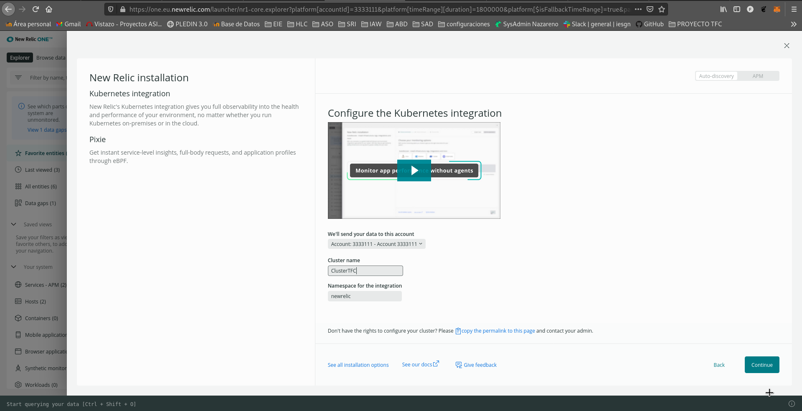

1. <a href="#lista1">Monitorización y análisis de aplicaciones web con new relic: Aquí explicas las características de la herramienta.</a>
    <p>1.1  <a href="#lista11">¿Cómo funciona?</a></p>
    <p>1.2  <a href="#lista12">Instalación de New Relic: Dejando claro donde se está instalando.</a></p>
2. <a href="#lista2">New Relic One</a>
3. <a href="#lista3">Kuberntes: Explicas que vas a desplegar una aplicación web para monitorizarla con new relic, en kuberntes, y que para ello vas a usar minikube, para crear un cluster de ejmplo.</a>
    <p>3.1  <a href="#lista31">Instalación de minikube.</a></p>
    <p>3.2  <a href="#lista32">Instalaciión de kubectl.</a></p>
    <p>3.3  <a href="#lista33">Escenario: Desplieque de una aplicación web.</a></p>
4. <a href="#lista4">Monitorización de nuestra aplicación con new relic.</a>
    <p>4.1  <a href="#lista41">Monitorización de un cluster de kubernetes</a></p>
    <p>4.2  <a href="#lista42">Monitorizar Conexiones HTTP</a></p>
    <p>4.3  <a href="#lista43">Mostrar Eventos</a></p>
    <p>4.4  <a href="#lista44">Fijar alertas</a></p>
    <p>4.5  <a href="#lista45">Gestión de logs</a></p>
    <p>4.6  <a href="#lista46">Estadísticas de rendimiento</a></p>
    <p>4.7  <a href="#lista47">Creación y gestión de nuevas Dashboard</a></p>

<hr id="lista1" >
<br>
<details open>
<summary>

## 1. New Relic 
</summary>


<details open>
<summary>

## ¿Que es New Relic?
</summary>

New Relic es una herramienta de medición del rendimiento de una infraestructura de servicios, desde backend hasta frontend: medición del rendimiento de navegadores, APIs, servidores, aplicaciones móviles… ¿Qué nos permite hacer?

* Este software es capaz de realizar las siguientes tareas:

  * Monitorizar Conexiones HTTP (tiempos de respuesta, nº de peticiones…).
  * Monitorización de errores (avisos cuando se detectan fallos de ejecución o conexión).
  * Fijar alertas sobre datos de referencia (tiempos de respuesta, errores de autenticación…).
  * Estadísticas de rendimiento en distintos dispositivos (uso de memoria, velocidad de respuesta,…).
  * Estadísticas de usuarios que la usen según el SO utilizado.

* Esta herramienta además soporta diferentes plataformas:
Aplicaciones WEB (APM)

* Permite monitorizar aplicaciones web en los siguientes lenguajes:

  * Ruby
  * PHP
  * Java
  * NET
  * Python
  * NodeJs

* Permite monitorizar nuestras aplicaciones para móviles (Android, iOS y Titanium).  
Navegadores (Browser)

* Permite monitorizar nuestro sitio sobre el navegador del usuario (tiempo de respuesta, tiempo de carga de elementos…).  
Usuarios (Synthetics)

* Permite simular usuarios (tanto flujo como interacciones) para anticiparse a los errores. Usa el servicio de alertas para avisar de esto.  
Servidores (Servers)

* Nos da una vista del servidor desde la perspectiva de la propia aplicación.

Además de las características arriba descritas, nos ofrece un amplio abanico de **plugins** para ayudarnos con ellas, e incluso añadir nuevas funcionalidades, soporte en la nube y integración con kubernete que veremos mas adelante.
</details>

<hr id="lista11" >
<br>
<details open>
<summary>

## 1.1 ¿Como funciona?
</summary>

Recopila una serie de parámetros que monitoriza a traves de nuestro navegador, para ello se lanza un agente dentro de la maquina de la que se quiera recopilar información, dependiendo de si es para recolectar datos de nuestro propio sistema o un cluster de kubernetes que tenemos alojado en la misma, etc... dependiendo del tipo de dato que necesitemos New Relic los suministrará la instalación del agente adecuado.

Podremos crear vistas en las que tengamos metricas de diferentes agentes y ademas todo el sistema es codigo abierto por lo tanto podremos modificar tambien algun agente para adaptarlo a nuestra necesidades y asi tener una monitorización mas personalizada.

Podemos ver utilidades o ejemplos de monitorización como los siguientes:

- **New Relic Browser**: New Relic monitoriza todo lo relacionado a las peticiones HTTP y HTTPs que realizamos dentro de un navegador, desde los tiempos de carga con histogramas, percentiles y gráficos con segmentación hasta reportes geográficos, rendimiento con toda la parte de backend y alertas relacionadas con peticiones AJAX y errores del Javascript. Lógicamente todos los tableros de monitorización son personalizables. 


- **New Relic Synthetics**: Permite monitorizar una aplicación móvil en todo su ciclo de vida, incluso en la fase de preproducción, desde la fase de desarrollo hasta las pruebas de testeo. Y una vez lanzado, también facilita la recolección de insights para medir el rendimiento. 

Ya tenemos una idea de que es New Relic, que datos recoge y como funciona, ahora daremos paso al proyecto comenzando con la instalacion de New Relic.
</details>

<hr id="lista12" >
<br>
<details open>
<summary>

## 1.2 Instalación de New Relic
</summary>

Realizaremos una instalación simple para poder para poder visualizar las metricas de nuestra maquina llamada **Central** en Openstacks. Para instalar New Relic primero deberemos acceder a su [website](https://newrelic.com/) para registrarnos y dar de alta nuestra cuenta que será necesaria para el acceso a nuestras vistas:


Una vez registrado procederemos a la implementación de new relic en nuestro entorno, para comenzar le daremos al icono [+ add more data]


Nos iremos a la sección de host y seleccionaremos Ubuntu:


En el plan de instalación nos pedira que instalemos el agente de New Relic:

**Agente**: Algunas integraciones de New Relic requieren la instalación manual de un agente. La forma en que se configura el comportamiento de esos agentes depende del agente específico(APM, infraestructuras, navegadores, movil, otros...).


El link que nos proporcionará es el de instalación del agente a nuestro sistema operativo:

**Nota**: Para no tener la web tan cargada he movido la captura de mi terminal a mi repositorio de Github:  
- <a href="https://github.com/franmadu6/tfc-data/blob/main/instalacion-newrelic-v" target="blank">Repositorio instalación New Relic</a>

Una vez la instalación haya sido finalizada volveremos al navegador y veremos como la pantalla ha cambiado, nos dejara darle a **See your data** para concluir la instalación, he de destaca que si nuestro equipo posee php, java, alguna base de datos, etc... Tambien lo detectaria el agente y nos lo instalaria al ejecutarlo.


Y listo! Ya tendremos nuestro agente instalado y listo para usarse.

Estos son algunos datos de los que podemos obtener atraves de new relic, que profundizaremos en ellos mas adelante.

**Debian**


</details>
</details>

<hr id="lista2" >
<br>
<details open>
<summary>

## 2. New Relic One
</summary>

Detectar, corregir y prevenir: esa es la promesa del monitoreo de software. ¿Pero qué pasa cuando las soluciones costosas impiden instrumentar todo y los enfoques poco sistemáticos producen un aumento en la cantidad de herramientas? Cuando los datos de desempeño de la aplicación, de la infraestructura y de los usuarios finales están dispersos por herramientas de monitoreo que no están conectadas, la detección y resolución de problemas puede ser innecesariamente compleja y puede consumir mucho tiempo.

Ahí es donde New Relic One marca la diferencia: una plataforma capaz de escalar masivamente y que recolecta y contextualiza todos los datos operativos—sin importar de dónde vengan—y simplifica la instrumentación, la ingestión de datos, la exploración, la correlación y el análisis basado en aprendizaje automático (machine learning), para reforzar la observabilidad de cada organización.


**Telemetry Data Platform**,todos los datos de telemetría en un solo lugar:

Recopile, explore y genere alertas en relación a todas las métricas, eventos, registros y rastros sin importar cuál sea su origen en una base de datos de telemetría abierta y unificada. Las integraciones—que vienen listas para usarse—con herramientas de código abierto como Prometheus y Grafana, por nombrar solo dos, eliminan el costo y la complejidad de administrar el almacenamiento de datos adicional.


**Todos sus datos en un solo lugar con Telemetry Data Platform.**

* Con Telemetry Data Platform, obtendrá lo siguiente:

  * Integraciones con más de 300 agentes y estándares como OpenTelemetry, lo que le permite ingerir y guardar todos los datos operativos en un solo lugar
  * Tiempos de consulta y respuesta ultra rápidos
  * La posibilidad de elegir entre crear paneles en New Relic One o conservar los flujos de trabajo existentes en Grafana
  * Alertas en tiempo real en relación a los datos
  * APIs y herramientas para crear aplicaciones personalizadas alojadas en New Relic One

**Full-Stack Observability**


Visualice y resuelva problemas de todo el stack en una experiencia unificada

Full-Stack Observability amplía la capacidad de Telemetry Data Platform, y proporciona una experiencia conectada que facilita entender en qué condición se encuentra el sistema dentro de su contexto, desde registros, infraestructura, aplicaciones y datos de la experiencia del usuario final. Elimine el trabajo extra y los puntos ciegos gracias a vistas especializadas que presentan los problemas automáticamente a sus equipos incluso antes de que a usted se le ocurra preguntar.


El explorador de clústeres de Kubernetes de New Relic reúne todos los elementos de observabilidad: métricas, eventos, registros y rastros.

Con Full-Stack Observability, obtendrá lo siguiente:

  * Toda la funcionalidad de New Relic que conoce y que tanto le agrada—APM, Infrastructure, Logs in Context, Distributed Tracing, Serverless, Browser, Mobile y Synthetics—todo en un solo paquete
  * Información contextual acerca de sus servicios distribuidos, aplicaciones y funciones sin servidor, sin importar cómo o dónde se hayan desarrollado
  * Visibilidad incomparable en los hosts de infraestructura, contenedores, recursos de nubes y clústers de Kubernetes
  * Análisis del rendimiento de extremo a extremo, desde los servicios de backend hasta la experiencia de los usuarios finales

**Applied Intelligence**


Detecte y resuelva problemas con más rapidez

Detecte, comprenda y resuelva los incidentes con más rapidez gracias a las potentes capacidades de AIOps. Applied Intelligence detecta y explica anomalías automáticamente antes de que se conviertan en incidentes, reduce el exceso de alertas repetidas gracias a que correlaciona las alertas relacionadas y diagnostica problemas enriqueciendo incidentes con contexto, lo que permite ir rápidamente a la raíz de los problemas.


Applied Intelligence utiliza el aprendizaje automático para automatizar las alertas.

Con Applied Intelligence, obtendrá lo siguiente:

  * Detección proactiva que detecta las anomalías antes de que se conviertan en incidentes
  * Inteligencia sobre incidentes que reduce el exceso de alertas repetidas y prioriza los problemas
  * Configuraciones con herramientas como Slack y PagerDuty para agilizar el diagnóstico y los tiempos de respuesta


**Observabilidad simplificada**

Con New Relic One podrá pasar menos tiempo resolviendo problemas y más tiempo diseñando software. Instrumente todo para eliminar los puntos ciegos, y hágalo a una escala de Petabytes. Practique la observabilidad del stack completo y aproveche Applied Intelligence y el aprendizaje automático para detectar problemas rápidamente y reducir el exceso de alertas repetidas. Bienvenido a la era de la observabilidad.

</details>

<hr id="lista3" >
<br>
<details open>
<summary>

## 3. Kubernetes: Explicas que vas a desplegar una aplicación web para monitorizarla con new relic, en kuberntes, y que para ello vas a usar minikube, para crear un cluster de ejmplo.
</summary>

EXPLICACIÓN SOBRE LA PRACTICA DE KUBERNETES


<hr id="lista31" >
<br>
<details open>
<summary>

## 3.1 Instalación de minikube
</summary>

Antes monitorizar nuestro cluster deberemos de confirgurarlo primero, para ello utilizaremos **minikube** para crear nuestros clusters, procederemos a su instalación.
```shell
vagrant@svKube:~$ curl -LO https://storage.googleapis.com/minikube/releases/latest/minikube-linux-amd64
  % Total    % Received % Xferd  Average Speed   Time    Time     Time  Current
                                 Dload  Upload   Total   Spent    Left  Speed
100 66.3M  100 66.3M    0     0  3995k      0  0:00:17  0:00:17 --:--:-- 3952k
vagrant@svKube:~$ sudo install minikube-linux-amd64 /usr/local/bin/minikube
```

Al inicializarlo nos da varios errores en mi casa tuve que ejecutarlo con minikube start --vm-driver=none y instalar docker,docker.io y conntrack, este fue un poco el historial de comandos que ejecute.
```shell
vagrant@svKube:~$ minikube start
vagrant@svKube:~$ minikube start --vm-driver=none
root@svKube:/home/vagrant# apt install docker docker.io
root@svKube:/home/vagrant# minikube start --vm-driver=none
root@svKube:/home/vagrant# sudo apt-get install -y conntrack
```

Ahora si podremos ejecutarlo correctamente:
```shell
root@svKube:/home/vagrant# minikube start --vm-driver=none
😄  minikube v1.24.0 on Debian 10.11 (vbox/amd64)
✨  Using the none driver based on user configuration

🧯  The requested memory allocation of 1995MiB does not leave room for system overhead (total system memory: 1995MiB). You may face stability issues.
💡  Suggestion: Start minikube with less memory allocated: 'minikube start --memory=1995mb'

👍  Starting control plane node minikube in cluster minikube
🤹  Running on localhost (CPUs=2, Memory=1995MB, Disk=20029MB) ...
ℹ️  OS release is Debian GNU/Linux 10 (buster)
    > kubeadm.sha256: 64 B / 64 B [--------------------------] 100.00% ? p/s 0s
    > kubectl.sha256: 64 B / 64 B [--------------------------] 100.00% ? p/s 0s
    > kubelet.sha256: 64 B / 64 B [--------------------------] 100.00% ? p/s 0s
    > kubeadm: 43.71 MiB / 43.71 MiB [---------------] 100.00% 3.84 MiB p/s 12s
    > kubectl: 44.73 MiB / 44.73 MiB [---------------] 100.00% 3.86 MiB p/s 12s
    > kubelet: 115.57 MiB / 115.57 MiB [-------------] 100.00% 4.01 MiB p/s 29s

    ▪ Generating certificates and keys ...
    ▪ Booting up control plane ...
    ▪ Configuring RBAC rules ...
🤹  Configuring local host environment ...

❗  The 'none' driver is designed for experts who need to integrate with an existing VM
💡  Most users should use the newer 'docker' driver instead, which does not require root!
📘  For more information, see: https://minikube.sigs.k8s.io/docs/reference/drivers/none/

❗  kubectl and minikube configuration will be stored in /root
❗  To use kubectl or minikube commands as your own user, you may need to relocate them. For example, to overwrite your own settings, run:

    ▪ sudo mv /root/.kube /root/.minikube $HOME
    ▪ sudo chown -R $USER $HOME/.kube $HOME/.minikube

💡  This can also be done automatically by setting the env var CHANGE_MINIKUBE_NONE_USER=true
🔎  Verifying Kubernetes components...
    ▪ Using image gcr.io/k8s-minikube/storage-provisioner:v5
🌟  Enabled addons: default-storageclass, storage-provisioner
💡  kubectl not found. If you need it, try: 'minikube kubectl -- get pods -A'
🏄  Done! kubectl is now configured to use "minikube" cluster and "default" namespace by default
```

Podremos apreciar su correcta instalación observando que sus pods estan corriendo.
```shell
root@svKube:/home/vagrant# minikube kubectl -- get pods -A
NAMESPACE     NAME                             READY   STATUS    RESTARTS   AGE
kube-system   coredns-78fcd69978-hchrh         1/1     Running   0          2m23s
kube-system   etcd-svkube                      1/1     Running   0          2m36s
kube-system   kube-apiserver-svkube            1/1     Running   0          2m36s
kube-system   kube-controller-manager-svkube   1/1     Running   0          2m38s
kube-system   kube-proxy-hv5zs                 1/1     Running   0          2m23s
kube-system   kube-scheduler-svkube            1/1     Running   0          2m36s
kube-system   storage-provisioner              1/1     Running   0          2m35s
```

Para comenzar su monitorización con **New relic** deberemos instalar **Helm**, la principal función de Helm es definir, instalar y actualizar aplicaciones complejas de Kubernetes. 
```shell
root@svKube:/home/vagrant# curl -fsSL -o get_helm.sh https://raw.githubusercontent.com/helm/helm/main/scripts/get-helm-3
root@svKube:/home/vagrant# chmod 700 get_helm.sh
root@svKube:/home/vagrant# ./get_helm.sh
Downloading https://get.helm.sh/helm-v3.7.1-linux-amd64.tar.gz
Verifying checksum... Done.
Preparing to install helm into /usr/local/bin
helm installed into /usr/local/bin/helm
```

El comando que nos proporciona **New relic** para establece una conexión con nuestro cluster no es valido para minikube, para ejecutarlo correctamente simplemente deberemos modificar la linea:
kubectl create namespace kube-system ; helm upgrade --install newrelic-bundle newrelic/nri-bundle \
por:
minikube kubectl create namespace kube-system ; helm upgrade --install newrelic-bundle newrelic/nri-bundle \

```shell
helm repo add newrelic https://helm-charts.newrelic.com && helm repo update && \
minikube kubectl create namespace kube-system ; helm upgrade --install newrelic-bundle newrelic/nri-bundle \
 --set global.licenseKey=eu01xx48059720c231a1080bc348906513e7NRAL \
 --set global.cluster=minikube \
 --namespace=kube-system \
 --set newrelic-infrastructure.privileged=true \
 --set global.lowDataMode=true \
 --set ksm.enabled=true \
 --set kubeEvents.enabled=true 
 ```


</details>

<hr id="lista32" >
<br>
<details open>
<summary>

## 3.2 Instalación de kubectl
</summary>

Instalaremos kubectl atraves del gestor de paquetes pues es la manera mas comoda y sencilla, en la cual añadiremos el repositorio de kubernete a nuestra maquina para utilizar su gestor:
```shell
sudo apt-get update && sudo apt-get install -y apt-transport-https gnupg2 curl
curl -s https://packages.cloud.google.com/apt/doc/apt-key.gpg | sudo apt-key add -
echo "deb https://apt.kubernetes.io/ kubernetes-xenial main" | sudo tee -a /etc/apt/sources.list.d/kubernetes.list
sudo apt-get update
sudo apt-get install -y kubectl
```  
  
  
**Nota**: Para no tener la web tan cargada he movido la captura de mi terminal a mi repositorio de Github:  
- <a href="https://github.com/franmadu6/tfc-data/blob/main/instalacion-kubectl-v" target="blank">Repositorio instalación kubectl</a>

Para verificar su instalación veremos que versión fue instalada:
```shell
ubuntu@controlador:~$  kubectl version --client
Client Version: version.Info{Major:"1", Minor:"23", GitVersion:"v1.23.0", GitCommit:"ab69524f795c42094a6630298ff53f3c3ebab7f4", GitTreeState:"clean", BuildDate:"2021-12-07T18:16:20Z", GoVersion:"go1.17.3", Compiler:"gc", Platform:"linux/amd64"}
```
  
  
</details>

<hr id="lista33" >
<br>
<details open>
<summary>

## 3.3 Escenario: Desplieque de una aplicación web.
</summary>


- <a href="https://github.com/franmadu6/tfc-data/blob/main/Vagrantfile" target="blank">Vagrantfile</a>

Para esta demostración de como New Relic monitoriza un cluster que tenga desplegado una app web, crearemos un escenario con 3 maquinas que constaran de un controlador con 2 workers que se encargaran de balancear y replicar la aplicación web que instalaremos en el controlador.   
  

### Instalación de k3s en el controlador.

Ejecutaremos el siguiente comando el cual realizará una instalación automática de k3s:
```shell
vagrant@controlador:~$ curl -sfL https://get.k3s.io | sh -
[INFO]  Finding release for channel stable
[INFO]  Using v1.21.7+k3s1 as release
[INFO]  Downloading hash https://github.com/k3s-io/k3s/releases/download/v1.21.7+k3s1/sha256sum-amd64.txt
[INFO]  Skipping binary downloaded, installed k3s matches hash
[INFO]  Skipping installation of SELinux RPM
[INFO]  Skipping /usr/local/bin/kubectl symlink to k3s, already exists
[INFO]  Skipping /usr/local/bin/crictl symlink to k3s, already exists
[INFO]  Skipping /usr/local/bin/ctr symlink to k3s, already exists
[INFO]  Creating killall script /usr/local/bin/k3s-killall.sh
[INFO]  Creating uninstall script /usr/local/bin/k3s-uninstall.sh
[INFO]  env: Creating environment file /etc/systemd/system/k3s.service.env
[INFO]  systemd: Creating service file /etc/systemd/system/k3s.service
[INFO]  systemd: Enabling k3s unit
Created symlink /etc/systemd/system/multi-user.target.wants/k3s.service → /etc/systemd/system/k3s.service.
[INFO]  systemd: Starting k3s
```

Una vez instalado podremos obtener información de los nodos:
```shell
vagrant@controlador:~$ sudo kubectl get nodes
NAME          STATUS   ROLES                  AGE   VERSION
controlador   Ready    control-plane,master   72m   v1.21.7+k3s1
```

### Parámetros necesarios para los workers

Necesitaremos la INTERNAL-IP que podremos obtener de la salida del siguiente comando:
```shell
vagrant@controlador:~$ sudo kubectl get nodes -o wide
NAME          STATUS   ROLES                  AGE   VERSION        INTERNAL-IP     EXTERNAL-IP   OS-IMAGE                       KERNEL-VERSION    CONTAINER-RUNTIME
controlador   Ready    control-plane,master   73m   v1.21.7+k3s1   10.15.198.198   <none>        Debian GNU/Linux 10 (buster)   4.19.0-18-amd64   containerd://1.4.12-k3s1
```

Para vincular los nuevos nodos con el controlador necesitaremos además de la ip de controller su token de verificación:
```shell
vagrant@controlador:~$ sudo cat /var/lib/rancher/k3s/server/node-token
K105a63e1097066148871e29940800e6dc96e5f053d48087f632b9bd27044190d52::server:848c555ce0c19353f1a452c9c570e832
```


### Instalación de k3s en los workers.  

La siguiente acción que realizaremos se hará de igual manera en ambos workers y consistira en añadire tanto la ip y el token obtenidos anteriormente a variables de entorno:
```shell
vagrant@worker1:~$ k3s_url="https://10.15.198.198:6443"
vagrant@worker1:~$ k3s_token="K105a63e1097066148871e29940800e6dc96e5f053d48087f632b9bd27044190d52::server:848c555ce0c19353f1a452c9c570e832"
```

```shell
vagrant@worker1:~$ curl -sfL https://get.k3s.io | K3S_URL=${k3s_url} K3S_TOKEN=${k3s_token} sh
[INFO]  Finding release for channel stable
[INFO]  Using v1.21.7+k3s1 as release
[INFO]  Downloading hash https://github.com/k3s-io/k3s/releases/download/v1.21.7+k3s1/sha256sum-amd64.txt
[INFO]  Downloading binary https://github.com/k3s-io/k3s/releases/download/v1.21.7+k3s1/k3s
[INFO]  Verifying binary download
[INFO]  Installing k3s to /usr/local/bin/k3s
[INFO]  Skipping installation of SELinux RPM
[INFO]  Creating /usr/local/bin/kubectl symlink to k3s
[INFO]  Creating /usr/local/bin/crictl symlink to k3s
[INFO]  Creating /usr/local/bin/ctr symlink to k3s
[INFO]  Creating killall script /usr/local/bin/k3s-killall.sh
[INFO]  Creating uninstall script /usr/local/bin/k3s-agent-uninstall.sh
[INFO]  env: Creating environment file /etc/systemd/system/k3s-agent.service.env
[INFO]  systemd: Creating service file /etc/systemd/system/k3s-agent.service
[INFO]  systemd: Enabling k3s-agent unit
Created symlink /etc/systemd/system/multi-user.target.wants/k3s-agent.service → /etc/systemd/system/k3s-agent.service.
[INFO]  systemd: Starting k3s-agent
```

Una vez realizada la instalación en ambas maquinas podremos comprobar que estan operativas chequeando los nodos disponibles desde el controlador.
```shell
vagrant@controlador:~$ sudo kubectl get nodes
NAME          STATUS   ROLES                  AGE     VERSION
controlador   Ready    control-plane,master   89m     v1.21.7+k3s1
worker1       Ready    <none>                 4m52s   v1.21.7+k3s1
worker2       Ready    <none>                 13s     v1.21.7+k3s1
```
  
### Gestionar el cluster desde fuera del escenario.  

Deberemos instalar **kubectl** como hemos echo <a href="#lista32">anteriormente</a>, nos iremos a nuestro controlador y copiaremos el archivo /etc/rancher/k3s/k3s.yaml:
  
- <a href="https://github.com/franmadu6/tfc-data/blob/main/k3s.yaml-controlador" target="blank">k3s.yaml-controlador</a>

Crearemos un nuevo fichero de configuración y cambiaremos su ip por la de nuestro controlador para que quede así: 

- <a href="https://github.com/franmadu6/tfc-data/blob/main/k3s.yaml-central" target="blank">k3s.yaml-central</a>


Cargaremos el fichero con las credenciales:
```shell
fran@debian:~$ export KUBECONFIG=~/.kube/config
```

Y ya podremos comprobar que tenemos nuestros nodos estan operativos desde nuestra maquina anfitriona:
```shell
fran@debian:~$ kubectl get nodes
NAME          STATUS   ROLES                  AGE    VERSION
controlador   Ready    control-plane,master   111m   v1.21.7+k3s1
worker1       Ready    <none>                 27m    v1.21.7+k3s1
worker2       Ready    <none>                 23m    v1.21.7+k3s1
```

### Despligue de Letschat.

Ahora realizaremos un despliegue de la aplicación Letschat, clonaremos el repositorio del centro, el cual aparte del ejemplo que vamos a utilizar posee varios mas sobre la utilizaicon de kubectl:
```shell
fran@debian:~/vagrant/proyectonewrelic$ git clone https://github.com/iesgn/kubernetes-storm.git
Clonando en 'kubernetes-storm'...
remote: Enumerating objects: 288, done.
remote: Counting objects: 100% (288/288), done.
remote: Compressing objects: 100% (213/213), done.
remote: Total 288 (delta 119), reused 224 (delta 60), pack-reused 0
Recibiendo objetos: 100% (288/288), 6.36 MiB | 3.15 MiB/s, listo.
Resolviendo deltas: 100% (119/119), listo.
```

Nos desplazaremos al ejemplo8 citado en la tarea y ejecutaremos el siguiente comando:
```shell
fran@debian:~/vagrant/proyectonewrelic$ ls
1  kubernetes-storm  Vagrantfile
fran@debian:~/vagrant/proyectonewrelic$ cd kubernetes-storm/unidad3/ejemplos-3.2/ejemplo8/
fran@debian:~/vagrant/proyectonewrelic/kubernetes-storm/unidad3/ejemplos-3.2/ejemplo8$ kubectl apply -f .
Warning: networking.k8s.io/v1beta1 Ingress is deprecated in v1.19+, unavailable in v1.22+; use networking.k8s.io/v1 Ingress
ingress.networking.k8s.io/ingress-letschat created
deployment.apps/letschat created
service/letschat created
deployment.apps/mongo created
service/mongo created
```

El fichero desplegará varios servicios, pasado unos segundos podremos observar que ya estará todo listo:
```shell
fran@debian:~/vagrant/proyectonewrelic/kubernetes-storm/unidad3/ejemplos-3.2/ejemplo8$ kubectl get all,ingress
NAME                            READY   STATUS              RESTARTS   AGE
pod/letschat-7c66bd64f5-p6z55   0/1     ContainerCreating   0          18s
pod/mongo-5c694c878b-5nwmp      0/1     ContainerCreating   0          18s

NAME                 TYPE        CLUSTER-IP      EXTERNAL-IP   PORT(S)          AGE
service/kubernetes   ClusterIP   10.43.0.1       <none>        443/TCP          4h46m
service/letschat     NodePort    10.43.173.187   <none>        8080:32241/TCP   18s
service/mongo        ClusterIP   10.43.20.221    <none>        27017/TCP        18s

NAME                       READY   UP-TO-DATE   AVAILABLE   AGE
deployment.apps/mongo      0/1     1            0           18s
deployment.apps/letschat   0/1     1            0           18s

NAME                                  DESIRED   CURRENT   READY   AGE
replicaset.apps/mongo-5c694c878b      1         1         0       18s
replicaset.apps/letschat-7c66bd64f5   1         1         0       18s

NAME                                         CLASS    HOSTS              ADDRESS                                    PORTS   AGE
ingress.networking.k8s.io/ingress-letschat   <none>   www.letschat.com   10.108.155.90,10.15.198.198,10.99.38.185   80      18s
```

Servicios desplegados:

  * mongo-deployment, mongo-srv: Despliegue y conexión con una base de datos mongo.
  * letschat-deployment, letschat-srv: Despligue y servicio de la aplicación letschat y su conexión con una base de datos.
  * ingress: Para poder acceder a la apliación mediante un nombre.


### Escalado

Para que podamos comprobar el funcionamiento de escalado bastara con ejecutar el siguiente comando:
```shell
fran@debian:~$ kubectl scale deployment letschat --replicas=6
deployment.apps/letschat scaled
```

Pasados unos segundos las replicas estaran ya escaladas.

Nota: Deberás de tener en cuenta la capicidad de tu ordenador a la hora de escalar las replicas, ya que el proceso podria suponer demasiado estres en la maquina dando lugar a una relentizacióń o incluso caida de alguna de las máquinas del escenario:
```shell
fran@debian:~$ kubectl get all
NAME                            READY   STATUS    RESTARTS   AGE
pod/mongo-5c694c878b-5nwmp      1/1     Running   0          12m
pod/letschat-7c66bd64f5-p6z55   1/1     Running   3          12m
pod/letschat-7c66bd64f5-lsjk9   1/1     Running   0          92s
pod/letschat-7c66bd64f5-6p76p   1/1     Running   0          92s
pod/letschat-7c66bd64f5-gzx4v   1/1     Running   0          92s
pod/letschat-7c66bd64f5-ml8ww   1/1     Running   0          92s
pod/letschat-7c66bd64f5-vbt4d   1/1     Running   0          92s

NAME                 TYPE        CLUSTER-IP      EXTERNAL-IP   PORT(S)          AGE
service/kubernetes   ClusterIP   10.43.0.1       <none>        443/TCP          4h58m
service/letschat     NodePort    10.43.173.187   <none>        8080:32241/TCP   12m
service/mongo        ClusterIP   10.43.20.221    <none>        27017/TCP        12m

NAME                       READY   UP-TO-DATE   AVAILABLE   AGE
deployment.apps/mongo      1/1     1            1           12m
deployment.apps/letschat   6/6     6            6           12m

NAME                                  DESIRED   CURRENT   READY   AGE
replicaset.apps/mongo-5c694c878b      1         1         1       12m
replicaset.apps/letschat-7c66bd64f5   6         6         6       12m
fran@debian:~$ kubectl get deploy,rs,po -o wide
NAME                       READY   UP-TO-DATE   AVAILABLE   AGE   CONTAINERS   IMAGES                 SELECTOR
deployment.apps/mongo      1/1     1            1           12m   mongo        mongo                  name=mongo
deployment.apps/letschat   6/6     6            6           12m   letschat     sdelements/lets-chat   name=letschat

NAME                                  DESIRED   CURRENT   READY   AGE   CONTAINERS   IMAGES                 SELECTOR
replicaset.apps/mongo-5c694c878b      1         1         1       12m   mongo        mongo                  name=mongo,pod-template-hash=5c694c878b
replicaset.apps/letschat-7c66bd64f5   6         6         6       12m   letschat     sdelements/lets-chat   name=letschat,pod-template-hash=7c66bd64f5

NAME                            READY   STATUS    RESTARTS   AGE   IP          NODE      NOMINATED NODE   READINESS GATES
pod/mongo-5c694c878b-5nwmp      1/1     Running   0          12m   10.42.2.4   worker2   <none>           <none>
pod/letschat-7c66bd64f5-p6z55   1/1     Running   3          12m   10.42.1.4   worker1   <none>           <none>
pod/letschat-7c66bd64f5-lsjk9   1/1     Running   0          96s   10.42.1.7   worker1   <none>           <none>
pod/letschat-7c66bd64f5-6p76p   1/1     Running   0          96s   10.42.1.6   worker1   <none>           <none>
pod/letschat-7c66bd64f5-gzx4v   1/1     Running   0          96s   10.42.2.7   worker2   <none>           <none>
pod/letschat-7c66bd64f5-ml8ww   1/1     Running   0          96s   10.42.2.8   worker2   <none>           <none>
pod/letschat-7c66bd64f5-vbt4d   1/1     Running   0          96s   10.42.2.6   worker2   <none>           <none>
```

Volvemos a rebajar el número de replicas a 1 para cuidar los recursos de nuestra maquina, como podemos comprobar esto no es instantaneo y se van parando los procesos poco a poco.
```shell
fran@debian:~/vagrant/proyectonewrelic$ kubectl scale deploy letschat --replicas=1
deployment.apps/letschat scaled
fran@debian:~/vagrant/proyectonewrelic$ kubectl get deploy,rs,po -o wide
NAME                       READY   UP-TO-DATE   AVAILABLE   AGE   CONTAINERS   IMAGES                 SELECTOR
deployment.apps/mongo      1/1     1            1           18h   mongo        mongo                  name=mongo
deployment.apps/letschat   1/1     1            1           18h   letschat     sdelements/lets-chat   name=letschat

NAME                                  DESIRED   CURRENT   READY   AGE   CONTAINERS   IMAGES                 SELECTOR
replicaset.apps/mongo-5c694c878b      1         1         1       18h   mongo        mongo                  name=mongo,pod-template-hash=5c694c878b
replicaset.apps/letschat-7c66bd64f5   1         1         1       18h   letschat     sdelements/lets-chat   name=letschat,pod-template-hash=7c66bd64f5

NAME                            READY   STATUS        RESTARTS   AGE   IP           NODE          NOMINATED NODE   READINESS GATES
pod/mongo-5c694c878b-tgsnk      1/1     Running       0          69m   10.42.1.8    worker1       <none>           <none>
pod/letschat-7c66bd64f5-9z6fl   1/1     Running       0          69m   10.42.0.24   controlador   <none>           <none>
pod/letschat-7c66bd64f5-ml8ww   0/1     Terminating   0          18h   <none>       worker2       <none>           <none>
pod/mongo-5c694c878b-5nwmp      0/1     Terminating   0          18h   <none>       worker2       <none>           <none>
pod/letschat-7c66bd64f5-vbt4d   0/1     Terminating   0          18h   <none>       worker2       <none>           <none>
pod/letschat-7c66bd64f5-gzx4v   0/1     Terminating   0          18h   <none>       worker2       <none>           <none>
pod/letschat-7c66bd64f5-xmj76   1/1     Terminating   0          69m   10.42.0.25   controlador   <none>           <none>
pod/letschat-7c66bd64f5-6p76p   1/1     Terminating   5          18h   10.42.1.6    worker1       <none>           <none>
pod/letschat-7c66bd64f5-p6z55   1/1     Terminating   8          18h   10.42.1.4    worker1       <none>           <none>
pod/letschat-7c66bd64f5-g7dsf   1/1     Terminating   2          69m   10.42.1.9    worker1       <none>           <none>
pod/letschat-7c66bd64f5-lsjk9   1/1     Terminating   6          18h   10.42.1.7    worker1       <none>           <none>
```

### Componente ingress

Para comprobar que el componente ingress este operativo (recordemos que sirve para poder acceder a la aplicación mediante un nombre) intentaremos acceder nuestra pagina de letschat generada anteriormente, para ello añadiremos la ip a nuestro fichero de hosts y accederemos via web:
```shell
vagrant@controlador:~$ sudo kubectl get ingress
NAME               CLASS    HOSTS              ADDRESS                                    PORTS   AGE
ingress-letschat   <none>   www.letschat.com   10.108.155.90,10.15.198.198,10.99.38.185   80      19h

sudo nano /etc/hosts
10.108.155.90	www.letschat.com
```

La API que se usa en el proyecto se ha quedado obsoleta y no nos permite acceder via web, deberemos actualizarla el contenido para adaptarlo a la versión v1, para ello deberemos modificar el siguiente fichero para que quede así:
```shell
fran@debian:~/vagrant/proyectonewrelic/kubernetes-storm/unidad3/ejemplos-3.2/ejemplo8$ cat ingress.yaml 
apiVersion: networking.k8s.io/v1
kind: Ingress
metadata:
  name: ingress-letschat
spec:
  rules:
  - host: www.letschat.com
    http:
      paths:
      - path: "/"
        pathType: Prefix
        backend:
          service:
            name: letschat
            port:
              number: 8080
```

Ahora si podremos acceder a la aplicación:


### Simulacro de fallo

Simularemos una situación real en la que uno de los workers llegara a caerse, como usamos vagrant bastará con apagar la maquina worker2.
```shell
fran@debian:~/vagrant/proyectonewrelic$ vagrant halt worker2
==> worker2: Attempting graceful shutdown of VM...
==> worker2: Forcing shutdown of VM...
```

Como podemos comprobar tras volver a listar deply,replpicaset y pods estan empezando a fallar ya que se perdio la conexión con el worker2 
```shell
fran@debian:~/vagrant/proyectonewrelic$ kubectl get deploy,rs,po -o wide
NAME                       READY   UP-TO-DATE   AVAILABLE   AGE   CONTAINERS   IMAGES                 SELECTOR
deployment.apps/mongo      1/1     1            1           17h   mongo        mongo                  name=mongo
deployment.apps/letschat   3/6     6            3           17h   letschat     sdelements/lets-chat   name=letschat

NAME                                  DESIRED   CURRENT   READY   AGE   CONTAINERS   IMAGES                 SELECTOR
replicaset.apps/mongo-5c694c878b      1         1         1       17h   mongo        mongo                  name=mongo,pod-template-hash=5c694c878b
replicaset.apps/letschat-7c66bd64f5   6         6         3       17h   letschat     sdelements/lets-chat   name=letschat,pod-template-hash=7c66bd64f5

NAME                            READY   STATUS             RESTARTS   AGE    IP           NODE          NOMINATED NODE   READINESS GATES
pod/letschat-7c66bd64f5-vbt4d   1/1     Terminating        0          17h    10.42.2.6    worker2       <none>           <none>
pod/letschat-7c66bd64f5-gzx4v   1/1     Terminating        0          17h    10.42.2.7    worker2       <none>           <none>
pod/mongo-5c694c878b-5nwmp      1/1     Terminating        0          17h    10.42.2.4    worker2       <none>           <none>
pod/letschat-7c66bd64f5-ml8ww   1/1     Terminating        0          17h    10.42.2.8    worker2       <none>           <none>
pod/letschat-7c66bd64f5-lsjk9   0/1     CrashLoopBackOff   5          17h    10.42.1.7    worker1       <none>           <none>
pod/mongo-5c694c878b-tgsnk      1/1     Running            0          3m3s   10.42.1.8    worker1       <none>           <none>
pod/letschat-7c66bd64f5-g7dsf   1/1     Running            2          3m3s   10.42.1.9    worker1       <none>           <none>
pod/letschat-7c66bd64f5-xmj76   0/1     ImagePullBackOff   0          3m3s   10.42.0.25   controlador   <none>           <none>
pod/letschat-7c66bd64f5-p6z55   1/1     Running            8          17h    10.42.1.4    worker1       <none>           <none>
pod/letschat-7c66bd64f5-6p76p   1/1     Running            5          17h    10.42.1.6    worker1       <none>           <none>
pod/letschat-7c66bd64f5-9z6fl   0/1     ErrImagePull       0          3m3s   10.42.0.24   controlador   <none>           <none>
```

Existe un parámetro llamado pod-eviction-timeout que especifica el tiempo que trascurre hasta que otro nodo/nodos recogen la carga dejada por el caido cuyo valor pode defecto es de 5 minutos.

Si comprobamos 5 minutos despues de la caida, podemos apreciar lo siguiente:
```shell
fran@debian:~/vagrant/proyectonewrelic$ kubectl get deploy,rs,po -o wide
NAME                       READY   UP-TO-DATE   AVAILABLE   AGE   CONTAINERS   IMAGES                 SELECTOR
deployment.apps/mongo      1/1     1            1           19h   mongo        mongo                  name=mongo
deployment.apps/letschat   6/6     6            6           19h   letschat     sdelements/lets-chat   name=letschat

NAME                                  DESIRED   CURRENT   READY   AGE   CONTAINERS   IMAGES                 SELECTOR
replicaset.apps/mongo-5c694c878b      1         1         1       19h   mongo        mongo                  name=mongo,pod-template-hash=5c694c878b
replicaset.apps/letschat-7c66bd64f5   6         6         6       19h   letschat     sdelements/lets-chat   name=letschat,pod-template-hash=7c66bd64f5

NAME                            READY   STATUS    RESTARTS   AGE    IP           NODE          NOMINATED NODE   READINESS GATES
pod/mongo-5c694c878b-tgsnk      1/1     Running   0          129m   10.42.1.8    worker1       <none>           <none>
pod/letschat-7c66bd64f5-9z6fl   1/1     Running   0          129m   10.42.0.24   controlador   <none>           <none>
pod/letschat-7c66bd64f5-q8zm4   1/1     Running   0          11m    10.42.0.26   controlador   <none>           <none>
pod/letschat-7c66bd64f5-gfqr2   1/1     Running   0          11m    10.42.1.12   worker1       <none>           <none>
pod/letschat-7c66bd64f5-vzt9s   1/1     Running   0          11m    10.42.1.13   worker1       <none>           <none>
pod/letschat-7c66bd64f5-dxpdr   1/1     Running   0          11m    10.42.1.11   worker1       <none>           <none>
pod/letschat-7c66bd64f5-44lxf   1/1     Running   0          11m    10.42.1.10   worker1       <none>           <none>
```

Tanto el controlador como el worker1 se han repartido la carga, siguen siendo 6 replicas y sigue estan operativa:


Ya hemos dado un buen repaso al cluster ahora comenzaremos con su monitorización y mas contenido que nos puede aportar new relic.
</details>
</details>


<hr id="lista4" >
<br>
<details open>
<summary>

## 4. Monitorización de nuestra aplicación con new relic.
</summary>

New Relic utiliza New Relic One que es su plataforma de monitorizacion,logs y alertas como ya hemos explicado anteriormente, ahora daremos paso a explicar detalladamente su uso.

Antes de entrar a detallar los diferentes aspectos y funciones de monitorización que pose New relic comenzaremos con la monitorización general, en mi caso la de mi maquina debian que actualmente es la que uso para el desarrollo del proyecto.


Como podemos observar a simple vista nos da bastantes datos diferentes como: el uso del CPU, la memoria usada, el trafico de red, disco usado, procesos que se estran ejecutando actualmente, media de carga, entre otros muchos. Es una interfaz sencilla y bastante detallada, de facil acceso ya que solo necesitaremos acceso a internet para poder acceder a su web donde mediante una cuenta podremos hacer uso de la plataforma.

<hr id="lista41" >
<br>
<details open>
<summary>

## 4.1 Monitorización de un cluster de kubernetes

</summary>

No iremos a [+ add more data] en la esquina superior derecha y selecionaremos en Cloud and platform technologies Kubernetes


Le daremos un nombre para que new relic lo identifique, el nombre que recibe el cluster en new relic es orientativo y no modifica nada en nuestro cluster.


Podremos seleccionar contenido adicional, en mi caso deje los que se marcaban por defecto, en especial los dos ultimos marcados que me parecian mas interesantes: recopilar datos de registro y reducir la cantidad de datos ingeridos, esto hará que los datos obtenidos sean los justos y necesarios para lograr una correcta monitorización aumentando así la velocidad de refresco de los mismos.


Iremos a nuestra maquina e instalaremos el codigo que nos proporciona.
```shell
helm repo add newrelic https://helm-charts.newrelic.com && helm repo update && \
minikube kubectl create namespace kube-system ; helm upgrade --install newrelic-bundle newrelic/nri-bundle \
 --set global.licenseKey=eu01xx48059720c231a1080bc348906513e7NRAL \
 --set global.cluster=minikube \
 --namespace=kube-system \
 --set newrelic-infrastructure.privileged=true \
 --set global.lowDataMode=true \
 --set ksm.enabled=true \
 --set kubeEvents.enabled=true 
```

Nota:Si no tenemos instalado Helm sigue estas breves instrucciones.
```shell
$ curl -fsSL -o get_helm.sh https://raw.githubusercontent.com/helm/helm/main/scripts/get-helm-3
$ chmod 700 get_helm.sh
$ ./get_helm.sh
```


Tendremos que esperar a que new relic recopile los primeros datos necesarios para monitorizar nuestro cluster.


Una vez finalizado el proceso podremos explorar el cluster monitorizado!

Como podemos comprobar nos muestra nuestro proyecto realizado anteriormente el cual constaba de 3 maquinas (controlador y 2 workers).

Como podemos comprobar


</details>

<hr id="lista42" >
<br>
<details open>
<summary>

## 4.2 Monitorizar Conexiones HTTP(Navegador)
</summary>

Comenzaremos monitorizando del trafico de nuestro navegador


```shell
fran@debian:~$ docker run -d --name ktranslate-ipfix --restart unless-stopped --net=host \
> -v `pwd`/snmp-base.yaml:/snmp-base.yaml \
> -e NEW_RELIC_API_KEY=eu01xxecd80a49b9c4fc36c38f31aadaFFFFNRAL  \
> kentik/ktranslate:v2 \
>   -snmp /snmp-base.yaml \
>   -nr_account_id=3333111 \
>   -log_level=info \
>   -metrics=jchf \
>   -flow_only=true \
>   -nf.source=ipfix \
>   -tee_logs=true \
>   -service_name=ipfix \
>   -nr_region=EU \
>   nr1.flow
Unable to find image 'kentik/ktranslate:v2' locally
v2: Pulling from kentik/ktranslate
97518928ae5f: Pull complete 
c5ab775387cf: Pull complete 
3fb672fad4c3: Pull complete 
6e1574d9f562: Pull complete 
d84e6cfa7dfa: Pull complete 
2c08d50c8195: Pull complete 
801ef62de11b: Pull complete 
009b5c293950: Pull complete 
d7216316c0e3: Pull complete 
8d149d0516da: Pull complete 
7dc919990f13: Pull complete 
Digest: sha256:5ab5a1e2b753bad01911be240ff2df5deae2f65ec985b21b731c1885a720831e
Status: Downloaded newer image for kentik/ktranslate:v2
ec4c1cd7df1e240d62825ed0b0353046687592f3f5da9d5b23bfd8e627eadf97
```


</details>

<hr id="lista43" >
<br>
<details open>
<summary>

## 4.3 Mostrar eventos
</summary>

La API de eventos de New Relic es una forma de informar eventos personalizados a New Relic, permite enviar datos de eventos personalizados a nuestra cuenta con un comando POST. Luego, estos eventos se pueden consultar y crear gráficos mediante NRQL(Lenguaje de consulta de New Relic).


Eventos en New Relic:
En New Relic, los eventos tienen varios atributos (pares clave-valor) adjuntos. Los datos de los eventos se utilizan en algunos gráficos y tablas de la interfaz de usuario, y también podemos consultarlos. El tiempo que permanecen disponibles los datos de eventos está determinado por las reglas de retención de datos(Que podemos modficar).


Existen bastantes eventos de manera prederterminada, que se dividen dependiendo los productos que tenemos configurados en new relic(Listado de tipos de eventos)[https://docs.newrelic.com/docs/data-apis/understand-data/event-data/default-events-reported-new-relic-products/].

</details>

<hr id="lista44" >
<br>
<details open>
<summary>

## 4.4 Gestión de Logs
</summary>

New relic gestiona los registros de manera rapida y sencilla, podemos buscar instántaneamente los registro, visualizarlos directamente desde la IU de registros, ademas podemos crear graficos y alertas(Que las veremos en el siguiente punto 4.5).


Podremos buscar atraves de una interfaz sencilla el registro que necesitemos, también podemos desglosar el log y buscar datos similares como podemos apreciar en la siguiente imagen en la que para el mismo registro tenemos varias ips diferentes:


Además podremos ver de forma detalla el log segmentado.


</details>

<hr id="lista45" >
<br>
<details open>
<summary>

## 4.5 Fijar alertas
</summary>

La alertas nos permiten configurar políticas de manera sólida y personalizada para cualquier cosa que pueda monitorizarse, New relic cuenta con alertas predeterminadas para(hosts,cluster de kubernetes,bdd,etc...) y tambien la creación de nuevas alertas para las todos los objetos monitorizados.


Las alertas se dividen dependiendo del objeto que monitorizen, **golden signals** son las que se utilizan de manera general pero tambien podemos contar con alertas relacionadas en este caso a kubernete la cual cuenta con un interfaz aparte y tambien vienen recogidas en otra sección.

- Alertas relacionadas con el cluster de kubernetes que tenemos creado:


- Alertas globales o **golden signals**:


También podemos crear nosotros mismo alertas en función de nuestras necesidades. Podemos crear alertas de dos maneras diferentes, mediante codigo:


O atraves de su plataforma, la cual cuenta con bastantes opciones y ademas podremos hacer una mezcla entra ambas y generar una alerta que luego podamos modificar atraves de su codigo.


Podremos configurar tambien que nos mande avisos de algunas de las alertas mas importantes de manera predeterminada:


Por otra parte si se cumple alguna de las alertas creadas nos mandará un aviso a nuestro correo(se pueden poner mas de uno). En mi caso cree una simple para que me avisara cuando en el log apareciese la palabra "OpenVPN", cuando encendí mi ordenador en casa y volvio a conectarse genero un log que este hizo que la alerta fuese enviada.


Si entramos en los detalles de la alerta nos viene de manera gáfica cuando se genero:


</details>

<hr id="lista46" >
<br>
<details open>
<summary>

## 4.6 Estadísticas de rendimiento
</summary>


</details>

<hr id="lista47" >
<br>
<details open>
<summary>

## 4.7 Creación y gestión de nuevas Dashboard
</summary>


</details>

</details>