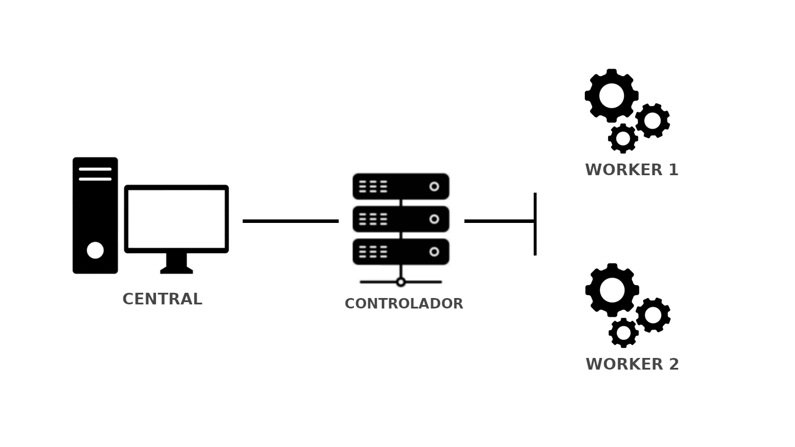

1. <a href="#lista1">Monitorización y análisis de aplicaciones web con new relic: Aquí explicas las características de la herramienta.</a>
    <p>1.1.  <a href="#lista11">¿Cómo funciona?</a></p>
    <p>1.2.  <a href="#lista12">Instalación de New Relic: Dejando claro donde se está instalando.</a></p>
2. <a href="#lista2">New Relic One</a>
3. <a href="#lista3">Kuberntes: Explicas que vas a desplegar una aplicación web para monitorizarla con new relic, en kuberntes, y que para ello vas a usar minikube, para crear un cluster de ejmplo.</a>
    <p>3.1.  <a href="#lista31">Instalación de minikube</a></p>
    <p>3.2.  <a href="#lista32">Instalaciión de kubectl</a></p>
    <p>3.3.  <a href="#lista33">Desplieque de la aplicación web: Explicas un poco la aplicación que has desplegado,  (no hace falta mirar la última práctica para enterarse de lo que vas a desplegar).</a></p>
4. <a href="#lista4">Monitorización de nuestra aplicación con new relic
    Aquí es donde te tienes que lucir: Explicando cada una de las características que podemos medir.. cada característica que vas a medir ponlo en un apartado:</a>
    <p>4.1.  <a href="#lista41">Monitorizar Conexiones HTTP</a></p>
    <p>4.2.  <a href="#lista42">Monitorización de errores</a></p>
    <p>4.3.  <a href="#lista43">Fijar alertas</a></p>
    <p>4.4.  <a href="#lista44">Estadísticas de rendimiento</a></p>
    <p>4.5.  <a href="#lista45">...</a></p>

<hr id="lista1" >
<br>
<details open>
<summary>

## 1. New Relic 
</summary>


<details open>
<summary>

## ¿Que es New Relic?
</summary>

New Relic es una herramienta de medición del rendimiento de una infraestructura de servicios, desde backend hasta frontend: medición del rendimiento de navegadores, APIs, servidores, aplicaciones móviles… ¿Qué nos permite hacer?

* Este software es capaz de realizar las siguientes tareas:

  * Monitorizar Conexiones HTTP (tiempos de respuesta, nº de peticiones…).
  * Monitorización de errores (avisos cuando se detectan fallos de ejecución o conexión).
  * Fijar alertas sobre datos de referencia (tiempos de respuesta, errores de autenticación…).
  * Estadísticas de rendimiento en distintos dispositivos (uso de memoria, velocidad de respuesta,…).
  * Estadísticas de usuarios que la usen según el SO utilizado.

* Esta herramienta además soporta diferentes plataformas:
Aplicaciones WEB (APM)

* Permite monitorizar aplicaciones web en los siguientes lenguajes:

  * Ruby
  * PHP
  * Java
  * NET
  * Python
  * NodeJs

* Permite monitorizar nuestras aplicaciones para móviles (Android, iOS y Titanium).  
Navegadores (Browser)

* Permite monitorizar nuestro sitio sobre el navegador del usuario (tiempo de respuesta, tiempo de carga de elementos…).  
Usuarios (Synthetics)

* Permite simular usuarios (tanto flujo como interacciones) para anticiparse a los errores. Usa el servicio de alertas para avisar de esto.  
Servidores (Servers)

* Nos da una vista del servidor desde la perspectiva de la propia aplicación.

Además de las características arriba descritas, nos ofrece un amplio abanico de **plugins** para ayudarnos con ellas, e incluso añadir nuevas funcionalidades, soporte en la nube y integración con kubernete que veremos mas adelante.
</details>

<hr id="lista11" >
<br>
<details open>
<summary>

## 1.1 ¿Como funciona?
</summary>

Recopila una serie de parámetros que monitoriza a traves de nuestro navegador, para ello se lanza un agente dentro de la maquina de la que se quiera recopilar información, dependiendo de si es para recolectar datos de nuestro propio sistema o un cluster de kubernetes que tenemos alojado en la misma, etc... dependiendo del tipo de dato que necesitemos New Relic los suministrará la instalación del agente adecuado.

Podremos crear vistas en las que tengamos metricas de diferentes agentes y ademas todo el sistema es codigo abierto por lo tanto podremos modificar tambien algun agente para adaptarlo a nuestra necesidades y asi tener una monitorización mas personalizada.

Podemos ver utilidades o ejemplos de monitorización como los siguientes:

- **New Relic Browser**: New Relic monitoriza todo lo relacionado a las peticiones HTTP y HTTPs que realizamos dentro de un navegador, desde los tiempos de carga con histogramas, percentiles y gráficos con segmentación hasta reportes geográficos, rendimiento con toda la parte de backend y alertas relacionadas con peticiones AJAX y errores del Javascript. Lógicamente todos los tableros de monitorización son personalizables. 


- **New Relic Synthetics**: Permite monitorizar una aplicación móvil en todo su ciclo de vida, incluso en la fase de preproducción, desde la fase de desarrollo hasta las pruebas de testeo. Y una vez lanzado, también facilita la recolección de insights para medir el rendimiento. 

Ya tenemos una idea de que es New Relic, que datos recoge y como funciona, ahora daremos paso al proyecto comenzando con la instalacion de New Relic.
</details>

<hr id="lista12" >
<br>
<details open>
<summary>

## 1.2 Instalación de New Relic
</summary>

Realizaremos una instalación simple para poder para poder visualizar las metricas de nuestra maquina llamada **Central** en Openstacks. Para instalar New Relic primero deberemos acceder a su [website](https://newrelic.com/) para registrarnos y dar de alta nuestra cuenta que será necesaria para el acceso a nuestras vistas:


Una vez registrado procederemos a la implementación de new relic en nuestro entorno, para comenzar le daremos al icono [+ add more data]


Nos iremos a la sección de host y seleccionaremos Ubuntu:


En el plan de instalación nos pedira que instalemos el agente de New Relic:

**Agente**: Algunas integraciones de New Relic requieren la instalación manual de un agente. La forma en que se configura el comportamiento de esos agentes depende del agente específico(APM, infraestructuras, navegadores, movil, otros...).


El link que nos proporcionará es el de instalación del agente a nuestro sistema operativo:

**Nota**: Para no tener la web tan cargada he movido la captura de mi terminal a mi repositorio de Github:  
- <a href="https://github.com/franmadu6/tfc-data/blob/main/instalacion-newrelic-v" target="blank">Repositorio</a>

Una vez la instalación haya sido finalizada volveremos al navegador y veremos como la pantalla ha cambiado, nos dejara darle a **See your data** para concluir la instalación, he de destaca que si nuestro equipo posee php, java, alguna base de datos, etc... Tambien lo detectaria el agente y nos lo instalaria al ejecutarlo.


Y listo! Ya tendremos nuestro agente instalado y listo para usarse.

Estos son algunos datos de los que podemos obtener atraves de new relic, que profundizaremos en ellos mas adelante.

**Debian**


</details>
</details>

<hr id="lista2" >
<br>
<details open>
<summary>

## 2. New Relic One
</summary>

Detectar, corregir y prevenir: esa es la promesa del monitoreo de software. ¿Pero qué pasa cuando las soluciones costosas impiden instrumentar todo y los enfoques poco sistemáticos producen un aumento en la cantidad de herramientas? Cuando los datos de desempeño de la aplicación, de la infraestructura y de los usuarios finales están dispersos por herramientas de monitoreo que no están conectadas, la detección y resolución de problemas puede ser innecesariamente compleja y puede consumir mucho tiempo.

Ahí es donde New Relic One marca la diferencia: una plataforma capaz de escalar masivamente y que recolecta y contextualiza todos los datos operativos—sin importar de dónde vengan—y simplifica la instrumentación, la ingestión de datos, la exploración, la correlación y el análisis basado en aprendizaje automático (machine learning), para reforzar la observabilidad de cada organización.


**Telemetry Data Platform**,todos los datos de telemetría en un solo lugar:

Recopile, explore y genere alertas en relación a todas las métricas, eventos, registros y rastros sin importar cuál sea su origen en una base de datos de telemetría abierta y unificada. Las integraciones—que vienen listas para usarse—con herramientas de código abierto como Prometheus y Grafana, por nombrar solo dos, eliminan el costo y la complejidad de administrar el almacenamiento de datos adicional.


**Todos sus datos en un solo lugar con Telemetry Data Platform.**

* Con Telemetry Data Platform, obtendrá lo siguiente:

  * Integraciones con más de 300 agentes y estándares como OpenTelemetry, lo que le permite ingerir y guardar todos los datos operativos en un solo lugar
  * Tiempos de consulta y respuesta ultra rápidos
  * La posibilidad de elegir entre crear paneles en New Relic One o conservar los flujos de trabajo existentes en Grafana
  * Alertas en tiempo real en relación a los datos
  * APIs y herramientas para crear aplicaciones personalizadas alojadas en New Relic One

**Full-Stack Observability**


Visualice y resuelva problemas de todo el stack en una experiencia unificada

Full-Stack Observability amplía la capacidad de Telemetry Data Platform, y proporciona una experiencia conectada que facilita entender en qué condición se encuentra el sistema dentro de su contexto, desde registros, infraestructura, aplicaciones y datos de la experiencia del usuario final. Elimine el trabajo extra y los puntos ciegos gracias a vistas especializadas que presentan los problemas automáticamente a sus equipos incluso antes de que a usted se le ocurra preguntar.


El explorador de clústeres de Kubernetes de New Relic reúne todos los elementos de observabilidad: métricas, eventos, registros y rastros.

Con Full-Stack Observability, obtendrá lo siguiente:

  * Toda la funcionalidad de New Relic que conoce y que tanto le agrada—APM, Infrastructure, Logs in Context, Distributed Tracing, Serverless, Browser, Mobile y Synthetics—todo en un solo paquete
  * Información contextual acerca de sus servicios distribuidos, aplicaciones y funciones sin servidor, sin importar cómo o dónde se hayan desarrollado
  * Visibilidad incomparable en los hosts de infraestructura, contenedores, recursos de nubes y clústers de Kubernetes
  * Análisis del rendimiento de extremo a extremo, desde los servicios de backend hasta la experiencia de los usuarios finales

**Applied Intelligence**


Detecte y resuelva problemas con más rapidez

Detecte, comprenda y resuelva los incidentes con más rapidez gracias a las potentes capacidades de AIOps. Applied Intelligence detecta y explica anomalías automáticamente antes de que se conviertan en incidentes, reduce el exceso de alertas repetidas gracias a que correlaciona las alertas relacionadas y diagnostica problemas enriqueciendo incidentes con contexto, lo que permite ir rápidamente a la raíz de los problemas.


Applied Intelligence utiliza el aprendizaje automático para automatizar las alertas.

Con Applied Intelligence, obtendrá lo siguiente:

  * Detección proactiva que detecta las anomalías antes de que se conviertan en incidentes
  * Inteligencia sobre incidentes que reduce el exceso de alertas repetidas y prioriza los problemas
  * Configuraciones con herramientas como Slack y PagerDuty para agilizar el diagnóstico y los tiempos de respuesta


**Observabilidad simplificada**

Con New Relic One podrá pasar menos tiempo resolviendo problemas y más tiempo diseñando software. Instrumente todo para eliminar los puntos ciegos, y hágalo a una escala de Petabytes. Practique la observabilidad del stack completo y aproveche Applied Intelligence y el aprendizaje automático para detectar problemas rápidamente y reducir el exceso de alertas repetidas. Bienvenido a la era de la observabilidad.

</details>

<hr id="lista3" >
<br>
<details open>
<summary>

## 3. Kubernetes: Explicas que vas a desplegar una aplicación web para monitorizarla con new relic, en kuberntes, y que para ello vas a usar minikube, para crear un cluster de ejmplo.
</summary>

EXPLICACIÓN SOBRE LA PRACTICA DE KUBERNETES


<hr id="lista31" >
<br>
<details open>
<summary>

## 3.1 Instalación de minikube
</summary>

Antes monitorizar nuestro cluster deberemos de confirgurarlo primero, para ello utilizaremos **minikube** para crear nuestros clusters, procederemos a su instalación.
```shell
vagrant@svKube:~$ curl -LO https://storage.googleapis.com/minikube/releases/latest/minikube-linux-amd64
  % Total    % Received % Xferd  Average Speed   Time    Time     Time  Current
                                 Dload  Upload   Total   Spent    Left  Speed
100 66.3M  100 66.3M    0     0  3995k      0  0:00:17  0:00:17 --:--:-- 3952k
vagrant@svKube:~$ sudo install minikube-linux-amd64 /usr/local/bin/minikube
```

Al inicializarlo nos da varios errores en mi casa tuve que ejecutarlo con minikube start --vm-driver=none y instalar docker,docker.io y conntrack, este fue un poco el historial de comandos que ejecute.
```shell
vagrant@svKube:~$ minikube start
vagrant@svKube:~$ minikube start --vm-driver=none
root@svKube:/home/vagrant# apt install docker docker.io
root@svKube:/home/vagrant# minikube start --vm-driver=none
root@svKube:/home/vagrant# sudo apt-get install -y conntrack
```

Ahora si podremos ejecutarlo correctamente:
```shell
root@svKube:/home/vagrant# minikube start --vm-driver=none
😄  minikube v1.24.0 on Debian 10.11 (vbox/amd64)
✨  Using the none driver based on user configuration

🧯  The requested memory allocation of 1995MiB does not leave room for system overhead (total system memory: 1995MiB). You may face stability issues.
💡  Suggestion: Start minikube with less memory allocated: 'minikube start --memory=1995mb'

👍  Starting control plane node minikube in cluster minikube
🤹  Running on localhost (CPUs=2, Memory=1995MB, Disk=20029MB) ...
ℹ️  OS release is Debian GNU/Linux 10 (buster)
    > kubeadm.sha256: 64 B / 64 B [--------------------------] 100.00% ? p/s 0s
    > kubectl.sha256: 64 B / 64 B [--------------------------] 100.00% ? p/s 0s
    > kubelet.sha256: 64 B / 64 B [--------------------------] 100.00% ? p/s 0s
    > kubeadm: 43.71 MiB / 43.71 MiB [---------------] 100.00% 3.84 MiB p/s 12s
    > kubectl: 44.73 MiB / 44.73 MiB [---------------] 100.00% 3.86 MiB p/s 12s
    > kubelet: 115.57 MiB / 115.57 MiB [-------------] 100.00% 4.01 MiB p/s 29s

    ▪ Generating certificates and keys ...
    ▪ Booting up control plane ...
    ▪ Configuring RBAC rules ...
🤹  Configuring local host environment ...

❗  The 'none' driver is designed for experts who need to integrate with an existing VM
💡  Most users should use the newer 'docker' driver instead, which does not require root!
📘  For more information, see: https://minikube.sigs.k8s.io/docs/reference/drivers/none/

❗  kubectl and minikube configuration will be stored in /root
❗  To use kubectl or minikube commands as your own user, you may need to relocate them. For example, to overwrite your own settings, run:

    ▪ sudo mv /root/.kube /root/.minikube $HOME
    ▪ sudo chown -R $USER $HOME/.kube $HOME/.minikube

💡  This can also be done automatically by setting the env var CHANGE_MINIKUBE_NONE_USER=true
🔎  Verifying Kubernetes components...
    ▪ Using image gcr.io/k8s-minikube/storage-provisioner:v5
🌟  Enabled addons: default-storageclass, storage-provisioner
💡  kubectl not found. If you need it, try: 'minikube kubectl -- get pods -A'
🏄  Done! kubectl is now configured to use "minikube" cluster and "default" namespace by default
```

Podremos apreciar su correcta instalación observando que sus pods estan corriendo.
```shell
root@svKube:/home/vagrant# minikube kubectl -- get pods -A
NAMESPACE     NAME                             READY   STATUS    RESTARTS   AGE
kube-system   coredns-78fcd69978-hchrh         1/1     Running   0          2m23s
kube-system   etcd-svkube                      1/1     Running   0          2m36s
kube-system   kube-apiserver-svkube            1/1     Running   0          2m36s
kube-system   kube-controller-manager-svkube   1/1     Running   0          2m38s
kube-system   kube-proxy-hv5zs                 1/1     Running   0          2m23s
kube-system   kube-scheduler-svkube            1/1     Running   0          2m36s
kube-system   storage-provisioner              1/1     Running   0          2m35s
```

Para comenzar su monitorización con **New relic** deberemos instalar **Helm**, la principal función de Helm es definir, instalar y actualizar aplicaciones complejas de Kubernetes. 
```shell
root@svKube:/home/vagrant# curl -fsSL -o get_helm.sh https://raw.githubusercontent.com/helm/helm/main/scripts/get-helm-3
root@svKube:/home/vagrant# chmod 700 get_helm.sh
root@svKube:/home/vagrant# ./get_helm.sh
Downloading https://get.helm.sh/helm-v3.7.1-linux-amd64.tar.gz
Verifying checksum... Done.
Preparing to install helm into /usr/local/bin
helm installed into /usr/local/bin/helm
```

El comando que nos proporciona **New relic** para establece una conexión con nuestro cluster no es valido para minikube, para ejecutarlo correctamente simplemente deberemos modificar la linea:
kubectl create namespace kube-system ; helm upgrade --install newrelic-bundle newrelic/nri-bundle \
por:
minikube kubectl create namespace kube-system ; helm upgrade --install newrelic-bundle newrelic/nri-bundle \

```shell
helm repo add newrelic https://helm-charts.newrelic.com && helm repo update && \
minikube kubectl create namespace kube-system ; helm upgrade --install newrelic-bundle newrelic/nri-bundle \
 --set global.licenseKey=eu01xx48059720c231a1080bc348906513e7NRAL \
 --set global.cluster=minikube \
 --namespace=kube-system \
 --set newrelic-infrastructure.privileged=true \
 --set global.lowDataMode=true \
 --set ksm.enabled=true \
 --set kubeEvents.enabled=true 
 ```


</details>

<hr id="lista32" >
<br>
<details open>
<summary>

## 3.2 Instalación de kubectl
</summary>

Instalaremos kubectl atraves del gestor de paquetes pues es la manera mas comoda y sencilla, en la cual añadiremos el repositorio de kubernete a nuestra maquina para utilizar su gestor:
```shell
sudo apt-get update && sudo apt-get install -y apt-transport-https gnupg2 curl
curl -s https://packages.cloud.google.com/apt/doc/apt-key.gpg | sudo apt-key add -
echo "deb https://apt.kubernetes.io/ kubernetes-xenial main" | sudo tee -a /etc/apt/sources.list.d/kubernetes.list
sudo apt-get update
sudo apt-get install -y kubectl
```  
  
  
**Nota**: Para no tener la web tan cargada he movido la captura de mi terminal a mi repositorio de Github:  
https://github.com/franmadu6/tfc-data/blob/main/instalacion-kubectl

Para verificar su instalación veremos que versión fue instalada:
```shell
ubuntu@controlador:~$  kubectl version --client
Client Version: version.Info{Major:"1", Minor:"23", GitVersion:"v1.23.0", GitCommit:"ab69524f795c42094a6630298ff53f3c3ebab7f4", GitTreeState:"clean", BuildDate:"2021-12-07T18:16:20Z", GoVersion:"go1.17.3", Compiler:"gc", Platform:"linux/amd64"}
```
  
  
</details>

<hr id="lista33" >
<br>
<details open>
<summary>

## 3.3 Desplieque de una aplicación web
</summary>



- <a href="https://github.com/franmadu6/tfc-data/blob/main/Vagrantfile" target="blank">Vagrantfile</a>

Para esta demostración de como New Relic monitoriza un cluster que tenga desplegado una app web, crearemos un escenario con 3 maquinas que constaran de un controlador con 2 workers que se encargaran de balancear y replicar la aplicación web que instalaremos en el controlador.   
  

Nos iremos a nuestro controlador y realizaremos la instalación de k3s:
```shell
ubuntu@controlador:~$ curl -sfL https://get.k3s.io | sh -
[INFO]  Finding release for channel stable
[INFO]  Using v1.21.7+k3s1 as release
[INFO]  Downloading hash https://github.com/k3s-io/k3s/releases/download/v1.21.7+k3s1/sha256sum-amd64.txt
[INFO]  Downloading binary https://github.com/k3s-io/k3s/releases/download/v1.21.7+k3s1/k3s
[INFO]  Verifying binary download
[INFO]  Installing k3s to /usr/local/bin/k3s
[INFO]  Skipping installation of SELinux RPM
[INFO]  Skipping /usr/local/bin/kubectl symlink to k3s, command exists in PATH at /usr/bin/kubectl
[INFO]  Creating /usr/local/bin/crictl symlink to k3s
[INFO]  Creating /usr/local/bin/ctr symlink to k3s
[INFO]  Creating killall script /usr/local/bin/k3s-killall.sh
[INFO]  Creating uninstall script /usr/local/bin/k3s-uninstall.sh
[INFO]  env: Creating environment file /etc/systemd/system/k3s.service.env
[INFO]  systemd: Creating service file /etc/systemd/system/k3s.service
[INFO]  systemd: Enabling k3s unit
Created symlink /etc/systemd/system/multi-user.target.wants/k3s.service → /etc/systemd/system/k3s.service.
[INFO]  systemd: Starting k3s
```

</details>
</details>