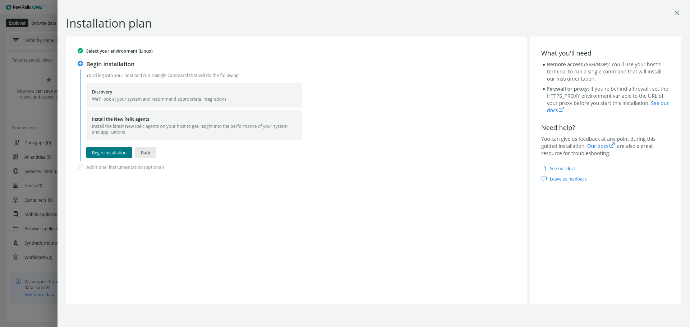

1. <a href="#lista1">Monitorización y análisis de aplicaciones web con new relic: Aquí explicas las características de la herramienta.</a>
    <p>1.1.  <a href="#lista11">¿Cómo funciona?</a></p>
    <p>1.2.  <a href="#lista12">Instalación de New Relic: Dejando claro donde se está instalando.</a></p>
2. <a href="#lista11">Kuberntes: Explicas que vas a desplegar una aplicación web para monitorizarla con new relic, en kuberntes, y que para ello vas a usar minikube, para crear un cluster de ejmplo.</a>
    <p>2.1.  <a href="#lista11">Instalación de minikube</a></p>
    <p>2.2.  <a href="#lista11">Instalaciión de kubectl</a></p>
    <p>2.3.  <a href="#lista11">Desplieque de la aplicación web: Explicas un poco la aplicación que has desplegado,  (no hace falta mirar la última práctica para enterarse de lo que vas a desplegar).</a></p>
3. <a href="#lista11">Monitorización de nuestra aplicación con new relic
    Aquí es donde te tienes que lucir: Explicando cada una de las características que podemos medir.. cada característica que vas a medir ponlo en un apartado:</a>
    <p>3.1.  <a href="#lista11">Monitorizar Conexiones HTTP</a></p>
    <p>3.2.  <a href="#lista11">Monitorización de errores</a></p>
    <p>3.3.  <a href="#lista11">Fijar alertas</a></p>
    <p>3.4.  <a href="#lista11">Estadísticas de rendimiento</a></p>
    <p>3.5.  <a href="#lista11">...</a></p>

<hr id="lista1" >

<br>

# New Relic

## ¿Que es New Relic?

New Relic es una herramienta de medición del rendimiento de una infraestructura de servicios, desde backend hasta frontend: medición del rendimiento de navegadores, APIs, servidores, aplicaciones móviles… ¿Qué nos permite hacer?

**Este software es capaz de realizar las siguientes tareas (entre otras muchas):**

- Monitorizar Conexiones HTTP (tiempos de respuesta, nº de peticiones…).
- Monitorización de errores (avisos cuando se detectan fallos de ejecución o conexión).
- Fijar alertas sobre datos de referencia (tiempos de respuesta, errores de autenticación…).
- Estadísticas de rendimiento en distintos dispositivos (uso de memoria, velocidad de respuesta,…).
- Estadísticas de usuarios que la usen según el SO utilizado.

**Esta herramienta además soporta diferentes plataformas:**
Aplicaciones WEB (APM)

**Permite monitorizar aplicaciones web en los siguientes lenguajes:**

- Ruby
- PHP
- Java (la miraremos un poco más en detalle)
- .NET
- Python
- NodeJs

**Aplicaciones Móviles (Mobile)**

**Permite monitorizar nuestras aplicaciones para móviles (Android, iOS y Titanium).**
Navegadores (Browser)

**Permite monitorizar nuestro sitio sobre el navegador del usuario (tiempo de respuesta, tiempo de carga de elementos…).**
Usuarios (Synthetics)

**Permite simular usuarios (tanto flujo como interacciones) para anticiparse a los errores. Usa el servicio de alertas para avisar de esto.**
Servidores (Servers)

**Nos da una vista del servidor desde la perspectiva de la propia aplicación.**
Otros

Además de las características arriba descritas, nos ofrece un amplio abanico de **Plugins** para ayudarnos con ellas, e incluso añadir nuevas funcionalidades, soporte en la nube y integración con kubernete que veremos mas adelante.

<hr id="lista11" >

<br>

## ¿Como funciona?

**New Relic** consta con varias aplicaciones, para no hablar de todas ellas veremos las que utilizaremos en este proyecto:

- **New Relic Browser**: New Relic monitoriza todo lo relacionado a las peticiones HTTP y HTTPs que realizamos dentro de un navegador, desde los tiempos de carga con histogramas, percentiles y gráficos con segmentación hasta reportes geográficos, rendimiento con toda la parte de backend y alertas relacionadas con peticiones AJAX y errores del Javascript. Lógicamente todos los tableros de monitorización son personalizables. 


- **New Relic Synthetics**: Permite monitorizar una aplicación móvil en todo su ciclo de vida, incluso en la fase de preproducción, desde la fase de desarrollo hasta las pruebas de testeo. Y una vez lanzado, también facilita la recolección de insights para medir el rendimiento. 

Ya tenemos una idea de que es **New Relic**, que datos recoge y como funciona, ahora daremos paso al proyecto comenzando con la instalacion de **New Relic**.

<hr id="lista12" >

<br>


Para instalar **New Relic** primero deberemos acceder a su [website](https://newrelic.com/) para registrarnos:


Una vez registrado procederemos a su instalación, en la que seleccionamos linux:


En el plan de instalación nos pedira que instalemos el agente de **New Relic**:



- Mensaje:
**Install the New Relic agents**
Install the latest New Relic agents on your host to get insight into the performance of your system and applications

Para ello seguí la [guia](https://docs.newrelic.com/docs/apm/agents/php-agent/installation/php-agent-installation-ubuntu-debian/) proporcionada por **New Relic**.

Configuramos el repositorio de **New Relic**:
```
echo 'deb http://apt.newrelic.com/debian/ newrelic non-free' | sudo tee /etc/apt/sources.list.d/newrelic.list
```

Comprobamos la relación de confianza con la **clave GPG**:
```
wget -O- https://download.newrelic.com/548C16BF.gpg | sudo apt-key add -
```

Actualizamos los paquetes:
```
sudo apt-get update
```

Instalamos el agente de PHP:
```
sudo apt-get install newrelic-php5
```

Y listo! Ya tendremos nuestro agente instalado y listo para usarse.


Para poder añadir nuestra maquina al navegador de new relic deberemos realizar un **curl** para conectarnos.
```
curl -Ls https://download.newrelic.com/install/newrelic-cli/scripts/install.sh | bash && sudo  NEW_RELIC_API_KEY=NRAK-H3WMTJBX8HDGGCWEG3KV1Y407ML NEW_RELIC_ACCOUNT_ID=3341847 NEW_RELIC_REGION=EU /usr/local/bin/newrelic install
```

Podremos elegir que parametros recoje, para este caso cogermos todos los posibles como ejemplo.
```
fran@debian:~$ curl -Ls https://download.newrelic.com/install/newrelic-cli/scripts/install.sh | bash && sudo  NEW_RELIC_API_KEY=NRAK-H3WMTJBX8HDGGCWEG3KV1Y407ML NEW_RELIC_ACCOUNT_ID=3341847 NEW_RELIC_REGION=EU /usr/local/bin/newrelic install
Starting installation.
Installing New Relic CLI v0.37.19
Installing to /usr/local/bin using sudo
[sudo] password for fran: 

   _   _                 ____      _ _
  | \ | | _____      __ |  _ \ ___| (_) ___
  |  \| |/ _ \ \ /\ / / | |_) / _ | | |/ __|
  | |\  |  __/\ V  V /  |  _ |  __| | | (__
  |_| \_|\___| \_/\_/   |_| \_\___|_|_|\___|

  Welcome to New Relic. Let's install some instrumentation.

  Questions? Read more about our installation process at
  https://docs.newrelic.com/

	
INFO Validating connectivity to the New Relic platform... 
The guided installation will begin by installing the latest version of the New Relic Infrastructure agent, which is required for additional instrumentation.

? Please choose from the following instrumentation to be installed: Logs integration, Golden Signal Alerts, Apache Open Source Integration, MySQL Open Source Integration

The following will be installed:
  Infrastructure Agent
  Logs integration
  Golden Signal Alerts
  Apache Open Source Integration
  MySQL Open Source Integration

==> Installing Infrastructure Agent...

Obj:1 http://repo.mysql.com/apt/debian buster InRelease
Ign:2 http://repo.mongodb.org/apt/debian buster/mongodb-org/4.4 InRelease
Obj:3 http://dl.google.com/linux/chrome/deb stable InRelease
Obj:4 http://security.debian.org/debian-security buster/updates InRelease
Obj:5 http://deb.debian.org/debian buster InRelease
Obj:6 http://repo.mongodb.org/apt/debian buster/mongodb-org/4.4 Release
Obj:7 http://packages.microsoft.com/repos/code stable InRelease
Obj:8 http://deb.debian.org/debian buster-updates InRelease
Obj:9 https://download.newrelic.com/infrastructure_agent/linux/apt buster InRelease
Obj:10 https://download.virtualbox.org/virtualbox/debian buster InRelease
Des:11 https://packages.cloud.google.com/apt kubernetes-xenial InRelease [9.383 B]
Descargados 9.383 B en 2s (5.494 B/s)
Leyendo lista de paquetes...
Warning: apt-key output should not be parsed (stdout is not a terminal)
OK
Ign:1 http://repo.mongodb.org/apt/debian buster/mongodb-org/4.4 InRelease
Obj:2 http://repo.mysql.com/apt/debian buster InRelease
Obj:3 http://dl.google.com/linux/chrome/deb stable InRelease
Obj:4 http://repo.mongodb.org/apt/debian buster/mongodb-org/4.4 Release
Obj:5 http://security.debian.org/debian-security buster/updates InRelease
Obj:6 http://deb.debian.org/debian buster InRelease
Obj:7 http://packages.microsoft.com/repos/code stable InRelease
Obj:8 http://deb.debian.org/debian buster-updates InRelease
Obj:9 https://download.newrelic.com/infrastructure_agent/linux/apt buster InRelease
Obj:10 https://download.virtualbox.org/virtualbox/debian buster InRelease
Des:11 https://packages.cloud.google.com/apt kubernetes-xenial InRelease [9.383 B]
Descargados 9.383 B en 1s (8.114 B/s)
Leyendo lista de paquetes...
Running agent status check attempt...
Agent status check ok.

  ✅ Checking for data in New Relic (this may take a few minutes)...success.

  ⚙️  The Infrastructure Agent configuration file can be found in /etc/newrelic-infra.yml
  Edit this file to make changes or configure advanced features for the agent. See the docs for options:
  https://docs.newrelic.com/docs/infrastructure/install-infrastructure-agent/configuration/infrastructure-agent-configuration-settings
  
  Note: Process monitoring has been enabled by default - all other config options are left to the user.

==> Installing Infrastructure Agent...success.

==> Installing Logs integration...

The log files below have been detected:
  /var/log/alternatives.log
  /var/log/auth.log
  /var/log/dpkg.log
  /var/log/messages
  /var/lib/docker/containers/*/*.log
  /var/log/apache2/*access.log
  /var/log/apache2/error.log
  /var/log/mysql/error.log
Would you like to tail those log files to New Relic Y/N (default: Y)? Y  


  ✅ Checking for data in New Relic (this may take a few minutes)...success.

  ⚙️  The Logs configuration file (base configuration) can be found in /etc/newrelic-infra/logging.d/logging.yml
  ⚙️  The Logs configuration file for discovered processes can be found in /etc/newrelic-infra/logging.d/discovered.yml
  Edit these files to make changes or configure advanced features for the Logs integration. See the docs for options:
  https://docs.newrelic.com/docs/logs/enable-log-management-new-relic/enable-log-monitoring-new-relic/forward-your-logs-using-infrastructure-agent#parameters

==> Installing Logs integration...success.

==> Installing Golden Signal Alerts...

  This installation will setup alerts for any existing, and future, hosts and applications reporting to newrelic with the Golden Signal conditions:
  - High CPU
  - High Application Error Rate
  - High Application Response Time
  - Low Application Throughput
  This policy can be modified under Alerts & AI\Policies.

Creating alert policy Golden Signals...
done
Adding alert condition High CPU...
done
Adding alert condition High Application Error percentage...
done
Adding alert condition High Application Response Time...
done
Adding alert condition Low Application Throughput...
done
Would you like to be notified on your registered email address frangodh97@gmail.com when this alert triggers Y/N (default: Y)? Y

Notification channel not found for email address frangodh97@gmail.com, creating notification channel...
done
Subscribing alert policy to notification channel...
done
==> Installing Golden Signal Alerts...success.

==> Installing Apache Open Source Integration...

  To capture data from the Apache integration, you'll first need to meet these prerequisites:
  - Apache version requirement (see https://docs.newrelic.com/docs/integrations/host-integrations/host-integrations-list/apache-monitoring-integration#comp-req)
  - Apache status module enabled and configured for Apache instance
  - Apache status module endpoint (default server-status) available

Obj:1 http://dl.google.com/linux/chrome/deb stable InRelease
Obj:2 http://repo.mysql.com/apt/debian buster InRelease
Ign:3 http://repo.mongodb.org/apt/debian buster/mongodb-org/4.4 InRelease
Obj:4 http://deb.debian.org/debian buster InRelease
Obj:5 http://security.debian.org/debian-security buster/updates InRelease
Obj:6 http://packages.microsoft.com/repos/code stable InRelease
Obj:7 http://repo.mongodb.org/apt/debian buster/mongodb-org/4.4 Release
Obj:8 https://download.virtualbox.org/virtualbox/debian buster InRelease
Obj:9 http://deb.debian.org/debian buster-updates InRelease
Obj:10 https://download.newrelic.com/infrastructure_agent/linux/apt buster InRelease
Obj:11 https://packages.cloud.google.com/apt kubernetes-xenial InRelease
Leyendo lista de paquetes...
Leyendo lista de paquetes...
Creando árbol de dependencias...
Leyendo la información de estado...
nri-apache ya está en su versión más reciente (1.7.1).
0 actualizados, 0 nuevos se instalarán, 0 para eliminar y 0 no actualizados.

  ✅ Checking for data in New Relic (this may take a few minutes)...success.

  ⚙️  The Apache configuration file can be found in /etc/newrelic-infra/integrations.d/apache-config.yml
  Edit this file to make changes or configure advanced features for this integration. See the docs for options:
  https://docs.newrelic.com/docs/integrations/host-integrations/host-integrations-list/apache-monitoring-integration#config

==> Installing Apache Open Source Integration...success.

==> Installing MySQL Open Source Integration...

  To capture data from the MySQL integration, we need to create a new MySql user with specific permissions (REPLICATION, SELECT).
  The installation will create a strong randomly generated password for that new user.
  This installation may prompt for your MySql root user password in order to create this new user.
  More information regarding the prerequisites can be found at https://docs.newrelic.com/docs/integrations/host-integrations/host-integrations-list/mysql-monitoring-integration#req

Obj:1 http://repo.mysql.com/apt/debian buster InRelease
Ign:2 http://repo.mongodb.org/apt/debian buster/mongodb-org/4.4 InRelease
Obj:3 http://dl.google.com/linux/chrome/deb stable InRelease
Obj:4 http://security.debian.org/debian-security buster/updates InRelease
Obj:5 http://repo.mongodb.org/apt/debian buster/mongodb-org/4.4 Release
Obj:6 http://deb.debian.org/debian buster InRelease
Obj:7 http://packages.microsoft.com/repos/code stable InRelease
Obj:8 http://deb.debian.org/debian buster-updates InRelease
Obj:9 https://download.newrelic.com/infrastructure_agent/linux/apt buster InRelease
Obj:10 https://download.virtualbox.org/virtualbox/debian buster InRelease
Obj:11 https://packages.cloud.google.com/apt kubernetes-xenial InRelease
Leyendo lista de paquetes...
Leyendo lista de paquetes...
Creando árbol de dependencias...
Leyendo la información de estado...
nri-mysql ya está en su versión más reciente (1.7.1).
0 actualizados, 0 nuevos se instalarán, 0 para eliminar y 0 no actualizados.

  ✅ Checking for data in New Relic (this may take a few minutes)...success.

  ⚙️  The MySQL configuration file can be found in /etc/newrelic-infra/integrations.d/mysql-config.yml
  Edit this file to make changes or configure advanced features for this integration. See the docs for options:
  https://docs.newrelic.com/docs/integrations/host-integrations/host-integrations-list/mysql-monitoring-integration#config

==> Installing MySQL Open Source Integration...success.


  New Relic installation complete 

  --------------------
  Installation Summary

  ✔  Infrastructure Agent  (installed)  
  ✔  Logs integration  (installed)  
  ✔  Golden Signal Alerts  (installed)  
  ✔  Apache Open Source Integration  (installed)  
  ✔  MySQL Open Source Integration  (installed)  

  View your data at the link below:
  ⮕  https://onenr.io/0dBj39mGvwX

  --------------------
```

Una vez la instalación haya sido finalizada volveremos al navegador y veremos como la pantalla ha cambiado, nos dira que ha finalizado y nos propondra instalar alguna instrumentación adicional.


Si no deseamos instalar mas herramientas le daremos a **See your data** y ya podremos hacer uso de sus herramientas de monitoreo.


