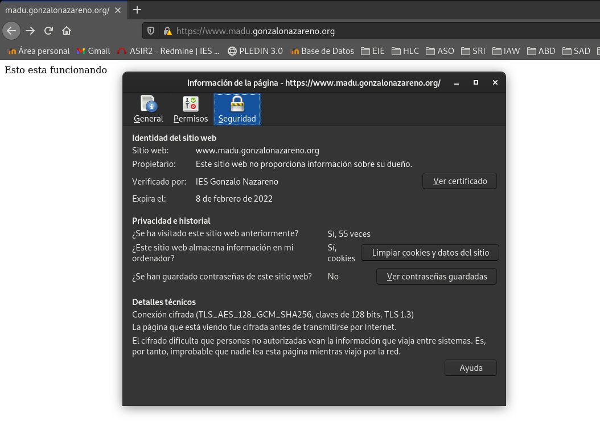

## El siguiente paso de nuestro proyecto es configurar de forma adecuada el protocolo HTTPS en nuestro servidor web para nuestra aplicaciones web. Para ello vamos a emitir un certificado wildcard en la AC Gonzalo Nazareno utilizando para la petición la utilidad "gestiona".

Comenzaremos creando el directorio que usaremos para guardar las claves ssl, dando los respectivos permisos y generando la clave RSA.
```shell
[root@quijote centos]# mkdir /etc/ssl/private
[root@quijote centos]# chmod 700 /etc/ssl/private/
[root@quijote centos]# openssl genrsa 4096 > /etc/ssl/private/openstack.key
Generating RSA private key, 4096 bit long modulus (2 primes)
...........++++
................................................................................................++++
e is 65537 (0x010001)
[root@quijote centos]# chmod 400 /etc/ssl/private/openstack.key
```

Crearemos un fichero con la clave generada anteriormente para que sea firmado por la autoridad certificadora de IES Gonzalo Nazareno.
```shell
[root@quijote centos]# openssl req -new -key /etc/ssl/private/openstack.key -out /root/openstack.csr
You are about to be asked to enter information that will be incorporated
into your certificate request.
What you are about to enter is what is called a Distinguished Name or a DN.
There are quite a few fields but you can leave some blank
For some fields there will be a default value,
If you enter '.', the field will be left blank.
-----
Country Name (2 letter code) [XX]:ES
State or Province Name (full name) []:Sevilla
Locality Name (eg, city) [Default City]:Dos Hermanas
Organization Name (eg, company) [Default Company Ltd]:IES Gonzalo Nazareno
Organizational Unit Name (eg, section) []:Informatica
Common Name (eg, your name or your server's hostname) []:*.madu.gonzalonazareno.org
Email Address []:frandh1997@gmail.com
-
Please enter the following 'extra' attributes
to be sent with your certificate request
A challenge password []:
An optional company name []:
```

Subimos el archivo a [gestiona](https://dit.gonzalonazareno.org/gestiona/cert/) y esperaremos a que sea firmado.
Una vez firmado, aprovecharemos para descargarnos el certificado de IES Gonzalo Nazareno y ambos archivos los ubicaremos en /etc/ssl/cert/.

Modificaremos nuestro virtualhost añadiendo añadiendo la redirección al puerto 443 y le añadiremos los certificados.
```shell
[root@quijote centos]# cat /etc/httpd/sites-available/quijoteweb.conf 
<VirtualHost *:80>
    ServerName www.madu.gonzalonazareno.org

    Redirect 301 / https://www.madu.gonzalonazareno.org/

    ErrorLog /var/www/fran/log/error.log
    CustomLog /var/www/fran/log/requests.log combined
</VirtualHost>

<IfModule mod_ssl.c>
    <VirtualHost _default_:443>
        ServerName www.madu.gonzalonazareno.org
        DocumentRoot /var/www/fran

	#Certificados
	SSLEngine on

        SSLCertificateFile	/etc/ssl/certs/openstack.crt
        SSLCertificateKeyFile   /etc/ssl/private/openstack.key
        SSLCACertificateFile    /etc/ssl/certs/gonzalonazareno.crt


        <Directory /var/www/fran/>
         Options FollowSymLinks
         AllowOverride All
         Order deny,allow
         Allow from all
         #PHP
	 <FilesMatch "\.php">
                SetHandler "proxy:unix:/run/php-fpm/www.sock|fcgi://localhost"
         </FilesMatch>

	</Directory>

        ErrorLog /var/www/fran/log/error.log
        CustomLog /var/www/fran/log/requests.log combined
    </VirtualHost>
</IfModule>
```

Instalamos el modulo de ssl para httpd.
```shell
[root@quijote centos]# dnf install mod_ssl
```

Deberemos de añadir una nueva directiva para habilitar https.
```shell
[root@quijote centos]# nano /etc/httpd/conf/httpd.conf
Listen 443
```

No olvidemos añadir una regla de encaminamiento creada en el ejercicio anterior:
```shell
root@dulcinea:~# nft add rule ip nat prerouting iifname "eth0" tcp dport 443 counter dnat to 10.0.2.4
```

!Listo¡ ya tendremos nuestro virtualhost funcionando en el puerto 443, será un poco mas seguro...

