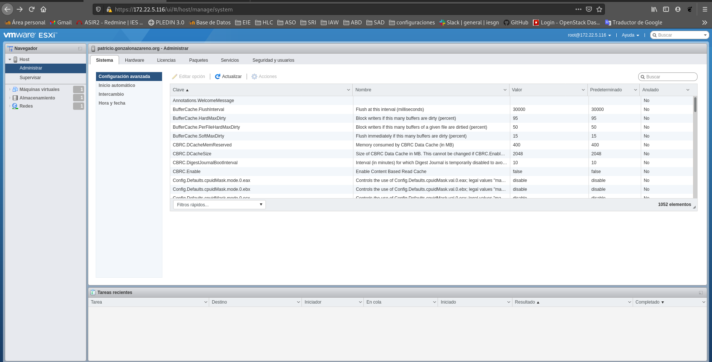
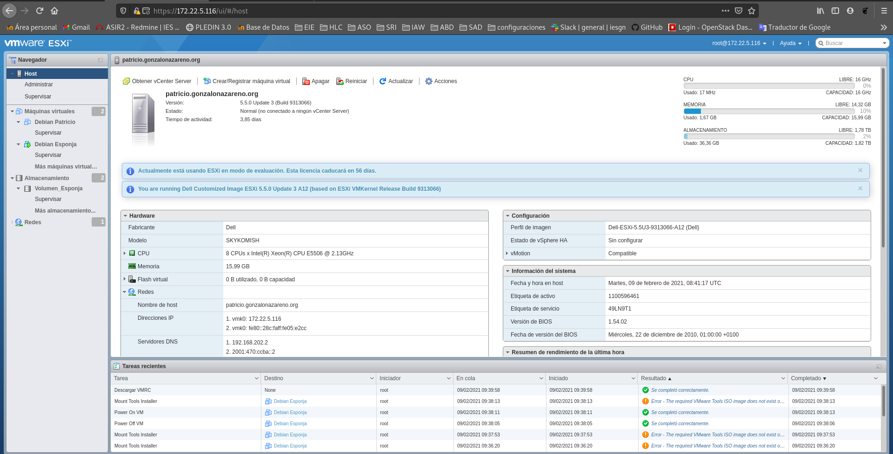
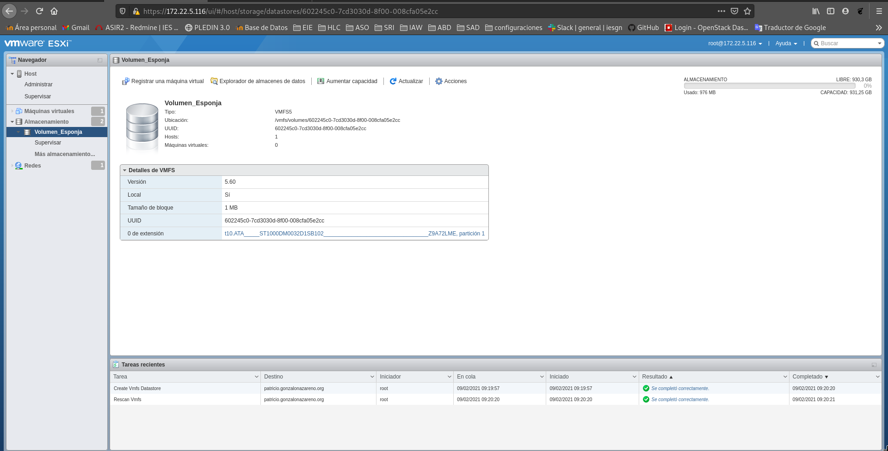
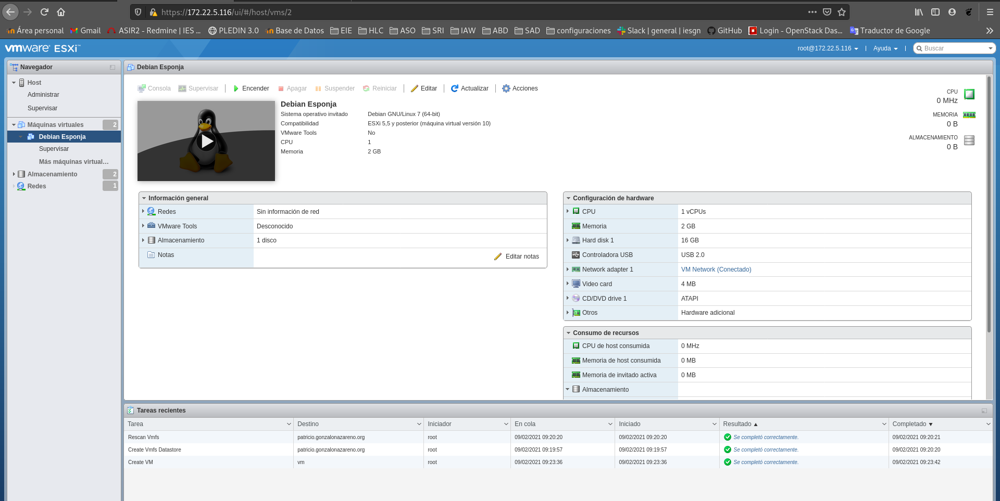
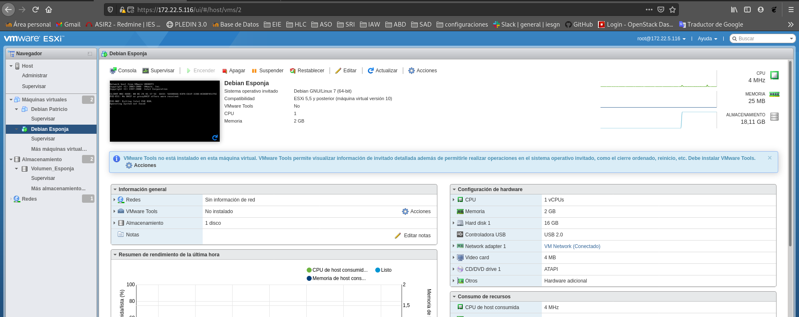
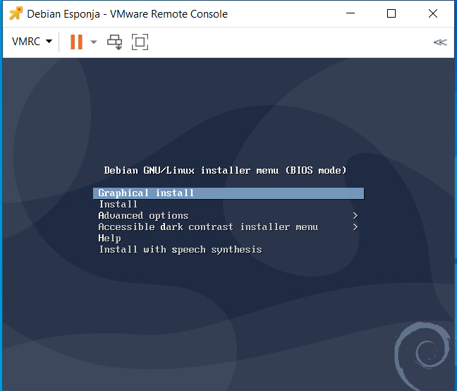
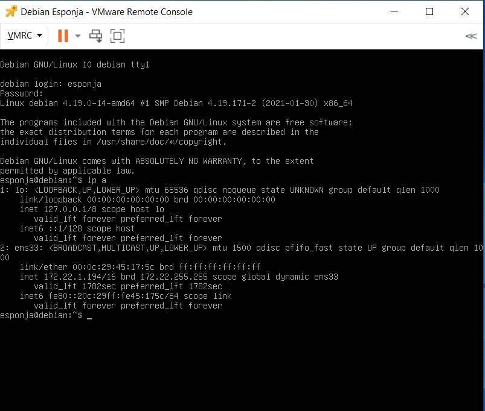
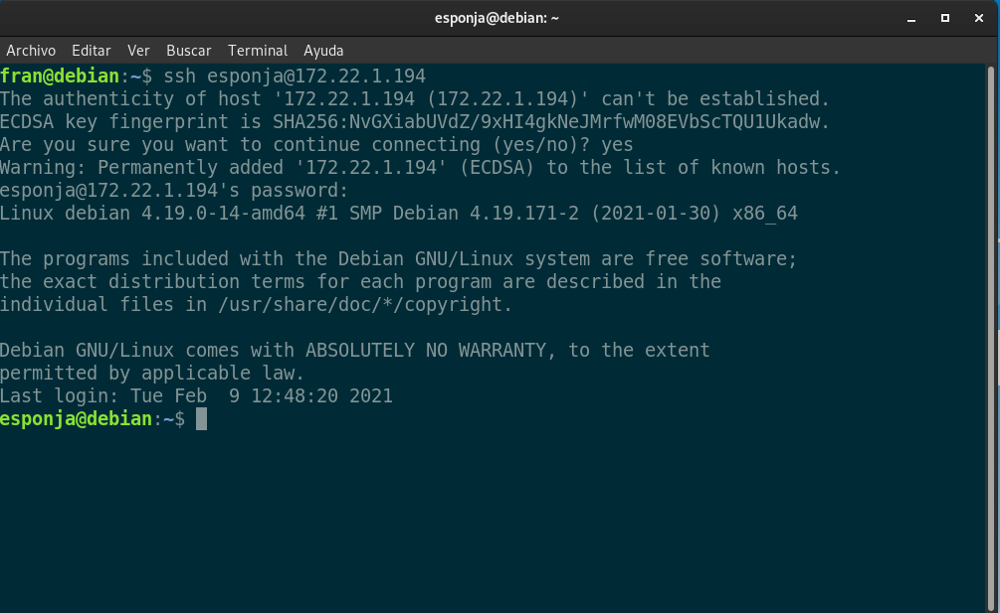
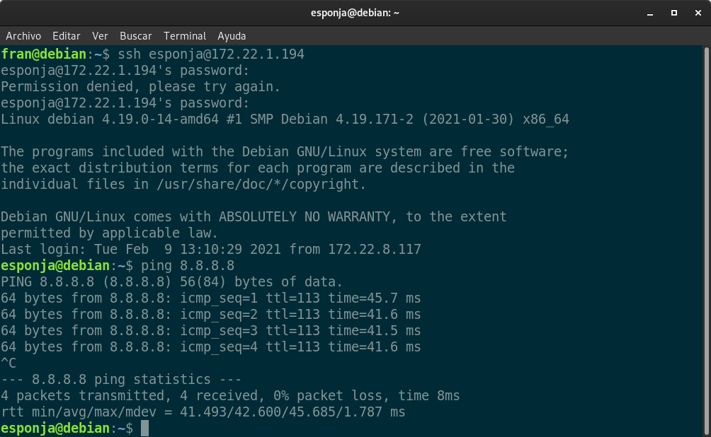

## Utiliza el servidor físico que se te haya asignado e instala la versión adecuada del sistema de virtualización VMWare ESXi (ten en cuenta que recibe diferentes denominaciones comerciales, pero nos referimos al sistema de virtualización de VMWare que proporciona virtualización de alto rendimiento mediante la técnica de la paravirtualización).

## Realiza la configuración del servicio que permita su gestión remota desde un equipo cliente e instala en tu equipo la aplicación cliente que permita gestionar remotamente el hipervisor.

## Instala una máquina virtual que tenga acceso a Internet. La corrección consistirá en comprobar el funcionamiento de dicha máquina virtual.

Nota: La fecha de comienzo y finalización de esta tarea irá variando en función de la disponibilidad de servidores físicos.

Para comenzar nos desplazaremos a los servidores del cloud una vez asignada nuestra máquina, guardaremos una copia de VMWare en un usb y procederemos a su instalación.

(**IMPORTANTE**:Deshabilitar el modulo IPMI para una instalación mucho mas rapida.)
Una vez realizada la instalación configuraremos un usuario para poder acceder vía navegador.

Crearemos un host en este caso patricio.gonzalonazareno.org

Para crear una nueva máquina deberemos antes crear un volumen nuevo.

Procederemos a la instalación de una nueva máquina le añadiremos un disco con debian10.

Encenderemos la máquina.

Nos descargaremos el soporte para visualizar VMWare desde nuestro ordenador

Nos descargamos y habilitamos el servidor de ssh.

¡Listo! Ya tenemos puesta a punto nuestra maquija en VMWare.

Prueba de ping para comprobar la conexión.
