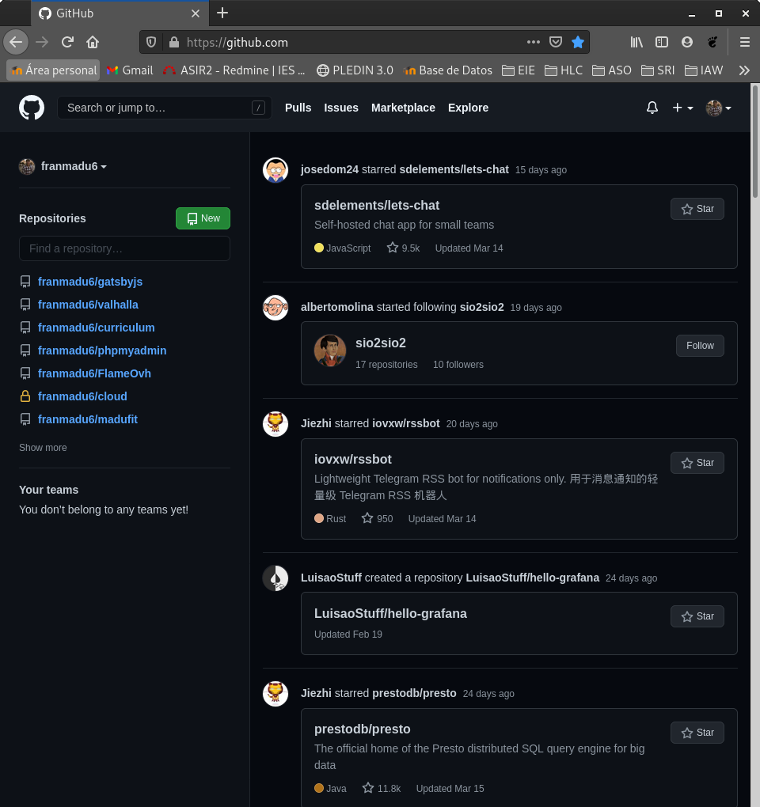

# Proxy Squid
Antes de comenzar crearemos una máquina **vagrant** donde realizaremos el ejercicio.  
* [Vagrantfile](https://fp.josedomingo.org/serviciosgs/u08/doc/squid/Vagrantfile)
(Para no tener problemas a la hora de levantar la máquina de vagrant modificaremos el box por generic/debian10)

## Tarea 1: Instala squid en la máquina squid y configúralo para que permita conexiones desde la red donde este tu ordenador.

Una vez se configuren ambas máquinas procederemos a la instalación de proxy squid y su configuración en la máquina "proxy".
```shell
root@proxy:~# apt install squid
Reading package lists... Done
Building dependency tree       
Reading state information... Done
The following additional packages will be installed:
  libdbi-perl libecap3 squid-common squid-langpack
Suggested packages:
  libclone-perl libmldbm-perl libnet-daemon-perl libsql-statement-perl squidclient
  squid-cgi squid-purge smbclient ufw winbind
The following NEW packages will be installed:
  libdbi-perl libecap3 squid squid-common squid-langpack
0 upgraded, 5 newly installed, 0 to remove and 0 not upgraded.
Need to get 3,907 kB of archives.
After this operation, 15.4 MB of additional disk space will be used.
Do you want to continue? [Y/n] y
Get:1 http://deb.debian.org/debian buster/main amd64 libecap3 amd64 1.0.1-3.2 [16.5 kB]
Get:2 http://deb.debian.org/debian buster/main amd64 squid-langpack all 20190110-1 [167 kB]
Get:3 http://deb.debian.org/debian buster/main amd64 squid-common all 4.6-1+deb10u4 [309 kB]
Get:4 http://deb.debian.org/debian buster/main amd64 libdbi-perl amd64 1.642-1+deb10u2 [775 kB]
Get:5 http://deb.debian.org/debian buster/main amd64 squid amd64 4.6-1+deb10u4 [2,640 kB]
Fetched 3,907 kB in 2s (2,243 kB/s)
Selecting previously unselected package libecap3:amd64.
(Reading database ... 60974 files and directories currently installed.)
Preparing to unpack .../libecap3_1.0.1-3.2_amd64.deb ...
Unpacking libecap3:amd64 (1.0.1-3.2) ...
Selecting previously unselected package squid-langpack.
Preparing to unpack .../squid-langpack_20190110-1_all.deb ...
Unpacking squid-langpack (20190110-1) ...
Selecting previously unselected package squid-common.
Preparing to unpack .../squid-common_4.6-1+deb10u4_all.deb ...
Unpacking squid-common (4.6-1+deb10u4) ...
Selecting previously unselected package libdbi-perl:amd64.
Preparing to unpack .../libdbi-perl_1.642-1+deb10u2_amd64.deb ...
Unpacking libdbi-perl:amd64 (1.642-1+deb10u2) ...
Selecting previously unselected package squid.
Preparing to unpack .../squid_4.6-1+deb10u4_amd64.deb ...
proxy:x:13:13:proxy:/bin:/usr/sbin/nologin
Unpacking squid (4.6-1+deb10u4) ...
Setting up squid-langpack (20190110-1) ...
Setting up libdbi-perl:amd64 (1.642-1+deb10u2) ...
Setting up libecap3:amd64 (1.0.1-3.2) ...
Setting up squid-common (4.6-1+deb10u4) ...
Setting up squid (4.6-1+deb10u4) ...
Setcap worked! /usr/lib/squid/pinger is not suid!
Created symlink /etc/systemd/system/multi-user.target.wants/squid.service → /lib/systemd/system/squid.service.
Processing triggers for systemd (241-7~deb10u6) ...
Processing triggers for man-db (2.8.5-2) ...
Processing triggers for libc-bin (2.28-10) ...
```

Ahora comenzaremos con su configuración, estableceremos los puertos y las redes.(Por defecto vienen la mayoría activados para hay otros que no, para ello revisa todos los comando y añade los nuevos.)
```shell
root@proxy:~# nano /etc/squid/squid.conf
acl localnet src 10.0.0.0/24
acl localnet src 192.168.200.0/24

acl SSL_ports port 443
acl Safe_ports port 80          # http
acl Safe_ports port 21          # ftp
acl Safe_ports port 443         # https
acl CONNECT method CONNECT

# Deny requests to certain unsafe ports
http_access deny !Safe_ports

# Deny CONNECT to other than secure SSL ports
http_access deny CONNECT !SSL_ports

# Only allow cachemgr access from localhost
http_access allow localhost manager
http_access deny manager

# from where browsing should be allowed
http_access allow localnet
http_access allow localhost

# And finally deny all other access to this proxy
http_access deny all

http_port 3128

coredump_dir /var/spool/squid
```

Reiniciamos el servicio.
```shell
root@proxy:~# systemctl restart squid
```

## Tarea 2: Prueba que tu ordenador está navegando a través del proxy (HTTP/HTTPS) configurando el proxy de dos maneras diferentes:
* **Directamente indicándolo en el navegador.**

Lo indicaremos mediante el navegador, lo configuraremos de manera que utilice la máquina servidor para controlar el tráfico.


Como podemos observar podemos acceder a cualquier página.


Comprobaremos el log de Squid para verificar que la conexión.
```shell
root@proxy:~# cat /var/log/squid/access.log
1615812871.897    151 192.168.200.1 TCP_MISS/200 1087 POST http://ocsp.sectigo.com/ - HIER_DIRECT/151.139.128.14 application/ocsp-response
1615812873.784    127 192.168.200.1 TCP_MISS/200 1059 POST http://r3.o.lencr.org/ - HIER_DIRECT/95.101.143.17 application/ocsp-response
1615812874.145     79 192.168.200.1 TCP_MISS/200 1086 POST http://ocsp.sectigo.com/ - HIER_DIRECT/151.139.128.14 application/ocsp-response
1615812874.175     67 192.168.200.1 TCP_MISS/200 1086 POST http://ocsp.sectigo.com/ - HIER_DIRECT/151.139.128.14 application/ocsp-response
1615812874.179     75 192.168.200.1 TCP_MISS/200 1086 POST http://ocsp.sectigo.com/ - HIER_DIRECT/151.139.128.14 application/ocsp-response
1615812874.181     77 192.168.200.1 TCP_MISS/200 1086 POST http://ocsp.sectigo.com/ - HIER_DIRECT/151.139.128.14 application/ocsp-response
1615812874.182     74 192.168.200.1 TCP_MISS/200 1086 POST http://ocsp.sectigo.com/ - HIER_DIRECT/151.139.128.14 application/ocsp-response
1615812874.288    404 192.168.200.1 TCP_TUNNEL/200 4374 CONNECT ovh.commander1.com:443 - HIER_DIRECT/15.188.224.144 -
1615812874.322    174 192.168.200.1 TCP_MISS/200 993 POST http://status.thawte.com/ - HIER_DIRECT/93.184.220.29 application/ocsp-response
1615812878.817   7314 192.168.200.1 TCP_TUNNEL/200 1000111 CONNECT www.ovh.com:443 - HIER_DIRECT/198.27.92.1 -
1615812878.864   5441 192.168.200.1 TCP_TUNNEL/200 20995 CONNECT analytics.ovh.com:443 - HIER_DIRECT/145.239.37.172 -
1615812884.068    201 192.168.200.1 TCP_MISS/200 835 POST http://ocsp.digicert.com/ - HIER_DIRECT/93.184.220.29 application/ocsp-response
1615812884.586      0 192.168.200.1 NONE/000 0 NONE error:transaction-end-before-headers - HIER_NONE/- -
1615812884.674    107 192.168.200.1 TCP_TUNNEL/200 39 CONNECT github.githubassets.com:443 - HIER_DIRECT/185.199.109.154 -
1615812884.675    108 192.168.200.1 TCP_TUNNEL/200 39 CONNECT github.githubassets.com:443 - HIER_DIRECT/185.199.109.154 -
1615812884.675    113 192.168.200.1 TCP_TUNNEL/200 39 CONNECT github.githubassets.com:443 - HIER_DIRECT/185.199.109.154 -
1615812884.675    113 192.168.200.1 TCP_TUNNEL/200 39 CONNECT github.githubassets.com:443 - HIER_DIRECT/185.199.109.154 -
1615812884.675    112 192.168.200.1 TCP_TUNNEL/200 39 CONNECT github.githubassets.com:443 - HIER_DIRECT/185.199.109.154 -
1615812884.678     37 192.168.200.1 TCP_TUNNEL/200 39 CONNECT github.githubassets.com:443 - HIER_DIRECT/185.199.109.154 -
1615812884.678    111 192.168.200.1 TCP_TUNNEL/200 39 CONNECT github.githubassets.com:443 - HIER_DIRECT/185.199.109.154 -
1615812884.801    233 192.168.200.1 TCP_TUNNEL/200 6135 CONNECT avatars.githubusercontent.com:443 - HIER_DIRECT/185.199.109.133 -
1615812884.807    237 192.168.200.1 TCP_TUNNEL/200 6788 CONNECT avatars.githubusercontent.com:443 - HIER_DIRECT/185.199.109.133 -
1615812885.407     35 192.168.200.1 TCP_TUNNEL/200 39 CONNECT github.githubassets.com:443 - HIER_DIRECT/185.199.109.154 -
1615812889.228  15380 192.168.200.1 TCP_TUNNEL/200 38335 CONNECT eu.api.ovh.com:443 - HIER_DIRECT/51.38.17.223 -
1615812889.231  15386 192.168.200.1 TCP_TUNNEL/200 9385 CONNECT eu.api.ovh.com:443 - HIER_DIRECT/51.38.17.223 -
1615812889.284  15440 192.168.200.1 TCP_TUNNEL/200 12260 CONNECT eu.api.ovh.com:443 - HIER_DIRECT/51.38.17.223 -
1615812889.284  15441 192.168.200.1 TCP_TUNNEL/200 42475 CONNECT eu.api.ovh.com:443 - HIER_DIRECT/51.38.17.223 -
1615812889.369  15523 192.168.200.1 TCP_TUNNEL/200 6204 CONNECT eu.api.ovh.com:443 - HIER_DIRECT/51.38.17.223 -
1615812889.423  15138 192.168.200.1 TCP_TUNNEL/200 131029 CONNECT eu.api.ovh.com:443 - HIER_DIRECT/51.38.17.223 -
1615812889.436  15149 192.168.200.1 TCP_TUNNEL/200 130375 CONNECT eu.api.ovh.com:443 - HIER_DIRECT/51.38.17.223 -
1615812889.552  15154 192.168.200.1 TCP_TUNNEL/200 126484 CONNECT eu.api.ovh.com:443 - HIER_DIRECT/51.38.17.223 -
1615812889.712  15869 192.168.200.1 TCP_TUNNEL/200 47569 CONNECT eu.api.ovh.com:443 - HIER_DIRECT/51.38.17.223 -
1615812945.854  61035 192.168.200.1 TCP_TUNNEL/200 4225 CONNECT collector.githubapp.com:443 - HIER_DIRECT/107.21.220.190 -
```

* **Configurando el proxy del sistema en el entorno gráfico (tienes que indicar en el navegador que vas a hacer uso del proxy del sistema).**

Primero revertiremos los cambios hecho en el navegador, y modificaremos el proxy desde la configuración de la interfaz.


Volveremos a verificar el funcionaminento accediendo a varias páginas.

Comprobaremos el log nuevamente.(nueva líneas)
```shell
root@proxy:~# cat /var/log/squid/access.log
1615813055.864 172194 192.168.200.1 TCP_TUNNEL/200 72812 CONNECT github.com:443 - HIER_DIRECT/140.82.121.4 -
1615813055.864 171278 192.168.200.1 TCP_TUNNEL/200 48559 CONNECT avatars.githubusercontent.com:443 - HIER_DIRECT/185.199.109.133 -
1615813055.864 171025 192.168.200.1 TCP_TUNNEL/200 3967 CONNECT api.github.com:443 - HIER_DIRECT/140.82.121.5 -
1615813235.176  60722 192.168.200.1 TCP_TUNNEL/200 4246 CONNECT profile.accounts.firefox.com:443 - HIER_DIRECT/54.148.210.55 -
1615813345.666 171203 192.168.200.1 TCP_TUNNEL/200 7136 CONNECT sync-1-us-west1-g.sync.services.mozilla.com:443 - HIER_DIRECT/35.186.227.140 -
1615813626.113  61051 192.168.200.1 TCP_TUNNEL/200 4246 CONNECT profile.accounts.firefox.com:443 - HIER_DIRECT/52.34.194.35 -
1615813800.933      0 192.168.200.1 NONE/000 0 NONE error:transaction-end-before-headers - HIER_NONE/- -
1615813800.933      0 192.168.200.1 NONE/000 0 NONE error:transaction-end-before-headers - HIER_NONE/- -
1615813893.503    644 192.168.200.1 TCP_TUNNEL/200 4379 CONNECT mail.google.com:443 - HIER_DIRECT/108.177.122.83 -
1615813895.684    182 192.168.200.1 TCP_TUNNEL/200 39 CONNECT www.gstatic.com:443 - HIER_DIRECT/173.194.219.94 -
1615813895.685    151 192.168.200.1 TCP_TUNNEL/200 39 CONNECT www.gstatic.com:443 - HIER_DIRECT/173.194.219.94 -
1615813895.686    169 192.168.200.1 TCP_TUNNEL/200 39 CONNECT www.gstatic.com:443 - HIER_DIRECT/173.194.219.94 -
1615813895.686    169 192.168.200.1 TCP_TUNNEL/200 39 CONNECT www.gstatic.com:443 - HIER_DIRECT/173.194.219.94 -
1615813895.686    168 192.168.200.1 TCP_TUNNEL/200 39 CONNECT www.gstatic.com:443 - HIER_DIRECT/173.194.219.94 -
1615813895.686    175 192.168.200.1 TCP_TUNNEL/200 39 CONNECT www.gstatic.com:443 - HIER_DIRECT/173.194.219.94 -
1615813895.686    166 192.168.200.1 TCP_TUNNEL/200 39 CONNECT www.gstatic.com:443 - HIER_DIRECT/173.194.219.94 -
1615813895.686    147 192.168.200.1 TCP_TUNNEL/200 39 CONNECT www.gstatic.com:443 - HIER_DIRECT/173.194.219.94 -
1615813895.686    174 192.168.200.1 TCP_TUNNEL/200 39 CONNECT www.gstatic.com:443 - HIER_DIRECT/173.194.219.94 -
1615813895.687    177 192.168.200.1 TCP_TUNNEL/200 39 CONNECT www.gstatic.com:443 - HIER_DIRECT/173.194.219.94 -
1615813895.687    179 192.168.200.1 TCP_TUNNEL/200 39 CONNECT www.gstatic.com:443 - HIER_DIRECT/173.194.219.94 -
1615813895.687    182 192.168.200.1 TCP_TUNNEL/200 39 CONNECT www.gstatic.com:443 - HIER_DIRECT/173.194.219.94 -
1615813895.687    179 192.168.200.1 TCP_TUNNEL/200 39 CONNECT www.gstatic.com:443 - HIER_DIRECT/173.194.219.94 -
1615813895.688    147 192.168.200.1 TCP_TUNNEL/200 39 CONNECT www.gstatic.com:443 - HIER_DIRECT/173.194.219.94 -
1615813895.689    178 192.168.200.1 TCP_TUNNEL/200 39 CONNECT www.gstatic.com:443 - HIER_DIRECT/173.194.219.94 -
1615813895.689    180 192.168.200.1 TCP_TUNNEL/200 39 CONNECT www.gstatic.com:443 - HIER_DIRECT/173.194.219.94 -
1615813895.690    182 192.168.200.1 TCP_TUNNEL/200 39 CONNECT www.gstatic.com:443 - HIER_DIRECT/173.194.219.94 -
1615813895.690    184 192.168.200.1 TCP_TUNNEL/200 39 CONNECT www.gstatic.com:443 - HIER_DIRECT/173.194.219.94 -
1615813895.691    181 192.168.200.1 TCP_TUNNEL/200 39 CONNECT www.gstatic.com:443 - HIER_DIRECT/173.194.219.94 -
1615813895.698    180 192.168.200.1 TCP_TUNNEL/200 39 CONNECT fonts.gstatic.com:443 - HIER_DIRECT/64.233.177.94 -
1615813895.698    177 192.168.200.1 TCP_TUNNEL/200 39 CONNECT fonts.gstatic.com:443 - HIER_DIRECT/64.233.177.94 -
1615813895.698    178 192.168.200.1 TCP_TUNNEL/200 39 CONNECT fonts.gstatic.com:443 - HIER_DIRECT/64.233.177.94 -
1615813896.955    802 192.168.200.1 TCP_TUNNEL/200 10452 CONNECT hangouts.google.com:443 - HIER_DIRECT/108.177.122.113 -
1615813897.635    355 192.168.200.1 TCP_TUNNEL/200 5169 CONNECT play.google.com:443 - HIER_DIRECT/74.125.136.102 -
1615813897.688    116 192.168.200.1 TCP_TUNNEL/200 39 CONNECT www.gstatic.com:443 - HIER_DIRECT/173.194.219.94 -
1615813898.013    376 192.168.200.1 TCP_TUNNEL/200 5623 CONNECT play.google.com:443 - HIER_DIRECT/74.125.136.102 -
1615813898.340    185 192.168.200.1 TCP_TUNNEL/200 39 CONNECT lh3.googleusercontent.com:443 - HIER_DIRECT/74.125.136.132 -
1615813904.410    119 192.168.200.1 TCP_TUNNEL/200 39 CONNECT www.gstatic.com:443 - HIER_DIRECT/173.194.219.94 -
1615813904.659    371 192.168.200.1 TCP_TUNNEL/200 3867 CONNECT www.gstatic.com:443 - HIER_DIRECT/173.194.219.94 -
1615813916.240      0 192.168.200.1 NONE/000 0 NONE error:transaction-end-before-headers - HIER_NONE/- -
1615813916.367    367 192.168.200.1 TCP_TUNNEL/200 3810 CONNECT www.google.com:443 - HIER_DIRECT/64.233.177.106 -
1615813916.465    360 192.168.200.1 TCP_TUNNEL/200 3809 CONNECT www.google.com:443 - HIER_DIRECT/64.233.177.106 -
1615813916.487    384 192.168.200.1 TCP_TUNNEL/200 3810 CONNECT www.google.com:443 - HIER_DIRECT/64.233.177.106 -
1615813916.566    363 192.168.200.1 TCP_TUNNEL/200 3810 CONNECT www.google.com:443 - HIER_DIRECT/64.233.177.106 -
1615813916.680    519 192.168.200.1 TCP_TUNNEL/200 10028 CONNECT signaler-pa.clients6.google.com:443 - HIER_DIRECT/142.250.105.95 -
1615813986.186     70 192.168.200.1 NONE/503 0 CONNECT dit.gonzalonazareno.org:443 - HIER_NONE/- -
1615813986.390 1101635 192.168.200.1 TCP_TUNNEL/200 4126 CONNECT alive.github.com:443 - HIER_DIRECT/140.82.113.25 -
1615813989.623    120 192.168.200.1 TCP_TUNNEL/200 39 CONNECT fonts.gstatic.com:443 - HIER_DIRECT/64.233.177.94 -
1615813990.264      0 192.168.200.1 NONE/000 0 NONE error:transaction-end-before-headers - HIER_NONE/- -
1615813992.967      0 192.168.200.1 NONE/503 0 CONNECT dit.gonzalonazareno.org:443 - HIER_NONE/- -
1615813995.260     62 192.168.200.1 TCP_TUNNEL/200 39 CONNECT cdn.jsdelivr.net:443 - HIER_DIRECT/199.232.58.109 -
1615813995.261    114 192.168.200.1 TCP_TUNNEL/200 39 CONNECT cdn.jsdelivr.net:443 - HIER_DIRECT/199.232.58.109 -
1615813995.264    120 192.168.200.1 TCP_TUNNEL/200 39 CONNECT fp.josedomingo.org:443 - HIER_DIRECT/37.187.119.60 -
1615813995.530     37 192.168.200.1 TCP_TUNNEL/200 39 CONNECT fp.josedomingo.org:443 - HIER_DIRECT/37.187.119.60 -
1615813996.650      1 192.168.200.1 NONE/503 0 CONNECT dit.gonzalonazareno.org:443 - HIER_NONE/- -
1615814003.322    181 192.168.200.1 TCP_TUNNEL/200 39 CONNECT fonts.googleapis.com:443 - HIER_DIRECT/74.125.21.95 -
1615814003.326    183 192.168.200.1 TCP_TUNNEL/200 39 CONNECT fonts.googleapis.com:443 - HIER_DIRECT/74.125.21.95 -
1615814003.628    227 192.168.200.1 TCP_TUNNEL/200 39 CONNECT fonts.gstatic.com:443 - HIER_DIRECT/64.233.177.94 -
1615814005.442      0 192.168.200.1 NONE/503 0 CONNECT dit.gonzalonazareno.org:443 - HIER_NONE/- -
1615814009.864     36 192.168.200.1 TCP_TUNNEL/200 39 CONNECT fp.josedomingo.org:443 - HIER_DIRECT/37.187.119.60 -
```

## Tarea 3: Configura squid para que pueda ser utilizado desde el cliente interno. En el cliente interno configura el proxy desde la línea de comandos (con una variable de entorno). Fíjate que no hemos puesto ninguna regla SNAT y podemos navegar (protocolo HTTP), pero no podemos hacer ping o utilizar otro servicio.

Configuraremos el proxy mediante la linea de comando añadiendo una nueva variable de entorno.
```shell
root@debian10:~# export http_proxy='http://10.0.0.10:3128'
```

Para poder verificar que tenemos salida hacia afuera descargaremos un documento.
```shell
root@debian10:~# wget https://fp.josedomingo.org/serviciosgs/u08/doc/squid/Vagrantfile
--2021-03-15 13:20:30--  https://fp.josedomingo.org/serviciosgs/u08/doc/squid/Vagrantfile
Resolving fp.josedomingo.org (fp.josedomingo.org)... 37.187.119.60
Connecting to fp.josedomingo.org (fp.josedomingo.org)|37.187.119.60|:443... connected.
HTTP request sent, awaiting response... 200 OK
Length: 541
Saving to: ‘Vagrantfile’

Vagrantfile            100%[==========================>]     541  --.-KB/s    in 0s      

2021-03-15 13:20:30 (6.56 MB/s) - ‘Vagrantfile’ saved [541/541]

root@debian10:~# ls
Vagrantfile
```

Comprobaremos si tenemos acceso mediante ping.
```shell
root@debian10:~# ping fp.josedomingo.org
PING endor.josedomingo.org (37.187.119.60) 56(84) bytes of data.
^C
--- endor.josedomingo.org ping statistics ---
2 packets transmitted, 0 received, 100% packet loss, time 219ms
```

## Tarea 4: Con squid podemos filtrar el acceso por url o dominios, realiza las configuraciones necesarias para implementar un filtro que funcione como lista negra (todo el acceso es permitido menos las url o dominios que indiquemos en un fichero.)

Modificaremos la configuración de **Squid** nuevamente añadiendo los parámetros esenciales para usar la función de **lista negra**.
```shell
root@proxy:~# nano /etc/squid/squid.conf
acl domain_blacklist dstdomain "/etc/squid/domain_blacklist.txt"
http_access deny domain_blacklist
```

Procederemos a crear el fichero anteriormente puesto en la configuración de **Squid** e indicaremos el dominio y sus subdominios a los que queremos denegar su acceso.
```shell
root@proxy:~# nano /etc/squid/domain_blacklist.txt
.europa.eu
```

Y nuevamente reiniciamos el servicio.
```shell
root@proxy:~# systemctl restart squid
```


Como podemos ver ahora no podemos acceder a https://europa.eu/ ya que nuestro proxy lo esta denegando.

## Tarea 5: Realiza las configuraciones necesarias para implementar un filtro que funcione como lista blanca (todo el acceso es denegado menos las url o dominios que indiquemos en un fichero.)

Añadiremos los parámetros necesarios para poder hacer uso de una **whitelist**.
```shell
root@proxy:~# nano /etc/squid/squid.conf
acl domain_whitelist dstdomain "/etc/squid/domain_whitelist.txt"
http_access deny !domain_whitelist
```

Crearemos el nuevo documento y le pondremos acceso solo a .josedomingo.org
```shell
root@proxy:~# nano /etc/squid/domain_whitelist.txt
.josedomingo.org
```


Comprobación de Logs:
```shell
root@proxy:~# cat /var/log/squid/access.log 
1615837540.838    481 192.168.200.1 TCP_TUNNEL/200 39 CONNECT fp.josedomingo.org:443 - HIER_DIRECT/37.187.119.60 -
1615837548.613      0 192.168.200.1 NONE/000 0 NONE error:transaction-end-before-headers - HIER_NONE/- -
1615837548.613      0 192.168.200.1 NONE/000 0 NONE error:transaction-end-before-headers - HIER_NONE/- -
1615837548.809      0 192.168.200.1 TCP_DENIED/403 3872 CONNECT apidata.googleusercontent.com:443 - HIER_NONE/- text/html
1615837548.813      0 192.168.200.1 TCP_DENIED/403 3872 CONNECT apidata.googleusercontent.com:443 - HIER_NONE/- text/html
1615837548.934      0 192.168.200.1 NONE/000 0 NONE error:transaction-end-before-headers - HIER_NONE/- -
1615837548.934      0 192.168.200.1 NONE/000 0 NONE error:transaction-end-before-headers - HIER_NONE/- -
1615837549.056      0 192.168.200.1 TCP_DENIED/403 3872 CONNECT apidata.googleusercontent.com:443 - HIER_NONE/- text/html
1615837549.062      0 192.168.200.1 TCP_DENIED/403 3872 CONNECT apidata.googleusercontent.com:443 - HIER_NONE/- text/html
1615837549.062      0 192.168.200.1 TCP_DENIED/403 3872 CONNECT apidata.googleusercontent.com:443 - HIER_NONE/- text/html
1615837549.071      0 192.168.200.1 TCP_DENIED/403 3872 CONNECT apidata.googleusercontent.com:443 - HIER_NONE/- text/html
1615837549.567      0 192.168.200.1 TCP_DENIED/403 3868 CONNECT accounts.google.com:443 - HIER_NONE/- text/html
1615837565.705      0 192.168.200.1 NONE/000 0 NONE error:transaction-end-before-headers - HIER_NONE/- -
1615837565.705      0 192.168.200.1 NONE/000 0 NONE error:transaction-end-before-headers - HIER_NONE/- -
1615837566.619      0 192.168.200.1 TCP_DENIED/403 3843 CONNECT www.imf.org:443 - HIER_NONE/- text/html
1615837566.620      0 192.168.200.1 TCP_DENIED/403 3861 CONNECT www.ecb.europa.eu:443 - HIER_NONE/- text/html
1615837567.829      0 192.168.200.1 TCP_DENIED/403 4004 CONNECT profile.accounts.firefox.com:443 - HIER_NONE/- text/html
1615837567.857      0 192.168.200.1 TCP_DENIED/403 3998 CONNECT token.services.mozilla.com:443 - HIER_NONE/- text/html
1615837567.871      0 192.168.200.1 TCP_DENIED/403 4049 CONNECT sync-1-us-west1-g.sync.services.mozilla.com:443 - HIER_NONE/- text/html
1615837661.673      0 192.168.200.1 TCP_DENIED/403 3968 CONNECT cdn.jsdelivr.net:443 - HIER_NONE/- text/html
```


<center></center>

# Balanceadores de carga

* [Escenario](https://fp.josedomingo.org/serviciosgs/u08/doc/haproxy/vagrant.zip)(Modificar en el Vagrantfile debian/buster64 por generic/debian10 y las rutas de los archivos.)

## Tarea 1: Entrega capturas de pantalla que el balanceador está funcionando.

El primer paso es arrancar el escenario e instalar el paquete HAproxy.
```shell
vagrant@balanceador:~$ sudo apt-get install haproxy
```

Configuración de HAproxy.
```shell
vagrant@balanceador:~$ cd /etc/haproxy/
vagrant@balanceador:/etc/haproxy$ sudo nano haproxy.cfg 

global
    daemon
    maxconn 256
    user    haproxy
    group   haproxy
    log     127.0.0.1       local0
    log     127.0.0.1       local1  notice
defaults
    mode    http
    log     global
    timeout connect 5000ms
    timeout client  50000ms
    timeout server  50000ms
listen granja_cda
    bind 192.168.43.17:80 #ip del balanceador
    mode http
    stats enable
    stats auth  cda:cda
    balance roundrobin
    server uno 10.10.10.11:80 maxconn 128
    server dos 10.10.10.22:80 maxconn 128
```

Habilitamos el arranque desde el inicio.
```shell
vagrant@balanceador:/etc/haproxy$ sudo nano /etc/default/haproxy 
ENABLED=1
```

Iniciamos y comprobamos el servicio Haproxy.
```shell
vagrant@balanceador:/etc/haproxy$ sudo systemctl start haproxy
vagrant@balanceador:/etc/haproxy$ sudo systemctl status haproxy
● haproxy.service - HAProxy Load Balancer
   Loaded: loaded (/lib/systemd/system/haproxy.service; enabled; vendor preset: enabled)
   Active: active (running) since Tue 2021-03-16 08:54:10 UTC; 4min 5s ago
     Docs: man:haproxy(1)
           file:/usr/share/doc/haproxy/configuration.txt.gz
 Main PID: 1653 (haproxy)
    Tasks: 2 (limit: 2359)
   Memory: 2.2M
   CGroup: /system.slice/haproxy.service
           ├─1653 /usr/sbin/haproxy -Ws -f /etc/haproxy/haproxy.cfg -p /run/haproxy.pid
           └─1654 /usr/sbin/haproxy -Ws -f /etc/haproxy/haproxy.cfg -p /run/haproxy.pid

Mar 16 08:54:10 balanceador systemd[1]: Starting HAProxy Load Balancer...
Mar 16 08:54:10 balanceador systemd[1]: Started HAProxy Load Balancer.
```


## Tarea 2: Entrega una captura de pantalla donde se vea la página web de estadísticas de haproxy (abrir en un navegador web la URL http://172.22.x.x/haproxy?stats, pedirá un usuario y un password, ambos cda).


## Tarea 3: Desde uno de los servidores (apache1 ó apache2), verificar los logs del servidor Apache. En todos los casos debería figurar como única dirección IP cliente la IP interna de la máquina balanceador 10.10.10.1. ¿Por qué?


```shell
vagrant@apache1:~$ sudo tail -f /var/log/apache2/access.log 
10.10.10.1 - - [16/Mar/2021:09:03:00 +0000] "GET / HTTP/1.1" 200 436 "-" "Mozilla/5.0 (X11; Linux x86_64; rv:78.0) Gecko/20100101 Firefox/78.0"
10.10.10.1 - - [16/Mar/2021:09:03:01 +0000] "GET / HTTP/1.1" 200 436 "-" "Mozilla/5.0 (X11; Linux x86_64; rv:78.0) Gecko/20100101 Firefox/78.0"
10.10.10.1 - - [16/Mar/2021:09:03:01 +0000] "GET / HTTP/1.1" 200 436 "-" "Mozilla/5.0 (X11; Linux x86_64; rv:78.0) Gecko/20100101 Firefox/78.0"
10.10.10.1 - - [16/Mar/2021:09:03:01 +0000] "GET / HTTP/1.1" 200 436 "-" "Mozilla/5.0 (X11; Linux x86_64; rv:78.0) Gecko/20100101 Firefox/78.0"
10.10.10.1 - - [16/Mar/2021:09:03:01 +0000] "GET / HTTP/1.1" 200 436 "-" "Mozilla/5.0 (X11; Linux x86_64; rv:78.0) Gecko/20100101 Firefox/78.0"
10.10.10.1 - - [16/Mar/2021:09:03:01 +0000] "GET / HTTP/1.1" 200 436 "-" "Mozilla/5.0 (X11; Linux x86_64; rv:78.0) Gecko/20100101 Firefox/78.0"
10.10.10.1 - - [16/Mar/2021:09:03:01 +0000] "GET / HTTP/1.1" 200 436 "-" "Mozilla/5.0 (X11; Linux x86_64; rv:78.0) Gecko/20100101 Firefox/78.0"
10.10.10.1 - - [16/Mar/2021:09:03:02 +0000] "GET / HTTP/1.1" 200 436 "-" "Mozilla/5.0 (X11; Linux x86_64; rv:78.0) Gecko/20100101 Firefox/78.0"
10.10.10.1 - - [16/Mar/2021:09:03:16 +0000] "GET / HTTP/1.1" 200 436 "-" "Mozilla/5.0 (X11; Linux x86_64; rv:78.0) Gecko/20100101 Firefox/78.0"
10.10.10.1 - - [16/Mar/2021:09:07:04 +0000] "GET /favicon.ico HTTP/1.1" 404 436 "-" "Mozilla/5.0 (X11; Linux x86_64; rv:78.0) Gecko/20100101 Firefox/78.0"
```

Esto es debido al tipo de balanceo **Roundrobin** que es el encargado de realizar las peticiones, son distribuidas entre los servidores de forma cíclica, independientemente de la carga del servidor. Distribuye las peticiones de forma ecuánime pero la carga no.

## Tarea 4:Verificar la estructura y valores de las cookies PHPSESSID intercambiadas. En la primera respuesta HTTP (inicio de sesión), se establece su valor con un parámetro HTTP SetCookie en la cabecera de la respuesta. Las sucesivas peticiones del cliente incluyen el valor de esa cookie (parámetro HTTP Cookie en la cabecera de las peticiones)

Modificaremos nuestro fichero de configuración de **Haproxy** y le añadiremos "cookie PHPSESSID prefix", debería queda así:
```shell
vagrant@balanceador:/etc/haproxy$ sudo nano haproxy.cfg 

global
    daemon
    maxconn 256
    user    haproxy
    group   haproxy
    log     127.0.0.1       local0
    log     127.0.0.1       local1  notice
defaults
    mode    http
    log     global
    timeout connect 5000ms
    timeout client  50000ms
    timeout server  50000ms
listen granja_cda
    bind 192.168.43.17:80 #ip del balanceador
    mode http
    stats enable
    stats auth  cda:cda
    balance roundrobin
    cookie PHPSESSID prefix
    server uno 10.10.10.11:80 maxconn 128
    server dos 10.10.10.22:80 maxconn 128
```

Reiniciamos servicio.
```shell
vagrant@balanceador:/etc/haproxy$ sudo systemctl restart haproxy
```


Como podemos comprobar pasados unos segundos la cookie queda generada y guardada.

