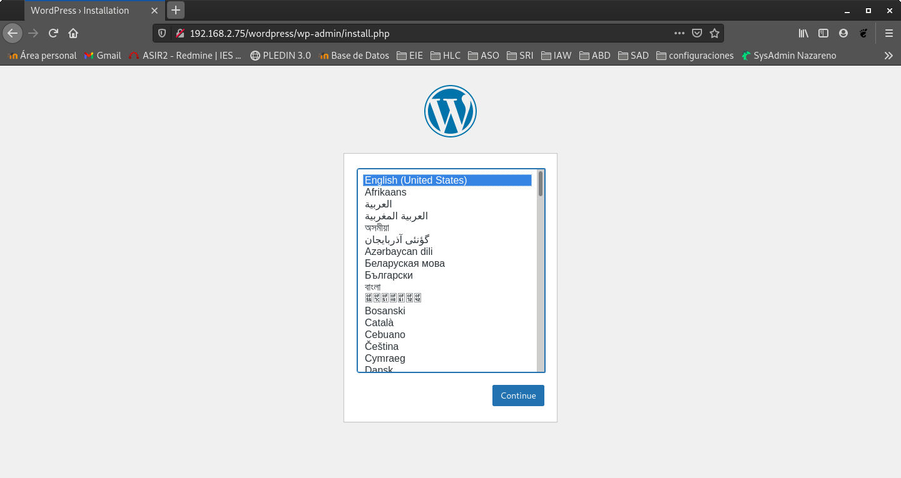

### Tarea 1: Vamos a configurar una máquina con la configuración ganadora: nginx + fpm_php (socket unix). Para ello ejecuta la receta ansible que encontraras en este  <a href="https://github.com/josedom24/ansible&#95;nginx&#95;fpm&#95;php" target="_blank">repositorio</a>. Accede al wordpress y termina la configuración del sitio.

Instalamos Ansible.
```shell
fran@debian:~$ sudo apt update && sudo apt install ansible
```

Clonamos el repositorio:
```shell
fran@debian:~/GitHub$ git clone https://github.com/josedom24/ansible_nginx_fpm_php.git
Clonando en 'ansible_nginx_fpm_php'...
remote: Enumerating objects: 40, done.
remote: Counting objects: 100% (40/40), done.
remote: Compressing objects: 100% (27/27), done.
remote: Total 40 (delta 0), reused 36 (delta 0), pack-reused 0
Desempaquetando objetos: 100% (40/40), listo.
```

Modificamos la ip de la maquina para adaptarla a nuestro interfaz.
```shell
root@debian:/home/fran/GitHub/ansible_nginx_fpm_php# nano ansible.cfg
[defaults]
inventory = hosts
remote_user = vagrant #modificaremos el usuario remoto
host_key_checking = false


root@debian:/home/fran/GitHub/ansible_nginx_fpm_php# nano hosts

[servidores_web]
nodo1 ansible_ssh_host=192.168.2.75 ansible_python_interpreter=/usr/bin/python3
```

Iniciamos la receta para crear el escenario.(con la opcion -k accederemos poniendo la contraseña)
```shell
root@debian:/home/fran/GitHub/ansible_nginx_fpm_php# ansible-playbook -k site.yaml 
SSH password: 

PLAY [servidores_web] ***********************************************************************************************************************************************

TASK [Gathering Facts] **********************************************************************************************************************************************
ok: [nodo1]

TASK [nginx : install nginx, php-fpm] *******************************************************************************************************************************
changed: [nodo1]

TASK [nginx : Copy info.php] ****************************************************************************************************************************************
changed: [nodo1]

TASK [nginx : Copy virtualhost default] *****************************************************************************************************************************
changed: [nodo1]

RUNNING HANDLER [nginx : restart nginx] *****************************************************************************************************************************
changed: [nodo1]

PLAY [servidores_web] ***********************************************************************************************************************************************

TASK [Gathering Facts] **********************************************************************************************************************************************
ok: [nodo1]

TASK [mariadb : ensure mariadb is installed] ************************************************************************************************************************
changed: [nodo1]

TASK [mariadb : ensure mariadb binds to internal interface] *********************************************************************************************************
changed: [nodo1]

RUNNING HANDLER [mariadb : restart mariadb] *************************************************************************************************************************
changed: [nodo1]

PLAY [servidores_web] ***********************************************************************************************************************************************

TASK [Gathering Facts] **********************************************************************************************************************************************
ok: [nodo1]

TASK [wordpress : install unzip] ************************************************************************************************************************************
changed: [nodo1]

TASK [wordpress : download wordpress] *******************************************************************************************************************************
changed: [nodo1]

TASK [wordpress : unzip wordpress] **********************************************************************************************************************************
changed: [nodo1]

TASK [wordpress : create database wordpress] ************************************************************************************************************************
changed: [nodo1]

TASK [wordpress : create user mysql wordpress] **********************************************************************************************************************
changed: [nodo1] => (item=localhost)

TASK [wordpress : copy wp-config.php] *******************************************************************************************************************************
changed: [nodo1]

RUNNING HANDLER [wordpress : restart nginx] *************************************************************************************************************************
changed: [nodo1]

PLAY RECAP **********************************************************************************************************************************************************
nodo1                      : ok=17   changed=14   unreachable=0    failed=0   
```

Ahora ya tenemos nuestra maquina creada en vagrant con la receta de ansible implementada, deberemos acceder a la ip/wordpress para iniciar la instalación del mismo.




### Tarea 2: Vamos a hacer las pruebas de rendimiento desde la misma máquina, es decir vamos a ejecutar instrucciones similares a esta:

```shell
ab -t 10 -c 200 -k http:/127.0.0.1/wordpress/index.php
```
**Realiza algunas prueba de rendimiento con varios valores distintos para el nivel de concurrencia (50,100,250,500) y apunta el resultado de peticiones/segundo (parámetro Requests per second de ab). Puedes hacer varias pruebas y quedarte con la media. Reinicia el servidor nginx y el fpm-php entre cada prueba para que los resultados sean los más reales posibles.**

Instalaremos apache2-utils que nos sera necesario para poder ejecutar **ab**.
```shell
vagrant@ansible:~$ sudo apt install apache2-utils
```

Pruebas de rendimiento.(50)
```shell
vagrant@ansible:~$ sudo systemctl restart nginx
vagrant@ansible:~$ ab -t 10 -c 50 -k http://192.168.2.75/wordpress/
This is ApacheBench, Version 2.3 <$Revision: 1843412 $>
Copyright 1996 Adam Twiss, Zeus Technology Ltd, http://www.zeustech.net/
Licensed to The Apache Software Foundation, http://www.apache.org/

Benchmarking 192.168.2.75 (be patient)
Finished 535 requests


Server Software:        nginx/1.14.2
Server Hostname:        192.168.2.75
Server Port:            80

Document Path:          /wordpress/
Document Length:        18150 bytes

Concurrency Level:      50
Time taken for tests:   10.002 seconds
Complete requests:      535
Failed requests:        0
Keep-Alive requests:    0
Total transferred:      9922645 bytes
HTML transferred:       9710250 bytes
Requests per second:    53.49 [#/sec] (mean)
Time per request:       934.777 [ms] (mean)
Time per request:       18.696 [ms] (mean, across all concurrent requests)
Transfer rate:          968.80 [Kbytes/sec] received

Connection Times (ms)
              min  mean[+/-sd] median   max
Connect:        0    0   0.2      0       1
Processing:    54  890 156.4    927     994
Waiting:       28  874 154.6    912     971
Total:         55  890 156.2    927     994

Percentage of the requests served within a certain time (ms)
  50%    927
  66%    935
  75%    940
  80%    946
  90%    961
  95%    968
  98%    979
  99%    981
 100%    994 (longest request)
```

Pruebas de rendimiento.(100)
```shell
vagrant@ansible:~$ sudo systemctl restart nginx
vagrant@ansible:~$ ab -t 10 -c 100 -k http://192.168.2.75/wordpress/
This is ApacheBench, Version 2.3 <$Revision: 1843412 $>
Copyright 1996 Adam Twiss, Zeus Technology Ltd, http://www.zeustech.net/
Licensed to The Apache Software Foundation, http://www.apache.org/

Benchmarking 192.168.2.75 (be patient)
Finished 496 requests


Server Software:        nginx/1.14.2
Server Hostname:        192.168.2.75
Server Port:            80

Document Path:          /wordpress/
Document Length:        18150 bytes

Concurrency Level:      100
Time taken for tests:   10.034 seconds
Complete requests:      496
Failed requests:        0
Keep-Alive requests:    0
Total transferred:      9199312 bytes
HTML transferred:       9002400 bytes
Requests per second:    49.43 [#/sec] (mean)
Time per request:       2022.973 [ms] (mean)
Time per request:       20.230 [ms] (mean, across all concurrent requests)
Transfer rate:          895.33 [Kbytes/sec] received

Connection Times (ms)
              min  mean[+/-sd] median   max
Connect:        0    4   8.4      0      22
Processing:    46 1809 498.9   1984    2138
Waiting:       28 1792 496.1   1968    2114
Total:         57 1813 492.1   1985    2138

Percentage of the requests served within a certain time (ms)
  50%   1985
  66%   2041
  75%   2061
  80%   2076
  90%   2098
  95%   2109
  98%   2115
  99%   2121
 100%   2138 (longest request)
```

Pruebas de rendimiento.(250)
```shell
vagrant@ansible:~$ sudo systemctl restart nginx
vagrant@ansible:~$ ab -t 10 -c 250 -k http://192.168.2.75/wordpress/
This is ApacheBench, Version 2.3 <$Revision: 1843412 $>
Copyright 1996 Adam Twiss, Zeus Technology Ltd, http://www.zeustech.net/
Licensed to The Apache Software Foundation, http://www.apache.org/

Benchmarking 192.168.2.75 (be patient)
Completed 5000 requests
Completed 10000 requests
Completed 15000 requests
Completed 20000 requests
Completed 25000 requests
Finished 26027 requests


Server Software:        nginx/1.14.2
Server Hostname:        192.168.2.75
Server Port:            80

Document Path:          /wordpress/
Document Length:        18150 bytes

Concurrency Level:      250
Time taken for tests:   10.000 seconds
Complete requests:      26027
Failed requests:        25628
   (Connect: 0, Receive: 0, Length: 25628, Exceptions: 0)
Non-2xx responses:      25628
Keep-Alive requests:    25509
Total transferred:      15856898 bytes
HTML transferred:       11675494 bytes
Requests per second:    2602.61 [#/sec] (mean)
Time per request:       96.057 [ms] (mean)
Time per request:       0.384 [ms] (mean, across all concurrent requests)
Transfer rate:          1548.47 [Kbytes/sec] received

Connection Times (ms)
              min  mean[+/-sd] median   max
Connect:        0    5  68.2      0    1008
Processing:     2   82 383.9     26    3679
Waiting:        2   82 381.5     26    3649
Total:          2   87 390.1     26    4545

Percentage of the requests served within a certain time (ms)
  50%     26
  66%     32
  75%     37
  80%     41
  90%     50
  95%     57
  98%   1014
  99%   3172
 100%   4545 (longest request)
```

Pruebas de rendimiento.(500)
```shell
vagrant@ansible:~$ sudo systemctl restart nginx
vagrant@ansible:~$ ab -t 10 -c 500 -k http://192.168.2.75/wordpress/
This is ApacheBench, Version 2.3 <$Revision: 1843412 $>
Copyright 1996 Adam Twiss, Zeus Technology Ltd, http://www.zeustech.net/
Licensed to The Apache Software Foundation, http://www.apache.org/

Benchmarking 192.168.2.75 (be patient)
Completed 5000 requests
Completed 10000 requests
Completed 15000 requests
Completed 20000 requests
Completed 25000 requests
Completed 30000 requests
Completed 35000 requests
Finished 36817 requests


Server Software:        nginx/1.14.2
Server Hostname:        192.168.2.75
Server Port:            80

Document Path:          /wordpress/
Document Length:        18150 bytes

Concurrency Level:      500
Time taken for tests:   10.000 seconds
Complete requests:      36817
Failed requests:        36456
   (Connect: 0, Receive: 0, Length: 36456, Exceptions: 0)
Non-2xx responses:      36456
Keep-Alive requests:    36235
Total transferred:      18757768 bytes
HTML transferred:       12891170 bytes
Requests per second:    3681.60 [#/sec] (mean)
Time per request:       135.811 [ms] (mean)
Time per request:       0.272 [ms] (mean, across all concurrent requests)
Transfer rate:          1831.76 [Kbytes/sec] received

Connection Times (ms)
              min  mean[+/-sd] median   max
Connect:        0    2  35.6      0    1030
Processing:     1  108 413.4     62    4429
Waiting:        1  108 412.2     62    4429
Total:          1  110 421.6     62    4429

Percentage of the requests served within a certain time (ms)
  50%     62
  66%     71
  75%     76
  80%     80
  90%     92
  95%    100
  98%    121
  99%   3364
 100%   4429 (longest request)
```

### Resumen de las pruebas.
<details open>
<summary>Pruebas de rendimiento.(50)</summary>
<br>
Requests per second:    53.49 [#/sec] (mean)
</details>

<details open>
<summary>Pruebas de rendimiento.(100)</summary>
<br>
Requests per second:    49.43 [#/sec] (mean)
</details>

<details open>
<summary>Pruebas de rendimiento.(250)</summary>
<br>
Requests per second:    2602.61 [#/sec] (mean)
</details>

<details open>
<summary>Pruebas de rendimiento.(500)</summary>
<br>
Requests per second:    3681.60 [#/sec] (mean)
</details>


### Tarea 3: Configura un proxy inverso - caché Varnish escuchando en el puerto 80 y que se comunica con el servidor web por el puerto 8080. Entrega y muestra una comprobación de que varnish está funcionando con la nueva configuración. Realiza pruebas de rendimiento (quedate con el resultado del parámetro Requests per second) y comprueba si hemos aumentado el rendimiento. Si hacemos varias peticiones a la misma URL, ¿cuantas peticiones llegan al servidor web? (comprueba el fichero access.log para averiguarlo).


Para realizar la prueba lo mas real posible modificaremos el puerto de nginx ya que nuestro proxy inverso utilizará el 80. 
```shell
vagrant@ansible:~$ sudo nano /etc/nginx/sites-available/default
        listen 8080 default_server;
        listen [::]:8080 default_server;
```

Reiniciaremos el servicio y comprobaremos que escuchamos por dicho puerto.
```shell
vagrant@ansible:~$ sudo systemctl restart nginx
vagrant@ansible:~$ netstat -tln
Active Internet connections (only servers)
Proto Recv-Q Send-Q Local Address           Foreign Address         State      
tcp        0      0 0.0.0.0:22              0.0.0.0:*               LISTEN     
tcp        0      0 0.0.0.0:25              0.0.0.0:*               LISTEN     
tcp        0      0 0.0.0.0:6081            0.0.0.0:*               LISTEN     
tcp        0      0 127.0.0.1:6082          0.0.0.0:*               LISTEN     
tcp        0      0 0.0.0.0:3306            0.0.0.0:*               LISTEN     
tcp        0      0 127.0.0.1:11211         0.0.0.0:*               LISTEN     
tcp        0      0 0.0.0.0:8080            0.0.0.0:*               LISTEN     
tcp6       0      0 :::22                   :::*                    LISTEN     
tcp6       0      0 :::25                   :::*                    LISTEN     
tcp6       0      0 :::6081                 :::*                    LISTEN     
tcp6       0      0 :::8080                 :::*                    LISTEN  
```

Instalamos **Varnish**:
```shell
vagrant@ansible:~$ sudo apt install varnish
```

Configuraremos **Varnish** para que esuche por el puerto 80 y redirija las peticiones al puerto de nginx 8080.
```shell
vagrant@ansible:~$ sudo nano /etc/default/varnish
DAEMON_OPTS="-a :80 \
             -T localhost:6082 \
             -f /etc/varnish/default.vcl \
             -S /etc/varnish/secret \
             -s malloc,256m"
```

```shell
vagrant@ansible:~$ sudo nano /lib/systemd/system/varnish.service

[Unit]
Description=Varnish HTTP accelerator
Documentation=https://www.varnish-cache.org/docs/6.1/ man:varnishd

[Service]
Type=simple
LimitNOFILE=131072
LimitMEMLOCK=82000
ExecStart=/usr/sbin/varnishd -j unix,user=vcache -F -a :80 -T localhost:6082 -f /etc/varnish$
ExecReload=/usr/share/varnish/varnishreload
ProtectSystem=full
ProtectHome=true
PrivateTmp=true
PrivateDevices=true

[Install]
WantedBy=multi-user.target
```

Reiniciaremos los servicios.
```shell
vagrant@ansible:~$ sudo systemctl daemon-reload
vagrant@ansible:~$ sudo systemctl restart varnish
```

Como podemos comprobar varnish esta escuchando por el puerto 80.
```shell
vagrant@ansible:~$ netstat -tln
Active Internet connections (only servers)
Proto Recv-Q Send-Q Local Address           Foreign Address         State      
tcp        0      0 0.0.0.0:22              0.0.0.0:*               LISTEN     
tcp        0      0 0.0.0.0:25              0.0.0.0:*               LISTEN     
tcp        0      0 127.0.0.1:6082          0.0.0.0:*               LISTEN     
tcp        0      0 0.0.0.0:3306            0.0.0.0:*               LISTEN     
tcp        0      0 127.0.0.1:11211         0.0.0.0:*               LISTEN     
tcp        0      0 0.0.0.0:80              0.0.0.0:*               LISTEN     
tcp        0      0 0.0.0.0:8080            0.0.0.0:*               LISTEN     
tcp6       0      0 :::22                   :::*                    LISTEN     
tcp6       0      0 :::25                   :::*                    LISTEN     
tcp6       0      0 :::80                   :::*                    LISTEN     
tcp6       0      0 :::8080                 :::*                    LISTEN    
```

Pruebas de rendimiento (Ahora con Varnish).
```shell
vagrant@ansible:~$ ab -t 10 -c 50 -k http://192.168.2.75/wordpress/
Requests per second:    7668.12 [#/sec] (mean)

vagrant@ansible:~$ ab -t 10 -c 50 -k http://192.168.2.75/wordpress/
Requests per second:    7831.05 [#/sec] (mean)

vagrant@ansible:~$ ab -t 10 -c 50 -k http://192.168.2.75/wordpress/
Requests per second:    7791.15 [#/sec] (mean)

vagrant@ansible:~$ ab -t 10 -c 100 -k http://192.168.2.75/wordpress/
Requests per second:    6809.21 [#/sec] (mean)

vagrant@ansible:~$ ab -t 10 -c 100 -k http://192.168.2.75/wordpress/
Requests per second:    7532.03 [#/sec] (mean)

vagrant@ansible:~$ ab -t 10 -c 100 -k http://192.168.2.75/wordpress/
Requests per second:    7109.23 [#/sec] (mean)

vagrant@ansible:~$ ab -t 10 -c 250 -k http://192.168.2.75/wordpress/
Requests per second:    7035.93 [#/sec] (mean)

vagrant@ansible:~$ ab -t 10 -c 250 -k http://192.168.2.75/wordpress/
Requests per second:    7010.52 [#/sec] (mean)

vagrant@ansible:~$ ab -t 10 -c 250 -k http://192.168.2.75/wordpress/
Requests per second:    6902.30 [#/sec] (mean)

vagrant@ansible:~$ ab -t 10 -c 500 -k http://192.168.2.75/wordpress/
Requests per second:    5636.73 [#/sec] (mean)

vagrant@ansible:~$ ab -t 10 -c 500 -k http://192.168.2.75/wordpress/
Requests per second:    5107.07 [#/sec] (mean)

vagrant@ansible:~$ ab -t 10 -c 500 -k http://192.168.2.75/wordpress/
Requests per second:    5358.35 [#/sec] (mean)
```

Como podemos comprobar las respuestas por segundo han aumentado bastante, ya que con el uso de **Varnish** se crea una copia del recurso solicitado por la caché del servidor, gracias a ello el rendimeinto aumenta.