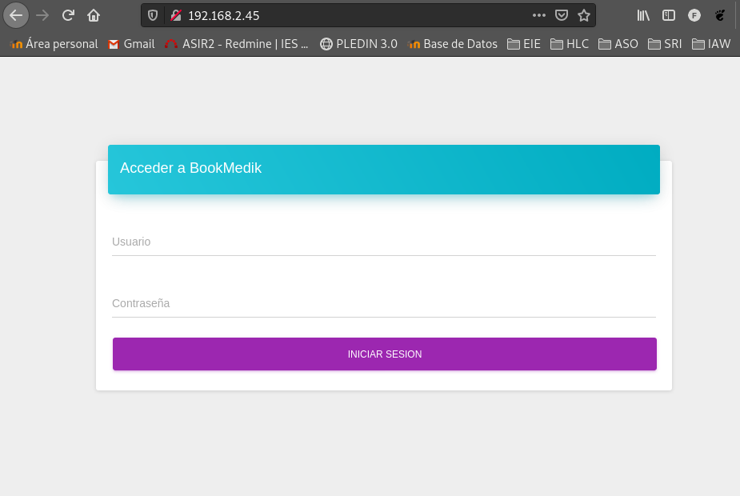
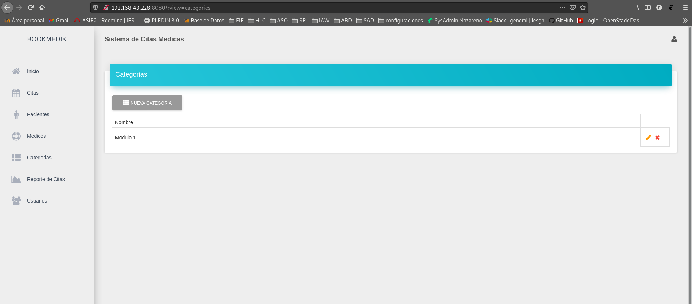
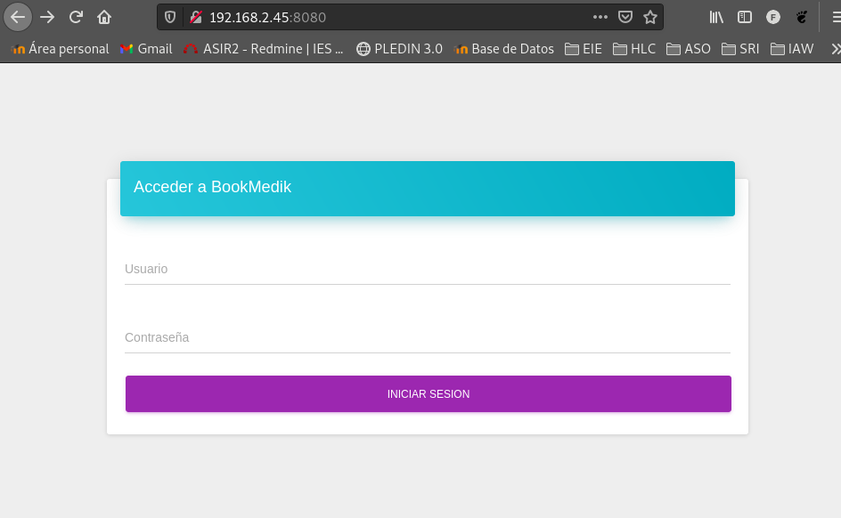
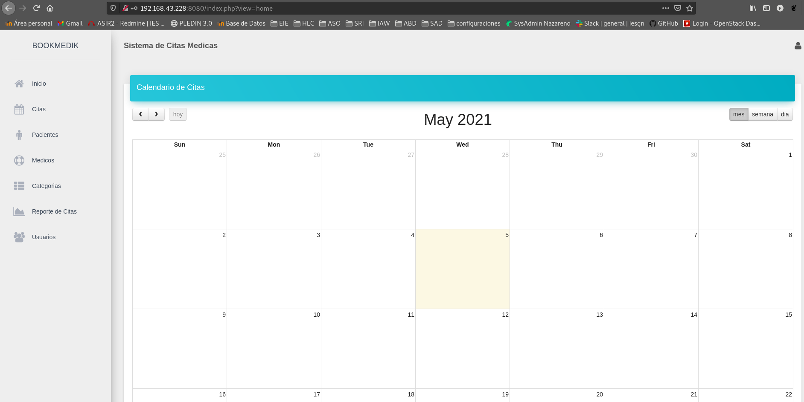
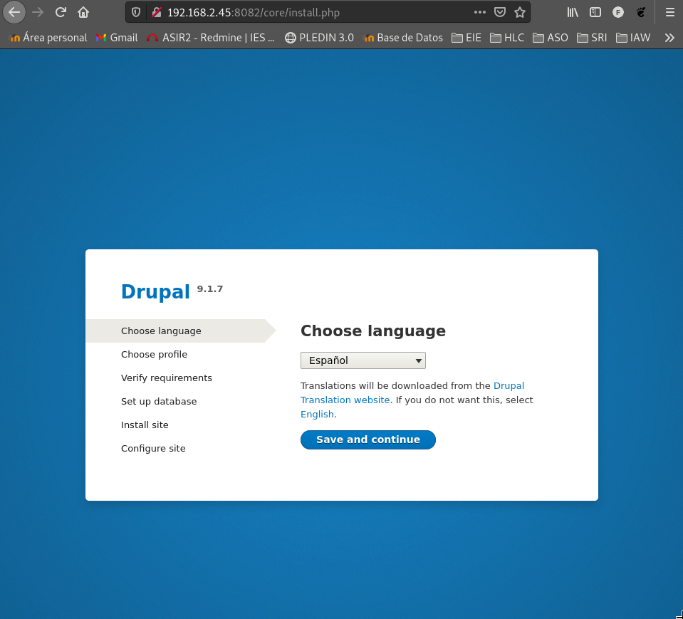
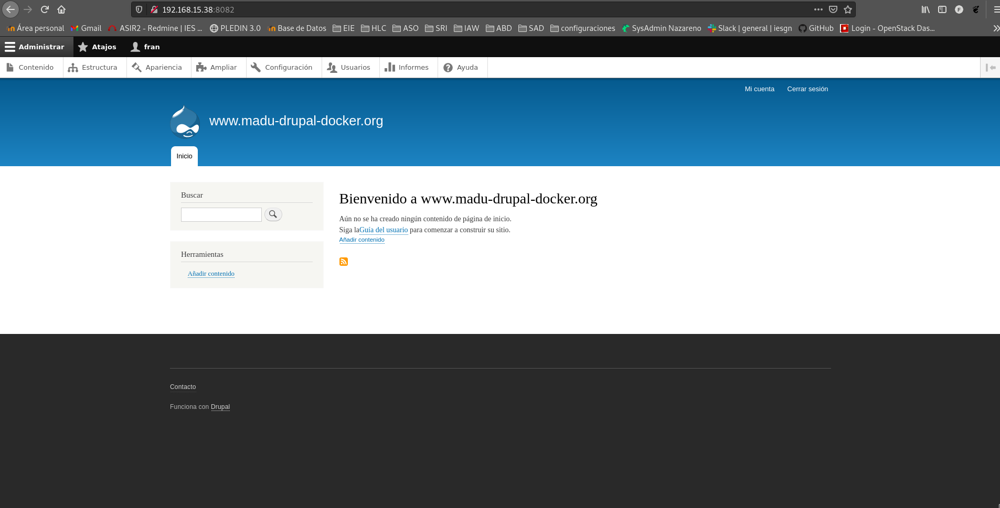
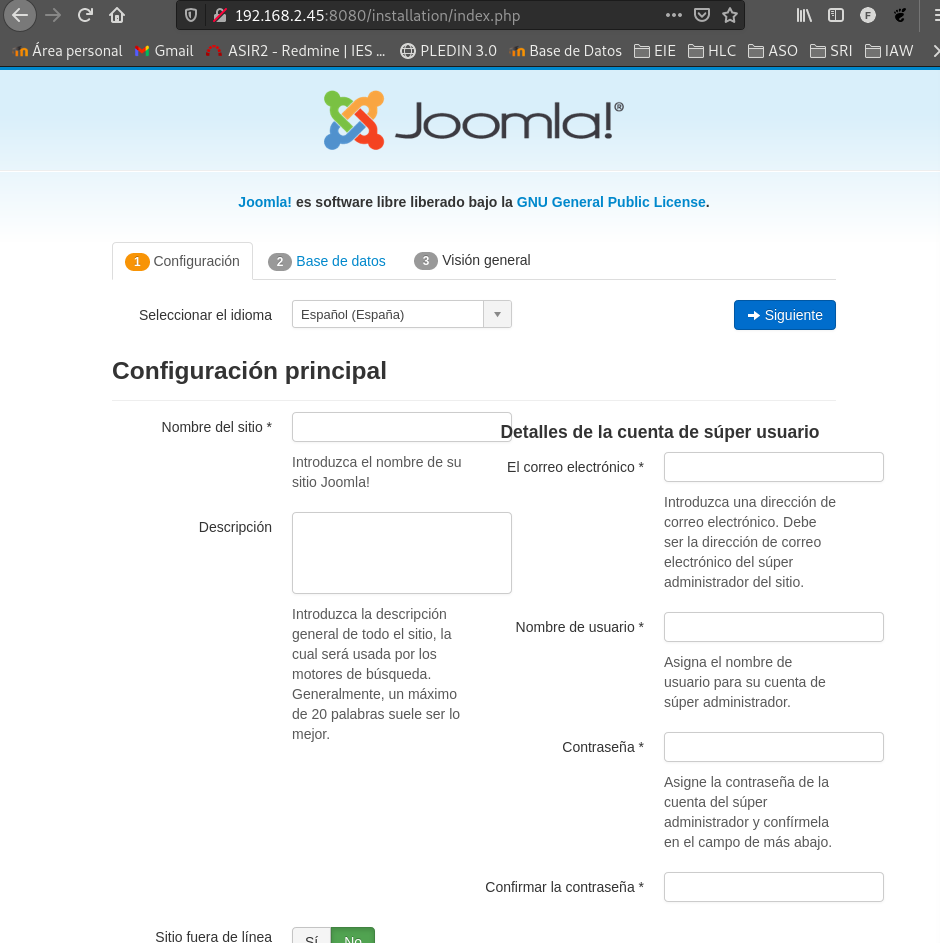
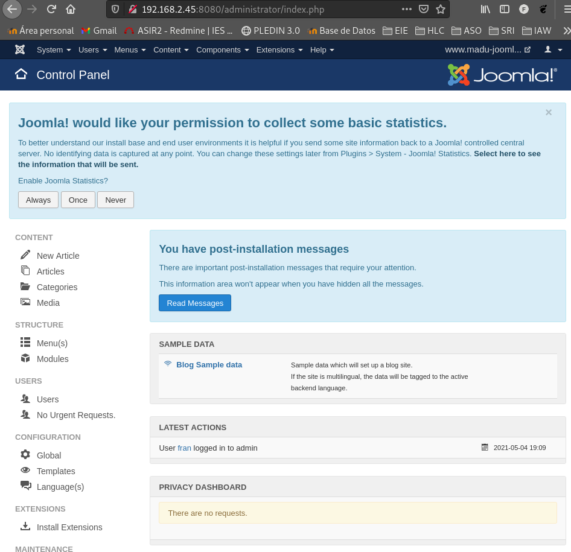

## Práctica: Implantación de aplicaciones web PHP en docker.

<hr>

### Tarea 1: Ejecución de una aplicación web PHP en docker.


* Queremos ejecutar en un contenedor docker la aplicación web escrita en PHP: bookMedik (https://github.com/evilnapsis/bookmedik).
* Es necesario tener un contenedor con mariadb donde vamos a crear la base de datos y los datos de la aplicación. El script para generar la base de datos y los registros lo encuentras en el repositorio y se llama schema.sql. Debes crear un usuario con su contraseña en la base de datos. La base de datos se llama bookmedik y se crea al ejecutar el script.
* Ejecuta el contenedor mariadb y carga los datos del script schema.sql. Para más información.
* El contenedor mariadb debe tener un volumen para guardar la base de datos.
* El contenedor que creas debe tener un volumen para guardar los logs de apache2.
* Crea una imagen docker con la aplicación desde una imagen base de debian o ubuntu. Ten en cuenta que el fichero de configuración de la base de datos (core\controller\Database.php) lo tienes que configurar utilizando las variables de entorno del contenedor mariadb. (Nota: Para obtener las variables de entorno en PHP usar la función getenv. Para más infomación).
* La imagen la tienes que crear en tu máquina con el comando docker build.
* Crea un script con docker compose que levante el escenario con los dos contenedores.(Usuario: admin, contraseña: admin).

<hr>

Instalaremos la paquetería necesaria.
```shell
apt install docker-compose docker.io
```

El primer paso será clonar el repo de la aplicación.
```shell
root@debian:/home/fran/Docker/tarea1# git clone https://github.com/evilnapsis/bookmedik.git
Clonando en 'bookmedik'...
remote: Enumerating objects: 856, done.
remote: Total 856 (delta 0), reused 0 (delta 0), pack-reused 856
Recibiendo objetos: 100% (856/856), 1.90 MiB | 2.14 MiB/s, listo.
Resolviendo deltas: 100% (372/372), listo.
```

Crearemos un repositorio en GitHub con la siguiente estructura, donde bookmedik es el repositorio que acabamos de clonar.
```shell
├── build
│   ├── bookmedik
│   ├── Dockerfile
│   └── script.sh
├── deploy
│   └── docker-compose.yml
```

Para crear el volumen con las tablas que nos hacen falta, crearemos el fichero **docker-compose** con la siguiente información:
```shell
version: "3.1"

services:
  db:
    container_name: servidor_mysql
    image: mariadb
    restart: always
    environment:
      MYSQL_DATABASE: bookmedik
      MYSQL_USER: bookmedik
      MYSQL_PASSWORD: bookmedik
      MYSQL_ROOT_PASSWORD: root
    volumes:
      - /opt/mysql_wp:/var/lib/mysql
```

Lo ejecutaremos:
```shell
root@debian:/home/fran/Docker/tarea1/bookmedik# docker-compose up -d
Creating network "deploy_default" with the default driver
Creating servidor_mysql ... done
```

Dentro del repositorio de bookmedik iremos al fichero **schema.sql** y borraremos o comentaremos la siguiente linea:
```shell
create database bookmedik;
```

Ahora vamos a cargar los datos en la base de datos.
```shell
root@debian:/home/fran/Docker/tarea1/bookmedik# cat schema.sql | docker exec -i servidor_mysql /usr/bin/mysql -u root --password=root bookmedik
```

Creamos el **Dockerfile** para el contenedor, el cual tendrá apache con el modulo de php.
```shell
FROM debian
MAINTAINER Fran Madueño "frandh1997@gmail.com"

RUN apt-get update && apt-get install -y apache2 \
libapache2-mod-php7.3 \
php7.3 \
php7.3-mysql \
&& apt-get clean \
&& rm -rf /var/lib/apt/lists/*

EXPOSE 80

RUN rm /var/www/html/index.html
COPY bookmedik /var/www/html/
ADD script.sh /usr/local/bin/

RUN chmod +x /usr/local/bin/script.sh

ENV DATABASE_USER bookmedik
ENV DATABASE_PASSWORD bookmedik
ENV DATABASE_HOST db

CMD ["script.sh"]
```

Crearemos ahora el fichero **script.sh**.
```shell
#!/bin/bash

sed -i "s/$this->user=\"root\";/$this->user=\"$DATABASE_USER\";/g" /var/www/html/core/controller/Database.php
sed -i "s/$this->pass=\"\";/$this->pass=\"$DATABASE_PASSWORD\";/g" /var/www/html/core/controller/Database.php
sed -i "s/$this->host=\"localhost\";/$this->host=\"$DATABASE_HOST\";/g" /var/www/html/core/controller/Database.php
apache2ctl -D FOREGROUND
```

Ejecutaremos la instrucción para la creación de la imagen:
```shell
root@debian:/home/fran/Docker/tarea1# docker build -t franmadu6/bookmedik:v1 .
Sending build context to Docker daemon  5.774MB
Step 1/12 : FROM debian
 ---> e7d08cddf791
Step 2/12 : RUN apt-get update && apt-get install -y apache2 libapache2-mod-php7.3 php7.3 php7.3-mysql && apt-get clean && rm -rf /var/lib/apt/lists/*
 ---> Using cache
 ---> bd943a2e2877
Step 3/12 : RUN rm /var/www/html/index.html
 ---> Using cache
 ---> 0eaa00c1c86f
 ...
Successfully built e51a62207187
Successfully tagged franmadu6/bookmedik:v1
```

Modificaremos nuevamente el fichero **docker-compose.yml** y añadiremos los siguientes campos:
```shell
version: "3.1"

services:
  db:
    container_name: servidor_mysql
    image: mariadb
    restart: always
    environment:
      MYSQL_DATABASE: bookmedik
      MYSQL_USER: bookmedik
      MYSQL_PASSWORD: bookmedik
      MYSQL_ROOT_PASSWORD: root
    volumes:
      - /opt/mysql_wp:/var/lib/mysql

  bookmedik:
     container_name: bookmedik
     image: franmadu6/bookmedik:v1
     restart: always
     environment:
       USER: bookmedik
       PASSWORD: bookmedik
       HOST: db
     ports:
         - 8080:80
     volumes:
         - /opt/bookmedik_logs:/var/log/apache2
```

Lo volvemos a ejecutar con **docker-compose up -d**.
Ejecutamos:
```shell
root@debian:/home/fran/Docker/tarea1/deploy# docker-compose up -d
Recreating servidor_mysql ... done
Creating bookmedik        ... done
```





### Tarea 2: Ejecución de una aplicación web PHP en docker.


* Realiza la imagen docker de la aplicación a partir de la imagen oficial PHP que encuentras en docker hub. Lee la documentación de la imagen para configurar una imagen con apache2 y php, además seguramente tengas que instalar alguna extensión de php.
* Crea esta imagen en docker hub.
* Crea un script con docker compose que levante el escenario con los dos contenedores.

<hr>

Reutilizaremos la tarea1 para ello copiaremos el directorio.

Nos bajaremos la imagen de php.
```shell
root@debian:/home/fran/Docker/tarea2/build# docker pull php
Using default tag: latest
latest: Pulling from library/php
f7ec5a41d630: Pull complete 
941223b59841: Pull complete 
a5f2415e5a0c: Pull complete 
b9844b87f0e3: Pull complete 
e6344d1b495a: Pull complete 
56b9ec0a1707: Pull complete 
a28bc80345cd: Pull complete 
41cae6f1fa59: Pull complete 
f5ab0cee411f: Pull complete 
Digest: sha256:c3b4938968e6a7b6245c9536203e6eaa5c7552d3673cd2fb92c349772737b313
Status: Downloaded newer image for php:latest
```

Modificaremos el Dockerfile para usar la imagen.
```shell
root@debian:/home/fran/Docker/tarea2/build# cat Dockerfile 
FROM php:7.2-apache
MAINTAINER Fran Madueño "frandh1997@gmail.com"

EXPOSE 80

RUN docker-php-ext-install mysqli
COPY bookmedik /var/www/html/
ADD script.sh /usr/local/bin/

RUN chmod +x /usr/local/bin/script.sh

ENV DATABASE_USER=bookmedik
ENV DATABASE_PASSWORD=bookmedik
ENV DATABASE_HOST=servidor_mysql

CMD ["script.sh"]
```


Creamos la nueva imagen.
```shell
root@debian:/home/fran/Docker/tarea2# docker build -t franmadu6/bookmedik:v2 .
...
Successfully tagged franmadu6/bookmedik:v2
```

Modificamos el antiguo fichero de **docker-compose.yml**:
```shell
root@debian:/home/fran/Docker/tarea2/deploy# cat docker-compose.yml 
version: "3.1"

services:
  db:
    container_name: servidor_mysql
    image: mariadb
    restart: always
    environment:
      MYSQL_DATABASE: bookmedik
      MYSQL_USER: bookmedik
      MYSQL_PASSWORD: bookmedik
      MYSQL_ROOT_PASSWORD: root
    volumes:
      - /opt/mysql_wp:/var/lib/mysql

  bookmedik:
     container_name: bookmedik
     image: franmadu6/bookmedik:v2
     restart: always
     environment:
       USER: bookmedik
       PASSWORD: bookmedik
       HOST: db
     ports:
         - 8080:80
     volumes:
         - /opt/bookmedik_logs:/var/log/apache2
```

```shell
root@debian:/home/fran/Docker/tarea2/deploy# docker-compose up -d
Recreating servidor_mysql ... done
Creating bookmedik        ... done
```






### Tarea 3: Ejecución de una aplicación PHP en docker.


* En este caso queremos usar un contenedor que utilice nginx para servir la aplicación PHP. Puedes crear la imagen desde una imagen base debian o ubuntu o desde la imagen oficial de nginx.
* Vamos a crear otro contenedor que sirva php-fpm.
* Y finalmente nuestro contenedor con la aplicación.
* Crea un script con docker compose que levante el escenario con los tres contenedores.

A lo mejor te puede ayudar el siguiente enlace: Dockerise your PHP application with Nginx and PHP7-FPM

<hr>

En esta ocasión la estructura a seguir es algo mas compleja, la haremos de la siguiente manera:
```shell
├── build
│   ├── bookmedik
│   ├── default.conf
│   ├── Dockerfile
│   └── script.sh
├── build-php
│   └── Dockerfile
├── deploy
│   └── docker-compose.yml
```

Realizaremos la creación de dos imágenes, una imagen oficial de nginx y otra oficial de php-fpm.

Dockerfile para nginx:
```shell
FROM nginx
MAINTAINER Fran Madueño "frandh1997@gmail.com"

EXPOSE 80

RUN rm /etc/nginx/conf.d/default.conf
COPY bookmedik /opt/bookmedik
COPY default.conf /etc/nginx/conf.d/default.conf

ADD script.sh /usr/local/bin/
RUN chmod +x /usr/local/bin/script.sh

ENV DATABASE_USER=user_bookmedik
ENV DATABASE_PASSWORD=pass_bookmedik
ENV DATABASE_HOST=servidor_mysql

CMD ["script.sh"]
```

```shell
#!/bin/bash

cp -R /opt/bookmedik/* /code
sed -i "s/$this->user=\"root\";/$this->user=\"$DATABASE_USER\";/g" /code/core/controller/Database.php
sed -i "s/$this->pass=\"\";/$this->pass=\"$DATABASE_PASSWORD\";/g" /code/core/controller/Database.php
sed -i "s/$this->host=\"localhost\";/$this->host=\"$DATABASE_HOST\";/g" /code/core/controller/Database.php

nginx -g 'daemon off;'
```

default.conf
```shell
server {
    index index.php index.html;
    server_name _;
    error_log  /var/log/nginx/error.log;
    access_log /var/log/nginx/access.log;
    root /code;

    location ~ \.php$ {
        try_files $uri =404;
        fastcgi_split_path_info ^(.+\.php)(/.+)$;
        fastcgi_pass php:9000;
        fastcgi_index index.php;
        include fastcgi_params;
        fastcgi_param SCRIPT_FILENAME $document_root$fastcgi_script_name;
        fastcgi_param PATH_INFO $fastcgi_path_info;
    }
}
```

Creamos la primera imagen:
```shell
root@debian:/home/fran/Docker/tarea3/build# docker build -t franmadu6/bookmedik:v3 .
```

Creación del Dockerfile para php-fpm:
```shell
FROM php:7.2-fpm
MAINTAINER Fran Madueño "frandh1997@gmail.com"

RUN docker-php-ext-install mysqli
```

Creamos la segunda imagen:
```shell
root@debian:/home/fran/Docker/tarea3/build-php# docker build -t franmadu6/php-fpm-mysqli:v1 .
```

Creación del **docker-compose**:
```shell
version: '3.1'

services:

  db:
     container_name: servidor_mysql
     image: mariadb
     restart: always
     environment:
           MYSQL_DATABASE: bookmedik
           MYSQL_USER: user_bookmedik
           MYSQL_PASSWORD: pass_bookmedik
           MYSQL_ROOT_PASSWORD: asdasd
     volumes:
           - /opt/mysql:/var/lib/mysql

  bookmedik:
     container_name: bookmedik
     image: franmadu6/bookmedik:v3
     restart: always
     ports:
         - 8080:80
     volumes:
         - /opt/bookmedik-php:/code

  php:
     container_name: php
     image: franmadu6/php-fpm-mysqli:v1
     restart: always
     volumes:
          - /opt/bookmedik-php:/code
```

Ejecución del deploy:
```shell
root@debian:/home/fran/Docker/tarea3/deploy# docker-compose up -d
Recreating servidor_mysql ... done
Recreating bookmedik      ... done
Creating php              ... done
```

Error:
```shell
Fatal error: Uncaught Error: Call to a member function fetch_array() on boolean in /code/core/app/view/processlogin-view.php:17 Stack trace: #0 /code/core/controller/View.php(31): include() #1 /code/core/app/layouts/layout.php(176): View::load('login') #2 /code/core/controller/Module.php(12): include('/code/core/app/...') #3 /code/core/app/init.php(9): Module::loadLayout('index') #4 /code/core/controller/Lb.php(15): include('/code/core/app/...') #5 /code/index.php(25): Lb->start() #6 {main} thrown in /code/core/app/view/processlogin-view.php on line 17
```


### Tarea 4: Ejecución de un CMS en docker.


* A partir de una imagen base (que no sea una imagen con el CMS), genera una imagen que despliegue un CMS PHP (que no sea wordpress).

* Crea los volúmenes necesarios para que la información que se guarda sea persistente.

<hr>

En este apartado utilizaremos [Drupal](https://hub.docker.com/_/drupal).


### ¿Qué es Drupal?

Drupal es un CMS o sistema de gestión de contenidos que se utiliza para crear sitios web
dinámicos y con gran variedad de funcionalidades.
Drupal es un software libre, escrito en PHP, que cuenta con una amplia y activa comunidad de usuarios
y desarrolladores que colaboran conjuntamente en su mejora y ampliación.
Esta ampliación es posible gracias a que se trata de un sistema modular con una arquitectura muy consistente,
que permite que los módulos creados por cualquier desarrollador puedan interactuar con el núcleo del sistema
y con los módulos creados por otros miembros de la comunidad.
Con Drupal es posible implementar una gran variedad de sitios web: un blog personal o profesional,
un portal corporativo, una tienda virtual, una red social o comunidad virtual, etc.


Para comenzar descargaremos y descomprimiremos la imagen de drupal y estructuraremos la tarea de la siguente forma:

```shell
wget https://www.drupal.org/download-latest/zip
```

```shell
├── build
│   ├── Dockerfile
│   ├── drupal
│   └── script.sh
├── deploy
│   └── docker-compose.yml
```

Creación de **Dockerfile** para la generación de la imagen:
```shell
FROM debian
MAINTAINER Fran Madueño "frandh1997@gmail.com"

EXPOSE 80

RUN apt-get update && apt-get install -y apache2 \
libapache2-mod-php \
php \
php-mysql \
php-dom  \
php-gd \
php-simplexml \
php-xml \
php7.3-mbstring \
&& apt-get clean \
&& rm -rf /var/lib/apt/lists/*

RUN rm /var/www/html/index.html
COPY drupal /var/www/html/
COPY drupal/sites /opt/drupal/sites
COPY drupal/profiles /opt/drupal/profiles
COPY drupal/modules /opt/drupal/modules
COPY drupal/themes /opt/drupal/themes

ADD script.sh /usr/local/bin/
RUN chmod +x /usr/local/bin/script.sh

CMD ["script.sh"]
```

Creación de **script.sh**:
```shell
#!/bin/bash

cp -R /opt/drupal/sites /var/www/html/
cp -R /opt/drupal/modules /var/www/html/
cp -R /opt/drupal/themes /var/www/html/
cp -R /opt/drupal/profiles /var/www/html/
mkdir -p /var/www/html/sites/default/files/translations
chmod -R 777 /var/www/html/sites/default
cp /var/www/html/sites/default/default.settings.php /var/www/html/sites/d$
chmod -R 777 /var/www/html/sites/default/settings.php

apache2ctl -D FOREGROUND
```

Creación de **docker-compose.yml**:
```shell
version: '3.1'

services:

  db:
     container_name: servidor_mysql
     image: mariadb
     restart: always
     environment:
           MYSQL_DATABASE: db_drupal
           MYSQL_USER: user_drupal
           MYSQL_PASSWORD: pass_drupal
           MYSQL_ROOT_PASSWORD: root
     volumes:
           - /opt/mysql:/var/lib/mysql

  drupal:
     container_name: drupal
     image: franmadu6/drupal:v1
     restart: always
     ports:
         - 8082:80
     volumes:
         - /opt/drupal/sites:/var/www/html/sites/
         - /opt/drupal/themes:/var/www/html/themes/
         - /opt/drupal/profiles:/var/www/html/profiles/
         - /opt/drupal/modules:/var/www/html/modules/
```

Generamos la imagen.
```shell
root@debian:/home/fran/Docker/tarea4/build# docker build -t franmadu6/drupal:v1 .
Successfully built b76accf07b39
Successfully tagged franmadu6/drupal:v1
```

Ejecutamos el escenario.
```shell
root@debian:/home/fran/Docker/tarea4/deploy# docker-compose up -d
Recreating servidor_mysql ... done
Creating drupal           ... done
```




Correción de errores:
Archivo de configuración -> Copiaremos el archivo ./sites/default/settings.php como ./sites/default/settings.php



### Tarea 5: Ejecución de un CMS en docker.

Busca una imagen oficial de un CMS PHP en docker hub (distinto al que has instalado en la tarea anterior, ni wordpress), y crea los contenedores necesarios para servir el CMS, siguiendo la documentación de docker hub.

<hr>

En este apartado utilizaremos [Joomla](https://hub.docker.com/_/joomla).


### ¿Qué es Joomla?

Joomla es un sistema de gestión de contenido (CMS) gratuito y de código abierto para publicar contenido web. Se basa en un marco de aplicación web modelo-vista-controlador que se puede utilizar independientemente del CMS. Joomla está escrito en PHP, utiliza técnicas de programación orientada a objetos (OOP) y patrones de diseño de software, almacena datos en una base de datos MySQL, MS SQL o PostgreSQL e incluye características como almacenamiento en caché de páginas, feeds RSS, versiones imprimibles de páginas, noticias flashes, blogs, búsqueda y soporte para la internacionalización de idiomas.

Comenzaremos con la creación del **docker-compose**:
```shell
version: '3.1'

services:

  joomladb:
    container_name: servidor_mysql
    image: mariadb
    restart: always
    environment:
           MYSQL_ROOT_PASSWORD: root
           MYSQL_DATABASE: db_joomla
           MYSQL_USER: user_joomla
           MYSQL_PASSWORD: pass_joomla

  joomla:
    container_name: joomla
    image: joomla
    restart: always
    ports:
      - 8080:80
    environment:
      JOOMLA_DB_HOST: joomladb
      JOOMLA_DB_USER: user_joomla
      JOOMLA_DB_PASSWORD: pass_joomla
      JOOMLA_DB_NAME: db_joomla
```

Comprobamos que se han realizado las imagenes correctamente.
```shell
root@debian:/home/fran/Docker/tarea5# docker ps
CONTAINER ID        IMAGE               COMMAND                  CREATED             STATUS              PORTS                  NAMES
52181b414ddc        joomla              "/entrypoint.sh apac…"   9 minutes ago       Up 9 minutes        0.0.0.0:8080->80/tcp   joomla
d1e9182b4cf8        mariadb             "docker-entrypoint.s…"   9 minutes ago       Up 9 minutes        3306/tcp               servidor_mysql
```

Configuramos joomla:


Comprobación de que la instalación se ha realizado correctamente.


Todos los ejercicios los puedes econtrar en: https://github.com/franmadu6/PHP-en-Docker