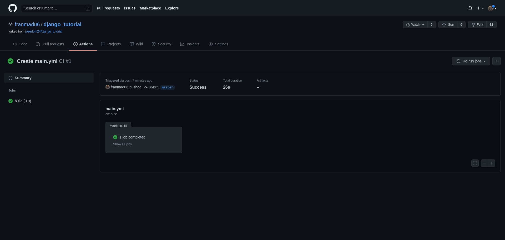

## Tarea: Integración continúa de aplicación django (Test + Deploy).

**Vamos a trabajar con el repositorio de la aplicación [django_tutorial](https://github.com/josedom24/django_tutorial). Esta aplicación tiene definidas una serie de test, que podemos estudiar en el fichero tests.py del directorio polls.**

**Para ejecutar las pruebas unitarias, ejecutamos la instrucción python3 manage.py test.**

### Estudia las distintas pruebas que se han realizado, y modifica el código de la aplicación (debes modificar el fichero views.py o los templates, no debes cambiar el fichero tests.py para que al menos una de ella no se ejecute de manera exitosa.

**A continuación vamos a configurar la integración continúa para que cada vez que hagamos un commit se haga la ejecución de test en la herramienta de CI/CD que haya elegido.**

### Crea el pipeline en el sistema de CI/CD para que pase automáticamente los tests. Muestra el fichero de configuración y una captura de pantalla con un resultado exitoso de la IC y otro con un error.

**A continuación vamos a realziar el despliegue coontinuo en un servicio de hosting, por ejemplo heroku.**

### Entrega un breve descripción de los pasos más importantes para realizar el despliegue desde el sistema de CI/CS y entrega una prueba de funcionamiento donde se compruebe cómo se hace el despliegue automático.

<hr>

Para esta práctica utilizaremos el fork de django_tutorial utilizado anteriormente.

Crearemos un entorno virtual.
```shell
fran@debian:~$ cd .virtualenvs/
fran@debian:~/.virtualenvs$ python3 -m venv django
fran@debian:~/.virtualenvs$ source django/bin/activate
(django) fran@debian:~/.virtualenvs$ 
```

Instalamos los requerimientos.
```shell
(django) fran@debian:~/GitHub/django_tutorial$ pip install -r requirements.txt 
Collecting asgiref==3.3.0 (from -r requirements.txt (line 1))
  Using cached https://files.pythonhosted.org/packages/c0/e8/578887011652048c2d273bf98839a11020891917f3aa638a0bc9ac04d653/asgiref-3.3.0-py3-none-any.whl
Collecting Django==3.1.3 (from -r requirements.txt (line 2))
  Using cached https://files.pythonhosted.org/packages/7f/17/16267e782a30ea2ce08a9a452c1db285afb0ff226cfe3753f484d3d65662/Django-3.1.3-py3-none-any.whl
Collecting pytz==2020.4 (from -r requirements.txt (line 3))
  Using cached https://files.pythonhosted.org/packages/12/f8/ff09af6ff61a3efaad5f61ba5facdf17e7722c4393f7d8a66674d2dbd29f/pytz-2020.4-py2.py3-none-any.whl
Collecting sqlparse==0.4.1 (from -r requirements.txt (line 4))
  Using cached https://files.pythonhosted.org/packages/14/05/6e8eb62ca685b10e34051a80d7ea94b7137369d8c0be5c3b9d9b6e3f5dae/sqlparse-0.4.1-py3-none-any.whl
Installing collected packages: asgiref, pytz, sqlparse, Django
Successfully installed Django-3.1.3 asgiref-3.3.0 pytz-2020.4 sqlparse-0.4.1
```

Realizaremos una comprobación de los test.
```shell
(django) fran@debian:~/GitHub/django_tutorial$ python3 manage.py test
Creating test database for alias 'default'...
System check identified no issues (0 silenced).
..........
----------------------------------------------------------------------
Ran 10 tests in 0.029s

OK
Destroying test database for alias 'default'...
```

Modificaremos la aplicación para producir un error.
```shell
(django) fran@debian:~/GitHub/django_tutorial/polls/templates/polls$ nano index.html 


<link rel="stylesheet" type="text/css" href="">


    <ul>
    
    <li><a href="">{{ question.question_text }}</a></li>
    
    </ul>

    <p>Generando un error<p>

```

Como podemos comprobar al realizar un nuevo test.
```shell
(django) fran@debian:~/GitHub/django_tutorial$ python3 manage.py test
Creating test database for alias 'default'...
System check identified no issues (0 silenced).
..F.F.....
======================================================================
FAIL: test_future_question (polls.tests.QuestionIndexViewTests)
----------------------------------------------------------------------
Traceback (most recent call last):
  File "/home/fran/GitHub/django_tutorial/polls/tests.py", line 73, in test_future_question
    self.assertContains(response, "No polls are available.")
  File "/home/fran/.virtualenvs/django/lib/python3.7/site-packages/django/test/testcases.py", line 470, in assertContains
    self.assertTrue(real_count != 0, msg_prefix + "Couldn't find %s in response" % text_repr)
AssertionError: False is not true : Couldn't find 'No polls are available.' in response

======================================================================
FAIL: test_no_questions (polls.tests.QuestionIndexViewTests)
----------------------------------------------------------------------
Traceback (most recent call last):
  File "/home/fran/GitHub/django_tutorial/polls/tests.py", line 51, in test_no_questions
    self.assertContains(response, "No polls are available.")
  File "/home/fran/.virtualenvs/django/lib/python3.7/site-packages/django/test/testcases.py", line 470, in assertContains
    self.assertTrue(real_count != 0, msg_prefix + "Couldn't find %s in response" % text_repr)
AssertionError: False is not true : Couldn't find 'No polls are available.' in response

----------------------------------------------------------------------
Ran 10 tests in 0.029s

FAILED (failures=2)
Destroying test database for alias 'default'...
```
Nos produce un error, la respuesta debería ser "No polls are available." pero se la hemos modificado.

Ahora daremos paso a un sistema IC/DC que en mi caso usare **GitHub Actions**.

Para poder acceder a **GitHub Actions** deberemos entrar en nuestro repositorio -> Acceder a la pestaña Actions -> Le daremos a la primera opción "set up a workflow yourself" para seleccionar el flujo de trabajo.

Editaremos el fichero generado **main.yml**:

```shell
# This is a basic workflow to help you get started with Actions

name: CI

# Controls when the action will run. 
on:
  # Triggers the workflow on push or pull request events but only for the master branch
  push:
    branches: [ master ]
  pull_request:
    branches: [ master ]

jobs:
  build:

    runs-on: ubuntu-latest
    strategy:
      matrix:
        python-version: [3.9]

    steps:
    - uses: actions/checkout@v2
    - name: Set up Python ${{ matrix.python-version }}
      uses: actions/setup-python@v2
      with:
        python-version: ${{ matrix.python-version }}
    - name: Instalar requerimientos
      run: |
        pip install --upgrade pip
        pip install -r requirements.txt
      
    - name: Probar python3
      run: python3 manage.py test
```

Le daremos a **Start Commit** para añadir el archivo al directorio, Ahora comprobaremos algunos test.

* Test Bueno



* Test Erroneo (Modificando nueva mente el un fichero del repositorio.)


A continuación vamos a realziar el despliegue coontinuo en un servicio de hosting, **Heroku**.

Deberemos irnos a nuestro perfil de usuario en Heroku, buscamos API_KEY la copiamos, ahora nos iremos a nuestro repositorio -> Settings -> Secrets y pegaremos ahí el codigo copiado.


Ahora crearemos un nuevo proyecto en heroku y lo conectaremos con GitHub.


Modificaremos el fichero main nueva mente añadiendo las sigueinte lineas para implementarlo en heroku:
```shell
# This is a basic workflow to help you get started with Actions

name: CI

# Controls when the action will run. 
on:
  # Triggers the workflow on push or pull request events but only for the master branch
  push:
    branches: [ master ]
  pull_request:
    branches: [ master ]

jobs:
  build:

    runs-on: ubuntu-latest
    strategy:
      matrix:
        python-version: [3.9]

    steps:
    - uses: actions/checkout@v2
    - uses: akhileshns/heroku-deploy@v3.8.9 # This is the action
      with:
          heroku_api_key: ${{secrets.HEROKU_API_KEY}}
          heroku_app_name: "django-tutorial-franmadu6" #Must be unique in Heroku
          heroku_email: "frandh1997@gmail.com"
          procfile: "web: npm start"    

    - name: Set up Python ${{ matrix.python-version }}
      uses: actions/setup-python@v2
      with:
        python-version: ${{ matrix.python-version }}
    - name: Instalar requerimientos
      run: |
        pip install --upgrade pip
        pip install -r requirements.txt
      
    - name: Probar python3
      run: python3 manage.py test
```

También modificaremos el fichero settings.py y le añadiremos en la primera línea:
```shell
import os
```
Y en la ultima:
```shell
STATIC_ROOT = os.path.join(BASE_DIR, 'static')
```


Como podemos comprobrar se hace el desplieque automático.
