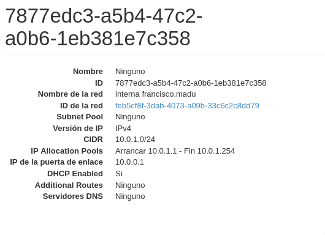

### cloud-init se define como el estándar para personalizar instancias cloud. Las imágenes para las instancias cloud empiezan siendo idénticas entre sí, al ser clones. Es la información proporcionada por el usuario lo que le da a la instancia su personalidad y cloud-init es la herramienta que aplica esta configuración a las instancias de forma automática.

### cloud-init fue desarrollado inicialmente por Canonical para las imágenes cloud de Ubuntu usadas por AWS. Desde entonces, la aplicación ha evolucionado y puede ser usada en otras muchas distribuciones y en otros entornos cloud (y no cloud).

<hr>

## Elige una instancia del escenario de OpenStack y vuelve a crearla utilizando el mismo volumen para el sistema raíz, pero realizando toda la configuración posible con cloud-init, de manera que la instancia permanezca bien configurada aunque se reinicie.
* Sube a la tarea el fichero **cloud-config** utilizado.

habilitaremos el servidor dhcp de la subred



Deberemos añadir la valiable de entorno (OS_VOLUME_API_VERSION) con la versión de la API que vamos a utilizar, por lo que haremos uso del comando:
```shell
root@debian:/home/fran/Documentos# echo "export OS_VOLUME_API_VERSION=2" >> Proyecto\ de\ francisco.madu-openrc.sh 
```

Verificaremos nuestras instancias actuales:
```shell
fran@debian:~/Documentos$ source ~/.virtualenvs/openstackclient/bin/activate
(openstackclient) fran@debian:~/Documentos$ source Proyecto\ de\ francisco.madu-openrc.sh 
Please enter your OpenStack Password for project Proyecto de francisco.madu as user francisco.madu: 
(openstackclient) fran@debian:~/Documentos$ openstack server list
+--------------------------------------+----------------+--------+-----------------------------------------------------------------------------------------------------------------+--------------------------+-----------+
| ID                                   | Name           | Status | Networks                                                                                                        | Image                    | Flavor    |
+--------------------------------------+----------------+--------+-----------------------------------------------------------------------------------------------------------------+--------------------------+-----------+
| 3dae141f-1707-478f-a26a-340081eb44a6 | Quijote        | ACTIVE | dmz de francisco.madu=10.0.2.4                                                                                  | N/A (booted from volume) | m1.mini   |
| 82fa5cde-c13c-486b-86b7-8027c0335207 | AnsiblePruebas | ACTIVE | red de francisco.madu=10.0.0.8, 172.22.201.13                                                                   | N/A (booted from volume) | m1.mini   |
| 29299b3d-c9de-4b1b-a21b-52a31a41b9ec | Sancho         | ACTIVE | interna francisco.madu=10.0.1.10                                                                                | N/A (booted from volume) | m1.mini   |
| 90868331-2011-4ee3-97cd-146931dbd536 | Freston        | ACTIVE | interna francisco.madu=10.0.1.3                                                                                 | N/A (booted from volume) | m1.mini   |
| 4573fbb8-0bd3-4230-85d4-6ae6ab99d543 | Dulcinea       | ACTIVE | dmz de francisco.madu=10.0.2.6; interna francisco.madu=10.0.1.7; red de francisco.madu=10.0.0.11, 172.22.201.38 | N/A (booted from volume) | m1.mini   |
| 7e3d63eb-114a-47c7-98a1-cc2d6199c36f | tareaDjango    | ACTIVE | red de francisco.madu=10.0.0.3, 172.22.200.109                                                                  | Debian Buster 10.6       | m1.normal |
+--------------------------------------+----------------+--------+-----------------------------------------------------------------------------------------------------------------+--------------------------+-----------+
```

Procedremos a la eliminación de **Sancho**, el volumen quedará libre y disponible para ser usado mas adelante:
```shell
(openstackclient) fran@debian:~/Documentos$ openstack server delete Sancho
(openstackclient) fran@debian:~/Documentos$ openstack server show Sancho
No server with a name or ID of 'Sancho' exists.
```

Verificaremos los puestos asociados a **'interna francisco.madu'**:
```shell
(openstackclient) fran@debian:~/Documentos$ openstack port list --network 'interna francisco.madu'
+--------------------------------------+------+-------------------+-------------------------------------------------------------------------+--------+
| ID                                   | Name | MAC Address       | Fixed IP Addresses                                                      | Status |
+--------------------------------------+------+-------------------+-------------------------------------------------------------------------+--------+
| 2c9b1d47-10ca-479e-b1de-62ed18ccca26 |      | fa:16:3e:28:3c:7d | ip_address='10.0.1.1', subnet_id='7877edc3-a5b4-47c2-a0b6-1eb381e7c358' | ACTIVE |
| 92ab186a-b317-41e5-8bac-315524c18c8b |      | fa:16:3e:0c:c0:5e | ip_address='10.0.1.7', subnet_id='7877edc3-a5b4-47c2-a0b6-1eb381e7c358' | ACTIVE |
| bd2dabad-a368-40c0-9897-765a9311b4fe |      | fa:16:3e:bf:dd:55 | ip_address='10.0.1.3', subnet_id='7877edc3-a5b4-47c2-a0b6-1eb381e7c358' | ACTIVE |
+--------------------------------------+------+-------------------+-------------------------------------------------------------------------+--------+
```

Deberemos de crear un nuevo puerto para **Sancho** (10.0.1.10):
```shell
openstack port create --network 'interna francisco.madu' --fixed-ip subnet=7877edc3-a5b4-47c2-a0b6-1eb381e7c358,ip-address=10.0.1.10 --no-security-group --disable-port-security port-sancho
```

```shell
(openstackclient) fran@debian:~/Documentos$ openstack port create --network 'interna francisco.madu' --fixed-ip subnet=7877edc3-a5b4-47c2-a0b6-1eb381e7c358,ip-address=10.0.1.10 --no-security-group --disable-port-security port-sancho
+-------------------------+--------------------------------------------------------------------------+
| Field                   | Value                                                                    |
+-------------------------+--------------------------------------------------------------------------+
| admin_state_up          | UP                                                                       |
| allowed_address_pairs   |                                                                          |
| binding_host_id         | None                                                                     |
| binding_profile         | None                                                                     |
| binding_vif_details     | None                                                                     |
| binding_vif_type        | None                                                                     |
| binding_vnic_type       | normal                                                                   |
| created_at              | 2021-06-06T08:32:46Z                                                     |
| data_plane_status       | None                                                                     |
| description             |                                                                          |
| device_id               |                                                                          |
| device_owner            |                                                                          |
| dns_assignment          | None                                                                     |
| dns_domain              | None                                                                     |
| dns_name                | None                                                                     |
| extra_dhcp_opts         |                                                                          |
| fixed_ips               | ip_address='10.0.1.10', subnet_id='7877edc3-a5b4-47c2-a0b6-1eb381e7c358' |
| id                      | 1d31a525-e907-45a0-abbc-610dbd9f8528                                     |
| ip_allocation           | None                                                                     |
| mac_address             | fa:16:3e:83:8d:75                                                        |
| name                    | port-sancho                                                              |
| network_id              | feb5cf8f-3dab-4073-a09b-33c6c2c8dd79                                     |
| numa_affinity_policy    | None                                                                     |
| port_security_enabled   | False                                                                    |
| project_id              | 2a0efdeba5724b2aa09e7c88e0c8a5bb                                         |
| propagate_uplink_status | None                                                                     |
| qos_network_policy_id   | None                                                                     |
| qos_policy_id           | None                                                                     |
| resource_request        | None                                                                     |
| revision_number         | 4                                                                        |
| security_group_ids      |                                                                          |
| status                  | DOWN                                                                     |
| tags                    |                                                                          |
| trunk_details           | None                                                                     |
| updated_at              | 2021-06-06T08:32:46Z                                                     |
+-------------------------+--------------------------------------------------------------------------+
```

Si volvemos listar los puertos podremos ver el nuevo puerto creado,(en mi caso el puerto aparecia DOWN y Alberto tuvo que mediar para activarlo).
```shell
(openstackclient) fran@debian:~/Documentos$ openstack port list --network 'interna francisco.madu'
+--------------------------------------+-------------+-------------------+--------------------------------------------------------------------------+--------+
| ID                                   | Name        | MAC Address       | Fixed IP Addresses                                                       | Status |
+--------------------------------------+-------------+-------------------+--------------------------------------------------------------------------+--------+
| 1d31a525-e907-45a0-abbc-610dbd9f8528 | port-sancho | fa:16:3e:83:8d:75 | ip_address='10.0.1.10', subnet_id='7877edc3-a5b4-47c2-a0b6-1eb381e7c358' | DOWN   |
| 2c9b1d47-10ca-479e-b1de-62ed18ccca26 |             | fa:16:3e:28:3c:7d | ip_address='10.0.1.1', subnet_id='7877edc3-a5b4-47c2-a0b6-1eb381e7c358'  | ACTIVE |
| 92ab186a-b317-41e5-8bac-315524c18c8b |             | fa:16:3e:0c:c0:5e | ip_address='10.0.1.7', subnet_id='7877edc3-a5b4-47c2-a0b6-1eb381e7c358'  | ACTIVE |
| bd2dabad-a368-40c0-9897-765a9311b4fe |             | fa:16:3e:bf:dd:55 | ip_address='10.0.1.3', subnet_id='7877edc3-a5b4-47c2-a0b6-1eb381e7c358'  | ACTIVE |
+--------------------------------------+-------------+-------------------+--------------------------------------------------------------------------+--------+
```

Listaremos nuestros volumenes para poder coger la **ID** del antiguo volumen asociado a **Sancho**:
```shell
(openstackclient) fran@debian:~/Documentos$ openstack volume list
+--------------------------------------+---------------------+--------+------+---------------------------------------------------------------+
| ID                                   | Name                | Status | Size | Attached to                                                   |
+--------------------------------------+---------------------+--------+------+---------------------------------------------------------------+
| b58cd167-8a8d-46a8-a0bc-517e5f29c933 | v4 zfs              | in-use |    1 | Attached to AnsiblePruebas on /dev/vde                        |
| 0fc5d06a-824a-48a5-9eed-f666702fc80d | v3 zfs              | in-use |    1 | Attached to AnsiblePruebas on /dev/vdd                        |
| e344de1f-e878-4ae5-a207-4aec7fd5c190 | v2 zfs              | in-use |    1 | Attached to AnsiblePruebas on /dev/vdc                        |
| 9f72a5c1-ef4c-48f0-8cff-6d83b03eea01 | v1 zfs              | in-use |    1 | Attached to AnsiblePruebas on /dev/vdb                        |
| 6a739c5f-1384-4140-a8ee-1fcf85ce0946 | Volumen de Quijote  | in-use |   10 | Attached to Quijote on /dev/vda                               |
| 09e5684a-723a-4686-8ef1-da85b804a5a1 |                     | in-use |    5 | Attached to AnsiblePruebas on /dev/vda                        |
| d2a35b12-a105-40e6-a0fc-b10bd43023f0 | Volumen de Sancho   | in-use |   10 | Attached to 29299b3d-c9de-4b1b-a21b-52a31a41b9ec on /dev/vda  |
| 5e309450-673c-40aa-85bc-f967b122be8d | Volumen de Dulcinea | in-use |   10 | Attached to Dulcinea on /dev/vda                              |
| f2a13043-2d9b-4f03-8186-8cef3bc7db4a | Volumen de Freston  | in-use |   10 | Attached to Freston on /dev/vda                               |
+--------------------------------------+---------------------+--------+------+---------------------------------------------------------------+
```

Ahora toca configurar nuestro fichero **cloud-config.yaml**, para ello rellenaremos el fichero de la siguiente manera:

**Especificaciones:**
* Configuramos los repositorios del CICA y deshabilitamos "backports"
* Configuramos adecuadamente el hostname y el FQDN
* Configuramos adecuadamente el cliente NTP con un servidor cercano
* Definimos la zona horaria correcta
* Creamos los usuarios "ubuntu" (que tendrá contraseña) y "profesor" y les permitimos hacer "sudo" sin contraseña, así como añadir las claves públicas necesarias.
```shell
(openstackclient) fran@debian:~/Documentos$ nano cloud-config.yaml
#cloud-config 
apt:
  disable_suites:
    - backports
  primary:
    - arches: [default]
      uri: http://archive.ubuntu.com/ubuntu/
  security:
    - arches: [default]
      uri: http://security.ubuntu.com/ubuntu
# 
manage_etc_hosts: true
fqdn: sancho.madu.gonzalonazareno.org
hostname: sancho
#
ntp:
  enabled: true
  ntp_client: systemd-timesyncd
  servers:
    - es.pool.ntp.org
# 
timezone: Europe/Madrid
# hashed_passwd => se obtiene atraves del comando [mkpasswd --method=SHA-512 --rounds=4096] (necesita estar instalador el paquete whois)
users:
  - name: ubuntu
    sudo: ALL=(ALL) NOPASSWD:ALL
    shell: /bin/bash
    lock_passwd: false
    hashed_passwd: $6$rounds=4096$oLDEh24L$DgaQvLjcmUEd1mf.yVzfgFLpXwneTx3njGQPrfMI1s5o1Swe9V.Y0zAnV2NNF7jVlYu4pThZqkKJAp8A7ur3m/
    ssh_authorized_keys:
      -ssh-rsa AAAAB3NzaC1yc2EAAAADAQABAAABAQDObn8DOhTKNI6ofl7o0ZGkvz7Q9VVXmu445nULNB+NPovmYROGut/ZMG543cez/uUbfKq1UJAvQw5AH9lMKaTsBr8VZLqwiSuk7kEOqTZmfocbDFP+Nr1vO+yhegIJiciAw65Aw9/jz/ubS/1Gsw+FIdUEoApg/Hqr0qmi/DXvi8mUzYfTYZ+Y9y0r7PolhULJGdMoTIkuGLjOZm4KUSjjo9Q3k9mJROHTeHyR6FxOzOV3xlDQWAKqmu0wpCrywoupUr5UCLdqcPQMCWTorSt4d3yENGUG3W/u2DwZggzkrHo9ZGzBNYIuNqx8whxR6FVBeBl3n9858Cx2eqW/mmIx Generated-by-Nova
      -ssh-rsa AAAAB3NzaC1yc2EAAAADAQABAAABAQC4c54Ans5kqEEL/qItQT/zyuhUV2nYLeyli7lb+n2mIsuz2UCNggN5njlSR1jg11fsXbQ8FLPRmXK0dml/alFvP6+gZJ7TwDqnZMr8tbLIOh5DumG4SpJYCPQTbAu2COWqJMlFknm1yWK905p0hNbTpvdkjEWmoVa5YQbY8Z/ajreGtVE6htiJJ9dbzXhxucuk6n7/hlwg4GsMox6GeS8CnSkLKdzqCpcrF31yqtbPkXaVuImo4+QvTM81xClk400rUYQz75mNfqDyuMjEapB6AECCPYj7WHVgW8r6vnqFhpCIaz7uh3Pypqv/k8kF7Unz/xfMGwvtuib/m+fMwRhZ fran@debian
      -ssh-rsa AAAAB3NzaC1yc2EAAAADAQABAAACAQCjJLKyf2WmQr7yBO3Sro6/016tk2xWe/cJfc++gkbai9SKGaTn/z+ei8LXQYDlkJbJBeBrgLEaJCzs5b9Whj3Q8GUdTbLBOqTjq7CQ/29rcS1QLCbYcztnKMRBlihARS9KdkTnVQxkBTADqsUmF+vvPBDNfJX4TUA1hGZhL3sIdn9R3U0mIl/oXe8LP8pfuBUYOQGNDi1p+Tb60vCBD5G47CFnzLwoL4eP4qcGpHMvvEujUy4XOe9U1BzFFSzXnNWEuOCEdfE9adE/94J0xszBfRn3WnR+OshUDvexNX9Wa5bhTInjUlyPbYdBkz7rEP8q4Wkhn6OnauZOoz1x5ikjScGWSmZzrFnBDegBhA8verVHXDd73yElbtP3L1REIPbTyIrN1CcDNM6irQr5NPYpwgL7DKjDP8qSxe5yfPVesCrKPtuyO+atyyxVJ+r5BXFQshYz7hGzH1zoKAhTReha3GmFfzf6yDaTeH3wSTtdy1Cll1GMgjwPxpe9YI2YWqSoX2EYCf8SNGf/qnK+VqHfBmBeUHXpkBuQIzWR2Bxq+CtLFfvpF1jziHzTujQUrtnhh0CnqCoyPnpxl7I+M2w8J2BW2wsJNNNgcqIl+xSTJmJT4ZbXamMfQ1zakbZOPNb2Dx+en5slP0UR3sPPM7MKnuVwupslsoTNOWuWYTabpw== frandh1997@gmail.com
  - name: profesor
    sudo: ALL=(ALL) NOPASSWD:ALL
    shell: /bin/bash
    ssh_authorized_keys:
      - ssh-rsa AAAAB3NzaC1yc2EAAAADAQABAAABAQCfk9mRtOHM3T1KpmGi0KiN2uAM6CDXM3WFcm1wkzKXx7RaLtf9pX+KCuVqHdy/N/9d9wtH7iSmLFX/4gQKQVG00jHiGf3ABufWeIpjmHtT1WaI0+vV47fofEIjDDfSZPlI3p5/c7tefHsIAK6GbQn31yepAcFYy9ZfqAh8H/Y5eLpf3egPZn9Czsvx+lm0I8Q+e/HSayRaiAPUukF57N2nnw7yhPZCHSZJqFbXyK3fVQ/UQVBeNS2ayp0my8X9sIBZnNkcYHFLIWBqJYdnu1ZFhnbu3yy94jmJdmELy3+54hqiwFEfjZAjUYSl8eGPixOfdTgc8ObbHbkHyIrQ91Kz rafa@eco
      - ssh-rsa AAAAB3NzaC1yc2EAAAADAQABAAABAQCmjoVIoZCx4QFXvljqozXGqxxlSvO7V2aizqyPgMfGqnyl0J9YXo6zrcWYwyWMnMdRdwYZgHqfiiFCUn2QDm6ZuzC4Lcx0K3ZwO2lgL4XaATykVLneHR1ib6RNroFcClN69cxWsdwQW6dpjpiBDXf8m6/qxVP3EHwUTsP8XaOV7WkcCAqfYAMvpWLISqYme6e+6ZGJUIPkDTxavu5JTagDLwY+py1WB53eoDWsG99gmvyit2O1Eo+jRWN+mgRHIxJTrFtLS6o4iWeshPZ6LvCZ/Pum12Oj4B4bjGSHzrKjHZgTwhVJ/LDq3v71/PP4zaI3gVB9ZalemSxqomgbTlnT jose@debian
      - ssh-rsa AAAAB3NzaC1yc2EAAAADAQABAAABAQC3AUDWjyPANntK+qwHmlJihKQZ1H+AGN02k06dzRHmkvWiNgou/VcCgowhMTGR+0I6nWVwgRSWKJEUEaMu1r9rEeL63GRtUSepCWpClHJG1CuySuJKVGtRdUq+/szDntpJnJW207a78hTeQLjQsyPvbOqkbulQG7xTRCycdT3bH2UO4JI2d+341gkOlxSG/stPQ52Dsbfb274oMRom5r5f2apD3wbfxE9A6qwm4m70G9NYS7T3uKgCiXegO/3GTJD4UbK0ylGUamG5obdS5yD8Ib12vRCCXWav23SAj/4f9MzAnXX8U4ATM/du2FHZBiIzWVH12LYvIEZpUIVYKPSf alberto@roma
```

Crearemos las nueva instancia de Sancho con el siguiente comando:
```shell
(openstackclient) fran@debian:~/Documentos$ openstack server create --volume d2a35b12-a105-40e6-a0fc-b10bd43023f0 --flavor m1.mini --key-name pardeclaves2asir --security-group default --port port-sancho --user-data cloud-config.yaml Sancho
+-----------------------------+------------------------------------------------------------------+
| Field                       | Value                                                            |
+-----------------------------+------------------------------------------------------------------+
| OS-DCF:diskConfig           | MANUAL                                                           |
| OS-EXT-AZ:availability_zone |                                                                  |
| OS-EXT-STS:power_state      | NOSTATE                                                          |
| OS-EXT-STS:task_state       | scheduling                                                       |
| OS-EXT-STS:vm_state         | building                                                         |
| OS-SRV-USG:launched_at      | None                                                             |
| OS-SRV-USG:terminated_at    | None                                                             |
| accessIPv4                  |                                                                  |
| accessIPv6                  |                                                                  |
| addresses                   |                                                                  |
| adminPass                   | QEbF6YwqnDjS                                                     |
| config_drive                |                                                                  |
| created                     | 2021-06-06T19:59:28Z                                             |
| flavor                      | m1.mini (12)                                                     |
| hostId                      |                                                                  |
| id                          | 35563e93-78f3-4539-9e34-fca063f1a298                             |
| image                       | N/A (booted from volume)                                         |
| key_name                    | pardeclaves2asir                                                 |
| name                        | Sancho                                                           |
| progress                    | 0                                                                |
| project_id                  | 2a0efdeba5724b2aa09e7c88e0c8a5bb                                 |
| properties                  |                                                                  |
| security_groups             | name='530e496f-ed0c-4df9-8b26-01af7413a84a'                      |
| status                      | BUILD                                                            |
| updated                     | 2021-06-06T19:59:29Z                                             |
| user_id                     | 378f01c66b109c988668b2fd6ba83d0148061106dffdb49a229a3f46b252d190 |
| volumes_attached            | id='d2a35b12-a105-40e6-a0fc-b10bd43023f0'                        |
+-----------------------------+------------------------------------------------------------------+¡
```


¡Listo!, la máquina se encuentra generada y en funcionamiento, procederemos a revisar el estado de la instancia:
```shell
debian@dulcinea:~$ ssh ubuntu@sancho
ubuntu@sancho's password: 
Welcome to Ubuntu 20.04.2 LTS (GNU/Linux 5.4.0-74-generic x86_64)

 * Documentation:  https://help.ubuntu.com
 * Management:     https://landscape.canonical.com
 * Support:        https://ubuntu.com/advantage

  System information as of Sun Jun  6 22:04:50 CEST 2021

  System load:  0.02              Processes:             106
  Usage of /:   31.1% of 9.52GB   Users logged in:       0
  Memory usage: 50%               IPv4 address for ens3: 10.0.1.10
  Swap usage:   0%

 * Super-optimized for small spaces - read how we shrank the memory
   footprint of MicroK8s to make it the smallest full K8s around.

   https://ubuntu.com/blog/microk8s-memory-optimisation

68 updates can be installed immediately.
0 of these updates are security updates.
To see these additional updates run: apt list --upgradable


Last login: Wed Jun  2 13:30:16 2021 from 10.0.1.7
ubuntu@sancho:~$ 
```

```shell
ubuntu@sancho:~$ ip a
1: lo: <LOOPBACK,UP,LOWER_UP> mtu 65536 qdisc noqueue state UNKNOWN group default qlen 1000
    link/loopback 00:00:00:00:00:00 brd 00:00:00:00:00:00
    inet 127.0.0.1/8 scope host lo
       valid_lft forever preferred_lft forever
    inet6 ::1/128 scope host 
       valid_lft forever preferred_lft forever
2: ens3: <BROADCAST,MULTICAST,UP,LOWER_UP> mtu 8950 qdisc fq_codel state UP group default qlen 1000
    link/ether fa:16:3e:83:8d:75 brd ff:ff:ff:ff:ff:ff
    inet 10.0.1.10/24 brd 10.0.1.255 scope global dynamic ens3
       valid_lft 86070sec preferred_lft 86070sec
    inet6 fe80::f816:3eff:fe83:8d75/64 scope link 
       valid_lft forever preferred_lft forever
#
ubuntu@sancho:~$ ip r
10.0.1.0/24 dev ens3 proto kernel scope link src 10.0.1.10 
169.254.169.254 via 10.0.1.1 dev ens3 proto dhcp src 10.0.1.10 metric 100 
```
Como podemos apreciar la interfaz tiene configurada la dirección 10.0.1.10 que ha sido obtenida por DHCP y por otro lado no tiene puerta de enlace predeterminada(no tiene conectividad externa).

Ambos problemas son debidos a que en el fichero cloud-config.yaml no hemos establecido ninguna configuración referente a la red.

Para solucionarlo deberemos de crear un fichero de configuración red (como teniamos creado anteriormente):
```shell
ubuntu@sancho:~$ nano /etc/cloud/cloud.cfg.d/50-curtin-networking.cfg
network:
    version: 2
    ethernets:
        ens3:
            dhcp4: false
            match:
                macaddress: fa:16:3e:83:8d:75
            mtu: 8950
            set-name: ens3
            addresses: [10.0.1.10/24]
            gateway4: 10.0.1.7
            nameservers:
                addresses: [10.0.1.3, 192.168.202.2, 192.168.200.2]
                search: ["madu.gonzalonazareno.org"]
```

Para guardar y aplicar los cambios, cargaremos nuevamente la configuración establecida de **cloud-init**:
```shell
ubuntu@sancho:~$ sudo cloud-init clean -r
Connection to sancho closed by remote host.
Connection to sancho closed.
```

### Pruebas de funcionamiento.

```shell
ubuntu@sancho:~$ ip a
1: lo: <LOOPBACK,UP,LOWER_UP> mtu 65536 qdisc noqueue state UNKNOWN group default qlen 1000
    link/loopback 00:00:00:00:00:00 brd 00:00:00:00:00:00
    inet 127.0.0.1/8 scope host lo
       valid_lft forever preferred_lft forever
    inet6 ::1/128 scope host 
       valid_lft forever preferred_lft forever
2: ens3: <BROADCAST,MULTICAST,UP,LOWER_UP> mtu 8950 qdisc fq_codel state UP group default qlen 1000
    link/ether fa:16:3e:83:8d:75 brd ff:ff:ff:ff:ff:ff
    inet 10.0.1.10/24 brd 10.0.1.255 scope global ens3
       valid_lft forever preferred_lft forever
    inet6 fe80::f816:3eff:fe83:8d75/64 scope link 
       valid_lft forever preferred_lft forever
ubuntu@sancho:~$ ip r
default via 10.0.1.7 dev ens3 proto static 
10.0.1.0/24 dev ens3 proto kernel scope link src 10.0.1.10 
```

```shell
ubuntu@sancho:~$ cat /etc/netplan/50-cloud-init.yaml
# This file is generated from information provided by the datasource.  Changes
# to it will not persist across an instance reboot.  To disable cloud-init's
# network configuration capabilities, write a file
# /etc/cloud/cloud.cfg.d/99-disable-network-config.cfg with the following:
# network: {config: disabled}
network:
    ethernets:
        ens3:
            addresses:
            - 10.0.1.10/24
            dhcp4: false
            gateway4: 10.0.1.7
            match:
                macaddress: fa:16:3e:83:8d:75
            mtu: 8950
            nameservers:
                addresses:
                - 10.0.1.3
                - 192.168.202.2
                - 192.168.200.2
                search:
                - madu.gonzalonazareno.org
            set-name: ens3
    version: 2
```

```shell
ubuntu@sancho:~$ cat /etc/resolv.conf
nameserver 127.0.0.53
options edns0 trust-ad
search madu.gonzalonazareno.org
```

```shell
ubuntu@sancho:~$ cat /etc/hostname 
sancho
ubuntu@sancho:~$ cat /etc/hosts
# Your system has configured 'manage_etc_hosts' as True.
# As a result, if you wish for changes to this file to persist
# then you will need to either
# a.) make changes to the master file in /etc/cloud/templates/hosts.debian.tmpl
# b.) change or remove the value of 'manage_etc_hosts' in
#     /etc/cloud/cloud.cfg or cloud-config from user-data
#
127.0.1.1 sancho.madu.gonzalonazareno.org sancho
127.0.0.1 localhost

# The following lines are desirable for IPv6 capable hosts
::1 ip6-localhost ip6-loopback
fe00::0 ip6-localnet
ff00::0 ip6-mcastprefix
ff02::1 ip6-allnodes
ff02::2 ip6-allrouters
ff02::3 ip6-allhosts
```

```shell
ubuntu@sancho:~$ ping google.es
PING google.es (142.250.200.67) 56(84) bytes of data.
64 bytes from mad07s24-in-f3.1e100.net (142.250.200.67): icmp_seq=1 ttl=111 time=42.9 ms
64 bytes from mad07s24-in-f3.1e100.net (142.250.200.67): icmp_seq=2 ttl=111 time=42.7 ms
64 bytes from mad07s24-in-f3.1e100.net (142.250.200.67): icmp_seq=3 ttl=111 time=43.5 ms
64 bytes from mad07s24-in-f3.1e100.net (142.250.200.67): icmp_seq=4 ttl=111 time=43.3 ms
64 bytes from mad07s24-in-f3.1e100.net (142.250.200.67): icmp_seq=5 ttl=111 time=42.9 ms
^C
--- google.es ping statistics ---
5 packets transmitted, 5 received, 0% packet loss, time 5915ms
rtt min/avg/max/mdev = 42.686/43.046/43.452/0.282 ms
```

Sancho no esta autorizado a hacer ping entre maquinas como ya explicamos en la tarea de [Cortafuegos](https://franmadu6.github.io/gatsbyjs/sad-cortafuegos-open-stack)
```shell
ubuntu@sancho:~$ ping dulcinea
PING dulcinea.madu.gonzalonazareno.org (10.0.1.7) 56(84) bytes of data.
^C
--- dulcinea.madu.gonzalonazareno.org ping statistics ---
53 packets transmitted, 0 received, 100% packet loss, time 53247ms
```

```shell
ubuntu@sancho:~$ ssh debian@freston
The authenticity of host 'freston (10.0.1.3)' can't be established.
ECDSA key fingerprint is SHA256:B0DAB9uCeMpOu0ZYFOKLmc8BzFPEoxGY7WMBoncGE0w.
Are you sure you want to continue connecting (yes/no/[fingerprint])? yes
Warning: Permanently added 'freston,10.0.1.3' (ECDSA) to the list of known hosts.
debian@freston's password: 
Linux freston 4.19.0-16-cloud-amd64 #1 SMP Debian 4.19.181-1 (2021-03-19) x86_64

The programs included with the Debian GNU/Linux system are free software;
the exact distribution terms for each program are described in the
individual files in /usr/share/doc/*/copyright.

Debian GNU/Linux comes with ABSOLUTELY NO WARRANTY, to the extent
permitted by applicable law.
Last login: Sun Jun  6 10:57:03 2021 from 10.0.1.7
debian@freston:~$ 
```