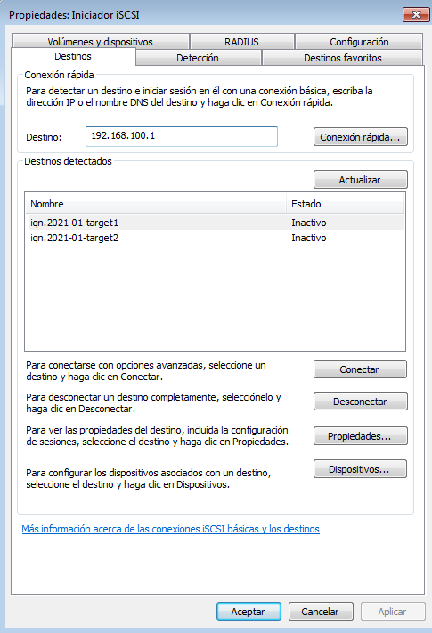
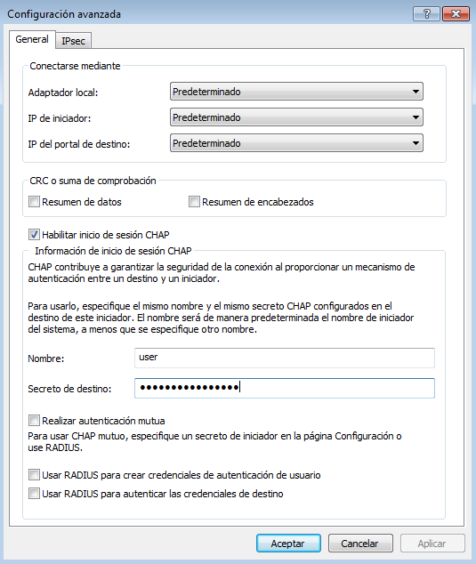
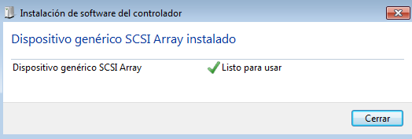
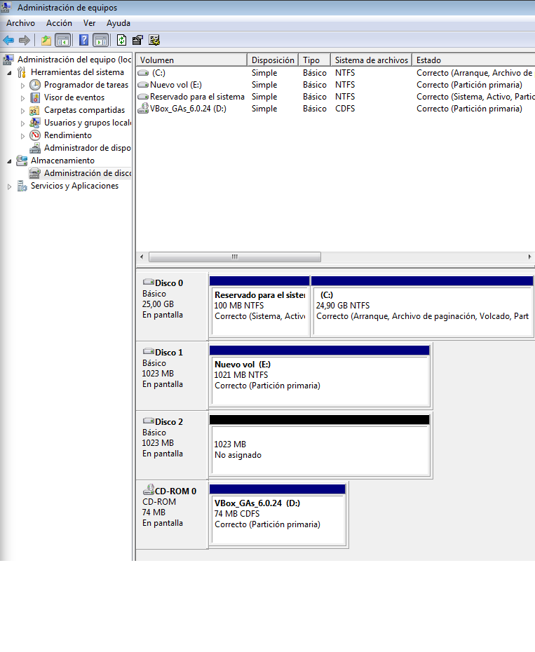

## Configura un escenario con vagrant o similar que incluya varias máquinas que permita realizar la configuración de un servidor iSCSI y dos clientes (uno linux y otro windows). Explica de forma detallada en la tarea los pasos realizados.

* Crea un target con una LUN y conéctala a un cliente GNU/Linux. Explica cómo escaneas desde el cliente buscando los targets disponibles y utiliza la unidad lógica proporcionada, formateándola si es necesario y montándola.
* Utiliza systemd mount para que el target se monte automáticamente al arrancar el cliente
* Crea un target con 2 LUN y autenticación por CHAP y conéctala a un cliente windows. Explica cómo se escanea la red en windows y cómo se utilizan las unidades nuevas (formateándolas con NTFS)

Nota: Es posible realizar esta tarea en un entorno virtual y corregirlo en clase o alternativamente montar un playbook con ansible que configure todo el escenario de forma automática y permita corregirlo a distancia montándolo desde cero.

<hr>


Para esta practica utilizaremos el siguiente fichero de configuración de vagrant.

* [Vagrantfile](documents/vagrantfileiscsi.txt "archivo de vagrant")

### **Desde el lado del Servidor**

Instalaremos **tgt** que es una herramienta que nos hace poder utilizar iSCSI(configurar targets pra iSCSI):
```shell
vagrant@server:~$ sudo apt install tgt
```

Una vez instalada daremos comienzo a la creación del target para debian, para crear el target permanente(que no desaparezca tras un reinicio) deberemos de crear un archivo de configuración del mismo:
```shell
vagrant@server:~$ sudo nano /etc/tgt/conf.d/target1.conf

<target iqn.2021-01-target1>
    backing-store /dev/sdb
</target>
```

Lo realizaremos de un solo LUN(Que quiere decir un solo disco), tras ello reiniciaremos el servicio:
```shell
vagrant@server:~$ sudo systemctl restart tgt
```

Podremos ver la información del target creado:
```shell
vagrant@server:~$ sudo tgtadm --mode target --op show
Target 1: iqn.2021-01-target1
    System information:
        Driver: iscsi
        State: ready
    I_T nexus information:
    LUN information:
        LUN: 0
            Type: controller
            SCSI ID: IET     00010000
            SCSI SN: beaf10
            Size: 0 MB, Block size: 1
            Online: Yes
            Removable media: No
            Prevent removal: No
            Readonly: No
            SWP: No
            Thin-provisioning: No
            Backing store type: null
            Backing store path: None
            Backing store flags: 
        LUN: 1
            Type: disk
            SCSI ID: IET     00010001
            SCSI SN: beaf11
            Size: 1074 MB, Block size: 512
            Online: Yes
            Removable media: No
            Prevent removal: No
            Readonly: No
            SWP: No
            Thin-provisioning: No
            Backing store type: rdwr
            Backing store path: /dev/sdb
            Backing store flags: 
    Account information:
    ACL information:
        ALL
```

### **Desde el lado del Cliente (debian)**

Deberemos instalar el paquete **open-iscsi** para que pueda realizar búsquedas de targets desde el cliente:
```shell
vagrant@cliente:~$ sudo apt install open-iscsi
#Realizamos una busqueda de targets disponibles:
vagrant@cliente:~$ sudo iscsiadm --mode discovery --type sendtargets --portal 192.168.100.1
192.168.100.1:3260,1 iqn.2021-01-target1
#Conectamos al target encontrado(en este caso el nuestro).
vagrant@cliente:~$ sudo iscsiadm --mode node -T iqn.2021-01-target1 --portal 192.168.100.1 -l
Logging in to [iface: default, target: iqn.2021-01-target1, portal: 192.168.100.1,3260] (multiple)
Login to [iface: default, target: iqn.2021-01-target1, portal: 192.168.100.1,3260] successful.
```

Podemos comprobar la conexión con dicho target de la siguiente forma:
```shell
vagrant@cliente:~$ sudo journalctl -k -f
-- Logs begin at Wed 2021-06-02 16:16:45 UTC. --
Jun 02 16:37:41 cliente kernel: scsi 1:0:0:0: RAID              IET      Controller       0001 PQ: 0 ANSI: 5
Jun 02 16:37:41 cliente kernel: scsi 1:0:0:0: Attached scsi generic sg1 type 12
Jun 02 16:37:41 cliente kernel: scsi 1:0:0:1: Direct-Access     IET      VIRTUAL-DISK     0001 PQ: 0 ANSI: 5
Jun 02 16:37:41 cliente kernel: sd 1:0:0:1: Attached scsi generic sg2 type 0
Jun 02 16:37:41 cliente kernel: sd 1:0:0:1: Power-on or device reset occurred
Jun 02 16:37:41 cliente kernel: sd 1:0:0:1: [sdb] 2097152 512-byte logical blocks: (1.07 GB/1.00 GiB)
Jun 02 16:37:41 cliente kernel: sd 1:0:0:1: [sdb] Write Protect is off
Jun 02 16:37:41 cliente kernel: sd 1:0:0:1: [sdb] Mode Sense: 69 00 10 08
Jun 02 16:37:41 cliente kernel: sd 1:0:0:1: [sdb] Write cache: enabled, read cache: enabled, supports DPO and FUA
Jun 02 16:37:41 cliente kernel: sd 1:0:0:1: [sdb] Attached SCSI disk
```

### Otros
### **Formateo y uso del target**

Podemos hacer uso del nuevo dispositivo como si estuviera en nuestro propio equipo, como formatearlo:
```shell
vagrant@cliente:~$ sudo mkfs.ext4 /dev/sdb 
mke2fs 1.44.5 (15-Dec-2018)
Creating filesystem with 262144 4k blocks and 65536 inodes
Filesystem UUID: 3a221b23-0abc-4590-9a3d-1e8c369ea47c
Superblock backups stored on blocks: 
	32768, 98304, 163840, 229376

Allocating group tables: done                            
Writing inode tables: done                            
Creating journal (8192 blocks): done
Writing superblocks and filesystem accounting information: done
```

Comprobamos:
```shell
vagrant@cliente:~$ lsblk -f
NAME   FSTYPE LABEL UUID                                 FSAVAIL FSUSE% MOUNTPOINT
sda                                                                     
└─sda1 ext4         d3d2a9a3-92f6-4777-bb0f-1d806e57bfec   17.1G     8% /
sdb    ext4         3a221b23-0abc-4590-9a3d-1e8c369ea47c    
```

Podemos montarlo para escribir datos en el:
```shell
vagrant@cliente:~$ sudo mount -t ext4 /dev/sdb /mnt/
vagrant@cliente:~$ lsblk -f
NAME   FSTYPE LABEL UUID                                 FSAVAIL FSUSE% MOUNTPOINT
sda                                                                     
└─sda1 ext4         d3d2a9a3-92f6-4777-bb0f-1d806e57bfec   17.1G     8% /
sdb    ext4         3a221b23-0abc-4590-9a3d-1e8c369ea47c  906.2M     0% /mnt
```

Ejemplo:
```shell
vagrant@cliente:~$ sudo touch /mnt/fichero1
vagrant@cliente:~$ ls /mnt/
fichero1  lost+found
```

### **Automontar al inicio**

Primero vamos a cargar el target con la siguiente configuración no sin antes desmontarlo:
```shell
vagrant@cliente:~$ sudo iscsiadm --mode node -T iqn.2021-01-target1 --portal 192.168.100.1 -u
Logging out of session [sid: 1, target: iqn.2021-01-target1, portal: 192.168.100.1,3260]
Logout of [sid: 1, target: iqn.2021-01-target1, portal: 192.168.100.1,3260] successful.
vagrant@cliente:~$ sudo iscsiadm --mode node -T iqn.2021-01-target1 -o update -n node.startup -v automatic
```

Nos iremos al fichero **/etc/iscsi/iscsid.conf** y modificaremos la linea de **node.startup = manual** por **node.startup = automatic**:
```shell
vagrant@cliente:~$ sudo nano /etc/iscsi/iscsid.conf

node.startup = automatic
```

Reiniciamos el servicio y vemos como se carga de manera automática:
```shell
vagrant@cliente:~$ sudo systemctl restart iscsi.service 
vagrant@cliente:~$ lsblk
NAME   MAJ:MIN RM SIZE RO TYPE MOUNTPOINT
sda      8:0    0  20G  0 disk 
└─sda1   8:1    0  20G  0 part /
sdb      8:32   0   1G  0 disk 
```

Lo habilitaremos de forma permanente para que se ejecute tras un reincio.
```shell
vagrant@cliente:~$ sudo systemctl enable open-iscsi.service
Synchronizing state of open-iscsi.service with SysV service script with /lib/systemd/systemd-sysv-install.
Executing: /lib/systemd/systemd-sysv-install enable open-iscsi
```

Lo que haremos ahora será crear la unidad de systemd para que se monte automáticamente cuando inicie el sistema, para ello, primero crearemos la carpeta dónde se montarán las unidades iSCSI y acto sigueinte crearemos la unidad systemd tipo mount teniendo en cuenta que el nombre que deben de tener tiene que ser igual que el del directorio donde se va a montar y el UUID que tenemos que poner es el del disco del target :
```shell
vagrant@cliente:~$ sudo mkdir /media/iSCSI
vagrant@cliente:~$ sudo nano /etc/systemd/system/media-iSCSI-target1.mount

[Unit]
Description=target1
After=open-iscsi.service

[Mount]
What=/dev/disk/by-uuid/3a221b23-0abc-4590-9a3d-1e8c369ea47c
Where=/media/iSCSI/target1
Type=ext4
Options=defaults

[Install]
WantedBy=multi-user.target
```

Ya sólo nos falta reiniciar los demonios, habilitar la unidad e iniciarla:
```shell
vagrant@cliente:~$ daemon-reload
vagrant@cliente:~$ sudo systemctl enable media-iSCSI-target1.mount
Created symlink /etc/systemd/system/multi-user.target.wants/media-iSCSI-target1.mount → /etc/systemd/system/media-iSCSI-target1.mount.
vagrant@cliente:~$ sudo systemctl start media-iSCSI-target1.mount
```

Comprobamos:
```shell
vagrant@cliente:~$ lsblk -f
NAME   FSTYPE LABEL UUID                                 FSAVAIL FSUSE% MOUNTPOINT
sda                                                                     
└─sda1 ext4         d3d2a9a3-92f6-4777-bb0f-1d806e57bfec   17.1G     8% /
sdb    ext4         3a221b23-0abc-4590-9a3d-1e8c369ea47c  906.2M     0% /media/iSCSI/target1
```

### **Creación de target para windows**

Realizaremos los mismos pasos que para la configuración anterior, con un nuevo fichero:
```shell
vagrant@server:~$ sudo nano /etc/tgt/conf.d/target2.conf

<target iqn.2021-01-target2>
    backing-store /dev/sdc
    backing-store /dev/sdd
    incominguser user password12345678
</target>
```

Reiniciamos servicio:
```shell
sudo systemctl restart tgt
```

Como podemos observar ya disponemos de un nuevo target:
```shell
vagrant@server:~$ sudo tgtadm --mode target --op show
Target 1: iqn.2021-01-target1
    System information:
        Driver: iscsi
        State: ready
    I_T nexus information:
    LUN information:
        LUN: 0
            Type: controller
            SCSI ID: IET     00010000
            SCSI SN: beaf10
            Size: 0 MB, Block size: 1
            Online: Yes
            Removable media: No
            Prevent removal: No
            Readonly: No
            SWP: No
            Thin-provisioning: No
            Backing store type: null
            Backing store path: None
            Backing store flags: 
        LUN: 1
            Type: disk
            SCSI ID: IET     00010001
            SCSI SN: beaf11
            Size: 1074 MB, Block size: 512
            Online: Yes
            Removable media: No
            Prevent removal: No
            Readonly: No
            SWP: No
            Thin-provisioning: No
            Backing store type: rdwr
            Backing store path: /dev/sdb
            Backing store flags: 
    Account information:
    ACL information:
        ALL
Target 2: iqn.2021-01-target2
    System information:
        Driver: iscsi
        State: ready
    I_T nexus information:
    LUN information:
        LUN: 0
            Type: controller
            SCSI ID: IET     00020000
            SCSI SN: beaf20
            Size: 0 MB, Block size: 1
            Online: Yes
            Removable media: No
            Prevent removal: No
            Readonly: No
            SWP: No
            Thin-provisioning: No
            Backing store type: null
            Backing store path: None
            Backing store flags: 
        LUN: 1
            Type: disk
            SCSI ID: IET     00020001
            SCSI SN: beaf21
            Size: 1074 MB, Block size: 512
            Online: Yes
            Removable media: No
            Prevent removal: No
            Readonly: No
            SWP: No
            Thin-provisioning: No
            Backing store type: rdwr
            Backing store path: /dev/sdc
            Backing store flags: 
        LUN: 2
            Type: disk
            SCSI ID: IET     00020002
            SCSI SN: beaf22
            Size: 1074 MB, Block size: 512
            Online: Yes
            Removable media: No
            Prevent removal: No
            Readonly: No
            SWP: No
            Thin-provisioning: No
            Backing store type: rdwr
            Backing store path: /dev/sdd
            Backing store flags: 
    Account information:
        user
    ACL information:
        ALL
```


### **Cliente windows**

Para conectarnos a nuestro target desde windows deberemos realizar los siguientes pasos:

Inicio -> Buscador iSCSI -> Seleccionar "Iniciador iSCSI" -> Introducimos los datos del servidor y actualizamos:



En opciones avanzadas deberemos de introduccir nuestra cuenta(usuario y contraseña) -> Habilitamos el inicio de sesión CHAP para poder introducir el usuario y contraseña:



Nos saldra una pantalla confirmando su conexión:


### **Formateo y uso unidad iSCSI desde windows**

Nos iremos al gestor de disco y comprobaremos que podemos trabajar o formatear el disco perfectamente:


