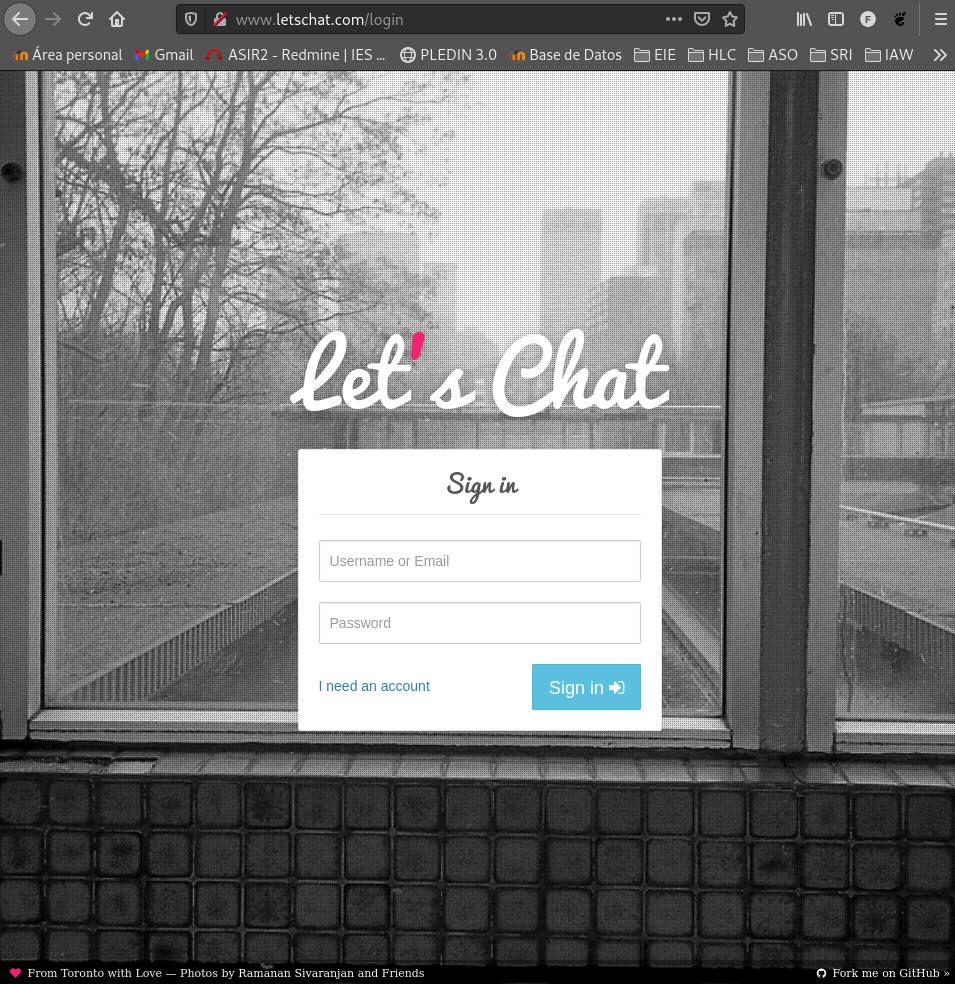

* Elige un método de instalación para crear un cluster de k8s con tres nodos (un controlador y dos workers), puedes usar kubeadm, k3s o cualquier otra opción equivalente que encuentres

* Describe en la tarea los pasos principales de la instalación y configuración del cluster

* Configura kubectl adecuadamente para gestionar el cluster desde tu máquina, no desde el nodo controlador

* Realiza un despliegue de la aplicación del ejemplo 8 del curso: https://github.com/iesgn/kubernetes-storm/tree/master/unidad3/ejemplos-3.2/ejemplo8

* Comprueba que es posible escalar a varias réplicas el despliegue del componente letschat y funciona correctamente el componente ingress

<hr>

El escenario que generaremos para la practica serà el siguiente [Vagrantfile](documents/vagrantfilekubernete.txt), en el se contempla el controlador y los dos workers.


Una vez levantado el escenario con **vagrant up** nos conectaremos al controlador:
```shell
fran@debian:~/vagrant/kubernete$ vagrant ssh controller
```

Ejecutaremos el siguiente comando el cual realizará una instalación automática de k3s:
```shell
vagrant@controller:~$ curl -sfL https://get.k3s.io | sh -
[INFO]  Finding release for channel stable
[INFO]  Using v1.21.1+k3s1 as release
[INFO]  Downloading hash https://github.com/k3s-io/k3s/releases/download/v1.21.1+k3s1/sha256sum-amd64.txt
[INFO]  Downloading binary https://github.com/k3s-io/k3s/releases/download/v1.21.1+k3s1/k3s
[INFO]  Verifying binary download
[INFO]  Installing k3s to /usr/local/bin/k3s
[INFO]  Creating /usr/local/bin/kubectl symlink to k3s
[INFO]  Creating /usr/local/bin/crictl symlink to k3s
[INFO]  Creating /usr/local/bin/ctr symlink to k3s
[INFO]  Creating killall script /usr/local/bin/k3s-killall.sh
[INFO]  Creating uninstall script /usr/local/bin/k3s-uninstall.sh
[INFO]  env: Creating environment file /etc/systemd/system/k3s.service.env
[INFO]  systemd: Creating service file /etc/systemd/system/k3s.service
[INFO]  systemd: Enabling k3s unit
Created symlink /etc/systemd/system/multi-user.target.wants/k3s.service → /etc/systemd/system/k3s.service.
[INFO]  systemd: Starting k3s
```

Una vez instalado podremos obtener información de los nodos:
```shell
vagrant@controller:~$ sudo kubectl get nodes
NAME         STATUS   ROLES                  AGE   VERSION
controller   Ready    control-plane,master   15s   v1.21.1+k3s1
```

## Parámetros necesarios para los workers

Necesitaremos la **INTERNAL-IP** que podremos obtener de la salida del siguiente comando:
```shell
vagrant@controller:~$ sudo kubectl get nodes -o wide
NAME         STATUS   ROLES                  AGE   VERSION        INTERNAL-IP    EXTERNAL-IP   OS-IMAGE                       KERNEL-VERSION    CONTAINER-RUNTIME
controller   Ready    control-plane,master   32s   v1.21.1+k3s1   192.168.1.11   <none>        Debian GNU/Linux 10 (buster)   4.19.0-16-amd64   containerd://1.4.4-k3s2
```

Para vincular los nuevos nodos con el controlador necesitaremos además de la ip de controller su **token de verificación**:
```shell
vagrant@controller:~$ sudo cat /var/lib/rancher/k3s/server/node-token
K10e01ce6e4004c6be864616c9289679d18c275036799c05b8d273761d1c369b625::server:3a535319fd4bef7eb1d90af1832b6d86
```

## Instalación de k3s en los workers

La siguiente acción que realizaremos se hará de igual manera en ambos workers y consistira en añadire tanto la **ip** y el **token** obtenidos anteriormente a variables de entorno:
```shell
vagrant@worker1:~$ k3s_url="https://192.168.1.11:6443"
vagrant@worker1:~$ k3s_token="K10e01ce6e4004c6be864616c9289679d18c275036799c05b8d273761d1c369b625::server:3a535319fd4bef7eb1d90af1832b6d86"
```

Ejecutaremos ahora la instalación de **k3s** haciendo uso de las nuevas variables para vincularlo con el controlador:
```shell
vagrant@worker1:~$ curl -sfL https://get.k3s.io | K3S_URL=${k3s_url} K3S_TOKEN=${k3s_token} sh
[INFO]  Finding release for channel stable
[INFO]  Using v1.21.1+k3s1 as release
[INFO]  Downloading hash https://github.com/k3s-io/k3s/releases/download/v1.21.1+k3s1/sha256sum-amd64.txt
[INFO]  Downloading binary https://github.com/k3s-io/k3s/releases/download/v1.21.1+k3s1/k3s
[INFO]  Verifying binary download
[INFO]  Installing k3s to /usr/local/bin/k3s
[INFO]  Creating /usr/local/bin/kubectl symlink to k3s
[INFO]  Creating /usr/local/bin/crictl symlink to k3s
[INFO]  Creating /usr/local/bin/ctr symlink to k3s
[INFO]  Creating killall script /usr/local/bin/k3s-killall.sh
[INFO]  Creating uninstall script /usr/local/bin/k3s-agent-uninstall.sh
[INFO]  env: Creating environment file /etc/systemd/system/k3s-agent.service.env
[INFO]  systemd: Creating service file /etc/systemd/system/k3s-agent.service
[INFO]  systemd: Enabling k3s-agent unit
Created symlink /etc/systemd/system/multi-user.target.wants/k3s-agent.service → /etc/systemd/system/k3s-agent.service.
[INFO]  systemd: Starting k3s-agent
```

Una vez realizada la instalación en ambas maquinas podremos comprobar que estan operativas chequeando los nodos disponibles desde el controlador.
```shell
vagrant@controller:~$ sudo kubectl get nodes
NAME         STATUS   ROLES                  AGE     VERSION
worker1      Ready    <none>                 96s     v1.21.1+k3s1
controller   Ready    control-plane,master   6m24s   v1.21.1+k3s1
worker2      Ready    <none>                 22s     v1.21.1+k3s1
```

# Gestionar el cluster desde fuera del escenario.

Deberemos de instalar **kubectl** en nuestra maquina anfitriona:
```shell
fran@debian:~/vagrant/kubernete$ curl -LO "https://dl.k8s.io/release/$(curl -L -s https://dl.k8s.io/release/stable.txt)/bin/linux/amd64/kubectl"
  % Total    % Received % Xferd  Average Speed   Time    Time     Time  Current
                                 Dload  Upload   Total   Spent    Left  Speed
100   154  100   154    0     0    939      0 --:--:-- --:--:-- --:--:--   939
100 45.3M  100 45.3M    0     0  19.8M      0  0:00:02  0:00:02 --:--:-- 25.4M
fran@debian:~/vagrant/kubernete$ sudo install -o root -g root -m 0755 kubectl /usr/local/bin/kubectl
[sudo] password for fran: 
fran@debian:~/vagrant/kubernete$ 
```

Nos iremos a nuestro controlador y copiaremos el archivo **/etc/rancher/k3s/k3s.yaml**:
```shell
vagrant@controller:~$ sudo cat /etc/rancher/k3s/k3s.yaml
apiVersion: v1
clusters:
- cluster:
    certificate-authority-data: LS0tLS1CRUdJTiBDRVJUSUZJQ0FURS0tLS0tCk1JSUJlRENDQVIyZ0F3SUJBZ0lCQURBS0JnZ3Foa2pPUFFRREFqQWpNU0V3SHdZRFZRUUREQmhyTTNNdGMyVnkKZG1WeUxXTmhRREUyTWpNMU56Y3pOREl3SGhjTk1qRXdOakV6TURrME1qSXlXaGNOTXpFd05qRXhNRGswTWpJeQpXakFqTVNFd0h3WURWUVFEREJock0zTXRjMlZ5ZG1WeUxXTmhRREUyTWpNMU56Y3pOREl3V1RBVEJnY3Foa2pPClBRSUJCZ2dxaGtqT1BRTUJCd05DQUFTVjd0dks2WEdwSTN5dWlzMmxqcGUxZ1oySFF0TE9JUUVISGRrYUNOYU4KUHd5UHVxNGwyeXVGbXZJbDBwdzhJWnVTV09CeFB6a3QzeFdsNXRGdjZMRk1vMEl3UURBT0JnTlZIUThCQWY4RQpCQU1DQXFRd0R3WURWUjBUQVFIL0JBVXdBd0VCL3pBZEJnTlZIUTRFRmdRVXREMjloZUI0K3E3R2x2SGRvaEttCjBRbE9VdlV3Q2dZSUtvWkl6ajBFQXdJRFNRQXdSZ0loQUliVTQ0UFdqZkt3VEcvVytkY3RuN0N3Mm1hdG53ZlEKV05OK2VtV3I2eUV4QWlFQXN0WWlTTTNmMm1FMlkrdFRrVllNTmt4eFZ2U3ZtMEFtMVV1THU2djZKY289Ci0tLS0tRU5EIENFUlRJRklDQVRFLS0tLS0K
    server: https://127.0.0.1:6443
  name: default
contexts:
- context:
    cluster: default
    user: default
  name: default
current-context: default
kind: Config
preferences: {}
users:
- name: default
  user:
    client-certificate-data: LS0tLS1CRUdJTiBDRVJUSUZJQ0FURS0tLS0tCk1JSUJrRENDQVRlZ0F3SUJBZ0lJZnRvakZuYnNCOW93Q2dZSUtvWkl6ajBFQXdJd0l6RWhNQjhHQTFVRUF3d1kKYXpOekxXTnNhV1Z1ZEMxallVQXhOakl6TlRjM016UXlNQjRYRFRJeE1EWXhNekE1TkRJeU1sb1hEVEl5TURZeApNekE1TkRJeU1sb3dNREVYTUJVR0ExVUVDaE1PYzNsemRHVnRPbTFoYzNSbGNuTXhGVEFUQmdOVkJBTVRESE41CmMzUmxiVHBoWkcxcGJqQlpNQk1HQnlxR1NNNDlBZ0VHQ0NxR1NNNDlBd0VIQTBJQUJBczNFMXY1UEY1TmlCd0UKVTFtOGQ5emI0Ui9LeTBCUUxEVldIYUdLdXJ2ZXNXL0EyaXp5dEtQUWU5c0NCZFdIaUNaVEVZR2pEY0V5TFVFYgpsWnFmRzMyalNEQkdNQTRHQTFVZER3RUIvd1FFQXdJRm9EQVRCZ05WSFNVRUREQUtCZ2dyQmdFRkJRY0RBakFmCkJnTlZIU01FR0RBV2dCUWNRUmJuQWNBNDJDY1VuckxkUEptMkFaeWdlekFLQmdncWhrak9QUVFEQWdOSEFEQkUKQWlCdWloQ1NsTWhOZXB1dGNhOGNlOEcrajJTRmdISFN4Z2hDN1JsaTJFUGRkZ0lnSENaTHY0SytyT0dZaHIrSgpZbkNSZzFUYzN4aG5qSmJUdmRKN3BhNG5ueG89Ci0tLS0tRU5EIENFUlRJRklDQVRFLS0tLS0KLS0tLS1CRUdJTiBDRVJUSUZJQ0FURS0tLS0tCk1JSUJlRENDQVIyZ0F3SUJBZ0lCQURBS0JnZ3Foa2pPUFFRREFqQWpNU0V3SHdZRFZRUUREQmhyTTNNdFkyeHAKWlc1MExXTmhRREUyTWpNMU56Y3pOREl3SGhjTk1qRXdOakV6TURrME1qSXlXaGNOTXpFd05qRXhNRGswTWpJeQpXakFqTVNFd0h3WURWUVFEREJock0zTXRZMnhwWlc1MExXTmhRREUyTWpNMU56Y3pOREl3V1RBVEJnY3Foa2pPClBRSUJCZ2dxaGtqT1BRTUJCd05DQUFTSkZZTXFMRnl4TzlnMWtBTU1xb3VNeWsrQnRrWFNYT0lYNyt2TWhvWjcKOVU1czFMaFJjWVV3M2tZaUhla2x0Sld3Tmc2eUFKellKSnVodXhEL2twYWFvMEl3UURBT0JnTlZIUThCQWY4RQpCQU1DQXFRd0R3WURWUjBUQVFIL0JBVXdBd0VCL3pBZEJnTlZIUTRFRmdRVUhFRVc1d0hBT05nbkZKNnkzVHlaCnRnR2NvSHN3Q2dZSUtvWkl6ajBFQXdJRFNRQXdSZ0loQU1rajBtbDQza0s1VlVMQXl4NjkwTEJkOXd1STRTN0cKRFVwNGM4Uzc3K0RZQWlFQTVPNnlSNjBtbVAvNytzLzFFaGkxa3JDdlQ2Wk9WQmxuQXBGZ3lORElPZlU9Ci0tLS0tRU5EIENFUlRJRklDQVRFLS0tLS0K
    client-key-data: LS0tLS1CRUdJTiBFQyBQUklWQVRFIEtFWS0tLS0tCk1IY0NBUUVFSU1KSXk4VkZjUHJ3Y2JiblNyRmNhN2JnT2JtaURqSjA1OUkzM2psdjBHV0hvQW9HQ0NxR1NNNDkKQXdFSG9VUURRZ0FFQ3pjVFcvazhYazJJSEFSVFdieDMzTnZoSDhyTFFGQXNOVllkb1lxNnU5NnhiOERhTFBLMApvOUI3MndJRjFZZUlKbE1SZ2FNTndUSXRRUnVWbXA4YmZRPT0KLS0tLS1FTkQgRUMgUFJJVkFURSBLRVktLS0tLQo=
```


Crearemos un nuevo fichero de configuración y cambiaremos su ip por la de nuestro controlador para que quede así:
```shell
fran@debian:~/vagrant/kubernete$ nano ~/.kube/config
apiVersion: v1
clusters:
- cluster:
    certificate-authority-data: LS0tLS1CRUdJTiBDRVJUSUZJQ0FURS0tLS0tCk1JSUJlRENDQVIyZ0F3SUJBZ0lCQURBS0JnZ3Foa2pPUFFRREFqQWpNU0V3SHdZRFZRUUREQmhyTTNNdGMyVnkKZG1WeUxXTmhRREUyTWpNMU56Y3pOREl3SGhjTk1qRXdOakV6TURrME1qSXlXaGNOTXpFd05qRXhNRGswTWpJeQpXakFqTVNFd0h3WURWUVFEREJock0zTXRjMlZ5ZG1WeUxXTmhRREUyTWpNMU56Y3pOREl3V1RBVEJnY3Foa2pPClBRSUJCZ2dxaGtqT1BRTUJCd05DQUFTVjd0dks2WEdwSTN5dWlzMmxqcGUxZ1oySFF0TE9JUUVISGRrYUNOYU4KUHd5UHVxNGwyeXVGbXZJbDBwdzhJWnVTV09CeFB6a3QzeFdsNXRGdjZMRk1vMEl3UURBT0JnTlZIUThCQWY4RQpCQU1DQXFRd0R3WURWUjBUQVFIL0JBVXdBd0VCL3pBZEJnTlZIUTRFRmdRVXREMjloZUI0K3E3R2x2SGRvaEttCjBRbE9VdlV3Q2dZSUtvWkl6ajBFQXdJRFNRQXdSZ0loQUliVTQ0UFdqZkt3VEcvVytkY3RuN0N3Mm1hdG53ZlEKV05OK2VtV3I2eUV4QWlFQXN0WWlTTTNmMm1FMlkrdFRrVllNTmt4eFZ2U3ZtMEFtMVV1THU2djZKY289Ci0tLS0tRU5EIENFUlRJRklDQVRFLS0tLS0K
    server: https://192.168.1.11:6443
  name: default
contexts:
- context:
    cluster: default
    user: default
  name: default
current-context: default
kind: Config
preferences: {}
users:
- name: default
  user:
    client-certificate-data: LS0tLS1CRUdJTiBDRVJUSUZJQ0FURS0tLS0tCk1JSUJrRENDQVRlZ0F3SUJBZ0lJZnRvakZuYnNCOW93Q2dZSUtvWkl6ajBFQXdJd0l6RWhNQjhHQTFVRUF3d1kKYXpOekxXTnNhV1Z1ZEMxallVQXhOakl6TlRjM016UXlNQjRYRFRJeE1EWXhNekE1TkRJeU1sb1hEVEl5TURZeApNekE1TkRJeU1sb3dNREVYTUJVR0ExVUVDaE1PYzNsemRHVnRPbTFoYzNSbGNuTXhGVEFUQmdOVkJBTVRESE41CmMzUmxiVHBoWkcxcGJqQlpNQk1HQnlxR1NNNDlBZ0VHQ0NxR1NNNDlBd0VIQTBJQUJBczNFMXY1UEY1TmlCd0UKVTFtOGQ5emI0Ui9LeTBCUUxEVldIYUdLdXJ2ZXNXL0EyaXp5dEtQUWU5c0NCZFdIaUNaVEVZR2pEY0V5TFVFYgpsWnFmRzMyalNEQkdNQTRHQTFVZER3RUIvd1FFQXdJRm9EQVRCZ05WSFNVRUREQUtCZ2dyQmdFRkJRY0RBakFmCkJnTlZIU01FR0RBV2dCUWNRUmJuQWNBNDJDY1VuckxkUEptMkFaeWdlekFLQmdncWhrak9QUVFEQWdOSEFEQkUKQWlCdWloQ1NsTWhOZXB1dGNhOGNlOEcrajJTRmdISFN4Z2hDN1JsaTJFUGRkZ0lnSENaTHY0SytyT0dZaHIrSgpZbkNSZzFUYzN4aG5qSmJUdmRKN3BhNG5ueG89Ci0tLS0tRU5EIENFUlRJRklDQVRFLS0tLS0KLS0tLS1CRUdJTiBDRVJUSUZJQ0FURS0tLS0tCk1JSUJlRENDQVIyZ0F3SUJBZ0lCQURBS0JnZ3Foa2pPUFFRREFqQWpNU0V3SHdZRFZRUUREQmhyTTNNdFkyeHAKWlc1MExXTmhRREUyTWpNMU56Y3pOREl3SGhjTk1qRXdOakV6TURrME1qSXlXaGNOTXpFd05qRXhNRGswTWpJeQpXakFqTVNFd0h3WURWUVFEREJock0zTXRZMnhwWlc1MExXTmhRREUyTWpNMU56Y3pOREl3V1RBVEJnY3Foa2pPClBRSUJCZ2dxaGtqT1BRTUJCd05DQUFTSkZZTXFMRnl4TzlnMWtBTU1xb3VNeWsrQnRrWFNYT0lYNyt2TWhvWjcKOVU1czFMaFJjWVV3M2tZaUhla2x0Sld3Tmc2eUFKellKSnVodXhEL2twYWFvMEl3UURBT0JnTlZIUThCQWY4RQpCQU1DQXFRd0R3WURWUjBUQVFIL0JBVXdBd0VCL3pBZEJnTlZIUTRFRmdRVUhFRVc1d0hBT05nbkZKNnkzVHlaCnRnR2NvSHN3Q2dZSUtvWkl6ajBFQXdJRFNRQXdSZ0loQU1rajBtbDQza0s1VlVMQXl4NjkwTEJkOXd1STRTN0cKRFVwNGM4Uzc3K0RZQWlFQTVPNnlSNjBtbVAvNytzLzFFaGkxa3JDdlQ2Wk9WQmxuQXBGZ3lORElPZlU9Ci0tLS0tRU5EIENFUlRJRklDQVRFLS0tLS0K
    client-key-data: LS0tLS1CRUdJTiBFQyBQUklWQVRFIEtFWS0tLS0tCk1IY0NBUUVFSU1KSXk4VkZjUHJ3Y2JiblNyRmNhN2JnT2JtaURqSjA1OUkzM2psdjBHV0hvQW9HQ0NxR1NNNDkKQXdFSG9VUURRZ0FFQ3pjVFcvazhYazJJSEFSVFdieDMzTnZoSDhyTFFGQXNOVllkb1lxNnU5NnhiOERhTFBLMApvOUI3MndJRjFZZUlKbE1SZ2FNTndUSXRRUnVWbXA4YmZRPT0KLS0tLS1FTkQgRUMgUFJJVkFURSBLRVktLS0tLQo=
```

Cargaremos el fichero con las credenciales:
```shell
fran@debian:~/vagrant/kubernete$ export KUBECONFIG=~/.kube/config
```

Y ya podremos comprobar que tenemos nuestros nodos estan operativos desde nuestra maquina anfitriona:
```shell
fran@debian:~/vagrant/kubernete$ kubectl get nodes
NAME         STATUS   ROLES                  AGE     VERSION
worker1      Ready    <none>                 9m21s   v1.21.1+k3s1
controller   Ready    control-plane,master   14m     v1.21.1+k3s1
worker2      Ready    <none>                 8m7s    v1.21.1+k3s1
```

## Despliegue Letschat

Ahora realizaremos un despliegue de la aplicación **Letschat**, clonaremos el repositorio del centro, el cual aparte del ejemplo que vamos a utilizar posee varios mas sobre la utilizaicon de kubectl:
```shell
fran@debian:~/vagrant/kubernete$ git clone https://github.com/iesgn/kubernetes-storm.git
```

Nos desplazaremos al ejemplo8 citado en la tarea y ejecutaremos el siguiente comando:
```shell
fran@debian:~/vagrant/kubernete$ ls
kubectl  kubernetes-storm  Vagrantfile
fran@debian:~/vagrant/kubernete$ cd kubernetes-storm/unidad3/ejemplos-3.2/ejemplo8/
fran@debian:~/vagrant/kubernete/kubernetes-storm/unidad3/ejemplos-3.2/ejemplo8$ kubectl apply -f .
Warning: networking.k8s.io/v1beta1 Ingress is deprecated in v1.19+, unavailable in v1.22+; use networking.k8s.io/v1 Ingress
ingress.networking.k8s.io/ingress-letschat created
deployment.apps/letschat created
service/letschat created
deployment.apps/mongo created
service/mongo created
```

El fichero desplegará varios servicios, pasado unos segundos podremos observar que ya estará todo listo:
```shell
fran@debian:~/vagrant/kubernete/kubernetes-storm/unidad3/ejemplos-3.2/ejemplo8$ kubectl get all,ingress
NAME                            READY   STATUS    RESTARTS   AGE
pod/mongo-5c694c878b-d5vjk      1/1     Running   0          6m13s
pod/letschat-7c66bd64f5-vcffj   1/1     Running   5          6m13s

NAME                 TYPE        CLUSTER-IP      EXTERNAL-IP   PORT(S)          AGE
service/kubernetes   ClusterIP   10.43.0.1       <none>        443/TCP          22m
service/letschat     NodePort    10.43.137.91    <none>        8080:31382/TCP   6m13s
service/mongo        ClusterIP   10.43.159.207   <none>        27017/TCP        6m13s

NAME                       READY   UP-TO-DATE   AVAILABLE   AGE
deployment.apps/mongo      1/1     1            1           6m13s
deployment.apps/letschat   1/1     1            1           6m13s

NAME                                  DESIRED   CURRENT   READY   AGE
replicaset.apps/mongo-5c694c878b      1         1         1       6m13s
replicaset.apps/letschat-7c66bd64f5   1         1         1       6m13s

NAME                                         CLASS    HOSTS              ADDRESS                                   PORTS   AGE
ingress.networking.k8s.io/ingress-letschat   <none>   www.letschat.com   192.168.1.11,192.168.1.117,192.168.1.41   80      6m13s
```

Servicios desplegados:
- mongo-deployment, mongo-srv: Despliegue y conexión con una base de datos mongo.
- letschat-deployment, letschat-srv: Despligue y servicio de la aplicación letschat y su conexión con una base de datos.
- ingress: Para poder acceder a la apliación mediante un nombre.


## Escalado

Para que podamos comprobar el funcionamiento de escalado bastara con ejecutar el siguiente comando:
```shell
fran@debian:~/vagrant/kubernete/kubernetes-storm/unidad3/ejemplos-3.2/ejemplo8$ kubectl scale deployment letschat --replicas=10
deployment.apps/letschat scaled
```

Pasados unos segundos las replicas estaran ya escaladas. 

Nota: Deberás de tener en cuenta la capicidad de tu ordenador a la hora de escalar las replicas, ya que el proceso podria suponer demasiado estres en la maquina dando lugar a una relentizacióń o incluso caida de alguna de las máquinas del escenario:
```shell
fran@debian:~/vagrant/kubernete/kubernetes-storm/unidad3/ejemplos-3.2/ejemplo8$ kubectl get all
NAME                            READY   STATUS    RESTARTS   AGE
pod/mongo-5c694c878b-d5vjk      1/1     Running   1          10m
pod/letschat-7c66bd64f5-jgj8p   1/1     Running   1          3m4s
pod/letschat-7c66bd64f5-g2hc4   1/1     Running   0          3m4s
pod/letschat-7c66bd64f5-9fxz7   1/1     Running   0          3m4s
pod/letschat-7c66bd64f5-vkz7t   1/1     Running   0          3m4s
pod/letschat-7c66bd64f5-4lcvx   1/1     Running   0          3m4s
pod/letschat-7c66bd64f5-dzlwb   1/1     Running   0          3m4s
pod/letschat-7c66bd64f5-vcffj   1/1     Running   6          10m
pod/letschat-7c66bd64f5-zm8tv   1/1     Running   1          3m4s
pod/letschat-7c66bd64f5-b2pn9   1/1     Running   1          3m4s
pod/letschat-7c66bd64f5-pncx7   1/1     Running   1          3m4s

NAME                 TYPE        CLUSTER-IP      EXTERNAL-IP   PORT(S)          AGE
service/kubernetes   ClusterIP   10.43.0.1       <none>        443/TCP          26m
service/letschat     NodePort    10.43.137.91    <none>        8080:31382/TCP   10m
service/mongo        ClusterIP   10.43.159.207   <none>        27017/TCP        10m

NAME                       READY   UP-TO-DATE   AVAILABLE   AGE
deployment.apps/mongo      1/1     1            1           10m
deployment.apps/letschat   10/10   10           10          10m

NAME                                  DESIRED   CURRENT   READY   AGE
replicaset.apps/mongo-5c694c878b      1         1         1       10m
replicaset.apps/letschat-7c66bd64f5   10        10        10      10m
fran@debian:~/vagrant/kubernete/kubernetes-storm/unidad3/ejemplos-3.2/ej
```

## Componente ingress

Para comprobar que el **componente ingress** este operativo (recordemos que sirve para poder acceder a la aplicación mediante un nombre) intentaremos acceder nuestra pagina de letschat generada anteriormente, para ello añadiremos la ip a nuestro fichero de hosts y accederemos via web:
```shell
fran@debian:~/vagrant/kubernete/kubernetes-storm/unidad3/ejemplos-3.2/ejemplo8$ sudo nano /etc/hosts

192.168.1.11  www.letschat.com
```



