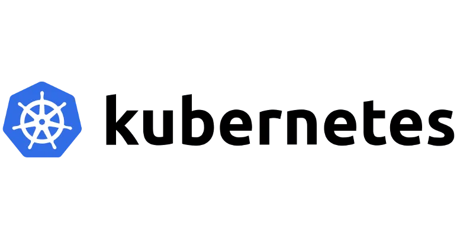

* Elige un método de instalación para crear un cluster de k8s con tres nodos (un controlador y dos workers), puedes usar kubeadm, k3s o cualquier otra opción equivalente que encuentres

* Describe en la tarea los pasos principales de la instalación y configuración del cluster

* Configura kubectl adecuadamente para gestionar el cluster desde tu máquina, no desde el nodo controlador

* Realiza un despliegue de la aplicación del ejemplo 8 del curso: https://github.com/iesgn/kubernetes-storm/tree/master/unidad3/ejemplos-3.2/ejemplo8

* Comprueba que es posible escalar a varias réplicas el despliegue del componente letschat y funciona correctamente el componente ingress

